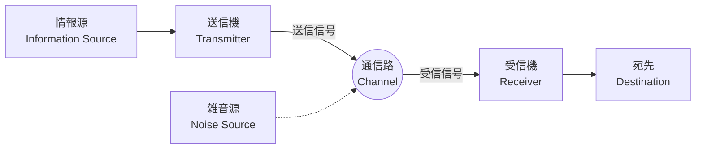

## 1. はじめに：情報とは何か？

私たちが日常的に口にする「情報」という言葉ですが、科学的に「情報」を定義しようとすると非常に困難を伴います。ニュース、友人からのメッセージ、DNAの塩基配列、あるいは宇宙から届く電波など、これらすべては情報を含んでいます。しかし、これらを数学的に共通の枠組みで扱うためには、客観的で定量的な指標が必要です。

この壮大な課題に挑み、現代のデジタル社会の礎を築いたのが、数学者であり工学者でもある クロード・シャノン（Claude Shannon） です。彼が1948年に発表した論文「通信の数学的理論（A Mathematical Theory of Communication）」は、 **情報理論** （Information Theory）という全く新しい学問分野を単独で創設したと言っても過言ではありません。

本記事では、シャノンがどのようにして「情報」を数学的に定義したのか、そしてその中心的な概念である **シャノンのエントロピー** が、データ圧縮や通信技術においてどのような意味を持つのかについて、徹底的に深掘りしていきます。

## 2. コミュニケーションの一般モデル

シャノンは情報の意味（セマンティクス）を一旦切り離し、情報の「伝達」そのものに焦点を当てました。彼が提唱した通信システムの一般モデルは、以下のMermaid図のように表されます。



このモデルにおいて、通信の最大の課題は **「雑音（ノイズ）が存在する通信路を通して、いかにして正確かつ効率的にメッセージを伝送するか」** という点に集約されます。

## 3. 情報量の数学的定義

情報理論における最も基本的な問いは、「ある事象が起こったことを知ったとき、私たちはどれだけの情報を得たのか？」というものです。

シャノンは、情報の量を「驚きの度合い」として捉えました。
- **よく起こること（確率が高い事象）** が起きても、驚きは少なく、得られる情報量は小さい。
- **めったに起こらないこと（確率が低い事象）** が起きると、驚きは大きく、得られる情報量は大きい。

事象 $ x $ が起こる確率を $ P(x) $ としたとき、その事象が持っている **自己情報量** （Self-Information） $ I(x) $ は以下のように定義されます。

$$
I(x) = - \log_2 P(x) = \log_2 \frac{1}{P(x)}
$$

対数の底に $ 2 $ を用いる場合、情報量の単位は **ビット** （bit）となります。たとえば、表と裏が等確率（$ P = 0.5 $）で出るコインを投げて表が出たという事象の情報量は、

$$
I(\text{表}) = - \log_2(0.5) = 1 \text{ bit}
$$

となります。これは「1ビットの情報」の直感的な理解とも一致します。

## 4. シャノンのエントロピー

自己情報量は個々の事象に対する情報量ですが、情報源全体から平均的にどれだけの情報が発生しているかを知るにはどうすればよいでしょうか。

ここで登場するのが **エントロピー** （Entropy）です。情報源 $ X $ が $ n $ 個の異なる記号 $ x_1, x_2, \dots, x_n $ を確率 $ P(x_1), P(x_2), \dots, P(x_n) $ で発生させるとき、情報源 $ X $ のエントロピー $ H(X) $ は、自己情報量の期待値として定義されます。

$$
H(X) = - \sum_{i=1}^{n} P(x_i) \log_2 P(x_i)
$$

（ただし、 $ P(x_i) = 0 $ の場合は $ 0 \log_2 0 = 0 $ とみなします）

### エントロピーの直感的な意味
エントロピー $ H(X) $ は、情報源が持つ **不確実性** の度合いを表します。
- どの記号が出るか全く予測できない（すべての確率が均等）とき、エントロピーは最大になります。
- 常に同じ記号が出る（ある確率が $ 1 $ で他が $ 0 $ ）とき、不確実性はなくなり、エントロピーは $ 0 $ になります。

以下のPythonコードで、コインの表が出る確率 $ p $ を変化させたときのエントロピーの変化を計算してみましょう。

```python
import numpy as np
import matplotlib.pyplot as plt

def binary_entropy(p):
    if p == 0 or p == 1:
        return 0
    return -p * np.log2(p) - (1 - p) * np.log2(1 - p)

probabilities = np.linspace(0, 1, 100)
entropies = [binary_entropy(p) for p in probabilities]

plt.plot(probabilities, entropies)
plt.title('Binary Entropy Function')
plt.xlabel('Probability of heads (p)')
plt.ylabel('Entropy H(X) in bits')
plt.grid(True)
plt.show()
```

このグラフを描画すると、$ p = 0.5 $ のときにエントロピーが最大値 $ 1 $ となり、完全に予測不可能な状態であることがわかります。

## 5. 情報源符号化定理：データ圧縮の限界

エントロピーは単なる抽象的な概念ではありません。シャノンは、このエントロピーが **データ圧縮の絶対的な限界** を定めていることを証明しました。これが **情報源符号化定理** （シャノンの第一定理）です。

定理の主張は非常にシンプルです。
**「いかなる可逆圧縮アルゴリズムを用いても、情報源から発生するデータの平均符号長を、その情報源のエントロピー $ H(X) $ より小さくすることはできない。」**

$$
L \ge H(X)
$$
（ $ L $ は平均符号長）

つまり、エントロピーは「情報そのものが持っている本質的なサイズ」を示しており、どんなに優れたZIPやgzipなどのアルゴリズムを開発しても、この限界の壁を越えて圧縮することは数学的に不可能であることを意味しています。

### ハフマン符号 (Huffman Coding)
エントロピーの限界に近づくための具体的な手法として、シャノンの共同研究者であったファノのアイデアを発展させ、デビッド・ハフマンが考案したのが **ハフマン符号** です。

出現確率の高い記号には短いビット列を、出現確率の低い記号には長いビット列を割り当てることで、全体の平均符号長を最小化します。以下はPythonによる簡単なハフマン符号の構築例です。

```python
import heapq
from collections import Counter

class Node:
    def __init__(self, char, freq):
        self.char = char
        self.freq = freq
        self.left = None
        self.right = None

    def __lt__(self, other):
        return self.freq < other.freq

def build_huffman_tree(text):
    frequency = Counter(text)
    heap = [Node(char, freq) for char, freq in frequency.items()]
    heapq.heapify(heap)

    while len(heap) > 1:
        left = heapq.heappop(heap)
        right = heapq.heappop(heap)
        merged = Node(None, left.freq + right.freq)
        merged.left = left
        merged.right = right
        heapq.heappush(heap, merged)

    return heap[0]

def generate_huffman_codes(node, prefix="", codebook={}):
    if node is not None:
        if node.char is not None:
            codebook[node.char] = prefix
        generate_huffman_codes(node.left, prefix + "0", codebook)
        generate_huffman_codes(node.right, prefix + "1", codebook)
    return codebook

# サンプルテキスト
text = "shannon_entropy_and_information_theory"
tree_root = build_huffman_tree(text)
codes = generate_huffman_codes(tree_root)

print("Huffman Codes:")
for char, code in sorted(codes.items()):
    print(f"'{char}': {code}")
```

## 6. 通信路符号化定理：誤りなく通信する限界

データ圧縮の限界を示したシャノンは、次に「ノイズのある通信路」に挑みました。ノイズがあるとデータの一部が反転したり失われたりします。これに対処するために、我々はデータに **冗長性** を付加してエラーを訂正できるようにします（誤り訂正符号）。

しかし、冗長性を加えれば加えるほど、実際に送れる情報の実質的な速度（レート）は下がってしまいます。では、ノイズのある環境下で、どのくらいの速度で、どの程度正確に情報を送れるのでしょうか？

この問いに対する答えが **通信路符号化定理** （シャノンの第二定理）です。

シャノンは、通信路には固有の **通信路容量** （Channel Capacity） $ C $ が存在することを証明しました。そして、驚くべきことに次のように主張しました。

**「情報伝送速度 $ R $ が通信路容量 $ C $ より小さい（ $ R < C $ ）ならば、適切な符号化を行うことで、誤り率をいくらでもゼロに近づけることができる。」**

通信路容量 $ C $ を計算する代表的な公式として、白色ガウス雑音（AWGN）通信路に関するシャノン・ハートレーの定理があります。

$$
C = B \log_2 \left( 1 + \frac{S}{N} \right)
$$

ここで、
- $ C $ : 通信路容量 (bits per second)
- $ B $ : 帯域幅 (Hz)
- $ S $ : 信号電力 (Watt)
- $ N $ : 雑音電力 (Watt)
- $ \frac{S}{N} $ : SN比 (Signal-to-Noise Ratio)

この定理は、現代のWi-Fi、5Gモバイル通信、衛星通信など、あらゆるデジタル通信システムの設計において、到達可能な理論的限界（シャノンリミット）を示す道しるべとなっています。

## 7. おわりに

クロード・シャノンが構築した情報理論は、「情報」という形のないものを数学的に厳密に定義し、デジタル時代への扉を開きました。 **シャノンのエントロピー** は単なる抽象的な概念にとどまらず、データ圧縮アルゴリズムの絶対的な限界を示し、通信路容量は私たちが日々利用するインターネットや無線通信の進化の方向性を決定づけました。

私たちがスマートフォンで動画をストリーミングでき、遠く離れた探査機から宇宙の鮮明な画像を受信できるのは、情報理論という確固たる数学的基盤が存在するからです。エントロピーの概念は現在、物理学の熱力学エントロピーとの関連性が議論されたり、機械学習（交差エントロピー誤差など）において重要な役割を果たしたりと、さらに広い分野へと波及し続けています。

データの性質を根本から理解し、その限界を知ることは、未来のより高度な情報通信システムを設計する上で、依然として最も重要なアプローチであり続けるでしょう。
