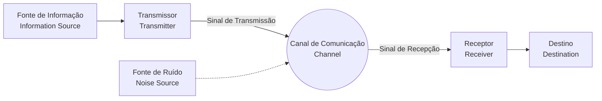

## 1. Introdução: O que é informação?

A palavra "informação" é usada em nosso dia a dia, mas tentar defini-la cientificamente é muito difícil. Notícias, mensagens de amigos, sequências de DNA ou até ondas de rádio do espaço, todas elas contêm informação. No entanto, para tratá-las numa estrutura matemática comum, precisamos de indicadores objetivos e quantitativos.

Quem enfrentou esse grande desafio e construiu os alicerces da nossa sociedade digital moderna foi o matemático e engenheiro Claude Shannon. Pode-se dizer, sem exageros, que seu artigo de 1948 "Uma Teoria Matemática da Comunicação (A Mathematical Theory of Communication)" fundou sozinho o campo inteiramente novo da **Teoria da Informação** (Information Theory).

Neste artigo, vamos nos aprofundar em como Shannon definiu matematicamente a "informação", e qual o significado de seu conceito central, a **Entropia de Shannon**, na compressão de dados e tecnologia de comunicação.

## 2. Modelo Geral de Comunicação

Shannon inicialmente deixou de lado o significado (semântica) da informação e focou na própria "transmissão" da informação. O modelo geral do sistema de comunicação proposto por ele é representado no diagrama Mermaid abaixo.



Neste modelo, o maior desafio da comunicação se resume a **"como transmitir mensagens com precisão e eficiência através de um canal com ruído"**.

## 3. Definição Matemática de Quantidade de Informação

A pergunta mais básica na teoria da informação é: "Quanta informação nós obtemos quando sabemos que um determinado evento ocorreu?"

Shannon percebeu a quantidade de informação como o "grau de surpresa".
- Quando ocorre algo **comum (evento de alta probabilidade)**, há pouca surpresa e a quantidade de informação obtida é pequena.
- Quando ocorre algo **raro (evento de baixa probabilidade)**, a surpresa é grande e a quantidade de informação obtida é grande.

Quando a probabilidade de um evento $ x $ ocorrer é $ P(x) $, a **autoinformação** (Self-Information) $ I(x) $ que o evento possui é definida como:

$$
I(x) = - \log_2 P(x) = \log_2 \frac{1}{P(x)}
$$

Se a base do logaritmo for $ 2 $, a unidade da quantidade de informação é o **bit** (bit). Por exemplo, a quantidade de informação de um evento em que uma moeda com igual probabilidade para cara e coroa ($ P = 0.5 $) dá cara é:

$$
I(\text{Cara}) = - \log_2(0.5) = 1 \text{ bit}
$$

Isso também está de acordo com o entendimento intuitivo de "1 bit de informação".

## 4. A Entropia de Shannon

A autoinformação é a quantidade de informação para eventos individuais, mas como podemos saber quanta informação é gerada em média por toda a fonte de informação?

É aqui que entra a **Entropia** (Entropy). Quando uma fonte de informação $ X $ gera $ n $ símbolos diferentes $ x_1, x_2, \dots, x_n $ com probabilidades $ P(x_1), P(x_2), \dots, P(x_n) $, a entropia $ H(X) $ da fonte de informação $ X $ é definida como o valor esperado da autoinformação.

$$
H(X) = - \sum_{i=1}^{n} P(x_i) \log_2 P(x_i)
$$

(No entanto, se $ P(x_i) = 0 $, consideramos que $ 0 \log_2 0 = 0 $)

### Significado intuitivo de Entropia
A entropia $ H(X) $ representa o grau de **incerteza** que a fonte de informação possui.
- Quando é completamente imprevisível qual símbolo aparecerá (todas as probabilidades são iguais), a entropia é máxima.
- Quando o mesmo símbolo aparece sempre (uma probabilidade é $ 1 $ e as outras são $ 0 $), não há incerteza, e a entropia é $ 0 $.

Vamos calcular a mudança na entropia ao alterar a probabilidade $ p $ de dar cara em uma moeda, usando o código Python abaixo.

```python
import numpy as np
import matplotlib.pyplot as plt

def binary_entropy(p):
    if p == 0 or p == 1:
        return 0
    return -p * np.log2(p) - (1 - p) * np.log2(1 - p)

probabilities = np.linspace(0, 1, 100)
entropies = [binary_entropy(p) for p in probabilities]

plt.plot(probabilities, entropies)
plt.title('Binary Entropy Function')
plt.xlabel('Probability of heads (p)')
plt.ylabel('Entropy H(X) in bits')
plt.grid(True)
plt.show()
```

Ao desenhar este gráfico, percebe-se que quando $ p = 0.5 $ a entropia atinge seu valor máximo de $ 1 $, o que é um estado completamente imprevisível.

## 5. Teorema da Codificação da Fonte: O Limite da Compressão de Dados

A entropia não é apenas um conceito abstrato. Shannon provou que essa entropia determina o **limite absoluto da compressão de dados**. Este é o **Teorema da Codificação da Fonte** (O primeiro teorema de Shannon).

A afirmação do teorema é muito simples.
**"Não importa qual algoritmo de compressão sem perdas seja usado, o comprimento médio do código dos dados gerados a partir de uma fonte de informação não pode ser menor que a entropia $ H(X) $ dessa fonte."**

$$
L \ge H(X)
$$
(Onde $ L $ é o comprimento médio do código)

Em outras palavras, a entropia mostra "o tamanho essencial que a própria informação tem", o que significa que é matematicamente impossível comprimir além dessa barreira limite, não importa o quão bons algoritmos, como ZIP ou gzip, sejam desenvolvidos.

### Codificação de Huffman (Huffman Coding)
Como um método concreto para se aproximar do limite da entropia, David Huffman, desenvolvendo uma ideia do co-pesquisador de Shannon, Fano, inventou a **Codificação de Huffman**.

Atribuindo sequências curtas de bits aos símbolos com alta probabilidade de ocorrência e sequências longas aos símbolos com baixa probabilidade de ocorrência, minimizamos o comprimento médio geral do código. A seguir está um exemplo de construção simples de código Huffman em Python.

```python
import heapq
from collections import Counter

class Node:
    def __init__(self, char, freq):
        self.char = char
        self.freq = freq
        self.left = None
        self.right = None

    def __lt__(self, other):
        return self.freq < other.freq

def build_huffman_tree(text):
    frequency = Counter(text)
    heap = [Node(char, freq) for char, freq in frequency.items()]
    heapq.heapify(heap)

    while len(heap) > 1:
        left = heapq.heappop(heap)
        right = heapq.heappop(heap)
        merged = Node(None, left.freq + right.freq)
        merged.left = left
        merged.right = right
        heapq.heappush(heap, merged)

    return heap[0]

def generate_huffman_codes(node, prefix="", codebook={}):
    if node is not None:
        if node.char is not None:
            codebook[node.char] = prefix
        generate_huffman_codes(node.left, prefix + "0", codebook)
        generate_huffman_codes(node.right, prefix + "1", codebook)
    return codebook

# Texto de exemplo
text = "shannon_entropy_and_information_theory"
tree_root = build_huffman_tree(text)
codes = generate_huffman_codes(tree_root)

print("Huffman Codes:")
for char, code in sorted(codes.items()):
    print(f"'{char}': {code}")
```

## 6. Teorema da Codificação de Canal: O Limite de Comunicação Sem Erros

Depois de mostrar os limites da compressão de dados, Shannon enfrentou em seguida o "canal de comunicação com ruído". Quando há ruído, parte dos dados pode ser invertida ou perdida. Para lidar com isso, nós adicionamos **redundância** aos dados para que os erros possam ser corrigidos (código de correção de erro).

No entanto, quanto mais redundância adicionamos, mais a velocidade efetiva (taxa) de informação que pode ser transmitida diminui. Então, em um ambiente ruidoso, em qual velocidade e quão precisamente podemos transmitir informações?

A resposta para essa pergunta é o **Teorema da Codificação de Canal** (Segundo Teorema de Shannon).

Shannon provou que há uma **Capacidade de Canal** (Channel Capacity) $ C $ inerente ao canal de comunicação. E, surpreendentemente, afirmou o seguinte:

**"Se a taxa de transmissão de informação $ R $ for menor que a capacidade de canal $ C $ ($ R < C $), então, ao aplicar uma codificação apropriada, a taxa de erro pode ser trazida tão próxima de zero quanto desejado."**

Como uma fórmula representativa para calcular a capacidade de canal $ C $, temos o teorema de Shannon-Hartley para o canal de Ruído Branco Gaussiano Aditivo (AWGN).

$$
C = B \log_2 \left( 1 + \frac{S}{N} \right)
$$

Onde:
- $ C $ : Capacidade de Canal (bits per second)
- $ B $ : Largura de banda (Hz)
- $ S $ : Potência do sinal (Watt)
- $ N $ : Potência de ruído (Watt)
- $ \frac{S}{N} $ : Relação Sinal-Ruído (Signal-to-Noise Ratio)

Este teorema atua como um farol, mostrando o limite teórico alcançável (limite de Shannon) no design de todos os sistemas de comunicação digital, como o Wi-Fi moderno, as comunicações móveis 5G e as comunicações via satélite.

## 7. Conclusão

A teoria da informação construída por Claude Shannon definiu matematicamente e com rigor a forma imaterial de "informação", abrindo as portas para a era digital. A **Entropia de Shannon** não é apenas um conceito abstrato; ela mostrou o limite absoluto para os algoritmos de compressão de dados, e a capacidade de canal determinou a direção da evolução da internet e das comunicações sem fio que usamos todos os dias.

A razão pela qual podemos transmitir vídeos em nossos smartphones e receber imagens espaciais claras de sondas a uma grande distância é por causa do forte fundamento matemático da teoria da informação. Atualmente, a relação entre o conceito de entropia e a entropia da termodinâmica na física é debatida, e desempenha papéis importantes no aprendizado de máquina (como a perda de entropia cruzada), continuando a influenciar um campo ainda mais amplo.

Compreender a essência dos dados e conhecer os seus limites continuará a ser a abordagem mais importante ao projetar os sistemas avançados de comunicação de informação do futuro.
