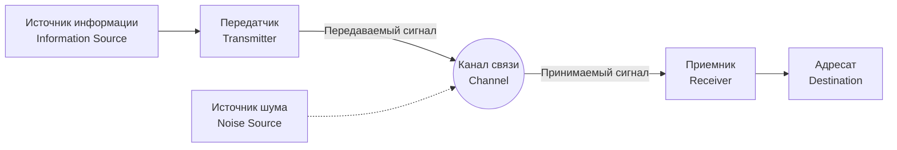

## 1. Введение: Что такое информация?

Слово «информация», которое мы произносим каждый день, очень трудно определить с научной точки зрения. Новости, сообщения от друзей, последовательность оснований ДНК или радиоволны из космоса — все это содержит информацию. Однако, чтобы работать с ними математически в общих рамках, необходим объективный и количественный показатель.

Человек, который взялся за эту грандиозную задачу и заложил основу современного цифрового общества, — математик и инженер Клод Шеннон (Claude Shannon). Не будет преувеличением сказать, что его статья 1948 года «Математическая теория связи» (A Mathematical Theory of Communication) в одиночку создала совершенно новую дисциплину — **теорию информации** (Information Theory).

В этой статье мы подробно рассмотрим, как Шеннон математически определил «информацию», и какое значение имеет ее центральная концепция, **энтропия Шеннона**, для технологий сжатия данных и связи.

## 2. Общая модель коммуникации

Шеннон на время отделил значение (семантику) информации и сосредоточился на самой «передаче» информации. Предложенная им общая модель системы связи представлена на диаграмме Mermaid ниже.



В этой модели главная проблема коммуникации сводится к следующему: **«Как точно и эффективно передать сообщение через канал связи с наличием шума?»**

## 3. Математическое определение количества информации

Самый фундаментальный вопрос в теории информации: «Когда мы узнаем, что произошло определенное событие, сколько информации мы получаем?»

Шеннон рассматривал количество информации как «степень удивления».
- Когда происходит **частое событие (событие с высокой вероятностью)**, удивление невелико, и получаемое количество информации мало.
- Когда происходит **редкое событие (событие с низкой вероятностью)**, удивление велико, и получаемое количество информации велико.

Пусть вероятность наступления события $ x $ равна $ P(x) $, тогда **собственная информация** (Self-Information) $ I(x) $, содержащаяся в этом событии, определяется следующим образом:

$$
I(x) = - \log_2 P(x) = \log_2 \frac{1}{P(x)}
$$

Если в качестве основания логарифма используется $ 2 $, единицей измерения количества информации является **бит** (bit). Например, количество информации события выпадения орла при подбрасывании монеты с равной вероятностью выпадения орла и решки ($ P = 0.5 $) равно:

$$
I(\text{Орел}) = - \log_2(0.5) = 1 \text{ bit}
$$

Это совпадает с интуитивным пониманием «1 бита информации».

## 4. Энтропия Шеннона

Собственная информация — это количество информации для отдельного события, но как узнать, сколько информации в среднем генерируется всем источником информации?

Здесь появляется **энтропия** (Entropy). Когда источник информации $ X $ генерирует $ n $ различных символов $ x_1, x_2, \dots, x_n $ с вероятностями $ P(x_1), P(x_2), \dots, P(x_n) $, энтропия $ H(X) $ источника информации $ X $ определяется как математическое ожидание собственной информации.

$$
H(X) = - \sum_{i=1}^{n} P(x_i) \log_2 P(x_i)
$$

(Однако, в случае $ P(x_i) = 0 $ считается, что $ 0 \log_2 0 = 0 $)

### Интуитивное значение энтропии
Энтропия $ H(X) $ представляет собой степень **неопределенности**, которой обладает источник информации.
- Когда совершенно невозможно предсказать, какой символ появится (все вероятности равны), энтропия достигает максимума.
- Когда всегда появляется один и тот же символ (вероятность одного равна $ 1 $, а остальных $ 0 $), неопределенность исчезает, и энтропия равна $ 0 $.

Давайте вычислим изменение энтропии при изменении вероятности выпадения орла $ p $, используя следующий код на Python.

```python
import numpy as np
import matplotlib.pyplot as plt

def binary_entropy(p):
    if p == 0 or p == 1:
        return 0
    return -p * np.log2(p) - (1 - p) * np.log2(1 - p)

probabilities = np.linspace(0, 1, 100)
entropies = [binary_entropy(p) for p in probabilities]

plt.plot(probabilities, entropies)
plt.title('Binary Entropy Function')
plt.xlabel('Probability of heads (p)')
plt.ylabel('Entropy H(X) in bits')
plt.grid(True)
plt.show()
```

Построив этот график, мы увидим, что при $ p = 0.5 $ энтропия достигает своего максимального значения $ 1 $, что указывает на состояние полной непредсказуемости.

## 5. Теорема кодирования источника: пределы сжатия данных

Энтропия — это не просто абстрактная концепция. Шеннон доказал, что эта энтропия определяет **абсолютный предел сжатия данных**. Это **теорема кодирования источника** (первая теорема Шеннона).

Утверждение теоремы очень простое:
**«Какой бы алгоритм сжатия без потерь ни использовался, средняя длина кода данных, генерируемых источником информации, не может быть меньше энтропии $ H(X) $ этого источника.»**

$$
L \ge H(X)
$$
( $ L $ — средняя длина кода)

Другими словами, энтропия указывает на «существенный размер самой информации», и это означает, что математически невозможно сжать данные за пределами этого барьера, независимо от того, насколько хороши алгоритмы ZIP или gzip.

### Код Хаффмана (Huffman Coding)
В качестве конкретного метода приближения к пределу энтропии Дэвид Хаффман, развивая идеи Фано, коллеги Шеннона, разработал **код Хаффмана**.

Присваивая короткие битовые последовательности часто встречающимся символам и длинные битовые последовательности редко встречающимся символам, минимизируется общая средняя длина кода. Ниже приведен пример простого построения кода Хаффмана на Python.

```python
import heapq
from collections import Counter

class Node:
    def __init__(self, char, freq):
        self.char = char
        self.freq = freq
        self.left = None
        self.right = None

    def __lt__(self, other):
        return self.freq < other.freq

def build_huffman_tree(text):
    frequency = Counter(text)
    heap = [Node(char, freq) for char, freq in frequency.items()]
    heapq.heapify(heap)

    while len(heap) > 1:
        left = heapq.heappop(heap)
        right = heapq.heappop(heap)
        merged = Node(None, left.freq + right.freq)
        merged.left = left
        merged.right = right
        heapq.heappush(heap, merged)

    return heap[0]

def generate_huffman_codes(node, prefix="", codebook={}):
    if node is not None:
        if node.char is not None:
            codebook[node.char] = prefix
        generate_huffman_codes(node.left, prefix + "0", codebook)
        generate_huffman_codes(node.right, prefix + "1", codebook)
    return codebook

# Пример текста
text = "shannon_entropy_and_information_theory"
tree_root = build_huffman_tree(text)
codes = generate_huffman_codes(tree_root)

print("Huffman Codes:")
for char, code in sorted(codes.items()):
    print(f"'{char}': {code}")
```

## 6. Теорема кодирования канала: пределы безошибочной связи

Продемонстрировав пределы сжатия данных, Шеннон затем взялся за «канал связи с шумом». При наличии шума некоторые данные инвертируются или теряются. Чтобы справиться с этим, мы добавляем к данным **избыточность**, чтобы можно было исправлять ошибки (коды с исправлением ошибок).

Однако, чем больше избыточности мы добавляем, тем ниже становится фактическая скорость (rate) передаваемой информации. Так с какой скоростью и насколько точно мы можем передавать информацию в условиях шума?

Ответом на этот вопрос является **теорема кодирования канала** (вторая теорема Шеннона).

Шеннон доказал, что канал связи имеет свою собственную **пропускную способность канала** (Channel Capacity) $ C $. И удивительно, он утверждал следующее:

**«Если скорость передачи информации $ R $ меньше пропускной способности канала $ C $ ( $ R < C $ ), то при соответствующем кодировании вероятность ошибки можно сделать сколь угодно близкой к нулю.»**

Типичной формулой для вычисления пропускной способности канала $ C $ является теорема Шеннона-Хартли для канала с аддитивным белым гауссовым шумом (AWGN).

$$
C = B \log_2 \left( 1 + \frac{S}{N} \right)
$$

Где:
- $ C $ : Пропускная способность канала (bits per second)
- $ B $ : Пропускная способность (Hz)
- $ S $ : Мощность сигнала (Watt)
- $ N $ : Мощность шума (Watt)
- $ \frac{S}{N} $ : Отношение сигнал/шум (Signal-to-Noise Ratio)

Эта теорема служит ориентиром, показывающим достижимый теоретический предел (предел Шеннона) в проектировании всех цифровых систем связи, таких как современный Wi-Fi, мобильная связь 5G и спутниковая связь.

## 7. Заключение

Теория информации, созданная Клодом Шенноном, математически строго определила нематериальную вещь под названием «информация» и открыла дверь в цифровую эпоху. **Энтропия Шеннона** — это не просто абстрактное понятие, она показывает абсолютный предел алгоритмов сжатия данных, а пропускная способность канала определила направление эволюции Интернета и беспроводной связи, которыми мы пользуемся каждый день.

Мы можем транслировать видео на наших смартфонах и получать четкие изображения космоса от далеких зондов, потому что существует прочная математическая основа, называемая теорией информации. Концепция энтропии продолжает распространяться на более широкие области, например, обсуждается ее связь с термодинамической энтропией в физике и она играет важную роль в машинном обучении (например, потери перекрестной энтропии).

Глубокое понимание природы данных и знание их пределов по-прежнему будут оставаться самым важным подходом при проектировании более совершенных систем информационных коммуникаций будущего.
