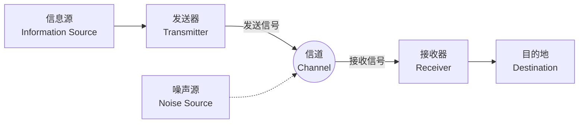

## 1. 引言：什么是信息？

我们在日常生活中经常会提到“信息”这个词，但要科学地定义“信息”却非常困难。新闻、朋友发来的消息、DNA的碱基序列，或者是从宇宙传来的无线电波，所有这些都包含信息。然而，为了能在数学上使用一个共同的框架来处理它们，我们需要一个客观且定量的指标。

挑战这个宏大课题，并为现代数字社会奠定基础的，是数学家兼工程师克劳德·香农（Claude Shannon）。他在1948年发表的论文《通信的数学理论》（A Mathematical Theory of Communication），毫不夸张地说，单枪匹马地开创了 **信息论** （Information Theory）这个全新的学科领域。

本文将深入探讨香农是如何在数学上定义“信息”的，以及其核心概念 **香农熵** （Shannon Entropy）在数据压缩和通信技术中具有怎样的意义。

## 2. 通信的一般模型

香农暂时剥离了信息的含义（语义），而将焦点放在信息的“传递”本身。他提出的通信系统一般模型，可以用以下的Mermaid图来表示。



在这个模型中，通信最大的挑战集中在 **“如何通过存在噪声的信道，准确且高效地传输消息”** 这一点上。

## 3. 信息量的数学定义

信息论中最基本的问题是：“当我们知道某个事件发生时，我们获得了多少信息？”

香农将信息的量视为“惊讶的程度”。
- 当 **经常发生的事情（概率高的事件）** 发生时，惊讶程度低，获得的信息量小。
- 当 **罕见发生的事情（概率低的事件）** 发生时，惊讶程度高，获得的信息量大。

假设事件 $ x $ 发生的概率为 $ P(x) $ ，那么该事件所包含的 **自信息量** （Self-Information） $ I(x) $ 定义如下。

$$
I(x) = - \log_2 P(x) = \log_2 \frac{1}{P(x)}
$$

如果对数的底数为 $ 2 $ ，则信息量的单位为 **比特** （bit）。例如，抛掷一枚正反面等概率（ $ P = 0.5 $ ）的硬币，出现正面这一事件的信息量为：

$$
I(\text{正面}) = - \log_2(0.5) = 1 \text{ bit}
$$

这与“1比特信息”的直观理解也是一致的。

## 4. 香农熵

自信息量是针对单个事件的信息量，但是我们如何知道从整个信息源平均产生了多少信息呢？

这时候登场的就是 **熵** （Entropy）。当信息源 $ X $ 以概率 $ P(x_1), P(x_2), \dots, P(x_n) $ 产生 $ n $ 个不同的符号 $ x_1, x_2, \dots, x_n $ 时，信息源 $ X $ 的熵 $ H(X) $ 定义为自信息量的期望值。

$$
H(X) = - \sum_{i=1}^{n} P(x_i) \log_2 P(x_i)
$$

（但是，当 $ P(x_i) = 0 $ 时，认为 $ 0 \log_2 0 = 0 $ ）

### 熵的直观含义
熵 $ H(X) $ 表示信息源所具有的 **不确定性** 程度。
- 当完全无法预测会出现哪个符号（所有概率均等）时，熵达到最大。
- 当总是出现同一个符号（某个概率为 $ 1 $ 且其他为 $ 0 $ ）时，不确定性消失，熵为 $ 0 $ 。

下面我们用Python代码，计算一下当硬币出现正面的概率 $ p $ 变化时，熵的变化情况。

```python
import numpy as np
import matplotlib.pyplot as plt

def binary_entropy(p):
    if p == 0 or p == 1:
        return 0
    return -p * np.log2(p) - (1 - p) * np.log2(1 - p)

probabilities = np.linspace(0, 1, 100)
entropies = [binary_entropy(p) for p in probabilities]

plt.plot(probabilities, entropies)
plt.title('Binary Entropy Function')
plt.xlabel('Probability of heads (p)')
plt.ylabel('Entropy H(X) in bits')
plt.grid(True)
plt.show()
```

绘制出这个图表后，我们可以发现当 $ p = 0.5 $ 时，熵达到最大值 $ 1 $ ，此时处于完全不可预测的状态。

## 5. 信源编码定理：数据压缩的极限

熵并不仅仅是一个抽象概念。香农证明了，这个熵决定了 **数据压缩的绝对极限** 。这就是 **信源编码定理** （香农第一定理）。

该定理的推论非常简单。
**“无论使用任何无损压缩算法，都无法使信息源产生数据的平均码长小于该信息源的熵 $ H(X) $ 。”**

$$
L \ge H(X)
$$
（ $ L $ 为平均码长）

也就是说，熵代表了“信息本身所固有的本质大小”，这意味着无论开发出多么优秀的ZIP或gzip等算法，在数学上都不可能突破这个极限壁垒进行压缩。

### 哈夫曼编码 (Huffman Coding)
为了接近熵的极限，作为具体的方法，香农的共同研究者法诺的想法被发展起来，大卫·哈夫曼发明了 **哈夫曼编码** 。

通过为出现概率高的符号分配较短的比特串，为出现概率低的符号分配较长的比特串，来最小化整体的平均码长。以下是使用Python构建简单的哈夫曼编码的示例。

```python
import heapq
from collections import Counter

class Node:
    def __init__(self, char, freq):
        self.char = char
        self.freq = freq
        self.left = None
        self.right = None

    def __lt__(self, other):
        return self.freq < other.freq

def build_huffman_tree(text):
    frequency = Counter(text)
    heap = [Node(char, freq) for char, freq in frequency.items()]
    heapq.heapify(heap)

    while len(heap) > 1:
        left = heapq.heappop(heap)
        right = heapq.heappop(heap)
        merged = Node(None, left.freq + right.freq)
        merged.left = left
        merged.right = right
        heapq.heappush(heap, merged)

    return heap[0]

def generate_huffman_codes(node, prefix="", codebook={}):
    if node is not None:
        if node.char is not None:
            codebook[node.char] = prefix
        generate_huffman_codes(node.left, prefix + "0", codebook)
        generate_huffman_codes(node.right, prefix + "1", codebook)
    return codebook

# 示例文本
text = "shannon_entropy_and_information_theory"
tree_root = build_huffman_tree(text)
codes = generate_huffman_codes(tree_root)

print("Huffman Codes:")
for char, code in sorted(codes.items()):
    print(f"'{char}': {code}")
```

## 6. 信道编码定理：无差错通信的极限

展示了数据压缩极限的香农，接下来挑战了“存在噪声的信道”。如果存在噪声，数据的一部分就会翻转或丢失。为了应对这个问题，我们在数据中加入 **冗余性** 以便能够纠正错误（纠错码）。

然而，加入的冗余性越多，实际能够发送的信息的实质速度（速率）就会越低。那么，在存在噪声的环境下，我们能以多快的速度，以及多高的准确率发送信息呢？

对这个问题的回答就是 **信道编码定理** （香农第二定理）。

香农证明了信道存在固有的 **信道容量** （Channel Capacity） $ C $ 。令人惊讶的是，他提出了如下主张：

**“如果信息传输速率 $ R $ 小于信道容量 $ C $ （ $ R < C $ ），那么通过进行适当的编码，可以使错误率无限接近于零。”**

计算信道容量 $ C $ 的代表性公式，是关于加性高斯白噪声（AWGN）信道的香农-哈特利定理。

$$
C = B \log_2 \left( 1 + \frac{S}{N} \right)
$$

在这里，
- $ C $ : 信道容量 (bits per second)
- $ B $ : 带宽 (Hz)
- $ S $ : 信号功率 (Watt)
- $ N $ : 噪声功率 (Watt)
- $ \frac{S}{N} $ : 信噪比 (Signal-to-Noise Ratio)

这一定理在现代Wi-Fi、5G移动通信、卫星通信等所有数字通信系统的设计中，成为了指明可达到的理论极限（香农极限）的灯塔。

## 7. 结语

克劳德·香农构建的信息论，将“信息”这个无形的东西在数学上进行了严格的定义，推开了数字时代的大门。 **香农熵** 并不仅仅停留在抽象概念上，它指出了数据压缩算法的绝对极限，而信道容量决定了我们日常使用的互联网和无线通信演进的方向。

我们在智能手机上可以流式传输视频，或者从遥远的探测器接收清晰的宇宙图像，正是因为有着信息论这个坚实的数学基础。熵的概念现在还在物理学的热力学熵的关系上被讨论，或者在机器学习（如交叉熵误差等）中扮演着重要角色，并持续波及更广泛的领域。

从根本上理解数据的性质，并了解其极限，在设计未来更高级的信息通信系统时，依然将是最为重要的方法。
