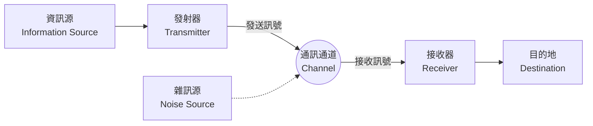

## 1. 簡介：什麼是資訊？

我們日常生活中常說「資訊」，但要在科學上定義「資訊」卻非常困難。新聞、來自朋友的訊息、DNA 的鹼基序列，或是從宇宙傳來的電波等，這一切都包含資訊。然而，為了在數學上使用共通的框架來處理這些事物，我們需要客觀且定量的指標。

挑戰這項艱鉅任務，並奠定現代數位社會基礎的，是身兼數學家與工程師的 克勞德·夏農（Claude Shannon） 。他在 1948 年發表的論文《通訊的數學理論》（A Mathematical Theory of Communication），可以毫不誇張地說，憑一己之力開創了 **資訊理論** （Information Theory）這個全新的學術領域。

本文將深入探討夏農是如何在數學上定義「資訊」，以及其核心概念 **夏農的熵** ，在資料壓縮與通訊技術中具有何種意義。

## 2. 通訊的一般模型

夏農暫時拋開了資訊的意義（語意），而將焦點集中在資訊的「傳遞」本身。他所提出的通訊系統一般模型，可以用以下的 Mermaid 圖來表示。



在這個模型中，通訊最大的挑戰歸結於 **「如何透過存在雜訊的通訊通道，準確且有效率地傳送訊息」** 。

## 3. 資訊量的數學定義

資訊理論中最基本的問題是：「當我們得知某個事件發生時，我們獲得了多少資訊？」

夏農將資訊的量視為「驚訝的程度」。
- 即使 **經常發生的事情（機率高的事件）** 發生了，驚訝程度也很低，獲得的資訊量就很小。
- 當 **罕見的事情（機率低的事件）** 發生時，驚訝程度很高，獲得的資訊量就很大。

假設事件 $ x $ 發生的機率為 $ P(x) $ ，則該事件所擁有的 **自我資訊量** （Self-Information） $ I(x) $ 定義如下：

$$
I(x) = - \log_2 P(x) = \log_2 \frac{1}{P(x)}
$$

當使用 $ 2 $ 作為對數的底數時，資訊量的單位是 **位元** （bit）。例如，投擲一枚出現正反面機率相等（$ P = 0.5 $）的硬幣，出現正面的事件的資訊量為：

$$
I(\text{正面}) = - \log_2(0.5) = 1 \text{ bit}
$$

這也與我們對「1 位元的資訊」的直觀理解相符。

## 4. 夏農的熵

自我資訊量是針對個別事件的資訊量，但我們該如何得知整體資訊源平均產生了多少資訊呢？

這時登場的就是 **熵** （Entropy）。當資訊源 $ X $ 以機率 $ P(x_1), P(x_2), \dots, P(x_n) $ 產生 $ n $ 個不同的符號 $ x_1, x_2, \dots, x_n $ 時，資訊源 $ X $ 的熵 $ H(X) $ 定義為自我資訊量的期望值。

$$
H(X) = - \sum_{i=1}^{n} P(x_i) \log_2 P(x_i)
$$

（不過，當 $ P(x_i) = 0 $ 時，我們將其視為 $ 0 \log_2 0 = 0 $）

### 熵的直觀意義
熵 $ H(X) $ 代表了資訊源所具有的 **不確定性** 的程度。
- 當完全無法預測會出現哪個符號（所有機率均等）時，熵會達到最大。
- 當總是出現相同的符號（某個機率為 $ 1 $ 且其他為 $ 0 $）時，不確定性消失，熵變為 $ 0 $。

我們可以用以下的 Python 程式碼，來計算硬幣出現正面的機率 $ p $ 變化時，熵的變化情況。

```python
import numpy as np
import matplotlib.pyplot as plt

def binary_entropy(p):
    if p == 0 or p == 1:
        return 0
    return -p * np.log2(p) - (1 - p) * np.log2(1 - p)

probabilities = np.linspace(0, 1, 100)
entropies = [binary_entropy(p) for p in probabilities]

plt.plot(probabilities, entropies)
plt.title('二元熵函數')
plt.xlabel('出現正面的機率 (p)')
plt.ylabel('熵 H(X) (位元)')
plt.grid(True)
plt.show()
```

繪製這張圖表後，可以發現當 $ p = 0.5 $ 時，熵達到最大值 $ 1 $ ，這表示處於完全無法預測的狀態。

## 5. 資訊源編碼定理：資料壓縮的極限

熵不只是一個抽象的概念。夏農證明了，這個熵決定了 **資料壓縮的絕對極限** 。這就是 **資訊源編碼定理** （夏農第一定理）。

這項定理的主張非常簡單：
**「無論使用任何無損壓縮演算法，資訊源產生資料的平均碼長，都無法小於該資訊源的熵 $ H(X) $ 。」**

$$
L \ge H(X)
$$
（ $ L $ 為平均碼長）

也就是說，熵表示了「資訊本身所具有的本質大小」，這意味著無論我們開發出多麼優秀的 ZIP 或 gzip 等演算法，在數學上都不可能突破這個極限壁壘進行壓縮。

### 哈夫曼編碼 (Huffman Coding)
為了逼近熵的極限，夏農的共同研究者法諾（Fano）提出了一個想法，隨後由大衛·哈夫曼（David Huffman）將其發展並發明了具體的方法，這就是 **哈夫曼編碼** 。

透過為出現機率高的符號分配較短的位元串，並為出現機率低的符號分配較長的位元串，可以將整體的平均碼長最小化。以下是使用 Python 建構簡單哈夫曼編碼的範例。

```python
import heapq
from collections import Counter

class Node:
    def __init__(self, char, freq):
        self.char = char
        self.freq = freq
        self.left = None
        self.right = None

    def __lt__(self, other):
        return self.freq < other.freq

def build_huffman_tree(text):
    frequency = Counter(text)
    heap = [Node(char, freq) for char, freq in frequency.items()]
    heapq.heapify(heap)

    while len(heap) > 1:
        left = heapq.heappop(heap)
        right = heapq.heappop(heap)
        merged = Node(None, left.freq + right.freq)
        merged.left = left
        merged.right = right
        heapq.heappush(heap, merged)

    return heap[0]

def generate_huffman_codes(node, prefix="", codebook={}):
    if node is not None:
        if node.char is not None:
            codebook[node.char] = prefix
        generate_huffman_codes(node.left, prefix + "0", codebook)
        generate_huffman_codes(node.right, prefix + "1", codebook)
    return codebook

# 範例文字
text = "夏農熵與資訊理論"
tree_root = build_huffman_tree(text)
codes = generate_huffman_codes(tree_root)

print("哈夫曼編碼：")
for char, code in sorted(codes.items()):
    print(f"'{char}': {code}")
```

## 6. 通訊通道編碼定理：無誤通訊的極限

在指出了資料壓縮的極限之後，夏農接著挑戰了「有雜訊的通訊通道」。如果有雜訊，資料的一部分就會反轉或遺失。為了解決這個問題，我們會在資料中加入 **冗餘性** ，使其能夠進行錯誤更正（錯誤更正碼）。

然而，加入的冗餘性越多，實際上能傳送資訊的實質速度（速率）就會下降。那麼，在有雜訊的環境下，我們能以多快的速度，多麼準確地傳送資訊呢？

這個問題的答案就是 **通訊通道編碼定理** （夏農第二定理）。

夏農證明了，通訊通道存在著固有的 **通訊通道容量** （Channel Capacity） $ C $ 。接著，他提出了令人驚訝的主張：

**「只要資訊傳輸速率 $ R $ 小於通訊通道容量 $ C $ （ $ R < C $ ），透過適當的編碼，就可以將錯誤率無限逼近於零。」**

計算通訊通道容量 $ C $ 的代表性公式，是關於白色高斯雜訊（AWGN）通訊通道的夏農-哈特利定理（Shannon-Hartley theorem）。

$$
C = B \log_2 \left( 1 + \frac{S}{N} \right)
$$

其中：
- $ C $ : 通訊通道容量 (bits per second)
- $ B $ : 頻寬 (Hz)
- $ S $ : 訊號功率 (Watt)
- $ N $ : 雜訊功率 (Watt)
- $ \frac{S}{N} $ : 訊噪比 (Signal-to-Noise Ratio)

這項定理為現代的 Wi-Fi、5G 行動通訊、衛星通訊等所有數位通訊系統的設計，指明了可達到的理論極限（夏農極限）。

## 7. 結語

克勞德·夏農建構的資訊理論，在數學上嚴謹地定義了「資訊」這個無形的事物，開啟了數位時代的大門。 **夏農的熵** 不僅僅停留在抽象的概念，它指出了資料壓縮演算法的絕對極限，而通訊通道容量則決定了我們日常使用的網際網路與無線通訊的演進方向。

我們能夠在智慧型手機上串流影片，或是接收來自遙遠探測器的清晰宇宙影像，都是因為有資訊理論這個堅實的數學基礎。熵的概念目前正繼續擴展至更廣泛的領域，例如與物理學中熱力學熵的關聯性探討，以及在機器學習（如交叉熵誤差等）中扮演的重要角色。

從根本上理解資料的性質，並認識其極限，在設計未來更先進的資訊通訊系統時，將依然是最為重要的途徑。
