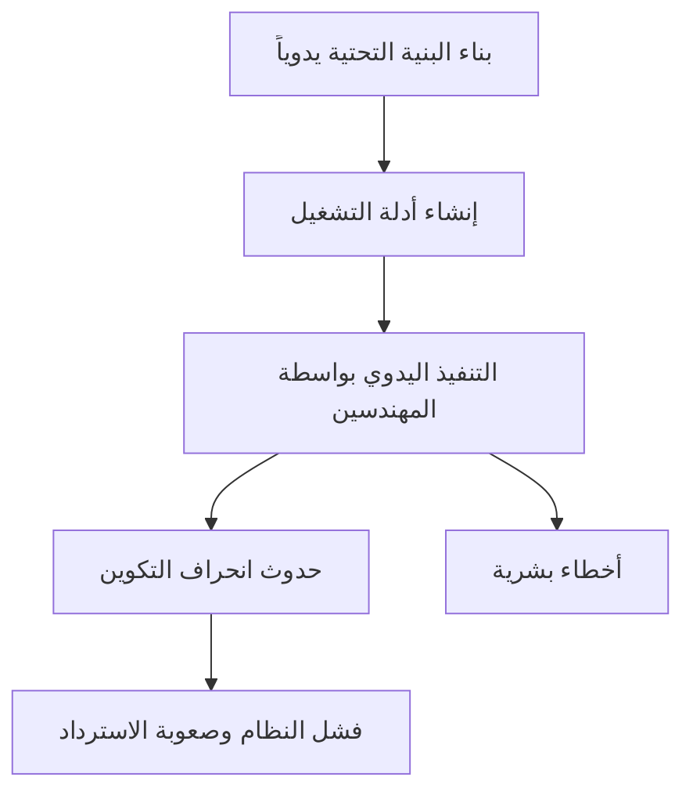
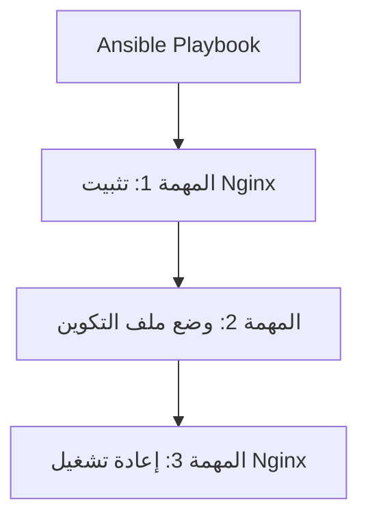
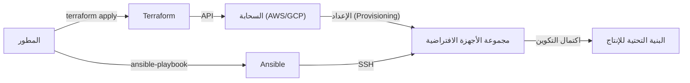

في تطوير الأنظمة الحديثة، لم يعد مصطلح "Infrastructure as Code (IaC)" أو البنية التحتية ككود مجرد كلمة طنانة، بل أصبح منصة أساسية لبناء وتشغيل أنظمة قابلة للتوسع وموثوقة. لقد انتقلنا من عصر كان فيه مهندسو البنية التحتية يسهرون طوال الليل لتركيب الخوادم وكتابة الأوامر على شاشات سوداء باستخدام أدلة التشغيل، إلى عصر تُدار فيه البنية التحتية ككود برمجي.

في هذه المقالة، سنقارن بين أداتين رائدتين في مجال IaC وهما **Terraform** و **Ansible**، وسنتعمق في الاختلافات في أدوارهما، وفلسفات التصميم (النهج التعريفي مقابل النهج الإجرائي)، وأفضل الممارسات للجمع بينهما.

## هشاشة بناء البنية التحتية اليدوي (أدلة التشغيل) وانعدام قابلية إعادة الإنتاج

لفهم قيمة IaC، يجب أن ننظر إلى الوراء في ديون "التشغيل اليدوي" في الماضي.
تقليديًا، كان يتم بناء الخوادم يدويًا استنادًا إلى "أدلة التشغيل (Runbooks)" التي تم إنشاؤها باستخدام برامج مثل Excel. هذا النهج يحتوي على العديد من العيوب القاتلة:

1. **حتمية الأخطاء البشرية**: إذا قام الإنسان بتنفيذ 100 سطر من الأوامر يدويًا، فمن المؤكد حدوث أخطاء مطبعية أو تخطي للخطوات في مكان ما.
2. **انحراف التكوين (Configuration Drift)**: عند إجراء استكشاف الأخطاء وإصلاحها بشكل عاجل في بيئة الإنتاج، تتم إضافة "تعديلات يدوية" لا تنعكس في دليل التشغيل أو المستودع. نتيجة لذلك، يحدث تناقض في التكوين بين بيئة الاختبار وبيئة الإنتاج، مما يؤدي إلى موقف "لقد عمل في بيئة الاختبار ولكنه لا يعمل في الإنتاج".
3. **الاعتماد على أشخاص محددين (Person-dependency)**: يستمر تحول النظام إلى "وصفات سرية" حيث يقال: "الشخص (أ) فقط هو من يعرف إعدادات Apache لذلك الخادم".
4. **حدود قابلية التوسع**: عند الحاجة إلى إضافة 10 خوادم في وقت واحد بسبب زيادة مفاجئة في حركة المرور، لا يمكن للعمل اليدوي أن يواكب ذلك أبدًا.

## تحول النموذج: البنية التحتية غير القابلة للتغيير (Immutable Infrastructure)

لحل هذه التحديات، ظهر مفهوم **البنية التحتية غير القابلة للتغيير (Immutable Infrastructure)**.

سابقًا، كان يتم تسجيل الدخول إلى الخوادم التي تم بناؤها عبر SSH لتحديث الحزم أو تعديل ملفات التكوين (Mutable: قابل للتغيير). على النقيض من ذلك، في البنية التحتية غير القابلة للتغيير، يتم تطبيق قاعدة "عدم إجراء أي تغييرات على الخوادم قيد التشغيل" بصرامة.
إذا كانت التحديثات ضرورية، يتم إعداد خوادم جديدة بإعدادات جديدة حديثاً، ويتم تدمير (استبدال) الخوادم القديمة.

من خلال هذا المفهوم، تظل حالة الخادم دائمًا كما كانت عليه عند البناء الأولي، مما يقضي على انحراف التكوين ويحسن بشكل كبير من قابلية إعادة الإنتاج وسهولة الاختبار. وتتيح أدوات IaC القدرة على "بناء الخوادم وتدميرها في لحظة".

## Terraform: النهج التعريفي و "الإعداد (Provisioning)"

تم تطوير **Terraform** بواسطة شركة HashiCorp، وهي أداة متخصصة بشكل رئيسي في "إعداد (Provisioning)" البنية التحتية السحابية. وتتفوق في إنشاء وإدارة الموارد السحابية (مثل VPC، الشبكات الفرعية، مثيلات EC2، RDS، إلخ) على منصات مثل AWS و GCP و Azure.

### النهج التعريفي (Declarative)
أكبر ميزة في Terraform هي اعتمادها على **النهج التعريفي**. بدلاً من وصف "كيفية (How)" إنشاء المورد، تقوم بكتابة "الحالة المرغوبة (What)" باستخدام كود HCL (HashiCorp Configuration Language).

يقوم محرك Terraform بمقارنة حالة البنية التحتية الحالية مع "الحالة المثالية" الموصوفة في الكود، ويحسب الفروق (Plan)، ثم ينفذ العمليات الضرورية (إنشاء، تحديث، حذف) تلقائيًا.

### مزايا وعيوب ملف إدارة الحالة "tfstate"
يستخدم Terraform ملف إدارة حالة يسمى `terraform.tfstate` لتسجيل الحالة الحالية للبنية التحتية.

**المزايا**:
- **حساب سريع للفروق**: بدلاً من استدعاء واجهات برمجة التطبيقات السحابية (API) في كل مرة لفحص جميع الموارد، فإنه يقارن الكود مع tfstate المحلي (أو الخلفية البعيدة Remote Backend)، مما يجعل عملية التخطيط سريعة.
- **تتبع الموارد وإدارة التبعيات**: نظرًا لأنه يحتفظ بالبيانات الوصفية للموارد التي تم إنشاؤها بواسطة Terraform، يمكنه فهم التبعيات المعقدة بين الموارد بدقة وبناءها وتدميرها بالترتيب الصحيح.

**العيوب**:
- **إدارة التعارضات والقفل**: إذا قام عدة أشخاص بتشغيل Terraform في نفس الوقت، فهناك خطر تلف ملف tfstate. لذلك، من الضروري استخدام التحكم الحصري (قفل الحالة State Lock) باستخدام خلفيات بعيدة مثل AWS S3 + DynamoDB.
- **التناقض بسبب التعديلات اليدوية**: إذا قمت بتعديل الموارد يدويًا من وحدة تحكم AWS أو غيرها، فسيحدث انحراف بين tfstate وحالة السحابة الفعلية. سيقوم Terraform في التشغيل التالي باكتشاف التعديلات اليدوية ومحاولة "إعادتها" إلى حالة الكود.

## Ansible: "إدارة التكوين" مع جوانب من النهج الإجرائي

**Ansible**، المدعوم من شركة Red Hat، هو أداة متخصصة بشكل رئيسي في "إدارة التكوين (Configuration)" داخل نظام التشغيل. وهو يتفوق في مهام مثل تثبيت البرامج الوسيطة (مثل Nginx و MySQL) بعد بناء الخادم، ووضع ملفات التكوين، وإنشاء المستخدمين، وبدء تشغيل الخدمات.

### جوانب النهج الإجرائي (Procedural)
على الرغم من أن Ansible مصمم أيضًا لضمان الحيادية التكرارية (Idempotence - الحصول على نفس النتيجة بغض النظر عن عدد مرات التشغيل)، إلا أن نموذج التنفيذ الخاص به له جانب **إجرائي (Procedural)**. في ملفات "Playbook" بصيغة YAML، يتم وصف "خطوات المهام" التي تُنفذ من الأعلى إلى الأسفل.

يقوم Ansible بالاتصال بالخوادم المستهدفة عبر SSH، وينقل الوحدات (Modules)، وينفذ المهام بالترتيب من الأعلى. يمكن القول أن هذا يقوم بترميز خطوات "كيفية الوصول إلى الحالة المطلوبة".

### سهولة كونه بدون وكيل (Agentless)
الميزة القوية لـ Ansible هي أنه **بدون وكيل (Agentless)**. ليست هناك حاجة لتثبيت وكيل إدارة مخصص على الخوادم المستهدفة، وطالما يمكنك الاتصال عبر SSH، يمكنك إدارة التكوين من أي مكان. يتيح ذلك إمكانية إدخاله بسهولة في الخوادم القديمة الحالية.

ومع ذلك، نظرًا لأنه لا يمتلك ملفًا لإدارة الحالة (مثل tfstate في Terraform)، فإنه ليس قويًا مثل Terraform في "حذف" الموارد أو "التتبع الدقيق للتبعيات".

## كيفية الدمج المناسب بين Terraform و Ansible

Terraform و Ansible ليسا متنافسين، بل هما في علاقة **تكامل متبادل**. يمكن تحقيق أقوى بنية تحتية لـ IaC من خلال الجمع بين الاثنين للاستفادة من نقاط القوة في كل منهما.

**تقسيم أفضل الممارسات:**
1. **Terraform (بناء الهيكل العظمي للبنية التحتية)**
   - بناء الشبكة (VPC، الشبكة الفرعية، جدول التوجيه Route Table)
   - تحديد مجموعات الأمان، وأدوار IAM
   - إعداد مثيلات الخوادم (EC2)، قواعد البيانات (RDS)، وموازنات الحمل
2. **Ansible (تجهيز محتوى البنية التحتية)**
   - تحديث حزم نظام التشغيل
   - تثبيت وتكوين البرامج الوسيطة والتطبيقات
   - وضع وكلاء مراقبة السجلات وغيرها

### دور Ansible في عالم غير قابل للتغيير (Immutable)
مع انتشار تقنيات الحاويات (Docker/Kubernetes) والبنية التحتية غير القابلة للتغيير الأصلية السحابية (Cloud-native)، يتناقص عدد مرات تشغيل Ansible مباشرة على خوادم الإنتاج.
في العصر الحديث، يتألق Ansible في مرحلة **"بناء صورة الجهاز (AMI)"**. من خلال دمج Ansible مع أدوات مثل Packer، يتم إنشاء "صورة ذهبية (Golden Image)" تم تكوينها مسبقًا. ثم يستخدم Terraform هذه الصورة الذهبية لإعداد الخوادم.

## الخلاصة

البنية التحتية ككود (Infrastructure as Code) هي محرك قوي يسرع دورة حياة تطوير البرمجيات بأكملها.
إن الفهم الصحيح لـ "إعداد البنية التحتية بالنهج التعريفي" الخاص بـ Terraform و "إدارة التكوين المرنة بالنهج الإجرائي" الخاص بـ Ansible، واستخدامهما بشكل صحيح، هو الخطوة الأولى نحو بناء أنظمة قوية وقابلة للتوسع.
دعونا نتخلى عن أدلة التشغيل اليدوية غير المؤكدة ونستهدف تشغيل بنية تحتية مؤكدة وغير قابلة للتغيير من خلال الكود.
