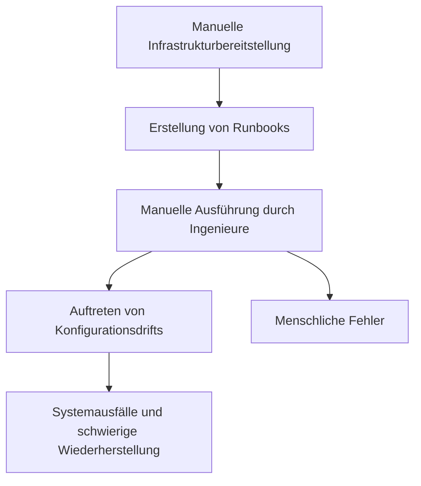
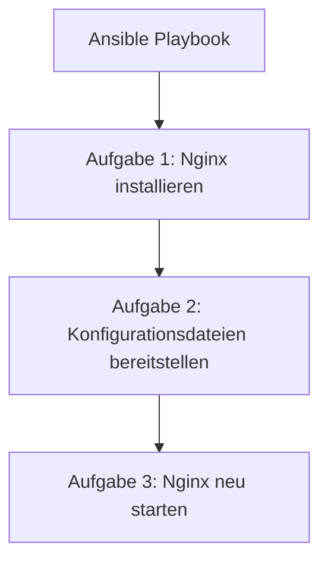
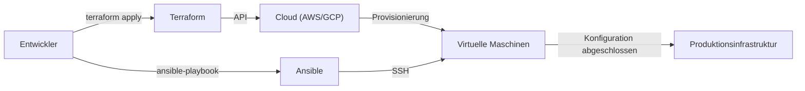

In der modernen Systementwicklung ist "Infrastructure as Code (IaC)" längst kein Buzzword mehr, sondern eine unverzichtbare Plattform für den Aufbau und Betrieb skalierbarer, zuverlässiger Systeme. Vorbei sind die Zeiten, in denen Infrastruktur-Ingenieure Nächte damit verbrachten, Server in Racks einzubauen und mit einem Handbuch in der Hand Befehle in einen schwarzen Bildschirm einzutippen – heute wird die Infrastruktur als Software-Code verwaltet.

In diesem Artikel vergleichen wir die beiden bekanntesten IaC-Tools, **Terraform** und **Ansible**, und gehen tief auf ihre unterschiedlichen Rollen, ihre Designphilosophien (deklarativer vs. prozeduraler Ansatz) sowie Best Practices für deren Kombination ein.

## Die Schwachstellen und mangelnde Reproduzierbarkeit der manuellen Infrastrukturbereitstellung (Runbooks)

Um den Wert von IaC zu verstehen, müssen wir uns die Altlasten des früheren "manuellen Betriebs" ansehen.
Traditionell wurde die Bereitstellung von Servern manuell anhand von "Runbooks" (Bedienungsanleitungen), die oft in Excel erstellt wurden, durchgeführt. Dieser Ansatz weist mehrere fatale Fehler auf:

1. **Unvermeidbarkeit menschlicher Fehler**: Wenn ein Mensch 100 Befehlszeilen manuell ausführt, kommt es unweigerlich zu Tippfehlern oder übersprungenen Schritten.
2. **Konfigurationsdrift (Configuration Drift)**: Wenn bei einer dringenden Fehlersuche in der Produktionsumgebung manuelle "Hotfixes" vorgenommen werden, die nicht im Runbook oder Repository dokumentiert sind, weichen Test- und Produktionsumgebung voneinander ab. Das führt oft zu dem Phänomen: "In der Testumgebung hat es funktioniert, aber in der Produktion nicht."
3. **Personenabhängigkeit (Wissensinseln)**: Es entsteht geheimes Wissen nach dem Motto: "Nur Herr A weiß, wie die Apache-Konfiguration auf jenem Server funktioniert."
4. **Grenzen der Skalierbarkeit**: Wenn bei einem plötzlichen Anstieg des Datenverkehrs 10 weitere Server hinzugefügt werden müssen, ist dies manuell kaum rechtzeitig zu bewältigen.

## Immutable Infrastructure (Unveränderliche Infrastruktur): Ein Paradigmenwechsel

Um diese Probleme zu lösen, entstand das Konzept der **Immutable Infrastructure (Unveränderliche Infrastruktur)**.

Bisher loggte man sich per SSH in einen einmal bereitgestellten Server ein, um Pakete zu aktualisieren oder Konfigurationsdateien zu ändern (Mutable: veränderlich). Im Gegensatz dazu setzt die Immutable Infrastructure strikt die Regel durch, dass "an laufenden Servern keine Änderungen vorgenommen werden".
Wenn ein Update erforderlich ist, wird stattdessen ein komplett neuer Server mit der neuen Konfiguration bereitgestellt, und der alte Server wird verworfen (ersetzt).

Da der Zustand des Servers durch dieses Konzept immer genau dem der ursprünglichen Bereitstellung entspricht, wird der Konfigurationsdrift eliminiert, und Reproduzierbarkeit sowie Testbarkeit steigen drastisch. Genau dieses "blitzschnelle Aufbauen und Verwerfen von Servern" wird durch IaC-Tools erst ermöglicht.

## Terraform: Der deklarative Ansatz und "Provisionierung"

Das von HashiCorp entwickelte **Terraform** ist ein Tool, das sich hauptsächlich auf die "Provisionierung" (Bereitstellung) von Cloud-Infrastruktur spezialisiert hat. Seine Stärke liegt in der Erstellung und Verwaltung von Cloud-Ressourcen (wie VPCs, Subnetze, EC2-Instanzen, RDS usw.) bei Anbietern wie AWS, GCP oder Azure.

### Deklarativer Ansatz (Declarative)
Das Hauptmerkmal von Terraform ist die Verwendung eines **deklarativen Ansatzes**. Statt zu beschreiben, "wie" (How) Ressourcen erstellt werden sollen, definiert man in der HCL (HashiCorp Configuration Language), "welcher Zustand" (What) erreicht werden soll.

Die Terraform-Engine vergleicht den aktuellen Zustand der Infrastruktur mit dem im Code definierten "Soll-Zustand", berechnet die Differenz (Plan) und führt die erforderlichen Operationen (Create, Update, Delete) automatisch aus.

### Vor- und Nachteile der Zustandsdatei "tfstate"
Terraform nutzt eine Zustandsverwaltungsdatei namens `terraform.tfstate`, um den aktuellen Infrastrukturzustand aufzuzeichnen.

**Vorteile**:
- **Schnelle Differenzberechnung**: Statt bei jedem Aufruf die Cloud-API abzufragen und alle Ressourcen zu scannen, vergleicht Terraform den Code mit der lokalen (oder in einem Remote-Backend liegenden) tfstate-Datei, was die Planung enorm beschleunigt.
- **Ressourcenverfolgung und Abhängigkeitsmanagement**: Da die Metadaten der durch Terraform erstellten Ressourcen gespeichert werden, kann es komplexe Abhängigkeiten genau erfassen und Ressourcen in der korrekten Reihenfolge aufbauen oder zerstören.

**Nachteile**:
- **Verwaltung von Konflikten und Sperren**: Wenn mehrere Personen gleichzeitig Terraform ausführen, besteht die Gefahr, dass die tfstate-Datei beschädigt wird. Daher müssen Remote-Backends wie AWS S3 + DynamoDB genutzt werden, um eine exklusive Sperre (State Lock) zu gewährleisten.
- **Inkonsistenzen durch manuelle Änderungen**: Wenn Ressourcen manuell über die AWS-Konsole geändert werden, entsteht eine Abweichung zwischen tfstate und dem tatsächlichen Cloud-Zustand. Bei der nächsten Ausführung erkennt Terraform diese manuelle Änderung und versucht, den im Code definierten Zustand wieder "herzustellen".

## Ansible: "Konfigurationsmanagement" mit prozeduralen Aspekten

Das von Red Hat unterstützte **Ansible** konzentriert sich vor allem auf das "Konfigurationsmanagement" (Einstellungen) innerhalb des Betriebssystems. Es glänzt bei der Installation von Middleware nach der Serverbereitstellung (wie Nginx, MySQL), der Verteilung von Konfigurationsdateien, der Erstellung von Benutzern und dem Starten von Diensten.

### Prozedurale Aspekte (Procedural)
Obwohl auch Ansible so konzipiert ist, dass es Idempotenz garantiert (die Eigenschaft, dass wiederholte Ausführungen dasselbe Ergebnis liefern), hat sein Ausführungsmodell eine stark **prozedurale (Procedural)** Ausrichtung. Ein in YAML geschriebenes "Playbook" beschreibt "Schritt-für-Schritt-Aufgaben", die von oben nach unten abgearbeitet werden.

Ansible verbindet sich per SSH mit dem Zielserver, überträgt Module und führt die Aufgaben sequenziell aus. Dies ist im Grunde die Kodierung des "Wie" (das Vorgehen), um den gewünschten Zustand zu erreichen.

### Die Bequemlichkeit der Agentenlosigkeit
Ein großer Vorteil von Ansible ist, dass es **agentenlos (agentless)** arbeitet. Es ist nicht erforderlich, einen speziellen Management-Agenten auf den Zielservern zu installieren; solange eine SSH-Verbindung besteht, ist Konfigurationsmanagement von überall aus möglich. Dadurch lässt es sich problemlos in bestehende Legacy-Server-Umgebungen integrieren.

Da es jedoch keine Datei zur Zustandsverwaltung (wie Terraforms tfstate) gibt, Ansible bei der "Löschung" von Ressourcen oder der "strengen Verfolgung von Abhängigkeiten" nicht so leistungsstark wie Terraform.

## Die richtige Kombination von Terraform und Ansible

Terraform und Ansible stehen nicht in Konkurrenz zueinander, sondern **ergänzen sich gegenseitig**. Die leistungsstärkste IaC-Infrastruktur entsteht, wenn beide kombiniert werden und ihre jeweiligen Stärken ausspielen.

**Best-Practice-Arbeitsteilung:**
1. **Terraform (Erstellen des Infrastruktur-Gerüsts)**
   - Netzwerkaufbau (VPC, Subnet, Route Table)
   - Definition von Sicherheitsgruppen und IAM-Rollen
   - Provisionierung von Server-Instanzen (EC2), Datenbanken (RDS) und Load Balancern
2. **Ansible (Einrichtung der Infrastruktur-Inhalte)**
   - Aktualisierung von OS-Paketen
   - Installation und Konfiguration von Middleware und Anwendungen
   - Bereitstellung von Log-Monitoring-Agenten usw.

### Die Rolle von Ansible in einer Immutable-Welt
Mit der zunehmenden Verbreitung von Container-Technologien (Docker/Kubernetes) und Cloud-nativer Immutable Infrastructure wird Ansible seltener direkt auf Produktionsservern ausgeführt.
Heute glänzt Ansible stattdessen in der Phase des **"Baus von Maschinen-Images (AMI)"**. In Kombination mit Tools wie Packer wird Ansible genutzt, um vorkonfigurierte "Golden Images" zu erstellen. Anschließend verwendet Terraform diese Golden Images, um die Server bereitzustellen.

## Fazit

Infrastructure as Code ist ein leistungsstarker Motor, der den gesamten Lebenszyklus der Softwareentwicklung beschleunigt.
Das richtige Verständnis und der gezielte Einsatz der Stärken – Terraforms "Infrastruktur-Provisionierung durch deklarativen Ansatz" und Ansibles "flexibles Konfigurationsmanagement durch prozeduralen Ansatz" – sind der erste Schritt zum Aufbau robuster und skalierbarer Systeme.
Verabschieden Sie sich von unzuverlässigen manuellen Runbooks und streben Sie einen sicheren, unveränderlichen Infrastrukturbetrieb durch Code an.
