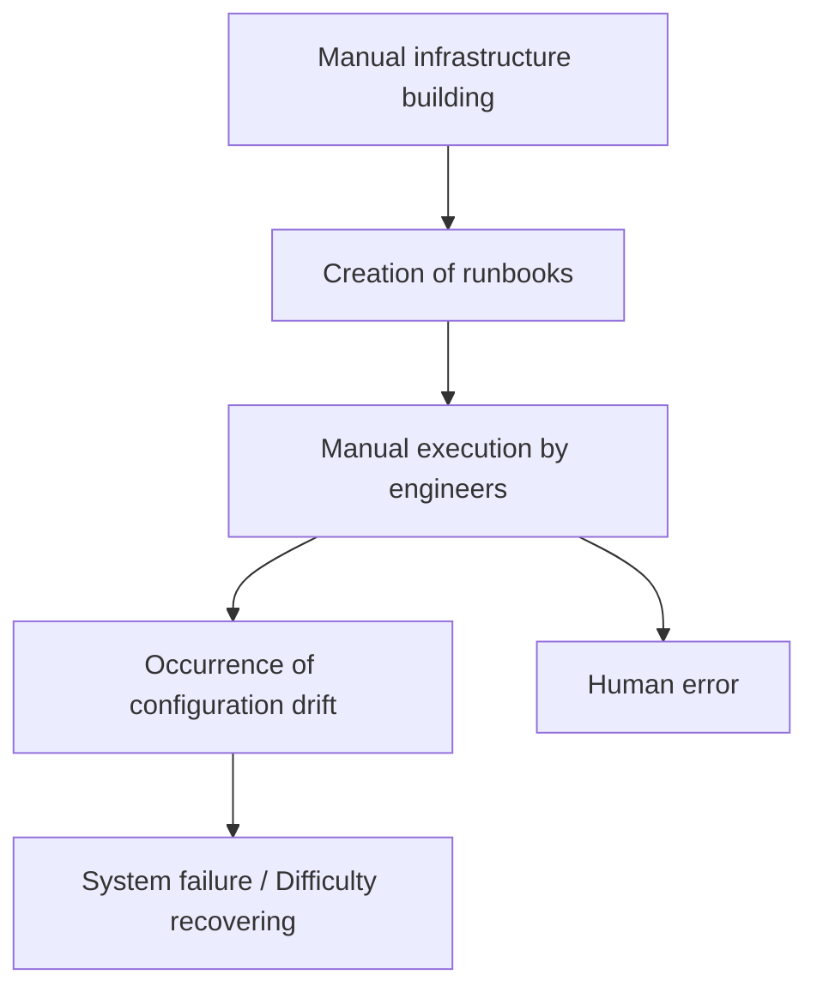
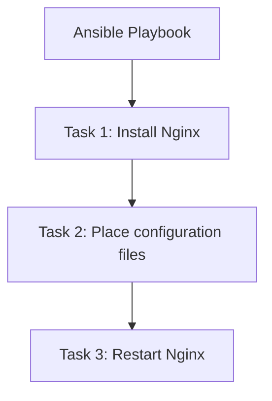
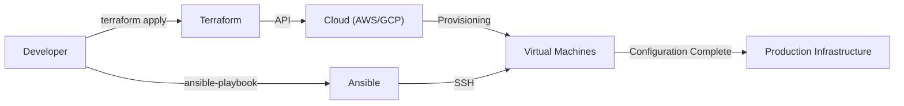

In modern system development, "Infrastructure as Code (IaC)" is no longer just a buzzword, but an essential platform for building and operating scalable and reliable systems. From the days when infrastructure engineers used to rack servers overnight and type commands into black screens with a manual in hand, we have shifted to an era where infrastructure is managed as software code.

In this article, we will compare the two representative IaC tools, **Terraform** and **Ansible**, and delve deeply into the differences in their roles, design philosophies (declarative vs. procedural approaches), and the best practices for combining them.

## The Vulnerability of Manual Infrastructure Building (Runbooks) and the Lack of Reproducibility

To understand the value of IaC, we must look back at the technical debt of past "manual operations".
Traditionally, server construction was done manually based on "Runbooks" (procedure manuals) created in Excel and the like. This approach has several fatal flaws:

1. **Inevitability of Human Error**: When a human manually executes 100 lines of commands, typos or skipped steps are bound to occur somewhere.
2. **Configuration Drift**: When urgent troubleshooting is performed in a production environment, "manual fixes" are applied that are not reflected in the runbook or repository. As a result, a discrepancy in configuration arises between the test and production environments, causing situations where "it worked in the test environment but fails in production".
3. **Over-reliance on Individuals (Siloing)**: A "secret sauce" situation progresses, such as "only Person A understands the Apache configuration of that server".
4. **Limits of Scalability**: When adding 10 servers during a sudden traffic spike, manual work simply cannot keep up.

## The Paradigm Shift of Immutable Infrastructure

To solve these challenges, the concept of **Immutable Infrastructure** emerged.

Previously, we would SSH into a once-built server and perform package updates or change configuration files (Mutable). In contrast, Immutable Infrastructure strictly enforces the rule of "making no changes to running servers".
When updates are necessary, a new server with the new configuration is newly provisioned, and the old server is destroyed (replaced).

Through this concept, the state of the server is always kept as it was during its initial construction, which eliminates configuration drift and dramatically improves reproducibility and testability. And it is IaC tools that make this "instantaneous building and destroying of servers" possible.

## Terraform: The Declarative Approach and "Provisioning"

Developed by HashiCorp, **Terraform** is a tool that primarily specializes in the "provisioning" (building) of cloud infrastructure. It excels at creating and managing cloud resources (VPCs, subnets, EC2 instances, RDS, etc.) on platforms like AWS, GCP, and Azure.

### The Declarative Approach

Terraform's greatest feature is its adoption of a **declarative approach**. Instead of describing "how" to make resources, you describe "what state you want them to be in (What)" using a code called HCL (HashiCorp Configuration Language).

The Terraform engine compares the current infrastructure state with the "desired state" written in the code, calculates the difference (Plan), and automatically executes the necessary operations (Create, Update, Delete).

### The Pros and Cons of the "tfstate" State Management File

Terraform uses a state management file called `terraform.tfstate` to record the current state of the infrastructure.

**Pros**:
- **Fast difference calculation**: Instead of calling cloud APIs every time to scan all resources, it compares the code with the local (or remote backend) tfstate, making planning fast.
- **Resource tracking and dependency management**: Since it holds the metadata of resources created by Terraform, it can accurately grasp complex dependencies between resources and build/destroy them in the correct order.

**Cons**:
- **Conflict and lock management**: If multiple people run Terraform simultaneously, there is a risk of corrupting the tfstate. Therefore, it is necessary to perform exclusive control (state locking) using remote backends like AWS S3 + DynamoDB.
- **Inconsistencies from manual changes**: If you manually change resources from the AWS console, a discrepancy arises between the tfstate and the actual cloud state. The next time Terraform runs, it will detect the manual changes and try to "revert" them to the state in the code.

## Ansible: "Configuration Management" with Procedural Aspects

Backed by Red Hat, **Ansible** is a tool that primarily specializes in "configuration management" (settings) inside the OS. It excels at tasks such as installing middleware (Nginx, MySQL, etc.) after server construction, placing configuration files, creating users, and starting services.

### The Procedural Aspect

While Ansible is also designed to ensure idempotency (the property of yielding the same result no matter how many times it's executed), its execution model has a **procedural** aspect. The YAML-format "Playbook" describes "steps of tasks" that are executed from top to bottom.

Ansible connects to the target server via SSH, transfers modules, and executes tasks in order from the top. This can be described as codifying the procedure of "how to achieve the desired state".

### The Convenience of Being Agentless

Ansible's powerful advantage is that it is **agentless**. There is no need to install a dedicated management agent on the target server; configuration management is possible from anywhere as long as an SSH connection can be established. This allows for easy adoption even on existing legacy servers.

However, because it lacks a file that manages state (like Terraform's tfstate), it is not as adept as Terraform at "deleting" resources or "strictly tracking dependencies".

## How to Properly Combine Terraform and Ansible

Terraform and Ansible are not competitors, but rather they have a **mutually complementary relationship**. The most powerful IaC infrastructure can be realized by combining both to leverage their respective strengths.

**Best Practice Division of Roles:**
1. **Terraform (Building the skeleton of the infrastructure)**
   - Network construction (VPC, Subnet, Route Table)
   - Defining security groups and IAM roles
   - Provisioning server instances (EC2), databases (RDS), and load balancers
2. **Ansible (Fleshing out the inside of the infrastructure)**
   - OS package updates
   - Installing and configuring middleware and applications
   - Deploying log monitoring agents, etc.

### Ansible's Role in an Immutable World

As container technologies (Docker/Kubernetes) and cloud-native Immutable Infrastructure become mainstream, the opportunities to run Ansible directly on production servers are decreasing.
In modern times, Ansible shines in the phase of **"building machine images (AMIs)"**. By combining tools like Packer with Ansible, you can create pre-configured "golden images". Terraform then provisions servers using those golden images.

## Conclusion

Infrastructure as Code is a powerful engine that accelerates the entire software development lifecycle.
Correctly understanding and distinguishing between Terraform's "provisioning of infrastructure via a declarative approach" and Ansible's "flexible configuration management via a procedural approach" is the first step toward building a robust and scalable system.
Let us break free from uncertain manual runbooks and aim for reliable and immutable infrastructure operations through code.
