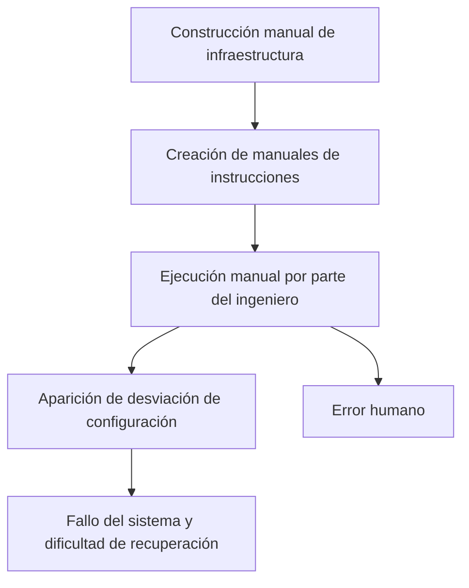
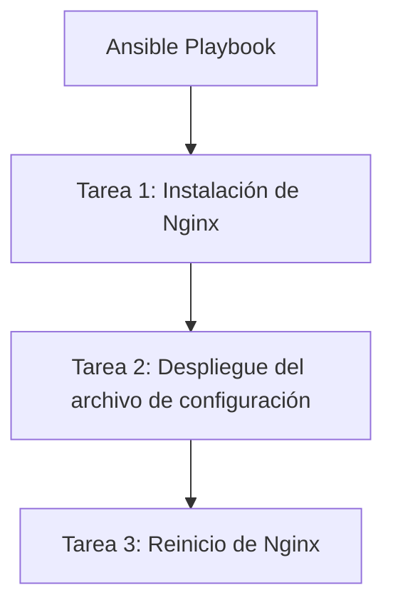
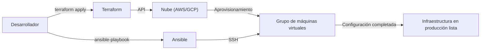

En el desarrollo de sistemas moderno, la "Infraestructura como código (IaC)" ya no es una palabra de moda, sino una plataforma esencial para construir y operar sistemas escalables y confiables. La era en la que los ingenieros de infraestructura pasaban la noche en vela montando servidores en racks y tecleando comandos en pantallas negras con un manual de instrucciones en mano ha quedado atrás, dando paso a una era en la que la infraestructura se gestiona como código de software.

En este artículo, compararemos **Terraform** y **Ansible**, dos de las herramientas de IaC más representativas, y profundizaremos en las diferencias en sus roles, filosofías de diseño (enfoque declarativo frente a enfoque procedimental) y las mejores prácticas para combinarlas.

## Vulnerabilidad y falta de reproducibilidad de la construcción manual de infraestructura (manuales de instrucciones)

Para comprender el valor de IaC, es necesario repasar la deuda de las pasadas "operaciones manuales".
Tradicionalmente, la construcción de servidores se realizaba de forma manual basándose en "manuales de instrucciones (Runbooks)" creados en Excel u otras herramientas. Este enfoque tiene varios defectos fatales:

1. **La inevitabilidad del error humano**: Si un ser humano ejecuta manualmente 100 líneas de comandos, es inevitable que se produzca un error tipográfico o se salte un paso en algún momento.
2. **Desviación de la configuración (Configuration Drift)**: Cuando se lleva a cabo la resolución de problemas de emergencia en el entorno de producción, se añaden "modificaciones manuales" que no se reflejan en el manual de instrucciones ni en el repositorio. Como resultado, se produce una discrepancia en la configuración entre el entorno de prueba y el entorno de producción, provocando la situación de "funcionó en el entorno de prueba pero no funciona en producción".
3. **Dependencia del conocimiento individual**: Progresa la creación de "recetas secretas", como "solo la persona A conoce la configuración de Apache de ese servidor".
4. **Límites de escalabilidad**: Si necesita agregar 10 servidores cuando el tráfico aumenta repentinamente, es imposible llegar a tiempo mediante un trabajo manual.

## El cambio de paradigma de la infraestructura inmutable (Immutable Infrastructure)

Para resolver estos problemas, surgió el concepto de **Infraestructura Inmutable (Immutable Infrastructure)**.

Anteriormente, los ingenieros iniciaban sesión por SSH en un servidor una vez construido para actualizar paquetes y modificar archivos de configuración (Mutable: variable). En contraste, la Infraestructura Inmutable hace cumplir estrictamente la regla de "no realizar cambios en los servidores en funcionamiento".
Si se necesita una actualización, se aprovisiona un nuevo servidor con la nueva configuración desde cero y se destruye (reemplaza) el servidor antiguo.

Gracias a este concepto, el estado del servidor siempre se mantiene exactamente igual que en la construcción inicial, por lo que se elimina la desviación de la configuración y se mejoran drásticamente la reproducibilidad y la facilidad de prueba. Y lo que hace posible este proceso de "construir y destruir servidores instantáneamente" son las herramientas de IaC.

## Terraform: Enfoque declarativo y "Aprovisionamiento"

**Terraform**, desarrollado por HashiCorp, es una herramienta especializada principalmente en el "aprovisionamiento (construcción)" de infraestructura en la nube. Sobresale en la creación y gestión de recursos en la nube (VPC, subredes, instancias EC2, RDS, etc.) en plataformas como AWS, GCP, Azure, entre otras.

### Enfoque declarativo (Declarative)
La característica más importante de Terraform es que adopta un **enfoque declarativo**. En lugar de describir "cómo (How)" crear los recursos, se describe "en qué estado se desea que estén (What)" mediante código en HCL (HashiCorp Configuration Language).

El motor de Terraform compara el estado actual de la infraestructura con el "estado ideal" descrito en el código, calcula la diferencia (Plan) y ejecuta automáticamente las operaciones necesarias (Create, Update, Delete).

### Los pros y contras del archivo de gestión de estado "tfstate"
Terraform utiliza un archivo de gestión de estado llamado `terraform.tfstate` para registrar el estado actual de la infraestructura.

**Ventajas**:
- **Cálculo rápido de diferencias**: En lugar de consultar la API de la nube en cada ocasión para escanear todos los recursos, compara el código con el tfstate local (o en un backend remoto), lo que hace que la planificación sea muy rápida.
- **Seguimiento de recursos y gestión de dependencias**: Dado que mantiene los metadatos de los recursos creados con Terraform, es capaz de comprender con precisión las complejas dependencias entre recursos y puede construirlos y destruirlos en el orden correcto.

**Desventajas**:
- **Gestión de conflictos y bloqueos**: Si varias personas ejecutan Terraform simultáneamente, existe el riesgo de que el tfstate se corrompa. Por lo tanto, es necesario utilizar un backend remoto como AWS S3 + DynamoDB para el control de exclusión (bloqueo de estado).
- **Inconsistencias por modificaciones manuales**: Si se modifican los recursos manualmente desde la consola de AWS u otros medios, se produce una discrepancia entre el tfstate y el estado real en la nube. En la siguiente ejecución, Terraform detectará el cambio manual e intentará "revertirlo" al estado del código.

## Ansible: "Gestión de la configuración" con facetas de enfoque procedimental

**Ansible**, respaldado por Red Hat, es una herramienta especializada principalmente en la "gestión de la configuración (ajustes)" internos del sistema operativo. Destaca en la instalación de middleware (Nginx, MySQL, etc.) tras la construcción del servidor, el despliegue de archivos de configuración, la creación de usuarios y el inicio de servicios.

### Faceta de enfoque procedimental (Procedural)
Aunque Ansible también está diseñado para garantizar la idempotencia (la propiedad de obtener el mismo resultado sin importar cuántas veces se ejecute), su modelo de ejecución tiene una faceta **procedimental (Procedural)**. En el "Playbook" en formato YAML, se describen los "pasos de las tareas" que se ejecutarán de arriba hacia abajo.

Ansible se conecta al servidor de destino a través de SSH, transfiere módulos y ejecuta las tareas secuencialmente desde arriba. Se puede decir que esto codifica los pasos de "cómo alcanzar el estado deseado".

### La conveniencia de ser sin agente (Agentless)
Una ventaja muy poderosa de Ansible es que es **sin agente**. No es necesario instalar un agente de gestión dedicado en el servidor de destino; siempre que se pueda establecer una conexión SSH, la gestión de la configuración se puede realizar desde cualquier lugar. Esto facilita su introducción incluso en servidores heredados existentes.

Sin embargo, dado que no cuenta con un archivo para gestionar el estado (como el tfstate de Terraform), la "eliminación" de recursos y el "seguimiento estricto de dependencias" no son sus puntos fuertes en comparación con Terraform.

## La forma adecuada de combinar Terraform y Ansible

Terraform y Ansible no compiten entre sí, sino que tienen una **relación complementaria**. La infraestructura IaC más potente se puede lograr combinando ambas herramientas, aprovechando los puntos fuertes de cada una.

**División de responsabilidades según las mejores prácticas:**
1. **Terraform (Construir el esqueleto de la infraestructura)**
   - Construcción de redes (VPC, Subnet, Route Table)
   - Definición de grupos de seguridad, roles de IAM
   - Aprovisionamiento de instancias de servidores (EC2), bases de datos (RDS) y balanceadores de carga
2. **Ansible (Preparar el contenido de la infraestructura)**
   - Actualización de paquetes del sistema operativo
   - Instalación y configuración de middleware y aplicaciones
   - Despliegue de agentes de monitoreo de registros, entre otros

### El papel de Ansible en un mundo inmutable
A medida que la tecnología de contenedores (Docker/Kubernetes) y la Infraestructura Inmutable nativa de la nube se vuelven predominantes, las oportunidades de ejecutar Ansible directamente en los servidores de producción están disminuyendo.
En la actualidad, Ansible brilla en la fase de **"construcción de imágenes de máquina (AMI)"**. Se combina Ansible con herramientas como Packer para crear una "imagen dorada (golden image)" preconfigurada. Posteriormente, Terraform utiliza esa imagen dorada para aprovisionar los servidores.

## Conclusión

La Infraestructura como Código es un motor poderoso que acelera todo el ciclo de vida del desarrollo de software.
Comprender correctamente y diferenciar el uso del "aprovisionamiento de infraestructura mediante un enfoque declarativo" de Terraform y la "gestión de configuración flexible mediante un enfoque procedimental" de Ansible, es el primer paso para construir sistemas robustos y escalables.
Dejemos atrás los manuales de instrucciones manuales e inciertos y apuntemos hacia una operación de infraestructura segura e inmutable mediante código.
