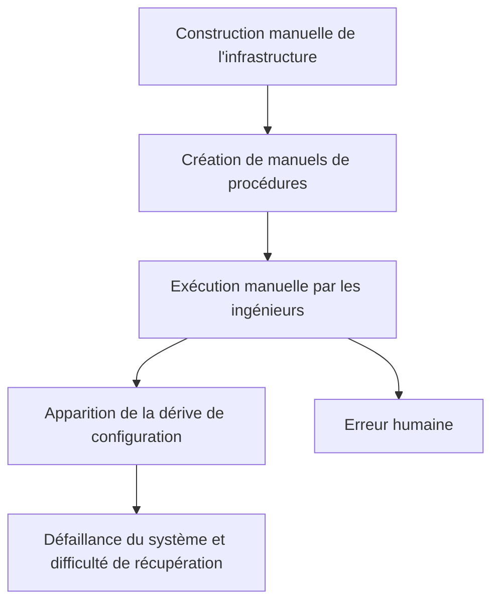
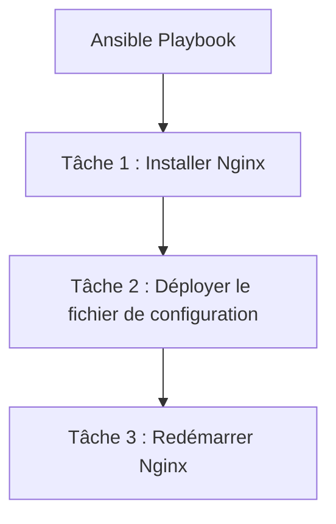
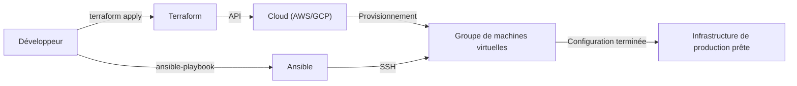

Dans le développement de systèmes modernes, l'"Infrastructure as Code (IaC)" n'est plus un mot à la mode, mais une plateforme indispensable pour construire et exploiter des systèmes évolutifs et fiables. L'époque où les ingénieurs d'infrastructure passaient des nuits blanches à installer des serveurs en rack, saisissant des commandes sur un écran noir avec un manuel à la main, est révolue, et l'infrastructure est désormais gérée comme du code logiciel.

Dans cet article, nous comparerons deux outils représentatifs de l'IaC, **Terraform** et **Ansible**, et nous examinerons en profondeur leurs rôles respectifs, leurs philosophies de conception (approches déclarative et procédurale), ainsi que les meilleures pratiques pour les combiner.

## La vulnérabilité de la construction manuelle de l'infrastructure (manuels de procédures) et le manque de reproductibilité

Pour comprendre la valeur de l'IaC, il faut revenir sur la dette des "opérations manuelles" du passé.
Traditionnellement, la construction des serveurs se faisait manuellement sur la base de "manuels de procédures (Runbooks)" créés avec Excel, etc. Cette approche présente plusieurs défauts majeurs.

1. **Inévitabilité de l'erreur humaine** : Si un être humain exécute manuellement 100 lignes de commandes, il y aura forcément une faute de frappe ou une étape omise quelque part.
2. **Dérive de la configuration (Configuration Drift)** : Lorsqu'un dépannage urgent est effectué dans l'environnement de production, des "modifications manuelles" non répercutées dans le manuel de procédures ou le dépôt sont ajoutées. En conséquence, un décalage de configuration se crée entre l'environnement de test et l'environnement de production, entraînant une situation où "cela a fonctionné dans l'environnement de test, mais ne fonctionne pas en production".
3. **Dépendance envers des personnes spécifiques (Siloing)** : La situation se détériore et devient une recette secrète telle que "seule la personne A connaît les paramètres Apache de ce serveur".
4. **Limites de l'évolutivité (Scalability)** : Lors de l'ajout de 10 serveurs pendant une augmentation soudaine du trafic, il est tout à fait impossible de suivre la cadence manuellement.

## Le changement de paradigme vers l'Infrastructure Immuable (Immutable Infrastructure)

C'est pour résoudre ces problèmes qu'est apparu le concept d'**Infrastructure Immuable (Immutable Infrastructure)**.

Auparavant, nous nous connections via SSH à un serveur déjà construit pour mettre à jour les paquets et modifier les fichiers de configuration (Mutable : variable). En revanche, l'Infrastructure Immuable applique strictement la règle de "ne jamais apporter de modifications aux serveurs en cours d'exécution".
Lorsqu'une mise à jour est nécessaire, un nouveau serveur avec la nouvelle configuration est nouvellement provisionné, et l'ancien serveur est détruit (remplacé).

Grâce à ce concept, l'état du serveur est toujours maintenu tel qu'il était lors de sa construction initiale, la dérive de configuration est éliminée, et la reproductibilité ainsi que la facilité de test sont considérablement améliorées. Ce sont les outils IaC qui permettent de "construire et détruire des serveurs instantanément".

## Terraform : Approche déclarative et "Provisionnement"

Développé par HashiCorp, **Terraform** est un outil principalement spécialisé dans le "provisionnement (construction)" d'infrastructures cloud. Il excelle dans la création et la gestion de ressources cloud (VPC, sous-réseaux, instances EC2, RDS, etc.) sur AWS, GCP, Azure, etc.

### Approche déclarative (Declarative)
La plus grande caractéristique de Terraform est qu'il adopte une **approche déclarative**. Au lieu de "comment (How)" créer une ressource, il décrit "l'état souhaité (What)" sous forme de code à l'aide du HCL (HashiCorp Configuration Language).

Le moteur Terraform compare l'état actuel de l'infrastructure à "l'état idéal" décrit dans le code, calcule la différence (Plan), et exécute automatiquement les opérations nécessaires (Create, Update, Delete).

### Les avantages et les inconvénients du fichier de gestion d'état "tfstate"
Terraform utilise un fichier de gestion d'état appelé `terraform.tfstate` pour enregistrer l'état actuel de l'infrastructure.

**Avantages** :
- **Calcul rapide des différences** : Plutôt que de frapper l'API cloud pour analyser toutes les ressources à chaque fois, il compare le code avec le tfstate local (ou le backend distant), ce qui rend la planification rapide.
- **Suivi des ressources et gestion des dépendances** : Comme il conserve les métadonnées des ressources créées par Terraform, il peut appréhender avec précision les dépendances complexes entre les ressources et les construire/détruire dans le bon ordre.

**Inconvénients** :
- **Gestion des conflits et des verrous** : L'exécution simultanée de Terraform par plusieurs personnes risque de corrompre le tfstate. Il est donc nécessaire d'utiliser un contrôle exclusif (verrouillage d'état) à l'aide d'un backend distant comme AWS S3 + DynamoDB.
- **Incohérence due aux modifications manuelles** : Si une ressource est modifiée manuellement depuis la console AWS ou autre, un décalage se produit entre le tfstate et l'état réel du cloud. Lors de la prochaine exécution, Terraform détectera la modification manuelle et tentera de "revenir" à l'état du code.

## Ansible : La "Gestion de configuration" avec une dimension d'approche procédurale

Soutenu par Red Hat, **Ansible** est un outil principalement spécialisé dans la "gestion de configuration (paramétrage)" interne des systèmes d'exploitation (OS). Il excelle dans l'installation de middlewares (Nginx, MySQL, etc.) après la construction du serveur, le déploiement de fichiers de configuration, la création d'utilisateurs, le démarrage de services, etc.

### Aspect de l'approche procédurale (Procedural)
Ansible est également conçu pour garantir l'idempotence (la propriété d'obtenir le même résultat, quel que soit le nombre d'exécutions), mais son modèle d'exécution a une dimension **procédurale (Procedural)**. Dans les "Playbooks" au format YAML, "les étapes des tâches" qui sont exécutées de haut en bas y sont décrites.

Ansible se connecte au serveur cible via SSH, transfère des modules et exécute les tâches dans l'ordre, de haut en bas. On peut dire qu'il code la procédure "comment atteindre l'état souhaité".

### La facilité du fonctionnement sans agent (Agentless)
Le grand avantage d'Ansible est qu'il est **sans agent (agentless)**. Il n'est pas nécessaire d'installer un agent de gestion dédié sur le serveur cible, et la gestion de configuration peut se faire de n'importe où tant qu'une connexion SSH est possible. Cela permet une introduction facile même sur les serveurs hérités (legacy) existants.

Cependant, comme il n'a pas de fichier pour gérer l'état (contrairement au tfstate de Terraform), il n'est pas aussi doué que Terraform pour la "suppression" des ressources ou le "suivi strict des dépendances".

## La bonne façon de combiner Terraform et Ansible

Terraform et Ansible ne sont pas en concurrence, mais dans une **relation de complémentarité mutuelle**. L'infrastructure IaC la plus puissante peut être réalisée en combinant les deux, en tirant parti des points forts de chacun.

**Répartition selon les meilleures pratiques :**
1. **Terraform (Construit le squelette de l'infrastructure)**
   - Construction du réseau (VPC, Subnet, Route Table)
   - Définition des groupes de sécurité, des rôles IAM
   - Provisionnement des instances de serveur (EC2), des bases de données (RDS), des équilibreurs de charge (Load Balancers)
2. **Ansible (Prépare le contenu de l'infrastructure)**
   - Mise à jour des paquets du système d'exploitation
   - Installation et configuration des middlewares et des applications
   - Déploiement des agents de surveillance des journaux (logs), etc.

### Le rôle d'Ansible dans un monde immuable
À mesure que la technologie des conteneurs (Docker/Kubernetes) et l'Infrastructure Immuable (cloud-native) deviennent la norme, les opportunités d'exécuter Ansible directement sur des serveurs de production se font plus rares.
Aujourd'hui, Ansible brille dans la phase de **"construction d'images de machines (AMI)"**. En combinant des outils comme Packer avec Ansible, une "image dorée (Golden Image)" préconfigurée est créée. Ensuite, Terraform utilise cette image dorée pour provisionner les serveurs.

## Conclusion

L'Infrastructure as Code est un moteur puissant qui accélère tout le cycle de vie du développement logiciel.
Comprendre correctement et utiliser "le provisionnement d'infrastructure par l'approche déclarative" de Terraform et "la gestion de configuration flexible par l'approche procédurale" d'Ansible selon le besoin, constitue la première étape vers la construction d'un système robuste et évolutif.
Éloignons-nous des manuels de procédures manuels incertains et visons une exploitation d'infrastructure fiable et immuable par le code.
