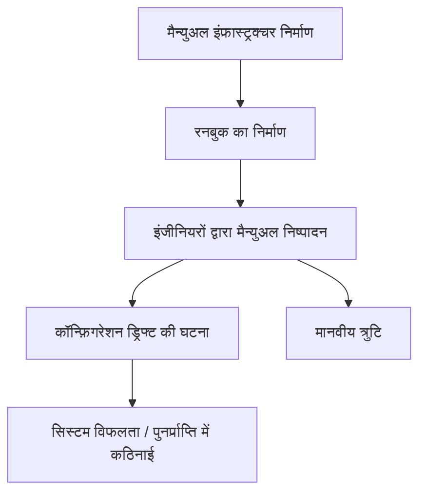
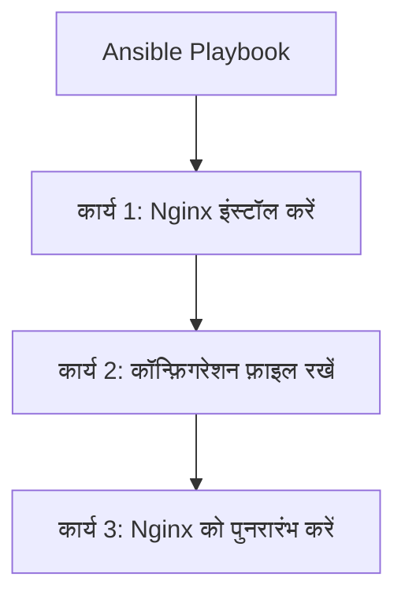
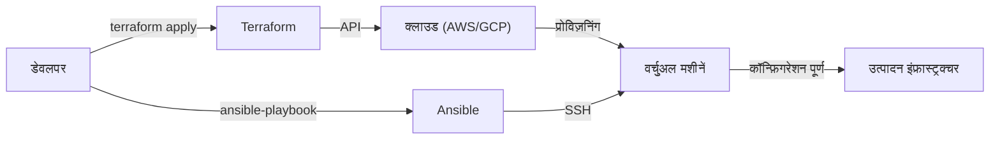

आधुनिक सिस्टम विकास में, "Infrastructure as Code (IaC)" अब केवल एक चर्चा का विषय (buzzword) नहीं रह गया है, बल्कि स्केलेबल और विश्वसनीय सिस्टम बनाने और संचालित करने के लिए एक आवश्यक प्लेटफ़ॉर्म बन गया है। कभी वह दौर था जब इंफ्रास्ट्रक्चर इंजीनियर रात-रात भर जागकर सर्वर की रैकिंग करते थे और मैनुअल (रनबुक) हाथ में लेकर काली स्क्रीन पर कमांड टाइप करते थे, लेकिन अब बुनियादी ढांचा (इंफ्रास्ट्रक्चर) सॉफ्टवेयर कोड के रूप में प्रबंधित होने के युग में स्थानांतरित हो गया है।

इस लेख में, हम IaC के दो प्रमुख उपकरणों, **Terraform** और **Ansible** की तुलना करेंगे। हम उनकी भूमिकाओं में अंतर, उनके डिज़ाइन दर्शन (घोषणात्मक दृष्टिकोण और प्रक्रियात्मक दृष्टिकोण) और दोनों को एक साथ मिलाने के सर्वोत्तम अभ्यास में गहराई से उतरेंगे।

## मैन्युअल इंफ्रास्ट्रक्चर निर्माण (रनबुक) की कमजोरियां और पुनरुत्पादन की कमी

IaC के मूल्य को समझने के लिए, पिछले "मैन्युअल संचालन" के ऋण को देखना आवश्यक है।
परंपरागत रूप से, सर्वर का निर्माण एक्सेल आदि में बनाए गए "रनबुक (प्रक्रिया पुस्तिका)" के आधार पर मैन्युअल रूप से किया जाता था। इस दृष्टिकोण में कई गंभीर खामियां मौजूद हैं।

1. **मानवीय त्रुटियों की अपरिहार्यता**: यदि कोई व्यक्ति मैन्युअल रूप से 100 कमांड निष्पादित करता है, तो कहीं न कहीं टाइपो या कोई चरण छूटने की संभावना हमेशा रहती है।
2. **कॉन्फ़िगरेशन ड्रिफ्ट (Configuration Drift)**: जब उत्पादन वातावरण में तत्काल कोई समस्या निवारण किया जाता है, तो "मैन्युअल संशोधन" जोड़े जाते हैं जो रनबुक या रिपॉजिटरी में प्रतिबिंबित नहीं होते हैं। इसके परिणामस्वरूप, परीक्षण वातावरण और उत्पादन वातावरण के कॉन्फ़िगरेशन में अंतर आ जाता है, जिससे "यह परीक्षण वातावरण में काम करता था लेकिन उत्पादन में विफल रहा" जैसी स्थिति पैदा होती है।
3. **व्यक्तिगत निर्भरता**: ज्ञान कुछ व्यक्तियों तक सीमित हो जाता है, जैसे "केवल व्यक्ति ए (A) ही उस सर्वर के अपाचे (Apache) कॉन्फ़िगरेशन को जानता है।"
4. **स्केलेबिलिटी की सीमाएं**: ट्रैफ़िक में अचानक वृद्धि होने पर 10 नए सर्वर जोड़ने का काम मैन्युअल रूप से समय पर पूरा करना पूरी तरह से असंभव है।

## Immutable Infrastructure (अपरिवर्तनीय इंफ्रास्ट्रक्चर) नामक पैराडाइम शिफ्ट

इन चुनौतियों का समाधान करने के लिए **Immutable Infrastructure (अपरिवर्तनीय इंफ्रास्ट्रक्चर)** की अवधारणा सामने आई।

परंपरागत रूप से, हम एक बार बनाए गए सर्वर में SSH के माध्यम से लॉग इन करते थे और पैकेज अपडेट या कॉन्फ़िगरेशन फ़ाइलों में बदलाव करते थे (Mutable: परिवर्तनीय)। इसके विपरीत, Immutable Infrastructure में यह नियम कड़ाई से लागू किया जाता है कि "चल रहे सर्वर में कोई बदलाव नहीं किया जाएगा।"
यदि अपडेट की आवश्यकता है, तो नई सेटिंग्स के साथ एक नया सर्वर प्रोविज़न किया जाता है और पुराने सर्वर को नष्ट (रिप्लेस) कर दिया जाता है।

इस अवधारणा के कारण, सर्वर की स्थिति हमेशा प्रारंभिक निर्माण के समय जैसी ही बनी रहती है, जिससे कॉन्फ़िगरेशन ड्रिफ्ट समाप्त हो जाता है और पुनरुत्पादन तथा परीक्षण में आसानी काफी बढ़ जाती है। और यह IaC टूल ही है जो "सर्वर को तुरंत बनाने और नष्ट करने" को संभव बनाता है।

## Terraform: घोषणात्मक दृष्टिकोण और "प्रोविज़निंग"

HashiCorp द्वारा विकसित **Terraform**, मुख्य रूप से क्लाउड इंफ्रास्ट्रक्चर के "प्रोविज़निंग (निर्माण)" में विशेषज्ञता रखने वाला एक टूल है। यह AWS, GCP और Azure जैसे क्लाउड संसाधनों (VPC, सबनेट, EC2 इंस्टेंस, RDS, आदि) को बनाने और प्रबंधित करने में उत्कृष्ट है।

### घोषणात्मक दृष्टिकोण (Declarative)
Terraform की सबसे बड़ी विशेषता यह है कि यह **घोषणात्मक दृष्टिकोण** अपनाता है। आप संसाधन को "कैसे (How)" बनाना है यह नहीं बताते, बल्कि HCL (HashiCorp Configuration Language) नामक कोड में यह लिखते हैं कि आप "कैसी स्थिति (What)" चाहते हैं।

Terraform इंजन वर्तमान इंफ्रास्ट्रक्चर की स्थिति और कोड में वर्णित "वांछित स्थिति" की तुलना करता है, उनके अंतर (Plan) की गणना करता है, और आवश्यक ऑपरेशंस (Create, Update, Delete) को स्वचालित रूप से निष्पादित करता है।

### स्थिति प्रबंधन फ़ाइल "tfstate" के फायदे और नुकसान
Terraform वर्तमान इंफ्रास्ट्रक्चर स्थिति को रिकॉर्ड करने के लिए `terraform.tfstate` नामक स्थिति प्रबंधन फ़ाइल का उपयोग करता है।

**फायदे**:
- **तेज़ अंतर गणना**: हर बार क्लाउड API को कॉल करके सभी संसाधनों को स्कैन करने के बजाय, यह स्थानीय (या रिमोट बैकएंड) tfstate और कोड की तुलना करता है, जिससे प्लानिंग बहुत तेज़ हो जाती है।
- **संसाधनों की ट्रैकिंग और निर्भरता प्रबंधन**: चूंकि यह Terraform द्वारा बनाए गए संसाधनों का मेटाडेटा रखता है, यह संसाधनों के बीच जटिल निर्भरताओं को सटीक रूप से समझ सकता है और सही क्रम में निर्माण और विनाश कर सकता है।

**नुकसान**:
- **टकराव और लॉक का प्रबंधन**: यदि कई लोग एक ही समय में Terraform चलाते हैं, तो tfstate के भ्रष्ट होने का जोखिम होता है। इसलिए, AWS S3 + DynamoDB जैसे रिमोट बैकएंड का उपयोग करके एक्सक्लूसिव कंट्रोल (स्टेट लॉक) करना आवश्यक है।
- **मैन्युअल परिवर्तनों के कारण असंगतता**: यदि आप AWS कंसोल आदि से संसाधनों को मैन्युअल रूप से बदलते हैं, तो tfstate और वास्तविक क्लाउड स्थिति के बीच अंतर आ जाएगा। अगली बार जब Terraform चलेगा, तो यह मैन्युअल परिवर्तनों का पता लगाएगा और स्थिति को वापस कोड के अनुसार "रीस्टोर" करने का प्रयास करेगा।

## Ansible: प्रक्रियात्मक दृष्टिकोण के पहलुओं के साथ "कॉन्फ़िगरेशन प्रबंधन"

Red Hat द्वारा समर्थित **Ansible**, मुख्य रूप से OS के भीतर "कॉन्फ़िगरेशन प्रबंधन (सेटिंग्स)" में विशेषज्ञता वाला टूल है। यह सर्वर बनने के बाद मिडलवेयर (जैसे Nginx, MySQL) स्थापित करने, कॉन्फ़िगरेशन फ़ाइलों को रखने, उपयोगकर्ता बनाने और सेवाओं को शुरू करने में उत्कृष्ट है।

### प्रक्रियात्मक दृष्टिकोण (Procedural) के पहलू
Ansible को इडेम्पोटेंसी (चाहे कितनी बार भी चलाया जाए, परिणाम समान रहता है) सुनिश्चित करने के लिए डिज़ाइन किया गया है, लेकिन इसके निष्पादन मॉडल में **प्रक्रियात्मक (Procedural)** पहलू हैं। YAML प्रारूप की "Playbook" में, ऊपर से नीचे तक निष्पादित होने वाले "कार्यों के चरण" लिखे होते हैं।

Ansible लक्षित सर्वर से SSH के माध्यम से जुड़ता है, मॉड्यूल स्थानांतरित करता है, और ऊपर से नीचे तक क्रम में कार्यों को निष्पादित करता है। इसे "वांछित स्थिति को कैसे प्राप्त करें" जैसी प्रक्रिया को कोडिंग करने के रूप में देखा जा सकता है।

### एजेंटलेस होने की सुविधा
Ansible का एक बहुत शक्तिशाली लाभ यह है कि यह **एजेंटलेस** है। लक्षित सर्वर पर कोई समर्पित प्रबंधन एजेंट स्थापित करने की आवश्यकता नहीं है, और जब तक SSH कनेक्शन स्थापित किया जा सकता है, कॉन्फ़िगरेशन प्रबंधन कहीं से भी किया जा सकता है। इसके कारण, इसे मौजूदा विरासत सर्वरों में भी आसानी से पेश किया जा सकता है।

हालाँकि, चूंकि इसमें स्थिति का प्रबंधन करने वाली कोई फ़ाइल (जैसे Terraform की tfstate) नहीं होती है, यह संसाधनों को "हटाने" या "निर्भरता को सख्ती से ट्रैक करने" में Terraform जितना अच्छा नहीं है।

## Terraform और Ansible का उचित संयोजन

Terraform और Ansible प्रतिस्पर्धी नहीं हैं, बल्कि उनके बीच **परस्पर पूरक संबंध** है। सबसे शक्तिशाली IaC इंफ्रास्ट्रक्चर दोनों की ताकतों का लाभ उठाकर उन्हें एक साथ मिलाकर प्राप्त किया जा सकता है।

**सर्वोत्तम अभ्यास का विभाजन:**
1. **Terraform (इंफ्रास्ट्रक्चर का ढांचा बनाना)**
   - नेटवर्क निर्माण (VPC, Subnet, Route Table)
   - सुरक्षा समूह, IAM भूमिकाओं को परिभाषित करना
   - सर्वर इंस्टेंस (EC2), डेटाबेस (RDS), और लोड बैलेंसर की प्रोविज़निंग
2. **Ansible (इंफ्रास्ट्रक्चर के अंदरूनी हिस्सों को तैयार करना)**
   - OS पैकेज अपडेट
   - मिडलवेयर और एप्लिकेशन की स्थापना और कॉन्फ़िगरेशन
   - लॉग मॉनिटरिंग एजेंट आदि की तैनाती

### Immutable दुनिया में Ansible की भूमिका
जैसे-जैसे कंटेनर तकनीक (Docker/Kubernetes) और क्लाउड-नेटिव Immutable Infrastructure मुख्यधारा बन रहे हैं, उत्पादन सर्वरों पर सीधे Ansible चलाने के अवसर कम हो रहे हैं।
आज के समय में, Ansible **"मशीन इमेज (AMI) निर्माण"** के चरण में उत्कृष्ट है। Ansible को Packer जैसे टूल के साथ मिलाकर कॉन्फ़िगर की गई "गोल्डन इमेज" बनाई जाती है। और फिर Terraform उस गोल्डन इमेज का उपयोग करके सर्वर प्रोविज़न करता है।

## निष्कर्ष

Infrastructure as Code एक शक्तिशाली इंजन है जो पूरे सॉफ्टवेयर विकास जीवनचक्र को गति देता है।
Terraform के "घोषणात्मक दृष्टिकोण का उपयोग करके इंफ्रास्ट्रक्चर प्रोविज़निंग" और Ansible के "प्रक्रियात्मक दृष्टिकोण का उपयोग करके लचीले कॉन्फ़िगरेशन प्रबंधन" को सही ढंग से समझना और उपयोग करना, एक मजबूत और स्केलेबल सिस्टम के निर्माण की दिशा में पहला कदम है।
आइए अनिश्चित मैन्युअल रनबुक से दूर हों और कोड के माध्यम से विश्वसनीय और अपरिवर्तनीय इंफ्रास्ट्रक्चर संचालन का लक्ष्य रखें।
