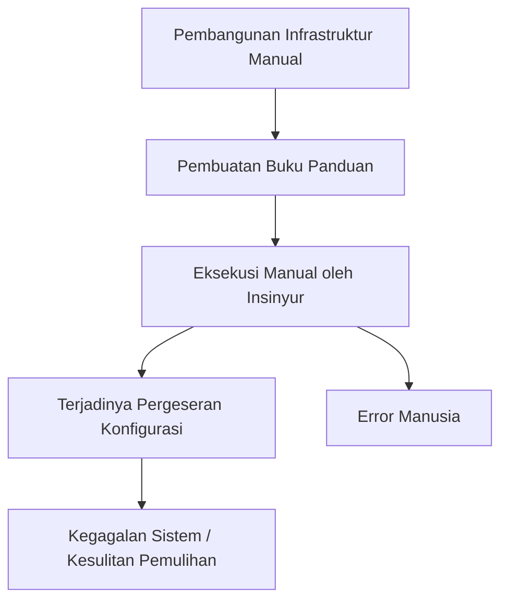
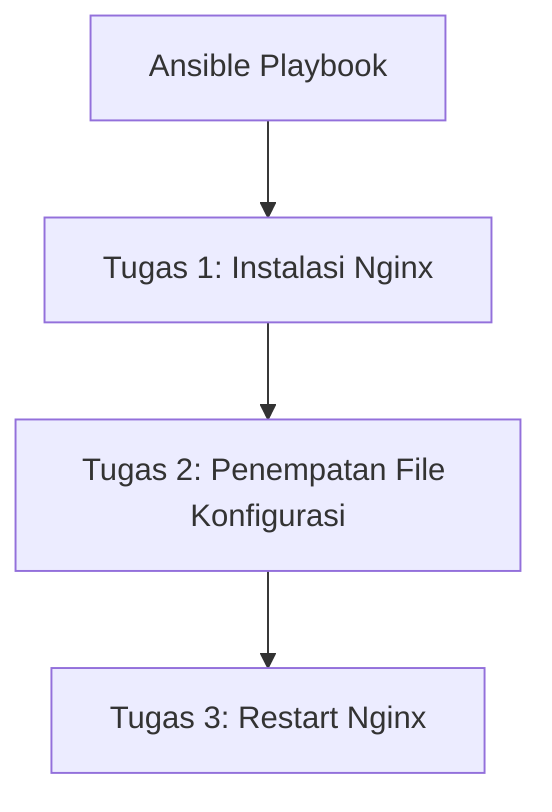
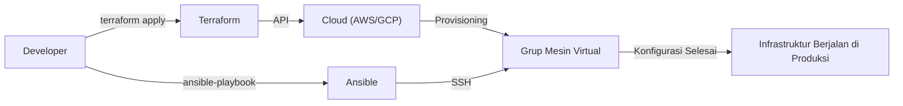

Dalam pengembangan sistem modern, 'Infrastructure as Code (IaC)' bukan lagi sekadar kata kunci (buzzword), melainkan telah menjadi platform wajib untuk membangun dan mengoperasikan sistem yang skalabel dan sangat andal. Dari era ketika insinyur infrastruktur harus begadang untuk menyusun server di rak, mengetikkan perintah di layar hitam sambil memegang buku panduan, kini telah beralih ke era di mana infrastruktur dikelola sebagai kode perangkat lunak.

Pada artikel ini, kita akan membandingkan dua alat (tool) perwakilan IaC, yaitu **Terraform** dan **Ansible**, serta menggali lebih dalam mengenai perbedaan peran masing-masing, filosofi desain (pendekatan deklaratif dan pendekatan prosedural), dan praktik terbaik (best practice) dalam menggabungkan keduanya.

## Kerentanan dan Kurangnya Reprodusibilitas pada Pembangunan Infrastruktur Manual (Buku Panduan)

Untuk memahami nilai dari IaC, kita perlu menengok kembali beban utang dari 'operasi manual' di masa lalu.
Secara tradisional, pembangunan server dilakukan secara manual berdasarkan 'buku panduan (Runbook)' yang dibuat di Excel atau sejenisnya. Pendekatan ini memiliki beberapa kelemahan fatal.

1. **Error Manusia yang Tak Terhindarkan**: Jika manusia mengeksekusi 100 baris perintah secara manual, pasti akan terjadi salah ketik atau langkah yang terlewat di suatu titik.
2. **Pergeseran Konfigurasi (Configuration Drift)**: Saat pemecahan masalah (troubleshooting) darurat dilakukan di lingkungan produksi, 'modifikasi manual' ditambahkan tanpa dicerminkan pada buku panduan atau repositori. Akibatnya, muncul perbedaan konfigurasi antara lingkungan pengujian dan lingkungan produksi, sehingga memicu situasi 'berjalan di lingkungan pengujian tetapi gagal di produksi'.
3. **Ketergantungan pada Individu (Personalisasi)**: Muncul fenomena rahasia di mana 'hanya Si A yang tahu konfigurasi Apache di server itu'.
4. **Batas Skalabilitas**: Saat perlu menambahkan 10 server pada saat lonjakan trafik yang tiba-tiba, pekerjaan manual tidak akan pernah bisa mengejar waktu.

## Pergeseran Paradigma: Immutable Infrastructure (Infrastruktur yang Tidak Berubah)

Untuk menyelesaikan masalah-masalah ini, hadirlah konsep **Immutable Infrastructure (Infrastruktur yang Tidak Berubah)**.

Dulu, kita masuk (login) ke server yang sudah dibangun melalui SSH dan melakukan pembaruan paket atau perubahan file konfigurasi (Mutable: dapat berubah). Sebaliknya, pada Immutable Infrastructure, aturan 'tidak melakukan perubahan pada server yang sedang berjalan' diterapkan secara ketat.
Jika pembaruan diperlukan, server dengan konfigurasi baru di-provisioning (dibangun ulang) secara baru, dan server lama dihancurkan (diganti).

Dengan konsep ini, kondisi server selalu terjaga seperti saat pembangunan awal, sehingga pergeseran konfigurasi dapat dihilangkan, serta reprodusibilitas dan kemudahan pengujian meningkat secara drastis. Dan yang memungkinkan kemampuan 'membangun dan menghancurkan server secara instan' ini adalah alat IaC.

## Terraform: Pendekatan Deklaratif dan 'Provisioning'

**Terraform** yang dikembangkan oleh HashiCorp adalah alat yang dikhususkan terutama pada 'provisioning (pembangunan)' infrastruktur cloud. Alat ini ahli dalam pembuatan dan pengelolaan sumber daya cloud seperti AWS, GCP, Azure (VPC, subnet, instance EC2, RDS, dan lain-lain).

### Pendekatan Deklaratif (Declarative)
Fitur terbesar Terraform adalah pengadopsian **pendekatan deklaratif**. Kita tidak mendeskripsikan 'bagaimana (How)' membuat sumber daya, melainkan 'ingin seperti apa kondisinya (What)' menggunakan kode yang disebut HCL (HashiCorp Configuration Language).

Mesin Terraform akan membandingkan status infrastruktur saat ini dengan 'kondisi ideal' yang ditulis dalam kode, menghitung perbedaannya (Plan), lalu secara otomatis mengeksekusi operasi yang diperlukan (Create, Update, Delete).

### Kelebihan dan Kekurangan File Manajemen Status 'tfstate'
Terraform menggunakan file manajemen status bernama `terraform.tfstate` untuk merekam status infrastruktur saat ini.

**Kelebihan**:
- **Perhitungan Perbedaan yang Cepat**: Karena tidak memanggil API cloud setiap saat untuk memindai semua sumber daya, melainkan membandingkan kode dengan tfstate lokal (atau remote backend), proses perencanaannya menjadi sangat cepat.
- **Pelacakan Sumber Daya dan Manajemen Ketergantungan**: Karena menyimpan metadata dari sumber daya yang dibuat dengan Terraform, ia dapat secara akurat memahami ketergantungan kompleks antar sumber daya dan melakukan pembangunan/penghancuran dalam urutan yang benar.

**Kekurangan**:
- **Manajemen Konflik dan Penguncian**: Jika beberapa orang mengeksekusi Terraform secara bersamaan, ada risiko rusaknya tfstate. Oleh karena itu, perlu menggunakan remote backend seperti AWS S3 + DynamoDB untuk melakukan kontrol eksklusif (penguncian status / state lock).
- **Inkonsistensi akibat Perubahan Manual**: Jika sumber daya diubah secara manual dari konsol AWS dll., akan terjadi ketidaksesuaian antara tfstate dan status cloud sebenarnya. Pada eksekusi berikutnya, Terraform akan mendeteksi perubahan manual tersebut dan mencoba 'mengembalikan' ke status yang ada di kode.

## Ansible: 'Manajemen Konfigurasi' dengan Aspek Pendekatan Prosedural

**Ansible** yang didukung oleh Red Hat adalah alat yang dikhususkan pada 'manajemen konfigurasi (pengaturan)' di dalam OS. Alat ini ahli dalam instalasi middleware (Nginx, MySQL, dll.) setelah server dibangun, penempatan file konfigurasi, pembuatan pengguna, serta menjalankan layanan (service).

### Aspek Pendekatan Prosedural (Procedural)
Meskipun Ansible juga dirancang untuk menjamin idempoten (sifat di mana hasil akhirnya tetap sama terlepas dari seberapa sering dijalankan), model eksekusinya memiliki aspek **prosedural (Procedural)**. Dalam 'Playbook' berformat YAML, 'urutan tugas' ditulis untuk dieksekusi dari atas ke bawah.

Ansible terhubung ke server target melalui SSH, mentransfer modul, dan mengeksekusi tugas secara berurutan dari atas. Hal ini bisa dikatakan sebagai pengodean prosedur mengenai 'bagaimana cara mencapai status yang dituju'.

### Kemudahan Tanpa Agen (Agentless)
Keuntungan kuat dari Ansible adalah kemampuannya yang **tanpa agen (agentless)**. Kita tidak perlu menginstal agen manajemen khusus di server target; manajemen konfigurasi dapat dilakukan dari mana saja asalkan koneksi SSH tersedia. Dengan demikian, Ansible mudah diimplementasikan bahkan pada server-server peninggalan masa lalu (legacy) yang sudah ada.

Namun, karena tidak memiliki file untuk mengelola status (seperti tfstate pada Terraform), hal-hal seperti 'penghapusan' sumber daya dan 'pelacakan ketergantungan yang ketat' tidaklah sehebat Terraform.

## Cara yang Tepat Menggabungkan Terraform dan Ansible

Terraform dan Ansible bukanlah alat yang bersaing, melainkan memiliki **hubungan saling melengkapi**. Infrastruktur IaC yang paling kuat dapat diwujudkan dengan menggabungkan keduanya dan memanfaatkan kekuatan masing-masing.

**Pembagian Praktik Terbaik (Best Practice):**
1. **Terraform (Membangun kerangka infrastruktur)**
   - Pembangunan jaringan (VPC, Subnet, Route Table)
   - Definisi grup keamanan (Security Group) dan peran IAM
   - Provisioning instance server (EC2), database (RDS), dan load balancer
2. **Ansible (Mengatur isi infrastruktur)**
   - Pembaruan paket OS
   - Instalasi dan konfigurasi middleware serta aplikasi
   - Penempatan agen pemantauan log, dll.

### Peran Ansible di Dunia yang Immutable
Seiring dengan teknologi kontainer (Docker/Kubernetes) dan arsitektur cloud-native Immutable Infrastructure yang menjadi tren utama (mainstream), kesempatan untuk menjalankan Ansible secara langsung pada server produksi semakin berkurang.
Di masa kini, Ansible lebih banyak berperan pada fase **'pembuatan image mesin (AMI)'**. Dengan menggabungkan Ansible dengan alat seperti Packer, kita membuat 'Golden Image' yang sudah terkonfigurasi. Kemudian, Terraform menggunakan Golden Image tersebut untuk melakukan provisioning server.

## Kesimpulan

Infrastructure as Code adalah mesin yang kuat untuk mempercepat seluruh siklus hidup pengembangan perangkat lunak.
Memahami dan menggunakan secara tepat 'provisioning infrastruktur dengan pendekatan deklaratif' dari Terraform serta 'manajemen konfigurasi yang fleksibel dengan pendekatan prosedural' dari Ansible, merupakan langkah awal menuju pembangunan sistem yang tangguh dan skalabel.
Mari bebaskan diri dari buku panduan manual yang penuh ketidakpastian, dan tuju operasi infrastruktur yang andal dan tidak berubah melalui kode.
