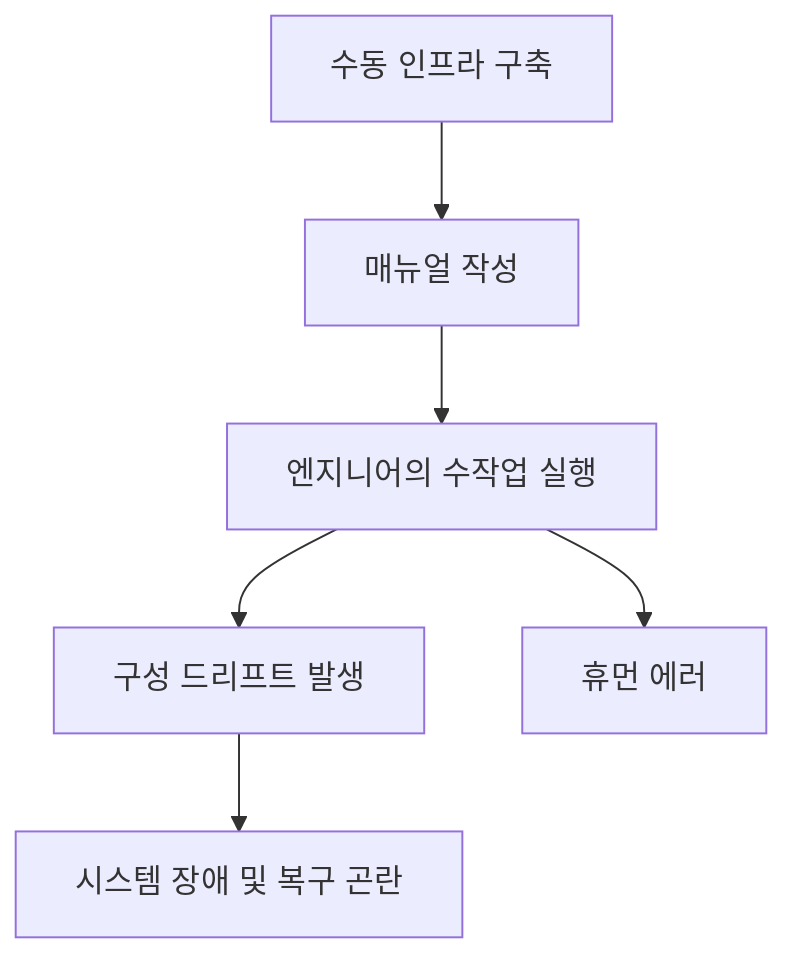
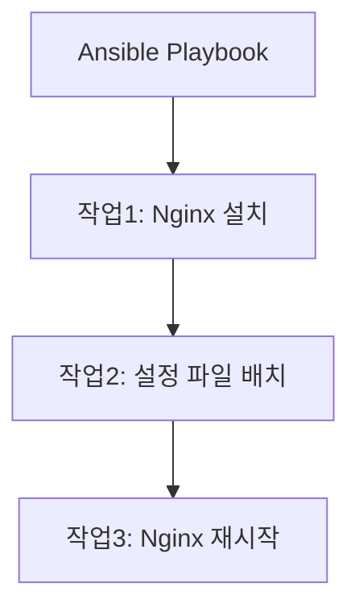
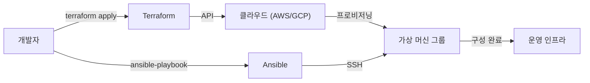

현대 시스템 개발에서 'Infrastructure as Code (IaC)'는 더 이상 유행어가 아니라 확장 가능하고 신뢰성 높은 시스템을 구축하고 운영하기 위한 필수 플랫폼이 되었습니다. 과거 인프라 엔지니어가 밤을 새워 서버 랙을 설치하고, 매뉴얼을 한 손에 든 채 검은 화면에 명령어를 입력하던 시대에서, 인프라는 소프트웨어 코드로서 관리되는 시대로 전환되었습니다.

이 글에서는 IaC를 대표하는 두 가지 도구인 **Terraform**과 **Ansible**을 비교하여, 각자의 역할 차이, 설계 사상(선언적 접근 방식과 절차적 접근 방식), 그리고 두 가지를 조합하는 모범 사례(베스트 프랙티스)에 대해 깊이 파헤쳐 보겠습니다.

## 수동 인프라 구축(매뉴얼)의 취약성과 재현성 결여

IaC의 가치를 이해하기 위해서는 과거 '수동 운영'의 부채를 되돌아볼 필요가 있습니다.
기존에는 서버 구축이 Excel 등으로 작성된 '매뉴얼(Runbook)'에 기반하여 수동으로 이루어졌습니다. 이 접근 방식에는 몇 가지 치명적인 결함이 존재합니다.

1. **휴먼 에러의 불가피성**: 사람이 100줄의 명령어를 수작업으로 실행하다 보면, 반드시 어딘가에서 오타나 절차 누락이 발생합니다.
2. **구성 드리프트(Configuration Drift)**: 운영 환경(운영 서버)에서 긴급한 트러블슈팅이 진행될 때, 매뉴얼이나 리포지토리에 반영되지 않은 '수동 수정'이 가해집니다. 그 결과, 테스트 환경과 운영 환경 간에 구성의 차이가 생겨 "테스트 환경에서는 작동했는데 운영 환경에서는 작동하지 않는" 사태를 초래합니다.
3. **속인화(属人化)**: "저 서버의 Apache 설정은 A씨만 알고 있다"와 같은 비법 소스화가 진행됩니다.
4. **확장성의 한계**: 트래픽이 급증하여 서버를 10대 추가해야 할 때, 수작업으로는 도저히 제시간에 맞출 수 없습니다.

## Immutable Infrastructure(불변 인프라)라는 패러다임 전환

이러한 과제들을 해결하기 위해 등장한 것이 **Immutable Infrastructure(불변 인프라)**라는 개념입니다.

기존에는 한 번 구축한 서버에 SSH로 로그인하여 패키지 업데이트나 설정 파일의 변경을 진행했습니다(Mutable: 가변). 이에 반해 Immutable Infrastructure에서는 '가동 중인 서버에 변경을 가하지 않는다'라는 규칙을 철저히 지킵니다.
업데이트가 필요한 경우에는 새로운 설정을 가진 서버를 신규로 프로비저닝하고, 기존 서버를 폐기(교체)합니다.

이 개념을 통해 서버의 상태가 항상 초기 구축 시점 그대로 유지되기 때문에 구성 드리프트가 배제되고 재현성과 테스트 용이성이 비약적으로 향상되었습니다. 그리고 이러한 '순식간에 서버를 구축하고 폐기하는' 것을 가능하게 해주는 것이 IaC 도구입니다.

## Terraform: 선언적 접근 방식과 '프로비저닝'

HashiCorp사가 개발한 **Terraform**은 주로 클라우드 인프라의 '프로비저닝(구축)'에 특화된 도구입니다. AWS, GCP, Azure 등의 클라우드 리소스(VPC, 서브넷, EC2 인스턴스, RDS 등) 생성과 관리에 강점을 가집니다.

### 선언적 접근 방식(Declarative)
Terraform의 가장 큰 특징은 **선언적 접근 방식**을 채택하고 있다는 점입니다. 리소스를 '어떻게(How)' 만들 것인지가 아니라 '어떠한 상태로 만들고 싶은지(What)'를 HCL(HashiCorp Configuration Language)이라는 코드로 기술합니다.

Terraform 엔진은 현재의 인프라 상태와 코드에 기술된 '이상적인 모습'을 비교하고, 그 차이(Plan)를 계산하여 필요한 작업(Create, Update, Delete)을 자동으로 실행합니다.

### 상태 관리 파일 'tfstate'의 명암
Terraform은 현재의 인프라 상태를 기록하기 위해 `terraform.tfstate`라는 상태 관리 파일을 사용합니다.

**장점**:
- **빠른 차이 계산**: 매번 클라우드 API를 호출하여 전체 리소스를 스캔하는 대신, 로컬(또는 원격 백엔드)의 tfstate와 코드를 비교하기 때문에 계획(Plan)이 빠릅니다.
- **리소스 추적 및 의존성 관리**: Terraform으로 생성된 리소스의 메타데이터를 유지하고 있기 때문에, 리소스 간의 복잡한 의존 관계를 정확히 파악하여 올바른 순서로 구축 및 폐기가 가능합니다.

**단점**:
- **충돌 및 잠금(Lock) 관리**: 여러 사람이 동시에 Terraform을 실행하면 tfstate가 손상될 위험이 있습니다. 따라서 AWS S3 + DynamoDB 등의 원격 백엔드를 사용하여 배타적 제어(상태 잠금)를 수행해야 합니다.
- **수동 변경으로 인한 불일치**: AWS 콘솔 등에서 수동으로 리소스를 변경하면, tfstate와 실제 클라우드 상태 간에 차이가 발생합니다. Terraform은 다음 실행 시에 수동 변경을 감지하고 코드의 상태로 '되돌리려' 합니다.

## Ansible: 절차적 접근 방식의 측면을 가진 '구성 관리'

Red Hat사가 지원하는 **Ansible**은 주로 OS 내부의 '구성 관리(설정)'에 특화된 도구입니다. 서버 구축 후 미들웨어 설치(Nginx, MySQL 등), 설정 파일 배치, 사용자 생성, 서비스 시작 등을 잘 처리합니다.

### 절차적 접근 방식(Procedural)의 측면
Ansible 역시 멱등성(몇 번을 실행해도 같은 결과가 나오는 성질)을 보장하도록 설계되어 있지만, 그 실행 모델은 **절차적(Procedural)**인 측면을 가지고 있습니다. YAML 형식의 'Playbook'에는 위에서 아래로 실행되는 '작업 절차'가 기술됩니다.

Ansible은 대상 서버에 SSH로 접속하여 모듈을 전송하고 위에서부터 순서대로 작업을 실행합니다. 이는 '어떻게 목적한 상태로 만들 것인가'라는 절차를 코드화하고 있다고 할 수 있습니다.

### 에이전트리스의 편리함
Ansible의 강력한 장점은 **에이전트리스(Agentless)**라는 것입니다. 대상 서버에 전용 관리 에이전트를 설치할 필요가 없으며, SSH 접속만 가능하면 어디서든 구성 관리를 할 수 있습니다. 이를 통해 기존의 레거시 서버에도 쉽게 도입할 수 있습니다.

하지만 상태를 관리하는 파일(Terraform의 tfstate 같은 것)을 가지고 있지 않기 때문에, 리소스의 '삭제'나 '의존성의 엄격한 추적'은 Terraform만큼 능숙하지 않습니다.

## Terraform과 Ansible의 적절한 조합 방법

Terraform과 Ansible은 경쟁하는 것이 아니라 **상호 보완 관계**에 있습니다. 가장 강력한 IaC 인프라는 각자의 강점을 살려 두 가지를 조합함으로써 실현할 수 있습니다.

**모범 사례의 역할 분담:**
1. **Terraform (인프라의 뼈대 만들기)**
   - 네트워크 구축 (VPC, Subnet, Route Table)
   - 보안 그룹, IAM 역할 정의
   - 서버 인스턴스(EC2), 데이터베이스(RDS), 로드 밸런서 프로비저닝
2. **Ansible (인프라의 내용물 구성하기)**
   - OS 패키지 업데이트
   - 미들웨어, 애플리케이션 설치 및 설정
   - 로그 모니터링 에이전트 등 배치

### Immutable한 세계에서의 Ansible의 역할
컨테이너 기술(Docker/Kubernetes)이나 클라우드 네이티브한 Immutable Infrastructure가 주류가 됨에 따라, Ansible을 운영 서버에 직접 실행할 기회는 줄어들고 있습니다.
현대에는 Ansible이 **'머신 이미지(AMI) 빌드'** 단계에서 활약합니다. Packer 등의 도구와 Ansible을 조합하여 설정이 완료된 '골든 이미지'를 생성합니다. 그리고 Terraform은 그 골든 이미지를 사용하여 서버를 프로비저닝하는 것입니다.

## 결론

Infrastructure as Code는 소프트웨어 개발의 전체 수명 주기(라이프사이클)를 가속화하는 강력한 엔진입니다.
Terraform의 '선언적 접근 방식에 의한 인프라 프로비저닝'과 Ansible의 '절차적 접근 방식에 의한 유연한 구성 관리'를 올바르게 이해하고 구분하여 사용하는 것이 견고하고 확장 가능한 시스템 구축을 향한 첫걸음이 됩니다.
수동의 불확실한 매뉴얼에서 벗어나 코드에 의한 확실하고 불변하는 인프라 운영을 목표로 합시다.
