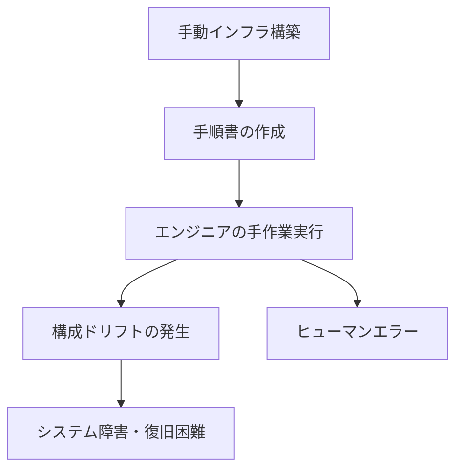
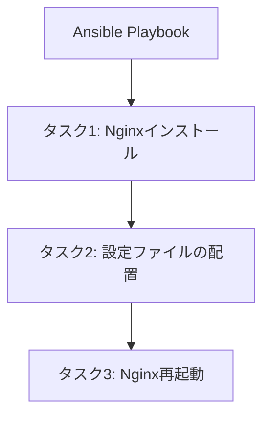
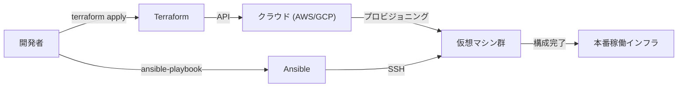

現代のシステム開発において、「Infrastructure as Code (IaC)」はもはやバズワードではなく、スケーラブルで信頼性の高いシステムを構築・運用するための必須プラットフォームとなっています。かつてインフラエンジニアが徹夜でサーバーのラッキングを行い、手順書を片手に黒い画面にコマンドを打ち込んでいた時代から、インフラストラクチャはソフトウェアのコードとして管理される時代へとシフトしました。

本記事では、IaCを代表する2つのツールである**Terraform**と**Ansible**を比較し、それぞれの役割の違い、設計思想（宣言的アプローチと手続き的アプローチ）、そして両者を組み合わせるベストプラクティスについて深く掘り下げます。

## 手動インフラ構築（手順書）の脆弱性と再現性の欠如

IaCの価値を理解するためには、過去の「手動運用」の負債を振り返る必要があります。
従来、サーバーの構築はExcelなどで作成された「手順書（Runbook）」に基づいて手動で行われていました。このアプローチには致命的な欠陥がいくつか存在します。

1. **ヒューマンエラーの不可避性**: 人間が100行のコマンドを手作業で実行すれば、必ずどこかでタイプミスや手順飛ばしが発生します。
2. **構成ドリフト（Configuration Drift）**: 本番環境で緊急のトラブルシューティングが行われた際、手順書やリポジトリに反映されない「手修正」が加わります。その結果、テスト環境と本番環境で構成にズレが生じ、「テスト環境では動いたのに本番で動かない」という事態を引き起こします。
3. **属人化**: 「あのサーバーのApacheの設定はAさんしか分からない」といった秘伝のタレ化が進行します。
4. **スケーラビリティの限界**: トラフィック急増時にサーバーを10台追加する場合、手作業では到底間に合いません。

## Immutable Infrastructure（不変インフラ）というパラダイムシフト

これらの課題を解決するために登場したのが**Immutable Infrastructure（不変インフラ）**の概念です。

従来は一度構築したサーバーにSSHでログインし、パッケージのアップデートや設定ファイルの変更を行っていました（Mutable: 可変）。これに対し、Immutable Infrastructureでは「稼働中のサーバーに変更を加えない」というルールを徹底します。
アップデートが必要な場合は、新しい設定を持ったサーバーを新規にプロビジョニングし、古いサーバーを破棄（リプレース）します。

この概念により、サーバーの状態が常に初期構築時のまま保たれるため、構成ドリフトが排除され、再現性とテスト容易性が飛躍的に向上しました。そして、この「瞬時にサーバーを構築・破棄する」ことを可能にするのがIaCツールです。

## Terraform：宣言的アプローチと「プロビジョニング」

HashiCorp社が開発した**Terraform**は、主にクラウドインフラストラクチャの「プロビジョニング（構築）」に特化したツールです。AWS、GCP、Azureなどのクラウドリソース（VPC、サブネット、EC2インスタンス、RDSなど）の作成や管理を得意とします。

### 宣言的アプローチ（Declarative）
Terraform最大の特徴は**宣言的アプローチ**を採用している点です。「どのように（How）」リソースを作るかではなく、「どのような状態にしたいか（What）」をHCL (HashiCorp Configuration Language) というコードで記述します。

Terraformエンジンは、現在のインフラ状態とコードに記述された「あるべき姿」を比較し、その差分（Plan）を計算して、必要な操作（Create, Update, Delete）を自動的に実行します。

### 状態管理ファイル「tfstate」の功罪
Terraformは現在のインフラ状態を記録するために `terraform.tfstate` という状態管理ファイルを使用します。

**メリット**:
- **高速な差分計算**: 毎回クラウドAPIを叩いて全リソースをスキャンするのではなく、ローカル（またはリモートバックエンド）のtfstateとコードを比較するため、プランニングが高速です。
- **リソースの追跡と依存関係の管理**: Terraformで作成されたリソースのメタデータを保持しているため、リソース間の複雑な依存関係を正確に把握し、正しい順序で構築・破棄が可能です。

**デメリット**:
- **競合とロックの管理**: 複数人で同時にTerraformを実行するとtfstateが壊れるリスクがあります。そのため、AWS S3 + DynamoDBなどのリモートバックエンドを使用して排他制御（ステートロック）を行う必要があります。
- **手動変更による不整合**: AWSコンソールなどから手動でリソースを変更すると、tfstateと実際のクラウド状態にズレが生じます。Terraformは次回の実行時に、手動変更を検知してコードの状態に「戻そう」とします。

## Ansible：手続き的アプローチの側面を持つ「構成管理」

Red Hat社が支援する**Ansible**は、主にOS内部の「構成管理（設定）」に特化したツールです。サーバー構築後のミドルウェアのインストール（Nginx, MySQLなど）、設定ファイルの配置、ユーザー作成、サービスの起動などを得意とします。

### 手続き的アプローチ（Procedural）の側面
Ansibleも冪等性（何度実行しても同じ結果になる性質）を担保するように設計されていますが、その実行モデルは**手続き的（Procedural）**な側面を持っています。YAML形式の「Playbook」には、上から下へと実行される「タスクの手順」が記述されます。

Ansibleは対象サーバーにSSHで接続し、モジュールを転送して上から順にタスクを実行します。これは「どうやって目的の状態にするか」という手順をコード化していると言えます。

### エージェントレスの手軽さ
Ansibleの強力なメリットは**エージェントレス**であることです。対象サーバーに専用の管理エージェントをインストールする必要がなく、SSH接続さえできればどこからでも構成管理が可能です。これにより、既存のレガシーサーバーにも容易に導入できます。

しかし、状態を管理するファイル（Terraformのtfstateのようなもの）を持たないため、リソースの「削除」や「依存関係の厳密な追跡」はTerraformほど得意ではありません。

## TerraformとAnsibleの適切な組み合わせ方

TerraformとAnsibleは競合するものではなく、**相互補完関係**にあります。最も強力なIaCインフラストラクチャは、それぞれの強みを活かして両者を組み合わせることで実現できます。

**ベストプラクティスの分担:**
1. **Terraform (インフラの骨組みを作る)**
   - ネットワーク構築 (VPC, Subnet, Route Table)
   - セキュリティグループ、IAMロールの定義
   - サーバーインスタンス（EC2）、データベース（RDS）、ロードバランサーのプロビジョニング
2. **Ansible (インフラの中身を整える)**
   - OSのパッケージアップデート
   - ミドルウェア、アプリケーションのインストールと設定
   - ログ監視エージェントなどの配置

### Immutableな世界でのAnsibleの役割
コンテナ技術（Docker/Kubernetes）やクラウドネイティブなImmutable Infrastructureが主流になるにつれ、Ansibleを直接本番サーバーに実行する機会は減りつつあります。
現代では、Ansibleは**「マシンイメージ（AMI）のビルド」**のフェーズで活躍します。PackerなどのツールとAnsibleを組み合わせ、設定済みの「ゴールデンイメージ」を作成します。そしてTerraformは、そのゴールデンイメージを使ってサーバーをプロビジョニングするのです。

## 結論

Infrastructure as Codeは、ソフトウェア開発のライフサイクル全体を加速させる強力なエンジンです。
Terraformの「宣言的アプローチによるインフラのプロビジョニング」と、Ansibleの「手続き的アプローチによる柔軟な構成管理」を正しく理解し、使い分けることが、堅牢でスケーラブルなシステム構築への第一歩となります。
手動の不確実な手順書から脱却し、コードによる確実で不変なインフラ運用を目指しましょう。
