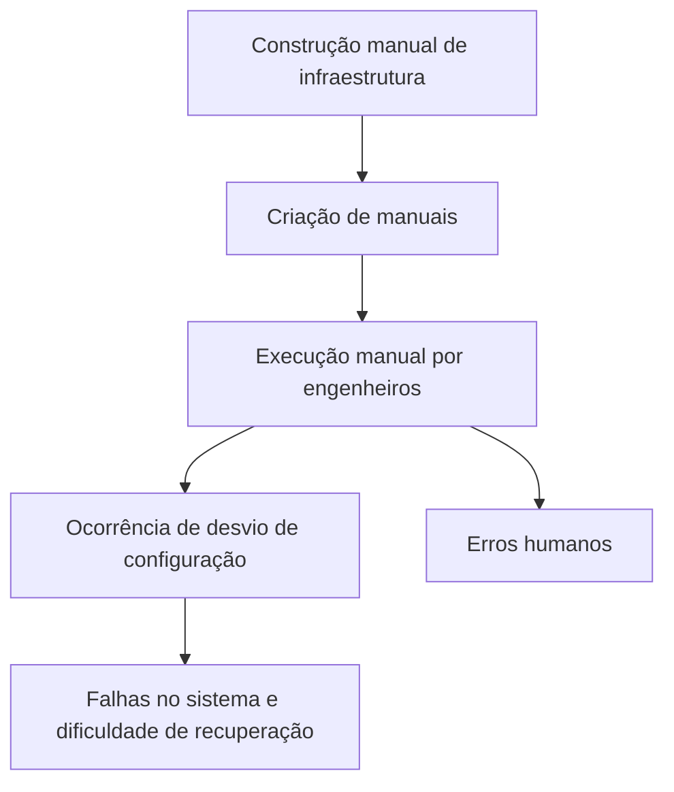
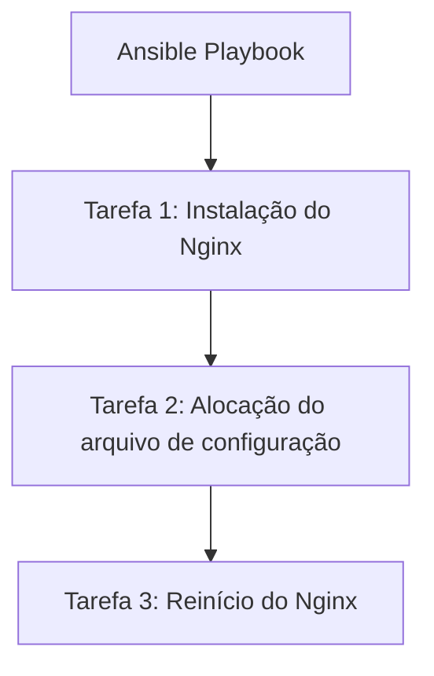
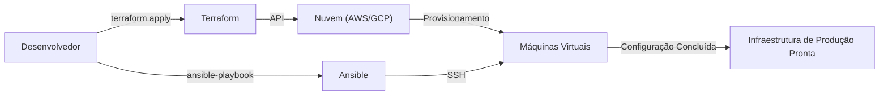

No desenvolvimento moderno de sistemas, 'Infrastructure as Code (IaC)' já não é apenas uma palavra da moda, mas sim uma plataforma essencial para construir e operar sistemas escaláveis e altamente confiáveis. Da época em que engenheiros de infraestrutura viravam noites fazendo o rack de servidores e digitando comandos em telas pretas com manuais na mão, a infraestrutura mudou para uma era em que é gerenciada como código de software.

Neste artigo, compararemos as duas ferramentas mais representativas de IaC, **Terraform** e **Ansible**, aprofundando-nos nas diferenças de seus papéis, em suas filosofias de design (abordagens declarativa e procedural) e nas melhores práticas para combiná-las.

## A vulnerabilidade e a falta de reprodutibilidade da construção manual de infraestrutura (manuais de instruções)

Para entender o valor do IaC, precisamos analisar o passivo das 'operações manuais' do passado.
Tradicionalmente, a construção de servidores era feita manualmente com base em 'manuais de instruções (Runbooks)' criados no Excel ou em ferramentas semelhantes. Essa abordagem possui algumas falhas fatais.

1. **A inevitabilidade dos erros humanos**: Se um humano executar 100 linhas de comandos manualmente, inevitavelmente ocorrerão erros de digitação ou o esquecimento de algum passo em algum momento.
2. **Desvio de configuração (Configuration Drift)**: Quando uma solução de problemas de emergência é realizada no ambiente de produção, 'modificações manuais' que não são refletidas no manual ou no repositório são adicionadas. Como resultado, ocorre uma discrepância de configuração entre os ambientes de teste e de produção, levando a situações em que 'funcionou no ambiente de teste, mas não funciona na produção'.
3. **Dependência de pessoas (Silo de conhecimento)**: Aumenta a situação do "molho secreto", em que coisas como 'apenas a pessoa A conhece as configurações do Apache daquele servidor' se tornam comuns.
4. **Limites de escalabilidade**: Ao adicionar 10 servidores devido a um aumento repentino no tráfego, o trabalho manual não tem como dar conta a tempo.

## A mudança de paradigma para Immutable Infrastructure (Infraestrutura Imutável)

O conceito de **Immutable Infrastructure (Infraestrutura Imutável)** surgiu para resolver esses problemas.

Anteriormente, fazíamos login via SSH em um servidor já construído e realizávamos atualizações de pacotes e modificações em arquivos de configuração (Mutável: variável). Em contraste, com a Immutable Infrastructure, a regra de 'não fazer alterações em servidores em funcionamento' é rigorosamente aplicada.
Quando uma atualização é necessária, um novo servidor com a nova configuração é provisionado do zero e o servidor antigo é destruído (substituído).

Por meio desse conceito, o estado do servidor é sempre mantido exatamente como na sua construção inicial. Isso elimina os desvios de configuração, melhorando drasticamente a reprodutibilidade e a facilidade de teste. E o que torna possível 'construir e destruir servidores instantaneamente' são as ferramentas de IaC.

## Terraform: Abordagem declarativa e 'provisionamento'

O **Terraform**, desenvolvido pela HashiCorp, é uma ferramenta especializada principalmente no 'provisionamento (construção)' de infraestrutura em nuvem. Ele se destaca na criação e no gerenciamento de recursos de nuvem, como AWS, GCP, Azure (VPC, sub-redes, instâncias EC2, RDS, etc.).

### Abordagem Declarativa (Declarative)

A maior característica do Terraform é que ele adota uma **abordagem declarativa**. Em vez de descrever 'como (How)' criar recursos, ele descreve 'em qual estado você deseja que as coisas fiquem (What)' usando um código chamado HCL (HashiCorp Configuration Language).

O mecanismo do Terraform compara o estado atual da infraestrutura com o 'estado ideal' descrito no código, calcula a diferença (Plan) e executa automaticamente as operações necessárias (Create, Update, Delete).

### Os prós e contras do arquivo de gerenciamento de estado 'tfstate'

O Terraform usa um arquivo de gerenciamento de estado chamado `terraform.tfstate` para registrar o estado atual da infraestrutura.

**Vantagens**:
- **Cálculo de diferenças em alta velocidade**: Em vez de chamar a API da nuvem todas as vezes para rastrear todos os recursos, o planejamento é muito rápido porque compara o código diretamente com o tfstate local (ou backend remoto).
- **Rastreamento de recursos e gerenciamento de dependências**: Ao manter os metadados dos recursos criados, o Terraform consegue compreender com precisão as complexas dependências entre os recursos e construir ou destruir na ordem correta.

**Desvantagens**:
- **Gestão de conflitos e bloqueios**: Existe o risco de corromper o tfstate se várias pessoas executarem o Terraform simultaneamente. Por conta disso, é necessário usar um backend remoto como AWS S3 + DynamoDB para realizar o controle de exclusividade (bloqueio de estado).
- **Inconsistências devido a alterações manuais**: Se um recurso for modificado manualmente a partir do console da AWS, por exemplo, haverá uma divergência entre o tfstate e o estado real da nuvem. Na próxima execução, o Terraform detectará a modificação manual e tentará 'reverter' o recurso para o estado definido no código.

## Ansible: 'Gerenciamento de configuração' com aspectos de abordagem procedural

O **Ansible**, mantido pela Red Hat, é uma ferramenta especializada principalmente no 'gerenciamento de configuração (configuração)' interna do sistema operacional. Ele se destaca na instalação de middlewares pós-construção do servidor (Nginx, MySQL, etc.), alocação de arquivos de configuração, criação de usuários e na inicialização de serviços.

### O aspecto da Abordagem Procedural (Procedural)

O Ansible também é projetado para garantir a idempotência (a propriedade de produzir o mesmo resultado, não importa quantas vezes seja executado), mas o seu modelo de execução tem um aspecto **procedural (Procedural)**. No 'Playbook' em formato YAML, descreve-se os 'procedimentos de tarefas' que são executados sequencialmente de cima para baixo.

O Ansible se conecta ao servidor alvo via SSH, transfere módulos e executa as tarefas sequencialmente, de cima para baixo. Pode-se dizer que isso codifica o procedimento de 'como alcançar o estado desejado'.

### A simplicidade de não utilizar agentes (Agentless)

Uma das maiores vantagens do Ansible é ser **sem agentes (agentless)**. Não há necessidade de instalar agentes de gerenciamento dedicados nos servidores alvo; desde que seja possível uma conexão SSH, o gerenciamento de configuração pode ser feito de qualquer lugar. Isso facilita muito a adoção em servidores legados existentes.

No entanto, como não possui um arquivo para gerenciar o estado (como o tfstate do Terraform), ele não é tão bom quanto o Terraform para 'deletar' recursos ou fazer o 'rastreamento rigoroso de dependências'.

## A maneira adequada de combinar Terraform e Ansible

O Terraform e o Ansible não são concorrentes, eles possuem uma **relação de complementação mútua**. A infraestrutura de IaC mais poderosa pode ser alcançada combinando as duas ferramentas para alavancar os pontos fortes de cada uma.

**Divisão de melhores práticas:**
1. **Terraform (Construir a estrutura da infraestrutura)**
   - Construção de redes (VPC, Subnet, Route Table)
   - Definição de grupos de segurança (Security Groups) e funções (Roles) do IAM
   - Provisionamento de instâncias de servidor (EC2), banco de dados (RDS) e balanceadores de carga
2. **Ansible (Preparar o conteúdo interno da infraestrutura)**
   - Atualização de pacotes do sistema operacional
   - Instalação e configuração de middlewares e aplicativos
   - Implantação de agentes de monitoramento de logs e afins

### O papel do Ansible em um mundo Imutável

À medida que tecnologias de contêineres (Docker/Kubernetes) e Immutable Infrastructure nativas da nuvem se tornam a norma, as oportunidades de executar o Ansible diretamente em servidores de produção estão diminuindo.
Hoje em dia, o Ansible se destaca na fase de **'construção de imagens de máquina (AMI)'**. Ferramentas como o Packer são combinadas com o Ansible para criar uma 'imagem dourada (golden image)' pré-configurada. O Terraform, então, utiliza essa imagem dourada para provisionar os servidores.

## Conclusão

Infrastructure as Code é um mecanismo poderoso que acelera todo o ciclo de vida do desenvolvimento de software.
Compreender adequadamente e utilizar o 'provisionamento de infraestrutura através de uma abordagem declarativa' do Terraform e o 'gerenciamento de configuração flexível através de uma abordagem procedural' do Ansible é o primeiro passo para construir um sistema robusto e escalável.
Vamos abandonar os manuais de instruções manuais e incertos, buscando operações de infraestrutura consistentes e imutáveis por meio de código.
