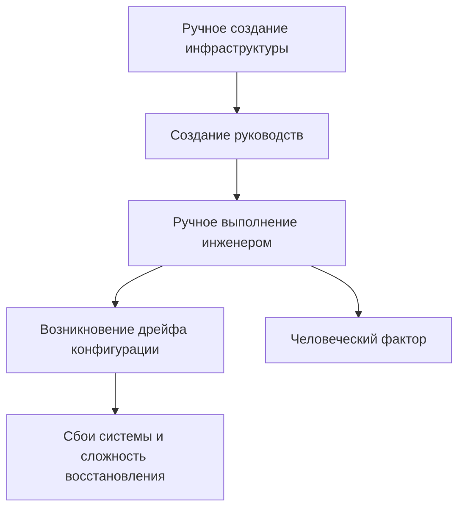
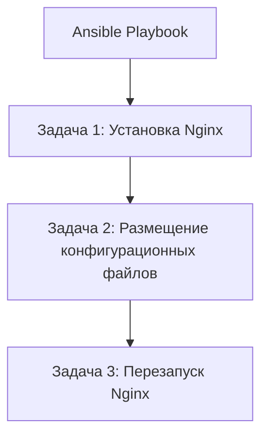
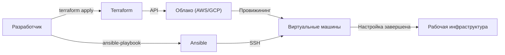

В современной разработке систем «Infrastructure as Code (IaC)» больше не является просто модным словом, а стало обязательной платформой для создания и эксплуатации масштабируемых и надежных систем. Эпоха, когда инженеры инфраструктуры проводили бессонные ночи, устанавливая серверы в стойки и вводя команды в черный экран с руководством в руках, сменилась эпохой, когда инфраструктура управляется как программный код.

В этой статье мы сравним два ведущих инструмента IaC — **Terraform** и **Ansible**, глубоко проанализируем различия в их ролях, философии проектирования (декларативный и процедурный подходы), а также лучшие практики их совместного использования.

## Уязвимости ручного создания инфраструктуры (по руководствам) и отсутствие воспроизводимости

Чтобы понять ценность IaC, необходимо оглянуться на технический долг прошлых «ручных операций».
Традиционно настройка серверов выполнялась вручную на основе «руководств» (Runbook), созданных в Excel или аналогичных программах. Этот подход имеет несколько фатальных недостатков.

1. **Неизбежность человеческого фактора**: Если человек вручную выполняет 100 строк команд, обязательно где-то возникнет опечатка или пропуск шага.
2. **Дрейф конфигурации (Configuration Drift)**: Когда в рабочей среде проводится срочное устранение неполадок, вносятся «ручные исправления», которые не отражаются в руководствах или репозиториях. В результате возникает расхождение в конфигурации между тестовой и рабочей средами, что приводит к ситуации: «В тестовой среде работало, а в рабочей не работает».
3. **Зависимость от конкретных людей**: Развивается эффект «секретного рецепта», например: «Только сотрудник А знает, как настроен Apache на том сервере».
4. **Пределы масштабируемости**: В случае резкого роста трафика, если необходимо добавить 10 серверов, сделать это вручную вовремя просто невозможно.

## Смена парадигмы: Immutable Infrastructure (Неизменяемая инфраструктура)

Для решения этих проблем появилась концепция **Immutable Infrastructure (Неизменяемая инфраструктура)**.

Ранее, после настройки сервера, в него заходили по SSH для обновления пакетов или изменения конфигурационных файлов (Mutable: изменяемая). В отличие от этого, Immutable Infrastructure строго следует правилу «не вносить изменения в работающий сервер».
Если требуется обновление, провижинится новый сервер с новыми настройками, а старый сервер уничтожается (заменяется).

Благодаря этой концепции состояние серверов всегда сохраняется таким, каким оно было при первоначальном создании, что устраняет дрейф конфигурации и значительно повышает воспроизводимость и удобство тестирования. Именно инструменты IaC позволяют «мгновенно создавать и уничтожать серверы».

## Terraform: Декларативный подход и «провижининг»

Разработанный компанией HashiCorp, **Terraform** — это инструмент, специализирующийся в основном на «провижининге (создании)» облачной инфраструктуры. Он отлично справляется с созданием и управлением облачными ресурсами (такими как VPC, подсети, экземпляры EC2, RDS и т. д.) в AWS, GCP, Azure и других платформах.

### Декларативный подход (Declarative)

Главная особенность Terraform заключается в использовании **декларативного подхода**. Вместо того чтобы описывать, «как (How)» создавать ресурсы, в коде на HCL (HashiCorp Configuration Language) описывается, «каким должно быть состояние (What)».

Движок Terraform сравнивает текущее состояние инфраструктуры с «идеальным состоянием», описанным в коде, вычисляет разницу (Plan) и автоматически выполняет необходимые операции (Create, Update, Delete).

### Плюсы и минусы файла управления состоянием «tfstate»

Terraform использует файл управления состоянием под названием `terraform.tfstate` для записи текущего состояния инфраструктуры.

**Преимущества**:
- **Быстрое вычисление разницы**: Планирование происходит быстро, поскольку сравнивается код с локальным (или удаленным) файлом tfstate, а не сканируются все ресурсы через вызовы облачного API каждый раз.
- **Отслеживание ресурсов и управление зависимостями**: Поскольку метаданные ресурсов, созданных в Terraform, сохраняются, можно точно понимать сложные зависимости между ресурсами и создавать или уничтожать их в правильном порядке.

**Недостатки**:
- **Управление конфликтами и блокировками**: Если несколько человек одновременно запускают Terraform, существует риск повреждения файла tfstate. Поэтому необходимо использовать удаленные бэкенды (например, AWS S3 + DynamoDB) для обеспечения эксклюзивного контроля (блокировки состояния).
- **Несоответствия из-за ручных изменений**: Если ресурсы изменяются вручную, например, через консоль AWS, возникает расхождение между tfstate и реальным состоянием облака. При следующем запуске Terraform обнаружит ручные изменения и попытается «вернуть» состояние к тому, что описано в коде.

## Ansible: «Управление конфигурацией» с элементами процедурного подхода

**Ansible**, поддерживаемый компанией Red Hat, в основном специализируется на «управлении конфигурацией (настройке)» внутри ОС. Он отлично подходит для установки промежуточного ПО (Nginx, MySQL и т. д.), размещения конфигурационных файлов, создания пользователей, запуска сервисов и т. д. после настройки сервера.

### Элементы процедурного подхода (Procedural)

Ansible также спроектирован так, чтобы гарантировать идемпотентность (свойство получать один и тот же результат независимо от количества выполнений), но его модель выполнения имеет **процедурные (Procedural)** черты. В «Playbook» формата YAML описываются «последовательности задач», которые выполняются сверху вниз.

Ansible подключается к целевому серверу по SSH, передает модули и выполняет задачи по порядку сверху вниз. Можно сказать, что это кодирование процесса «как достичь желаемого состояния».

### Удобство работы без агентов

Мощное преимущество Ansible — это его **безагентность**. Нет необходимости устанавливать специальный агент управления на целевой сервер; конфигурацией можно управлять откуда угодно, если есть SSH-подключение. Это позволяет легко внедрять его даже на существующих устаревших серверах.

Однако, поскольку у него нет файла для управления состоянием (подобного tfstate в Terraform), он не так хорош в «удалении» ресурсов или «строгом отслеживании зависимостей», как Terraform.

## Как правильно комбинировать Terraform и Ansible

Terraform и Ansible не конкурируют друг с другом, а находятся в **отношениях взаимодополняемости**. Самая мощная инфраструктура IaC может быть реализована путем объединения обоих инструментов с использованием их сильных сторон.

**Лучшие практики разделения обязанностей:**
1. **Terraform (Создание каркаса инфраструктуры)**
   - Настройка сети (VPC, Subnet, Route Table)
   - Определение групп безопасности, ролей IAM
   - Провижининг экземпляров серверов (EC2), баз данных (RDS), балансировщиков нагрузки
2. **Ansible (Настройка внутреннего содержимого инфраструктуры)**
   - Обновление пакетов ОС
   - Установка и настройка промежуточного ПО, приложений
   - Размещение агентов мониторинга логов и т. д.

### Роль Ansible в мире Immutable

По мере того как контейнерные технологии (Docker/Kubernetes) и облачные (cloud-native) решения Immutable Infrastructure становятся мейнстримом, возможности запуска Ansible напрямую на рабочих серверах уменьшаются.
В настоящее время Ansible играет активную роль на этапе **«сборки образов машин (AMI)»**. Инструменты вроде Packer комбинируются с Ansible для создания предварительно настроенного «золотого образа» (Golden Image). Затем Terraform использует этот золотой образ для провижининга серверов.

## Заключение

Infrastructure as Code — это мощный двигатель, ускоряющий весь жизненный цикл разработки программного обеспечения.
Правильное понимание и использование «провижининга инфраструктуры через декларативный подход» Terraform и «гибкого управления конфигурацией через процедурный подход» Ansible является первым шагом к созданию надежных и масштабируемых систем.
Давайте избавимся от ненадежных ручных руководств и будем стремиться к надежному, неизменяемому управлению инфраструктурой с помощью кода.
