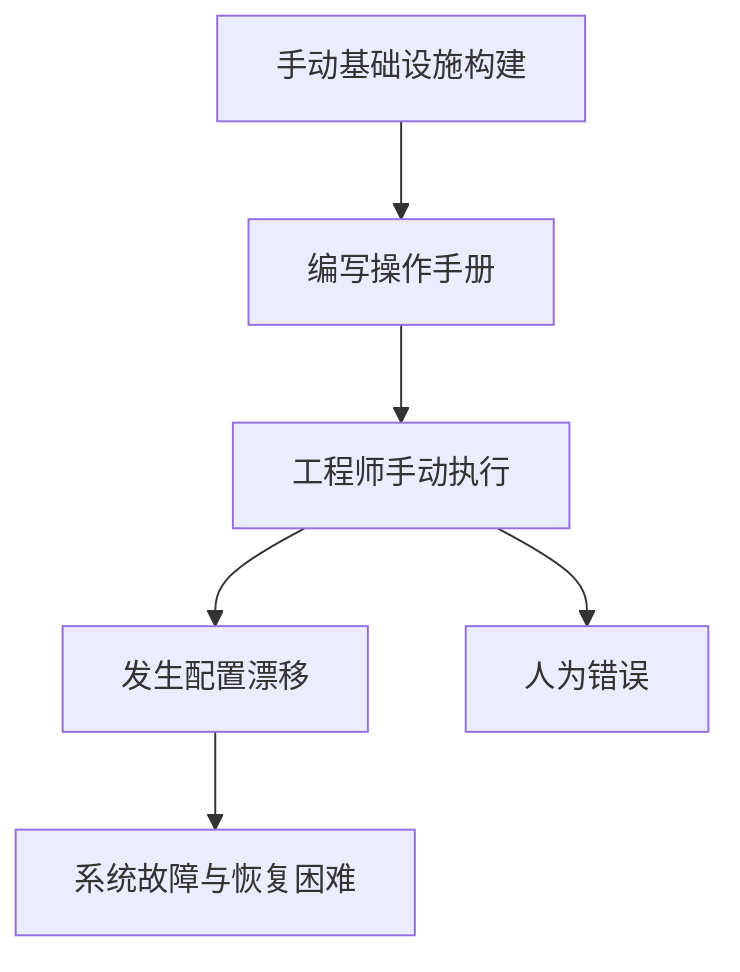
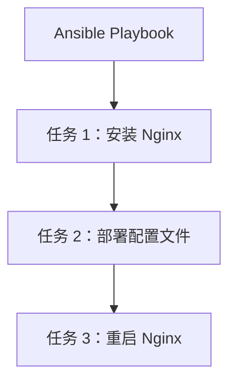
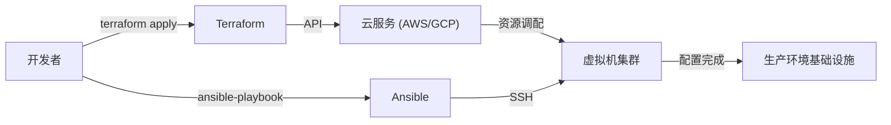

在现代系统开发中，“Infrastructure as Code (IaC)”（基础设施即代码）已经不再是一个流行词，而是构建和运营可扩展且高可靠性系统的必备平台。基础设施已经从过去由基础设施工程师熬夜将服务器上架、拿着操作手册对着黑底白字屏幕输入命令的时代，转变为将基础设施作为软件代码进行管理的时代。

本文将对代表 IaC 的两大工具 **Terraform** 和 **Ansible** 进行比较，深入探讨它们在角色上的差异、设计理念（声明式方法与过程式方法）以及结合这两者的最佳实践。

## 手动基础设施构建（操作手册）的脆弱性与缺乏可重复性

要理解 IaC 的价值，我们需要回顾过去“手动运维”所带来的技术债务。
在过去，服务器的构建主要基于在 Excel 等工具中编写的“操作手册（Runbook）”来手动进行。这种方法存在一些致命的缺陷：

1. **人为错误的不可避免性**：如果让人员手动执行 100 行命令，必然会在某个地方发生拼写错误或遗漏步骤。
2. **配置漂移（Configuration Drift）**：当在生产环境中进行紧急故障排查时，通常会进行一些未反映在操作手册或代码库中的“手动修改”。结果会导致测试环境和生产环境之间的配置出现偏差，引发“在测试环境中正常，但在生产环境中无法运行”的情况。
3. **过度依赖个人（属人化）**：类似于“那台服务器的 Apache 配置只有 A 先生才懂”这样成为秘方的现象会逐渐蔓延。
4. **可扩展性的限制**：当流量激增需要增加 10 台服务器时，手动操作根本无法及时应对。

## Immutable Infrastructure（不可变基础设施）的范式转变

为了解决这些问题，**Immutable Infrastructure（不可变基础设施）**的概念应运而生。

传统方式下，人们通过 SSH 登录到已构建好的服务器上，进行软件包更新或配置文件修改（Mutable：可变）。与此相对，不可变基础设施严格遵循“不对运行中的服务器进行修改”的规则。
如果需要更新，则直接预置（provision）包含新配置的全新服务器，并销毁（替换）旧服务器。

通过这一概念，服务器的状态始终保持在初始构建时的样子，从而消除了配置漂移，大幅提升了可重复性和可测试性。而让这种“瞬间构建和销毁服务器”成为可能的技术，正是 IaC 工具。

## Terraform：声明式方法与“资源调配（Provisioning）”

由 HashiCorp 公司开发的 **Terraform** 主要是一个专注于云基础设施“资源调配（构建）”的工具。它擅长创建和管理 AWS、GCP、Azure 等云资源（如 VPC、子网、EC2 实例、RDS 等）。

### 声明式方法（Declarative）
Terraform 最大的特点是采用了**声明式方法**。它不是描述“如何（How）”创建资源，而是通过 HCL（HashiCorp Configuration Language）代码来描述“期望的状态是什么（What）”。

Terraform 引擎会将当前基础设施状态与代码中描述的“理想状态”进行对比，计算其差异（Plan），并自动执行必要的操作（Create、Update、Delete）。

### 状态管理文件 `tfstate` 的优缺点
Terraform 使用名为 `terraform.tfstate` 的状态管理文件来记录当前的基础设施状态。

**优点**：
- **快速的差异计算**：不需要每次都调用云服务 API 扫描所有资源，而是通过将本地（或远程后端）的 tfstate 与代码进行比较，因此规划（Planning）速度非常快。
- **资源追踪与依赖管理**：它保存了由 Terraform 创建的资源的元数据，因此能够准确把握资源之间复杂的依赖关系，并按照正确的顺序进行构建和销毁。

**缺点**：
- **冲突与锁管理**：多人同时执行 Terraform 存在破坏 tfstate 的风险。因此，必须使用 AWS S3 + DynamoDB 等远程后端来进行排他控制（状态锁定）。
- **手动修改导致的不一致**：如果通过 AWS 控制台等手动修改了资源，会导致 tfstate 与实际云端状态产生偏差。在下次执行时，Terraform 会检测到手动修改，并试图将其“恢复”到代码所定义的状态。

## Ansible：具备过程式方法特征的“配置管理”

由 Red Hat 赞助支持的 **Ansible** 主要是一个专注于操作系统内部“配置管理（设置）”的工具。它擅长在服务器构建完成后安装中间件（如 Nginx、MySQL 等）、部署配置文件、创建用户、启动服务等操作。

### 过程式方法（Procedural）的侧面
虽然 Ansible 在设计上也确保了幂等性（无论执行多少次都会得到相同的结果），但它的执行模型具有**过程式（Procedural）**的特征。在 YAML 格式的“Playbook”中，定义了从上到下依次执行的“任务步骤”。

Ansible 通过 SSH 连接到目标服务器，传输模块并按顺序从上到下执行任务。可以说，它将“如何达到目的状态”的步骤进行了代码化。

### 无代理（Agentless）的便利性
Ansible 最大的优势在于其**无代理**的特性。不需要在目标服务器上安装专用的管理代理，只要能建立 SSH 连接，就可以在任何地方进行配置管理。这使得它可以轻松引入到现有的传统服务器环境中。

然而，由于它没有像 Terraform 的 tfstate 那样管理状态的文件，因此在资源的“删除”或“严格追踪依赖关系”方面，不如 Terraform 擅长。

## Terraform 与 Ansible 的合适组合方式

Terraform 和 Ansible 并非竞争关系，而是**互补关系**。通过发挥各自的优势将两者结合使用，可以构建出最强大的 IaC 基础设施。

**最佳实践分工：**
1. **Terraform（构建基础设施骨架）**
   - 网络构建（VPC、子网、路由表）
   - 安全组、IAM 角色的定义
   - 服务器实例（EC2）、数据库（RDS）、负载均衡器的资源调配
2. **Ansible（配置基础设施内部）**
   - 操作系统的软件包更新
   - 中间件、应用程序的安装与配置
   - 日志监控代理等的部署

### Ansible 在不可变世界中的作用
随着容器技术（Docker/Kubernetes）和云原生 Immutable Infrastructure 成为主流，直接在生产服务器上运行 Ansible 的机会正在减少。
在现代开发中，Ansible 主要活跃在**“构建机器镜像（AMI）”**的阶段。通过将 Packer 等工具与 Ansible 结合，创建已配置好的“黄金镜像”。然后，Terraform 再使用该黄金镜像来预置（provision）服务器。

## 结论

Infrastructure as Code 是加速整个软件开发生命周期的强大引擎。
正确理解并区分使用 Terraform 的“基于声明式方法的基础设施资源调配”和 Ansible 的“基于过程式方法的灵活配置管理”，是迈向构建健壮且可扩展系统的第一步。
让我们摆脱充满不确定性的手动操作手册，朝着通过代码实现可靠且不可变的基础设施运维迈进。
