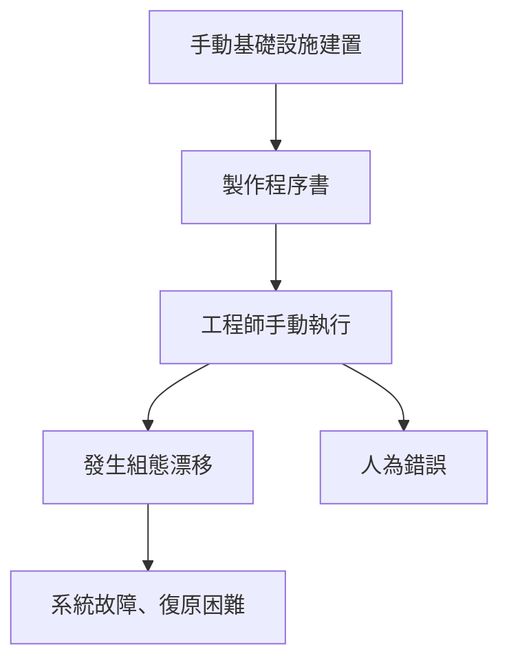
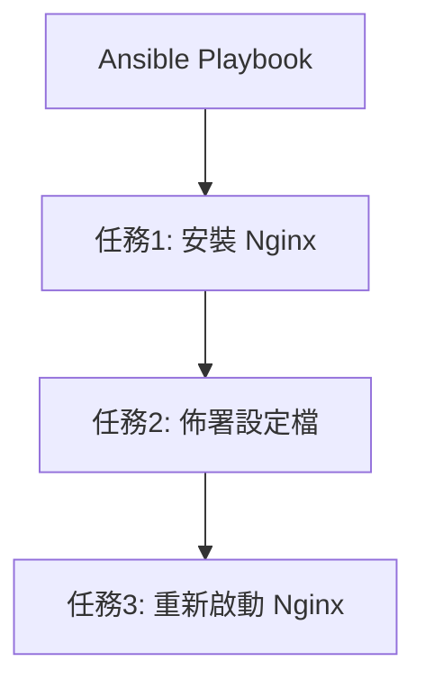
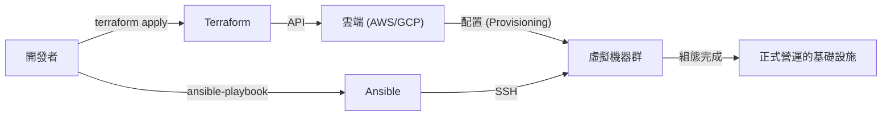

現代的系統開發中，「Infrastructure as Code (IaC)」早已不再是個流行語，而是建置與營運具備高擴充性且可靠系統的必備平台。過去基礎設施工程師需要熬夜為伺服器上架，一手拿著程序書在黑色畫面上敲打指令的時代已經過去，基礎設施已轉變為作為軟體程式碼來管理的時代。

本文將針對代表 IaC 的兩大工具：**Terraform** 與 **Ansible** 進行比較，深入探討各自的角色差異、設計理念（宣告式方法與程序式方法），以及結合兩者的最佳實踐。

## 手動基礎設施建置（程序書）的脆弱性與缺乏可重現性

為了理解 IaC 的價值，我們必須回顧過去「手動營運」所留下的技術債。
以往，伺服器的建置是根據 Excel 等軟體製作的「程序書（Runbook）」手動進行的。這種方法存在幾個致命的缺陷：

1. **人為錯誤的不可避免性**：當人類手動執行 100 行指令時，必定會在某處發生打字錯誤或漏掉步驟的情況。
2. **組態漂移（Configuration Drift）**：當正式環境中進行緊急的故障排除時，會加入未反映在程序書或版本庫中的「手動修改」。結果導致測試環境與正式環境的組態產生落差，引發「在測試環境可以正常運作，但在正式環境卻無法運作」的情況。
3. **依賴個人（屬人化）**：會逐漸演變成「只有 A 先生才知道那台伺服器的 Apache 是怎麼設定的」這種秘方化的現象。
4. **擴展性的極限**：當流量暴增需要新增 10 台伺服器時，手工作業根本來不及應付。

## Immutable Infrastructure（不可變基礎設施）的典範轉移

為了解決這些課題而出現的，就是 **Immutable Infrastructure（不可變基礎設施）** 的概念。

過去，我們會透過 SSH 登入已建置好的伺服器，進行套件更新或修改設定檔（Mutable：可變的）。相對地，在 Immutable Infrastructure 中，則嚴格遵守「不對運作中的伺服器進行修改」的規則。
當需要更新時，會全新配置一台帶有新設定的伺服器，並廢棄（替換）舊的伺服器。

透過這個概念，伺服器的狀態始終保持在最初建置時的模樣，從而消除了組態漂移，並讓可重現性與易測試性獲得飛躍性的提升。而讓這種「瞬間建置與廢棄伺服器」成為可能的，正是 IaC 工具。

## Terraform：宣告式方法與「配置（Provisioning）」

由 HashiCorp 公司開發的 **Terraform**，主要是專注於雲端基礎設施「配置（Provisioning，建置）」的工具。它擅長建立與管理 AWS、GCP、Azure 等雲端資源（如 VPC、子網路、EC2 執行個體、RDS 等）。

### 宣告式方法（Declarative）
Terraform 最大的特色在於採用了**宣告式方法**。它不是描述「如何（How）」建立資源，而是使用 HCL (HashiCorp Configuration Language) 這種程式碼來描述「想要變成什麼狀態（What）」。

Terraform 引擎會比較目前的基礎設施狀態與程式碼中描述的「理想狀態」，計算出兩者的差異（Plan），然後自動執行必要的操作（Create, Update, Delete）。

### 狀態管理檔「tfstate」的功與過
Terraform 為了記錄目前的基礎設施狀態，會使用名為 `terraform.tfstate` 的狀態管理檔。

**優點**：
- **高速的差異計算**：不需要每次都呼叫雲端 API 來掃描所有資源，而是直接將本地（或遠端後端）的 tfstate 與程式碼進行比較，因此規劃（Planning）的速度非常快。
- **追蹤資源與管理相依性**：因為保留了由 Terraform 建立的資源詮釋資料，所以能夠準確掌握資源間複雜的相依關係，並以正確的順序進行建置與廢棄。

**缺點**：
- **衝突與鎖定管理**：如果多人同時執行 Terraform，會有損壞 tfstate 的風險。因此，必須使用 AWS S3 + DynamoDB 等遠端後端來進行排他控制（狀態鎖定）。
- **手動修改帶來的不一致**：如果從 AWS 主控台等地方手動修改資源，就會造成 tfstate 與實際雲端狀態的落差。在下次執行時，Terraform 會偵測到手動修改，並試圖將其「還原」回程式碼的狀態。

## Ansible：具備程序式方法側面的「組態管理」

由 Red Hat 公司支援的 **Ansible**，主要是專注於作業系統內部「組態管理（設定）」的工具。它擅長在伺服器建置完成後，進行中介軟體的安裝（如 Nginx, MySQL）、設定檔的佈署、使用者的建立以及服務的啟動等。

### 程序式方法（Procedural）的側面
雖然 Ansible 在設計上也確保了冪等性（無論執行多少次都會得到相同結果的特性），但其執行模型卻帶有**程序式（Procedural）**的側面。在 YAML 格式的「Playbook」中，會描述由上至下執行的「任務步驟」。

Ansible 會透過 SSH 連線到目標伺服器，傳送模組並由上而下依序執行任務。這可以說是一種將「如何達到目的狀態」的步驟給程式碼化的做法。

### 無代理程式的便利性
Ansible 強大的優勢在於它是**無代理程式（Agentless）**的。不需要在目標伺服器上安裝專用的管理代理程式，只要能夠透過 SSH 連線，就能從任何地方進行組態管理。這使得它也能夠輕鬆導入到現有的傳統伺服器中。

然而，因為它沒有像 Terraform 的 tfstate 那樣管理狀態的檔案，所以在資源的「刪除」與「嚴格追蹤相依性」方面，就不如 Terraform 拿手。

## Terraform 與 Ansible 的適當結合方式

Terraform 與 Ansible 並不是競爭對手，而是處於**互補關係**。最強大的 IaC 基礎設施，是藉由發揮各自的優勢並將兩者結合來實現的。

**最佳實踐的分工：**
1. **Terraform（打造基礎設施的骨架）**
   - 網路建置 (VPC, Subnet, Route Table)
   - 定義安全群組、IAM 角色
   - 配置伺服器執行個體（EC2）、資料庫（RDS）、負載平衡器
2. **Ansible（完善基礎設施的內部）**
   - 作業系統的套件更新
   - 中介軟體、應用程式的安裝與設定
   - 佈署日誌監控代理程式等

### 在 Immutable 世界中 Ansible 的角色
隨著容器技術（Docker/Kubernetes）與雲端原生的 Immutable Infrastructure 成為主流，直接在正式伺服器上執行 Ansible 的機會正逐漸減少。
在現代，Ansible 活躍於**「建置機器映像檔（AMI）」**的階段。我們會將 Ansible 與 Packer 等工具結合，建立已設定完成的「黃金映像檔（Golden Image）」。然後，Terraform 就能使用這個黃金映像檔來配置伺服器。

## 結論

Infrastructure as Code 是能夠加速整個軟體開發生命週期的強大引擎。
正確理解並劃分 Terraform「透過宣告式方法進行基礎設施配置」與 Ansible「透過程序式方法進行靈活的組態管理」，將是邁向建置堅固且具備高擴充性系統的第一步。
讓我們擺脫手動且充滿不確定性的程序書，邁向透過程式碼實現確實且不可變的基礎設施營運吧。
