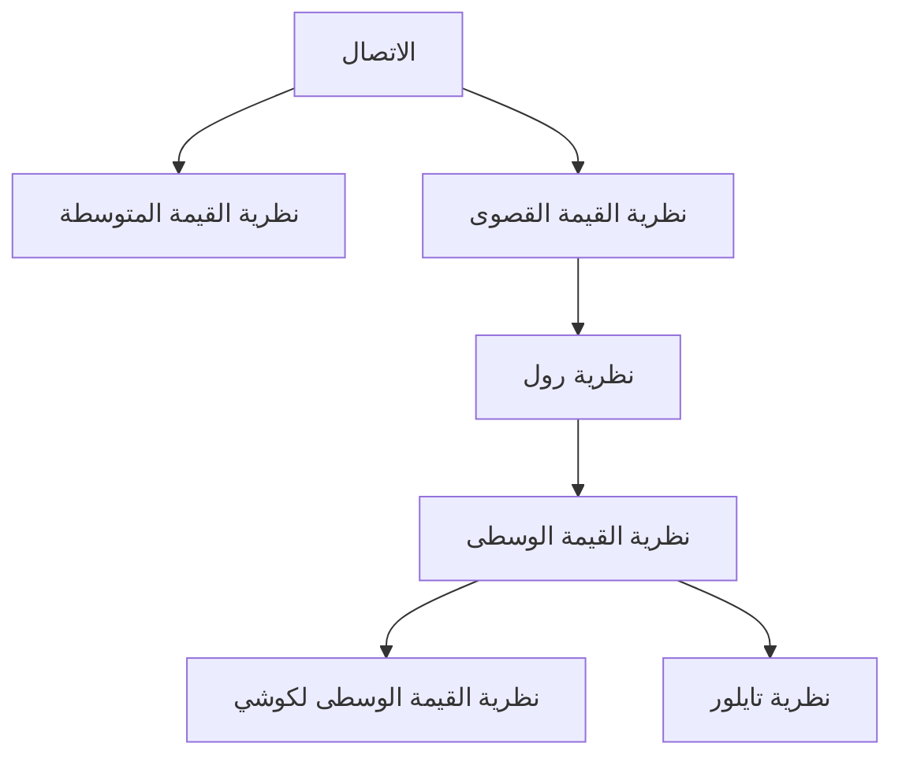

## 1. مقدمة: الحدس والمنطق اللذان يدعمان التفاضل والتكامل

حساب التفاضل والتكامل (Calculus) هو إطار قوي لالتقاط التغيير رياضيًا. في صميم نظريته توجد مفاهيم مثل "الاتصال" (Continuity) و"قابلية الاشتقاق" (Differentiability). هذه المفاهيم هي صيغ رياضية صارمة للصور البديهية التي نواجهها يوميًا، مثل "الترابط" و"السلاسة".

في هذه المقالة، سنركز على اثنتين من أهم النظريات الأساسية في التفاضل والتكامل: **نظرية القيمة المتوسطة** (Intermediate Value Theorem) و **نظرية القيمة الوسطى** (Mean Value Theorem). تعمل هذه النظريات كأدوات قوية لإثبات وجود حلول للمعادلات وتحليل سلوك الدوال (مثل اطرادها).

يوضح المخطط أدناه التبعيات المنطقية لمختلف النظريات المستمدة من الاتصال وقابلية الاشتقاق.

دعونا نتعمق في فهم كيفية ترابط هذه النظريات، باستخدام صيغ محددة وشروحات بديهية.

## 2. نظرية القيمة المتوسطة

### نص النظرية

نظرية القيمة المتوسطة هي واحدة من أبسط الخصائص البديهية للدوال المتصلة.

> **نظرية (نظرية القيمة المتوسطة)**
> لنفترض أن الدالة $f(x)$ متصلة على الفترة المغلقة $[a, b]$. إذا كان $f(a) \neq f(b)$، فإنه لأي عدد $k$ بين $f(a)$ و $f(b)$، يوجد على الأقل $c$ واحد في الفترة المفتوحة $(a, b)$ بحيث:
> $$f(c) = k$$

### المعنى البديهي والتفسير الهندسي

ما تنص عليه هذه النظرية بسيط للغاية: "عندما ترسم خطًا من النقطة $(a, f(a))$ إلى النقطة $(b, f(b))$ دون رفع قلمك عن الورقة، يجب أن تعبر الخط الأفقي عند الارتفاع $k$ مرة واحدة على الأقل". نظرًا لأن الدالة **متصلة**، فلا يمكنها القفز فوق القيم المتوسطة.

### تطبيق: إثبات وجود حلول للمعادلات

التطبيق الأكثر شيوعًا لنظرية القيمة المتوسطة هو إثبات وجود جذور حقيقية لمعادلة.

**مثال:**
أثبت أن المعادلة $x^3 - x - 1 = 0$ لها جذر حقيقي واحد على الأقل في الفترة $(1, 2)$.

**الحل:**
نعتبر الدالة $f(x) = x^3 - x - 1$. نظرًا لأن الدوال كثيرة الحدود متصلة لجميع الأعداد الحقيقية، فإن $f(x)$ متصلة أيضًا على الفترة المغلقة $[1, 2]$.
بحساب القيم عند كلا طرفي الفترة:
- $f(1) = 1^3 - 1 - 1 = -1 < 0$
- $f(2) = 2^3 - 2 - 1 = 5 > 0$

بما أن $f(1) < 0 < f(2)$، فبموجب نظرية القيمة المتوسطة، يوجد $c \in (1, 2)$ بحيث $f(c) = 0$. لذلك، فإن المعادلة لها جذر في النطاق $(1, 2)$.

## 3. نظرية رول

كخطوة حاسمة نحو إثبات نظرية القيمة الوسطى، نقدم أولاً **نظرية رول** (Rolle's Theorem).

> **نظرية (نظرية رول)**
> لنفترض أن الدالة $f(x)$ تحقق الشروط الثلاثة التالية:
> 1. متصلة على الفترة المغلقة $[a, b]$.
> 2. قابلة للاشتقاق على الفترة المفتوحة $(a, b)$.
> 3. $f(a) = f(b)$.
> 
> إذن، يوجد على الأقل $c$ واحد في الفترة المفتوحة $(a, b)$ بحيث $f'(c) = 0$.

هندسيًا، يعني هذا أنه لأي منحنى سلس حيث يكون ارتفاعا البداية والنهاية متماثلين، يجب أن يكون هناك نقطة واحدة على الأقل حيث يكون المماس أفقيًا (الميل يساوي 0).

## 4. نظرية القيمة الوسطى

يمكن اعتبار نظرية القيمة الوسطى (نظرية القيمة الوسطى للاجرانج) الركيزة الأساسية التي تدعم التفاضل والتكامل بأكمله.

### نص النظرية

> **نظرية (نظرية القيمة الوسطى)**
> لنفترض أن الدالة $f(x)$ متصلة على الفترة المغلقة $[a, b]$ وقابلة للاشتقاق على الفترة المفتوحة $(a, b)$. إذن، يوجد على الأقل $c$ واحد في الفترة المفتوحة $(a, b)$ بحيث:
> $$f'(c) = \frac{f(b) - f(a)}{b - a}$$

### المعنى البديهي والتفسير الهندسي

يمثل الجانب الأيمن $\frac{f(b) - f(a)}{b - a}$ ميل القاطع (secant line) الذي يربط بين النقطتين $(a, f(a))$ و $(b, f(b))$، وهو **معدل التغير المتوسط** للدالة على الفترة بأكملها.
ويمثل الجانب الأيسر $f'(c)$ ميل خط المماس عند النقطة $c$، وهو **معدل التغير اللحظي**.

بمعنى آخر، تؤكد نظرية القيمة الوسطى أنه "يجب أن تكون هناك لحظة على طول الطريق تكون فيها السرعة اللحظية مساوية تمامًا للسرعة المتوسطة على مدى الفترة بأكملها". إذا كنت تقود سيارتك من النقطة A إلى النقطة B بمتوسط سرعة $60 \text{ كم/ساعة}$، فمن المؤكد أن عداد السرعة الخاص بك قد أشار بالضبط إلى $60 \text{ كم/ساعة}$ في لحظة ما أثناء الرحلة.

### إثبات نظرية القيمة الوسطى

يتم إثبات نظرية القيمة الوسطى من خلال الاستخدام الذكي لنظرية رول.

نعتبر معادلة القاطع $g(x)$:
$$g(x) = f(a) + \frac{f(b) - f(a)}{b - a}(x - a)$$

نحدد دالة جديدة $h(x)$ تمثل الفرق بين الدالة الأصلية $f(x)$ والقاطع $g(x)$:
$$h(x) = f(x) - g(x) = f(x) - \left( f(a) + \frac{f(b) - f(a)}{b - a}(x - a) \right)$$

لنتحقق من خصائص الدالة $h(x)$:
1. بما أن كلاً من $f(x)$ والمعادلات الخطية في $x$ متصلة على $[a, b]$، فإن $h(x)$ متصلة أيضًا على $[a, b]$.
2. قابلة للاشتقاق على $(a, b)$.
3. $h(a) = f(a) - f(a) = 0$
4. $h(b) = f(b) - \left( f(a) + f(b) - f(a) \right) = 0$

وبالتالي، $h(a) = h(b) = 0$، مما يعني أن الدالة $h(x)$ تلبي جميع شروط نظرية رول.
بموجب نظرية رول، يوجد $c \in (a, b)$ بحيث $h'(c) = 0$.

باشتقاق $h(x)$، نحصل على:
$$h'(x) = f'(x) - \frac{f(b) - f(a)}{b - a}$$
وبما أن $h'(c) = 0$، لدينا:
$$f'(c) - \frac{f(b) - f(a)}{b - a} = 0 \implies f'(c) = \frac{f(b) - f(a)}{b - a}$$
وهذا يكمل الإثبات.

### تطبيقات: اختبار الدالة الثابتة وإثبات الاطراد

توفر نظرية القيمة الوسطى الأساس النظري لتحديد سلوك الدالة من إشارة مشتقتها.

**نتيجة 1: إذا كانت المشتقة تساوي صفرًا، فإن الدالة ثابتة**
> إذا كان $f'(x) = 0$ لجميع قيم $x$ في الفترة $I$، فإن $f(x)$ ثابتة على $I$.

**مخطط الإثبات:**
نختار أي نقطتين مختلفتين $x_1, x_2$ ($x_1 < x_2$) داخل الفترة $I$. بموجب نظرية القيمة الوسطى، يوجد $c \in (x_1, x_2)$ يحقق:
$$f(x_2) - f(x_1) = f'(c)(x_2 - x_1)$$
حسب افتراضنا، $f'(c) = 0$، إذن $f(x_2) - f(x_1) = 0$، مما يعني أن $f(x_1) = f(x_2)$. بما أن القيم متساوية عند أي نقطتين، فإن الدالة ثابتة.

**نتيجة 2: الدوال المتزايدة والمتناقصة باطراد**
> إذا كان $f'(x) > 0$ لجميع قيم $x$ في الفترة $I$، فإن $f(x)$ متزايدة تمامًا على $I$.

يمكن إثبات هذه النتيجة بنفس الطريقة تمامًا. عندما يكون $x_1 < x_2$، وبما أن $f'(c) > 0$ و $(x_2 - x_1) > 0$، لدينا $f(x_2) - f(x_1) > 0$، مما يعني أن $f(x_1) < f(x_2)$، وهذا يوضح بصرامة أن الدالة متزايدة تمامًا.

وبهذه الطريقة، فإن مبادئ جداول الإشارات التي نستخدمها بشكل طبيعي في رياضيات المدرسة الثانوية ("إذا كانت المشتقة موجبة فهي تتزايد، وإذا كانت سالبة فهي تتناقص") مضمونة جميعها بواسطة **نظرية القيمة الوسطى** هذه.

## 5. نظرية القيمة الوسطى لكوشي

نظرية القيمة الوسطى لكوشي هي امتداد لنظرية القيمة الوسطى لتشمل دالتين.

> **نظرية (نظرية القيمة الوسطى لكوشي)**
> لنفترض أن الدالتين $f(x)$ و $g(x)$ متصلتان على الفترة المغلقة $[a, b]$ وقابلتان للاشتقاق على الفترة المفتوحة $(a, b)$، وأن $g'(x) \neq 0$ لجميع قيم $x \in (a, b)$. إذن، يوجد $c \in (a, b)$ بحيث:
> $$\frac{f(b) - f(a)}{g(b) - g(a)} = \frac{f'(c)}{g'(c)}$$

يمكن تفسير هذه النظرية على أنها نظرية القيمة الوسطى لمنحنى محدد وسيطيًا $(g(t), f(t))$. وهي أيضًا نظرية أساسية تُستخدم للإثبات الصارم لـ **قاعدة لوبيتال** (L'Hôpital's Rule)، والتي تعد مفيدة للغاية في حسابات النهايات.

## 6. خاتمة

في هذه المقالة، شرحنا [نظرية القيمة المتوسطة ونظرية القيمة الوسطى](https://kenji.blog/ar/p/intermediate-and-mean-value-theorem/)، اللتين تشكلان أساس التفاضل والتكامل.

- تضمن **نظرية القيمة المتوسطة** الطبيعة "المتصلة" للدوال المتصلة وتشير إلى وجود حلول للمعادلات.
- تربط **نظرية القيمة الوسطى** التغير المتوسط للدالة بتغيرها اللحظي، وتعمل كأداة لا غنى عنها لفهم السلوك العام للدالة (مثل اتجاهات التزايد أو التناقص) باستخدام خصائص المشتقات.

للوهلة الأولى، قد تبدو هذه النظريات وكأنها تذكر البديهيات. ومع ذلك، فإن دعم الحدس بمنطق صارم هو بالضبط القوة الدافعة وراء التطور القوي للرياضيات الحديثة. من خلال عدم الاكتفاء بحفظ نصوص النظريات فحسب، بل بتقدير معانيها الهندسية والأفكار الكامنة وراء براهينها، ستتمكن من الاستمتاع بالعمق الثري للرياضيات بشكل أكبر.
