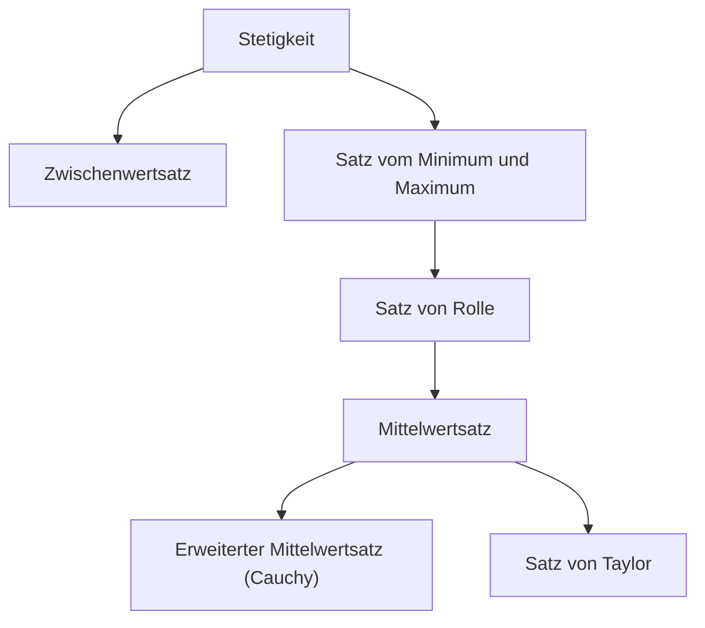

## 1. Einleitung: Intuition und Logik als Basis der Analysis

Die Analysis (Calculus) ist ein mächtiges System zur mathematischen Erfassung von Veränderungen. Im Kern ihrer Theorie stehen Konzepte wie „Stetigkeit“ und „Differenzierbarkeit“. Diese Konzepte sind strenge mathematische Formulierungen der intuitiven Vorstellungen, die uns im Alltag begegnen, wie etwa „Zusammenhang“ und „Glätte“.

In diesem Artikel konzentrieren wir uns auf zwei der wichtigsten und grundlegendsten Sätze der Analysis: den **Zwischenwertsatz** (Intermediate Value Theorem) und den **Mittelwertsatz** (Mean Value Theorem). Diese Sätze dienen als mächtige Werkzeuge, um die Existenz von Lösungen für Gleichungen zu beweisen und das Verhalten von Funktionen (wie etwa die Monotonie) zu analysieren.

Das folgende Diagramm zeigt die logischen Abhängigkeiten verschiedener Sätze, die aus der Stetigkeit und Differenzierbarkeit abgeleitet werden.

Lassen Sie uns tief eintauchen und anhand konkreter Formeln und intuitiver Erklärungen verstehen, wie diese Sätze miteinander verbunden sind.

## 2. Der Zwischenwertsatz

### Aussage des Satzes

Der Zwischenwertsatz ist eine der grundlegendsten und intuitivsten Eigenschaften stetiger Funktionen.

> **Satz (Zwischenwertsatz)**
> Sei eine Funktion $f(x)$ stetig auf dem abgeschlossenen Intervall $[a, b]$. Wenn $f(a) \neq f(b)$, dann existiert für jede Zahl $k$ zwischen $f(a)$ und $f(b)$ mindestens ein $c$ im offenen Intervall $(a, b)$, sodass:
> $$f(c) = k$$

### Intuitive Bedeutung und Geometrische Interpretation

Was dieser Satz aussagt, ist äußerst simpel: „Wenn man eine Linie vom Punkt $(a, f(a))$ zum Punkt $(b, f(b))$ zeichnet, ohne den Stift vom Papier abzuheben, muss man die horizontale Linie auf der Höhe $k$ mindestens einmal überqueren.“ Da die Funktion **stetig** ist, kann sie keine Zwischenwerte überspringen.

### Anwendung: Beweis der Existenz von Lösungen für Gleichungen

Die häufigste Anwendung des Zwischenwertsatzes ist der Nachweis der Existenz reeller Wurzeln für eine Gleichung.

**Beispiel:**
Zeigen Sie, dass die Gleichung $x^3 - x - 1 = 0$ mindestens eine reelle Wurzel im Intervall $(1, 2)$ hat.

**Lösung:**
Betrachten wir die Funktion $f(x) = x^3 - x - 1$. Da Polynomfunktionen für alle reellen Zahlen stetig sind, ist $f(x)$ auch auf dem abgeschlossenen Intervall $[1, 2]$ stetig.
Wir berechnen die Werte an den Rändern des Intervalls:
- $f(1) = 1^3 - 1 - 1 = -1 < 0$
- $f(2) = 2^3 - 2 - 1 = 5 > 0$

Da $f(1) < 0 < f(2)$ gilt, existiert nach dem Zwischenwertsatz ein $c \in (1, 2)$, sodass $f(c) = 0$. Folglich hat die Gleichung eine Wurzel im Bereich $(1, 2)$.

## 3. Der Satz von Rolle

Als entscheidenden Schritt auf dem Weg zum Beweis des Mittelwertsatzes führen wir zunächst den **Satz von Rolle** ein.

> **Satz (Satz von Rolle)**
> Sei eine Funktion $f(x)$, die die folgenden drei Bedingungen erfüllt:
> 1. Sie ist stetig auf dem abgeschlossenen Intervall $[a, b]$.
> 2. Sie ist differenzierbar auf dem offenen Intervall $(a, b)$.
> 3. $f(a) = f(b)$.
> 
> Dann existiert mindestens ein $c$ im offenen Intervall $(a, b)$, sodass $f'(c) = 0$.

Geometrisch bedeutet dies, dass es bei jeder glatten Kurve, bei der die Anfangs- und Endhöhe gleich sind, mindestens einen Punkt geben muss, an dem die Tangente horizontal ist (die Steigung ist 0).

## 4. Der Mittelwertsatz der Differentialrechnung

Der Mittelwertsatz (Mittelwertsatz von Lagrange) kann als der zentrale Pfeiler betrachtet werden, der die gesamte Analysis stützt.

### Aussage des Satzes

> **Satz (Mittelwertsatz)**
> Sei eine Funktion $f(x)$ stetig auf dem abgeschlossenen Intervall $[a, b]$ und differenzierbar auf dem offenen Intervall $(a, b)$. Dann existiert mindestens ein $c$ im offenen Intervall $(a, b)$, sodass gilt:
> $$f'(c) = \frac{f(b) - f(a)}{b - a}$$

### Intuitive Bedeutung und Geometrische Interpretation

Die rechte Seite $\frac{f(b) - f(a)}{b - a}$ stellt die Steigung der Sekante (secant line) dar, die die Punkte $(a, f(a))$ und $(b, f(b))$ verbindet. Dies entspricht der **durchschnittlichen Änderungsrate** der Funktion über das gesamte Intervall.
Die linke Seite $f'(c)$ stellt die Steigung der Tangente im Punkt $c$ dar, also die **momentane Änderungsrate**.

Mit anderen Worten besagt der Mittelwertsatz: „Es muss einen Moment auf der Strecke geben, an dem die Momentangeschwindigkeit exakt der Durchschnittsgeschwindigkeit über das gesamte Intervall entspricht.“ Wenn Sie mit einer Durchschnittsgeschwindigkeit von $60 \text{ km/h}$ von Punkt A nach Punkt B fahren, muss Ihr Tachometer irgendwann während der Fahrt exakt auf $60 \text{ km/h}$ gestanden haben.

### Beweis des Mittelwertsatzes

Der Mittelwertsatz wird bewiesen, indem der Satz von Rolle geschickt angewendet wird.

Betrachten wir die Gleichung der Sekante $g(x)$:
$$g(x) = f(a) + \frac{f(b) - f(a)}{b - a}(x - a)$$

Wir definieren eine neue Funktion $h(x)$, welche die Differenz zwischen der ursprünglichen Funktion $f(x)$ und der Sekante $g(x)$ darstellt:
$$h(x) = f(x) - g(x) = f(x) - \left( f(a) + \frac{f(b) - f(a)}{b - a}(x - a) \right)$$

Überprüfen wir die Eigenschaften der Funktion $h(x)$:
1. Da sowohl $f(x)$ als auch lineare Gleichungen in $x$ auf $[a, b]$ stetig sind, ist auch $h(x)$ auf $[a, b]$ stetig.
2. Sie ist auf $(a, b)$ differenzierbar.
3. $h(a) = f(a) - f(a) = 0$
4. $h(b) = f(b) - \left( f(a) + f(b) - f(a) \right) = 0$

Daher ist $h(a) = h(b) = 0$, was bedeutet, dass die Funktion $h(x)$ alle Bedingungen des Satzes von Rolle erfüllt.
Nach dem Satz von Rolle existiert ein $c \in (a, b)$, sodass $h'(c) = 0$.

Differenziert man $h(x)$, erhält man:
$$h'(x) = f'(x) - \frac{f(b) - f(a)}{b - a}$$
Da $h'(c) = 0$, gilt:
$$f'(c) - \frac{f(b) - f(a)}{b - a} = 0 \implies f'(c) = \frac{f(b) - f(a)}{b - a}$$
Damit ist der Beweis abgeschlossen.

### Anwendungen: Test auf konstante Funktion und Beweis der Monotonie

Der Mittelwertsatz liefert die theoretische Grundlage zur Bestimmung des Verhaltens einer Funktion aus dem Vorzeichen ihrer Ableitung.

**Korollar 1: Wenn die Ableitung null ist, ist die Funktion konstant**
> Wenn $f'(x) = 0$ für alle $x$ in einem Intervall $I$ gilt, dann ist $f(x)$ auf $I$ konstant.

**Beweisskizze:**
Wählen wir zwei beliebige verschiedene Punkte $x_1, x_2$ ($x_1 < x_2$) innerhalb des Intervalls $I$. Nach dem Mittelwertsatz existiert ein $c \in (x_1, x_2)$, das Folgendes erfüllt:
$$f(x_2) - f(x_1) = f'(c)(x_2 - x_1)$$
Nach unserer Annahme ist $f'(c) = 0$, also ist $f(x_2) - f(x_1) = 0$, was $f(x_1) = f(x_2)$ bedeutet. Da die Werte an zwei beliebigen Punkten gleich sind, ist die Funktion konstant.

**Korollar 2: Monoton steigende und fallende Funktionen**
> Wenn $f'(x) > 0$ für alle $x$ in einem Intervall $I$ gilt, dann ist $f(x)$ auf $I$ streng monoton steigend.

Dieses Korollar lässt sich auf genau dieselbe Weise beweisen. Wenn $x_1 < x_2$, da $f'(c) > 0$ und $(x_2 - x_1) > 0$, haben wir $f(x_2) - f(x_1) > 0$, was $f(x_1) < f(x_2)$ bedeutet und rigoros zeigt, dass die Funktion streng monoton steigend ist.

Auf diese Weise werden die Prinzipien der Vorzeichentabellen, die wir in der Schulmathematik selbstverständlich verwenden („wenn die Ableitung positiv ist, steigt sie, wenn negativ, fällt sie“), alle durch diesen **Mittelwertsatz** garantiert.

## 5. Der Erweiterte Mittelwertsatz (Cauchy)

Der Mittelwertsatz von Cauchy ist eine Erweiterung des Mittelwertsatzes auf zwei Funktionen.

> **Satz (Erweiterter Mittelwertsatz)**
> Seien zwei Funktionen $f(x)$ und $g(x)$ stetig auf dem abgeschlossenen Intervall $[a, b]$ und differenzierbar auf dem offenen Intervall $(a, b)$, und sei $g'(x) \neq 0$ für alle $x \in (a, b)$. Dann existiert ein $c \in (a, b)$, sodass:
> $$\frac{f(b) - f(a)}{g(b) - g(a)} = \frac{f'(c)}{g'(c)}$$

Dieser Satz kann als Mittelwertsatz für eine parametrisch definierte Kurve $(g(t), f(t))$ interpretiert werden. Er ist auch ein wesentlicher Satz, der für den strengen Beweis der **Regel von L'Hôpital** verwendet wird, die bei der Berechnung von Grenzwerten äußerst nützlich ist.

## 6. Fazit

In diesem Artikel haben wir den Zwischenwertsatz und den Mittelwertsatz erklärt, welche das Fundament der Analysis bilden.

- Der **Zwischenwertsatz** garantiert die „zusammenhängende“ Natur stetiger Funktionen und zeigt die Existenz von Lösungen für Gleichungen auf.
- Der **Mittelwertsatz** verknüpft die durchschnittliche Änderung einer Funktion mit ihrer momentanen Änderung und dient als unverzichtbares Werkzeug, um das Gesamtverhalten einer Funktion (wie etwa ihre Steigungs- oder Gefälletendenzen) unter Verwendung der Eigenschaften von Ableitungen zu erfassen.

Auf den ersten Blick scheinen diese Sätze das Offensichtliche auszusprechen. Jedoch ist es genau diese Untermauerung der Intuition durch strenge Logik, welche die treibende Kraft hinter der mächtigen Entwicklung der modernen Mathematik darstellt. Indem Sie sich nicht nur die Aussagen der Sätze einprägen, sondern auch ihre geometrischen Bedeutungen und die Ideen hinter ihren Beweisen schätzen lernen, können Sie die tiefgreifende Reichhaltigkeit der Mathematik noch mehr genießen.
