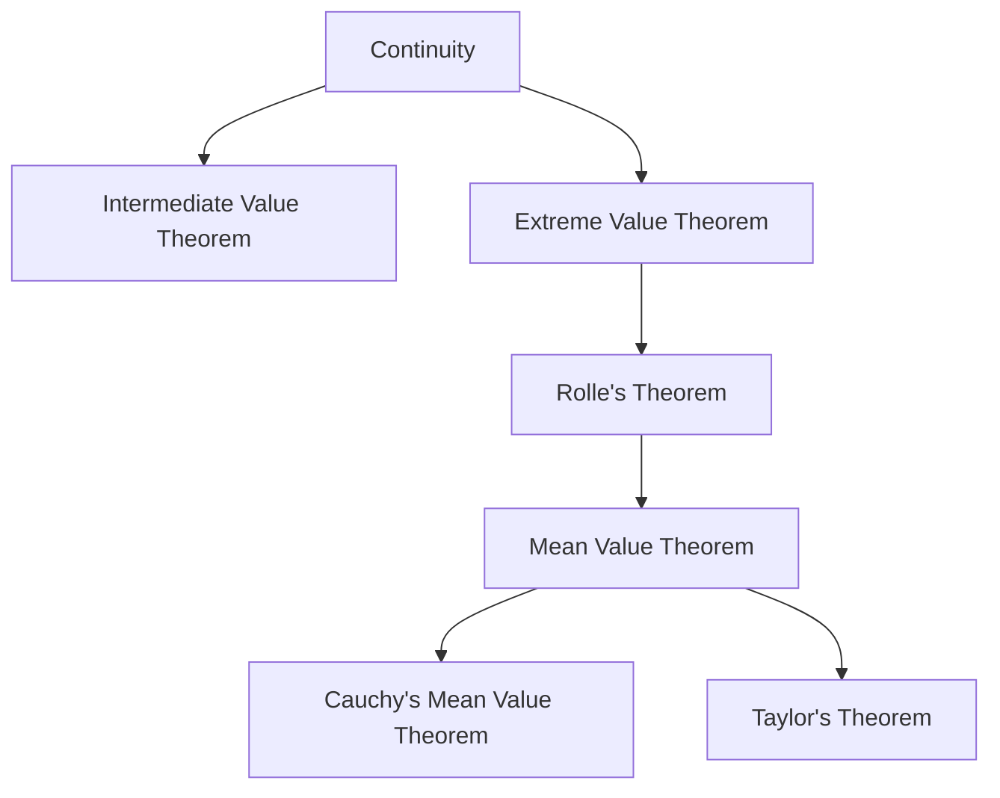
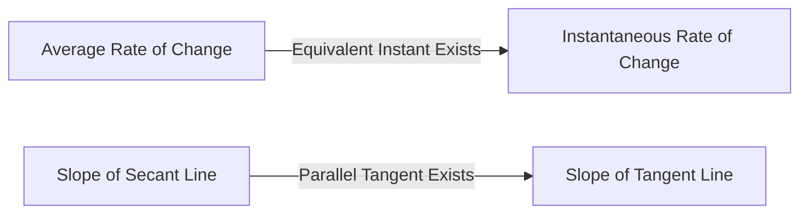

## 1. Introduction: Intuition and Logic Underpinning Calculus

Calculus is a powerful framework for capturing change mathematically. At the core of its theory are concepts such as "continuity" and "differentiability." These concepts are rigorous mathematical formulations of the intuitive images we encounter daily, such as "connectedness" and "smoothness."

In this article, we focus on two of the most important and fundamental theorems in calculus: the **Intermediate Value Theorem** (IVT) and the **Mean Value Theorem** (MVT). These theorems serve as powerful tools for proving the existence of solutions to equations and analyzing the behavior of functions (such as monotonicity).

The diagram below shows the logical dependencies of various theorems derived from continuity and differentiability.

Let's dive deep into understanding how these theorems are interconnected, using specific formulas and intuitive explanations.

## 2. Intermediate Value Theorem

### Statement of the Theorem

The Intermediate Value Theorem is one of the most basic and intuitive properties of continuous functions.

> **Theorem (Intermediate Value Theorem)**
> Suppose a function $f(x)$ is continuous on the closed interval $[a, b]$. If $f(a) \neq f(b)$, then for any number $k$ between $f(a)$ and $f(b)$, there exists at least one $c$ in the open interval $(a, b)$ such that:
> $$f(c) = k$$

### Intuitive Meaning and Geometric Interpretation

What this theorem states is extremely simple: "When you draw a line from the point $(a, f(a))$ to the point $(b, f(b))$ without lifting your pen from the paper, you must cross the horizontal line at height $k$ at least once." Because the function is **continuous**, it cannot jump over intermediate values.

### Application: Proving the Existence of Solutions to Equations

The most common application of the Intermediate Value Theorem is to demonstrate the existence of real roots for an equation.

**Example:**
Show that the equation $x^3 - x - 1 = 0$ has at least one real root in the interval $(1, 2)$.

**Solution:**
Consider the function $f(x) = x^3 - x - 1$. Since polynomial functions are continuous for all real numbers, $f(x)$ is also continuous on the closed interval $[1, 2]$.
Calculating the values at both ends of the interval:
- $f(1) = 1^3 - 1 - 1 = -1 < 0$
- $f(2) = 2^3 - 2 - 1 = 5 > 0$

Since $f(1) < 0 < f(2)$, by the Intermediate Value Theorem, there exists $c \in (1, 2)$ such that $f(c) = 0$. Therefore, the equation has a root in the range $(1, 2)$.

## 3. Rolle's Theorem

As a crucial step towards proving the Mean Value Theorem, we first introduce **Rolle's Theorem**.

> **Theorem (Rolle's Theorem)**
> Suppose a function $f(x)$ satisfies the following three conditions:
> 1. It is continuous on the closed interval $[a, b]$.
> 2. It is differentiable on the open interval $(a, b)$.
> 3. $f(a) = f(b)$.
> 
> Then, there exists at least one $c$ in the open interval $(a, b)$ such that $f'(c) = 0$.

Geometrically, this means that for any smooth curve where the starting and ending heights are the same, there must be at least one point where the tangent is horizontal (the slope is 0).

## 4. Mean Value Theorem

The Mean Value Theorem ([Lagrange](https://kenji.blog/en/p/lagrange/)'s Mean Value Theorem) can be considered the central pillar supporting the entirety of calculus.

### Statement of the Theorem

> **Theorem (Mean Value Theorem)**
> Suppose a function $f(x)$ is continuous on the closed interval $[a, b]$ and differentiable on the open interval $(a, b)$. Then, there exists at least one $c$ in the open interval $(a, b)$ such that:
> $$f'(c) = \frac{f(b) - f(a)}{b - a}$$

### Intuitive Meaning and Geometric Interpretation

The right side $\frac{f(b) - f(a)}{b - a}$ represents the slope of the secant line connecting the points $(a, f(a))$ and $(b, f(b))$, which is the **average rate of change** of the function over the entire interval.
The left side $f'(c)$ represents the slope of the tangent line at point $c$, which is the **instantaneous rate of change**.

In other words, the Mean Value Theorem asserts that "there must exist an instant along the way where the instantaneous speed exactly equals the average speed over the entire interval." If you drive from point A to point B at an average speed of $60 \text{ km/h}$, your speedometer must have pointed exactly to $60 \text{ km/h}$ at some moment during the trip.

### Proof of the Mean Value Theorem

The Mean Value Theorem is proven by cleverly utilizing Rolle's Theorem.

Consider the equation of the secant line $g(x)$:
$$g(x) = f(a) + \frac{f(b) - f(a)}{b - a}(x - a)$$

Define a new function $h(x)$ representing the difference between the original function $f(x)$ and the secant line $g(x)$:
$$h(x) = f(x) - g(x) = f(x) - \left( f(a) + \frac{f(b) - f(a)}{b - a}(x - a) \right)$$

Let's check the properties of the function $h(x)$:
1. Since both $f(x)$ and linear equations in $x$ are continuous on $[a, b]$, $h(x)$ is also continuous on $[a, b]$.
2. It is differentiable on $(a, b)$.
3. $h(a) = f(a) - f(a) = 0$
4. $h(b) = f(b) - \left( f(a) + f(b) - f(a) \right) = 0$

Thus, $h(a) = h(b) = 0$, meaning the function $h(x)$ satisfies all the conditions of Rolle's Theorem.
By Rolle's Theorem, there exists $c \in (a, b)$ such that $h'(c) = 0$.

Differentiating $h(x)$, we get:
$$h'(x) = f'(x) - \frac{f(b) - f(a)}{b - a}$$
Since $h'(c) = 0$, we have:
$$f'(c) - \frac{f(b) - f(a)}{b - a} = 0 \implies f'(c) = \frac{f(b) - f(a)}{b - a}$$
This completes the proof.

### Applications: Constant Function Test and Proving Monotonicity

The Mean Value Theorem provides the theoretical basis for determining the behavior of a function from the sign of its derivative.

**Corollary 1: If the derivative is zero, the function is constant**
> If $f'(x) = 0$ for all $x$ in an interval $I$, then $f(x)$ is constant on $I$.

**Outline of Proof:**
Choose any two distinct points $x_1, x_2$ ($x_1 < x_2$) within the interval $I$. By the Mean Value Theorem, there exists $c \in (x_1, x_2)$ satisfying:
$$f(x_2) - f(x_1) = f'(c)(x_2 - x_1)$$
By our assumption, $f'(c) = 0$, so $f(x_2) - f(x_1) = 0$, which means $f(x_1) = f(x_2)$. Since the values are equal at any two points, the function is constant.

**Corollary 2: Monotonically Increasing and Decreasing Functions**
> If $f'(x) > 0$ for all $x$ in an interval $I$, then $f(x)$ is strictly increasing on $I$.

This corollary can be proven in exactly the same way. When $x_1 < x_2$, since $f'(c) > 0$ and $(x_2 - x_1) > 0$, we have $f(x_2) - f(x_1) > 0$, meaning $f(x_1) < f(x_2)$, which rigorously shows that the function is strictly increasing.

In this way, the principles of sign charts that we use naturally in high school mathematics ("if the derivative is positive it increases, if negative it decreases") are all guaranteed by this **Mean Value Theorem**.

## 5. [Cauchy](https://kenji.blog/en/p/cauchy/)'s Mean Value Theorem

[Cauchy](https://kenji.blog/en/p/cauchy/)'s Mean Value Theorem is an extension of the Mean Value Theorem to two functions.

> **Theorem ([Cauchy](https://kenji.blog/en/p/cauchy/)'s Mean Value Theorem)**
> Suppose two functions $f(x)$ and $g(x)$ are continuous on the closed interval $[a, b]$ and differentiable on the open interval $(a, b)$, and that $g'(x) \neq 0$ for all $x \in (a, b)$. Then, there exists $c \in (a, b)$ such that:
> $$\frac{f(b) - f(a)}{g(b) - g(a)} = \frac{f'(c)}{g'(c)}$$

This theorem can be interpreted as the Mean Value Theorem for a parametrically defined curve $(g(t), f(t))$. It is also an essential theorem used for the rigorous proof of **L'Hôpital's Rule**, which is extremely useful in limit calculations.

## 6. Conclusion

In this article, we explained the Intermediate Value Theorem and the Mean Value Theorem, which form the foundation of calculus.

- The **Intermediate Value Theorem** guarantees the "connected" nature of continuous functions and indicates the existence of solutions to equations.
- The **Mean Value Theorem** links the average change of a function with its instantaneous change, serving as an indispensable tool for grasping the overall behavior of a function (such as its increasing or decreasing trends) using the properties of derivatives.

At first glance, these theorems might seem to state the obvious. However, backing up intuition with rigorous logic is precisely the driving force behind the powerful development of modern mathematics. By not merely memorizing the statements of the theorems, but by appreciating their geometric meanings and the ideas behind their proofs, you will be able to enjoy the profound depth of mathematics even more.
