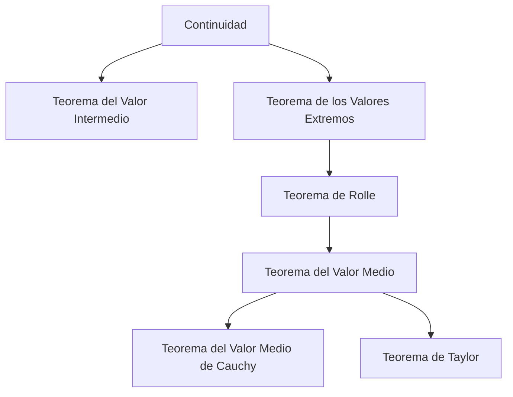
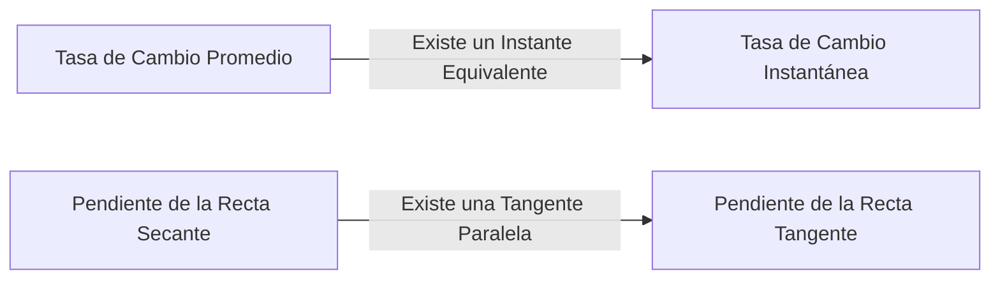

## 1. Introducción: La Intuición y la Lógica que Sustentan el Cálculo

El cálculo (Calculus) es un marco poderoso para capturar matemáticamente el cambio. En el núcleo de su teoría se encuentran conceptos como la "continuidad" y la "diferenciabilidad". Estos conceptos son formulaciones matemáticas rigurosas de las imágenes intuitivas que encontramos a diario, como "conexión" y "suavidad".

En este artículo, nos centraremos en dos de los teoremas más importantes y fundamentales del cálculo: el **Teorema del Valor Intermedio** (TVI) y el **Teorema del Valor Medio** (TVM). Estos teoremas sirven como herramientas poderosas para demostrar la existencia de soluciones a ecuaciones y analizar el comportamiento de las funciones (como su monotonía).

El diagrama a continuación muestra las dependencias lógicas de varios teoremas derivados de la continuidad y la diferenciabilidad.

Vamos a profundizar en cómo estos teoremas están interconectados, utilizando fórmulas específicas y explicaciones intuitivas.

## 2. Teorema del Valor Intermedio

### Enunciado del Teorema

El Teorema del Valor Intermedio es una de las propiedades más básicas e intuitivas de las funciones continuas.

> **Teorema (Teorema del Valor Intermedio)**
> Supongamos que una función $f(x)$ es continua en el intervalo cerrado $[a, b]$. Si $f(a) \neq f(b)$, entonces para cualquier número $k$ entre $f(a)$ y $f(b)$, existe al menos un $c$ en el intervalo abierto $(a, b)$ tal que:
> $$f(c) = k$$

### Significado Intuitivo e Interpretación Geométrica

Lo que afirma este teorema es extremadamente simple: "Cuando trazas una línea desde el punto $(a, f(a))$ hasta el punto $(b, f(b))$ sin levantar el bolígrafo del papel, debes cruzar la línea horizontal a una altura $k$ al menos una vez". Dado que la función es **continua**, no puede saltar los valores intermedios.

### Aplicación: Demostración de la Existencia de Soluciones de Ecuaciones

La aplicación más común del Teorema del Valor Intermedio es demostrar la existencia de raíces reales para una ecuación.

**Ejemplo:**
Demuestre que la ecuación $x^3 - x - 1 = 0$ tiene al menos una raíz real en el intervalo $(1, 2)$.

**Solución:**
Consideremos la función $f(x) = x^3 - x - 1$. Como las funciones polinómicas son continuas para todos los números reales, $f(x)$ también es continua en el intervalo cerrado $[1, 2]$.
Calculando los valores en ambos extremos del intervalo:
- $f(1) = 1^3 - 1 - 1 = -1 < 0$
- $f(2) = 2^3 - 2 - 1 = 5 > 0$

Dado que $f(1) < 0 < f(2)$, por el Teorema del Valor Intermedio, existe $c \in (1, 2)$ tal que $f(c) = 0$. Por lo tanto, la ecuación tiene una raíz en el rango $(1, 2)$.

## 3. Teorema de Rolle

Como un paso crucial hacia la demostración del Teorema del Valor Medio, primero presentamos el **Teorema de Rolle**.

> **Teorema (Teorema de Rolle)**
> Supongamos que una función $f(x)$ cumple las siguientes tres condiciones:
> 1. Es continua en el intervalo cerrado $[a, b]$.
> 2. Es diferenciable en el intervalo abierto $(a, b)$.
> 3. $f(a) = f(b)$.
> 
> Entonces, existe al menos un $c$ en el intervalo abierto $(a, b)$ tal que $f'(c) = 0$.

Geométricamente, esto significa que para cualquier curva suave donde las alturas inicial y final sean iguales, debe haber al menos un punto donde la tangente sea horizontal (la pendiente sea 0).

## 4. Teorema del Valor Medio

El Teorema del Valor Medio (Teorema del Valor Medio de Lagrange) puede considerarse el pilar central que soporta la totalidad del cálculo.

### Enunciado del Teorema

> **Teorema (Teorema del Valor Medio)**
> Supongamos que una función $f(x)$ es continua en el intervalo cerrado $[a, b]$ y diferenciable en el intervalo abierto $(a, b)$. Entonces, existe al menos un $c$ en el intervalo abierto $(a, b)$ tal que:
> $$f'(c) = \frac{f(b) - f(a)}{b - a}$$

### Significado Intuitivo e Interpretación Geométrica

El lado derecho $\frac{f(b) - f(a)}{b - a}$ representa la pendiente de la recta secante (secant line) que conecta los puntos $(a, f(a))$ y $(b, f(b))$, lo cual es la **tasa de cambio promedio** de la función en todo el intervalo.
El lado izquierdo $f'(c)$ representa la pendiente de la recta tangente en el punto $c$, lo cual es la **tasa de cambio instantánea**.

En otras palabras, el Teorema del Valor Medio afirma que "debe existir un instante en el camino donde la velocidad instantánea sea exactamente igual a la velocidad promedio en todo el intervalo". Si conduces desde el punto A hasta el punto B a una velocidad promedio de $60 \text{ km/h}$, tu velocímetro debe haber marcado exactamente $60 \text{ km/h}$ en algún momento del viaje.

### Demostración del Teorema del Valor Medio

El Teorema del Valor Medio se demuestra utilizando ingeniosamente el Teorema de Rolle.

Consideremos la ecuación de la recta secante $g(x)$:
$$g(x) = f(a) + \frac{f(b) - f(a)}{b - a}(x - a)$$

Definimos una nueva función $h(x)$ que representa la diferencia entre la función original $f(x)$ y la recta secante $g(x)$:
$$h(x) = f(x) - g(x) = f(x) - \left( f(a) + \frac{f(b) - f(a)}{b - a}(x - a) \right)$$

Verifiquemos las propiedades de la función $h(x)$:
1. Dado que tanto $f(x)$ como las ecuaciones lineales en $x$ son continuas en $[a, b]$, $h(x)$ también es continua en $[a, b]$.
2. Es diferenciable en $(a, b)$.
3. $h(a) = f(a) - f(a) = 0$
4. $h(b) = f(b) - \left( f(a) + f(b) - f(a) \right) = 0$

Por lo tanto, $h(a) = h(b) = 0$, lo que significa que la función $h(x)$ cumple todas las condiciones del Teorema de Rolle.
Por el Teorema de Rolle, existe $c \in (a, b)$ tal que $h'(c) = 0$.

Derivando $h(x)$, obtenemos:
$$h'(x) = f'(x) - \frac{f(b) - f(a)}{b - a}$$
Como $h'(c) = 0$, tenemos:
$$f'(c) - \frac{f(b) - f(a)}{b - a} = 0 \implies f'(c) = \frac{f(b) - f(a)}{b - a}$$
Esto completa la demostración.

### Aplicaciones: Prueba de Función Constante y Demostración de Monotonía

El Teorema del Valor Medio proporciona la base teórica para determinar el comportamiento de una función a partir del signo de su derivada.

**Corolario 1: Si la derivada es cero, la función es constante**
> Si $f'(x) = 0$ para todo $x$ en un intervalo $I$, entonces $f(x)$ es constante en $I$.

**Esquema de la Demostración:**
Elijamos dos puntos distintos cualesquiera $x_1, x_2$ ($x_1 < x_2$) dentro del intervalo $I$. Por el Teorema del Valor Medio, existe $c \in (x_1, x_2)$ que satisface:
$$f(x_2) - f(x_1) = f'(c)(x_2 - x_1)$$
Por nuestra suposición, $f'(c) = 0$, por lo que $f(x_2) - f(x_1) = 0$, lo que significa que $f(x_1) = f(x_2)$. Dado que los valores son iguales en dos puntos cualesquiera, la función es constante.

**Corolario 2: Funciones Monótonamente Crecientes y Decrecientes**
> Si $f'(x) > 0$ para todo $x$ en un intervalo $I$, entonces $f(x)$ es estrictamente creciente en $I$.

Este corolario puede demostrarse exactamente de la misma manera. Cuando $x_1 < x_2$, dado que $f'(c) > 0$ y $(x_2 - x_1) > 0$, tenemos que $f(x_2) - f(x_1) > 0$, lo que significa que $f(x_1) < f(x_2)$, demostrando rigurosamente que la función es estrictamente creciente.

De esta manera, los principios de las tablas de signos que usamos de manera natural en las matemáticas de secundaria ("si la derivada es positiva aumenta, si es negativa disminuye") están todos garantizados por este **Teorema del Valor Medio**.

## 5. Teorema del Valor Medio de Cauchy

El Teorema del Valor Medio de Cauchy es una extensión del Teorema del Valor Medio a dos funciones.

> **Teorema (Teorema del Valor Medio de Cauchy)**
> Supongamos que dos funciones $f(x)$ y $g(x)$ son continuas en el intervalo cerrado $[a, b]$ y diferenciables en el intervalo abierto $(a, b)$, y que $g'(x) \neq 0$ para todo $x \in (a, b)$. Entonces, existe $c \in (a, b)$ tal que:
> $$\frac{f(b) - f(a)}{g(b) - g(a)} = \frac{f'(c)}{g'(c)}$$

Este teorema puede interpretarse como el Teorema del Valor Medio para una curva definida paramétricamente $(g(t), f(t))$. También es un teorema esencial utilizado para la demostración rigurosa de la **Regla de L'Hôpital**, que es extremadamente útil en los cálculos de límites.

## 6. Conclusión

En este artículo, explicamos el Teorema del Valor Intermedio y el Teorema del Valor Medio, que forman la base del cálculo.

- El **Teorema del Valor Intermedio** garantiza la naturaleza "conectada" de las funciones continuas e indica la existencia de soluciones a las ecuaciones.
- El **Teorema del Valor Medio** vincula el cambio promedio de una función con su cambio instantáneo, sirviendo como una herramienta indispensable para comprender el comportamiento general de una función (como sus tendencias de crecimiento o decrecimiento) utilizando las propiedades de las derivadas.

A primera vista, estos teoremas pueden parecer afirmar lo obvio. Sin embargo, respaldar la intuición con lógica rigurosa es precisamente la fuerza impulsora detrás del poderoso desarrollo de las matemáticas modernas. Al no limitarse a memorizar los enunciados de los teoremas, sino a apreciar sus significados geométricos y las ideas detrás de sus demostraciones, podrá disfrutar aún más de la profunda riqueza de las matemáticas.
