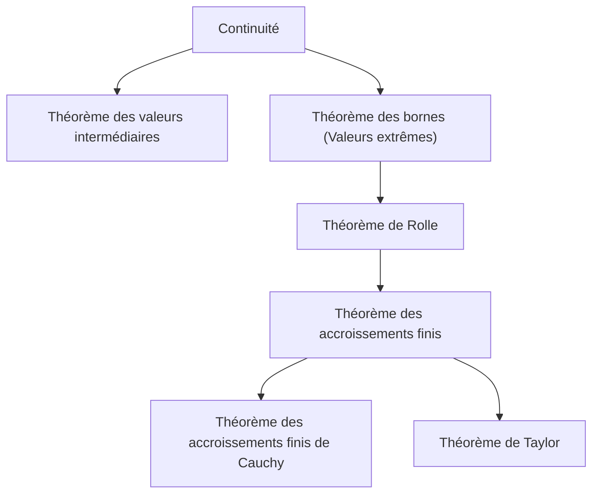

## 1. Introduction : Intuition et Logique qui Sous-tendent le Calcul

Le calcul infinitésimal (Calculus) est un cadre puissant pour capturer mathématiquement le changement. Au cœur de sa théorie se trouvent des concepts tels que la « continuité » et la « dérivabilité ». Ces concepts sont des formulations mathématiques rigoureuses des images intuitives que nous rencontrons quotidiennement, telles que la « connexion » et la « fluidité ».

Dans cet article, nous nous concentrerons sur deux des théorèmes les plus importants et fondamentaux du calcul infinitésimal : le **théorème des valeurs intermédiaires** (TVI) et le **théorème des accroissements finis** (TAF). Ces théorèmes servent d'outils puissants pour prouver l'existence de solutions à des équations et analyser le comportement des fonctions (comme leur monotonie).

Le diagramme ci-dessous montre les dépendances logiques de divers théorèmes dérivés de la continuité et de la dérivabilité.

Plongeons-nous dans la compréhension de la façon dont ces théorèmes sont interconnectés, en utilisant des formules spécifiques et des explications intuitives.

## 2. Théorème des Valeurs Intermédiaires

### Énoncé du Théorème

Le théorème des valeurs intermédiaires est l'une des propriétés les plus fondamentales et intuitives des fonctions continues.

> **Théorème (Théorème des valeurs intermédiaires)**
> Soit une fonction $f(x)$ continue sur un intervalle fermé $[a, b]$. Si $f(a) \neq f(b)$, alors pour tout réel $k$ compris entre $f(a)$ et $f(b)$, il existe au moins un réel $c$ dans l'intervalle ouvert $(a, b)$ tel que :
> $$f(c) = k$$

### Signification Intuitive et Interprétation Géométrique

Ce que ce théorème énonce est extrêmement simple : « Lorsque vous tracez une ligne du point $(a, f(a))$ au point $(b, f(b))$ sans lever le stylo du papier, vous devez traverser la ligne horizontale de hauteur $k$ au moins une fois ». Parce que la fonction est **continue**, elle ne peut pas sauter par-dessus les valeurs intermédiaires.

### Application : Prouver l'Existence de Solutions aux Équations

L'application la plus courante du théorème des valeurs intermédiaires consiste à démontrer l'existence de racines réelles pour une équation.

**Exemple :**
Montrez que l'équation $x^3 - x - 1 = 0$ admet au moins une racine réelle dans l'intervalle $(1, 2)$.

**Solution :**
Considérons la fonction $f(x) = x^3 - x - 1$. Puisque les fonctions polynomiales sont continues pour tous les nombres réels, $f(x)$ est également continue sur l'intervalle fermé $[1, 2]$.
En calculant les valeurs aux deux extrémités de l'intervalle :
- $f(1) = 1^3 - 1 - 1 = -1 < 0$
- $f(2) = 2^3 - 2 - 1 = 5 > 0$

Puisque $f(1) < 0 < f(2)$, d'après le théorème des valeurs intermédiaires, il existe $c \in (1, 2)$ tel que $f(c) = 0$. Par conséquent, l'équation admet une racine dans l'intervalle $(1, 2)$.

## 3. Théorème de Rolle

Comme étape cruciale vers la preuve du théorème des accroissements finis, nous introduisons d'abord le **théorème de Rolle**.

> **Théorème (Théorème de Rolle)**
> Soit une fonction $f(x)$ vérifiant les trois conditions suivantes :
> 1. Elle est continue sur l'intervalle fermé $[a, b]$.
> 2. Elle est dérivable sur l'intervalle ouvert $(a, b)$.
> 3. $f(a) = f(b)$.
> 
> Alors, il existe au moins un $c$ dans l'intervalle ouvert $(a, b)$ tel que $f'(c) = 0$.

Géométriquement, cela signifie que pour toute courbe lisse dont les hauteurs de départ et d'arrivée sont identiques, il doit y avoir au moins un point où la tangente est horizontale (la pente est 0).

## 4. Théorème des Accroissements Finis

Le théorème des accroissements finis (ou théorème de la moyenne) peut être considéré comme le pilier central soutenant l'ensemble du calcul infinitésimal.

### Énoncé du Théorème

> **Théorème (Théorème des accroissements finis)**
> Soit une fonction $f(x)$ continue sur l'intervalle fermé $[a, b]$ et dérivable sur l'intervalle ouvert $(a, b)$. Alors, il existe au moins un $c$ dans l'intervalle ouvert $(a, b)$ tel que :
> $$f'(c) = \frac{f(b) - f(a)}{b - a}$$

### Signification Intuitive et Interprétation Géométrique

Le côté droit $\frac{f(b) - f(a)}{b - a}$ représente la pente de la sécante (secant line) reliant les points $(a, f(a))$ et $(b, f(b))$, ce qui correspond au **taux de variation moyen** de la fonction sur l'ensemble de l'intervalle.
Le côté gauche $f'(c)$ représente la pente de la tangente au point $c$, ce qui correspond au **taux de variation instantané**.

En d'autres termes, le théorème des accroissements finis affirme qu'« il doit exister un instant sur le trajet où la vitesse instantanée est exactement égale à la vitesse moyenne sur tout l'intervalle ». Si vous conduisez du point A au point B à une vitesse moyenne de $60 \text{ km/h}$, votre compteur de vitesse a dû indiquer exactement $60 \text{ km/h}$ à un moment donné du trajet.

### Preuve du Théorème des Accroissements Finis

Le théorème des accroissements finis est prouvé en utilisant habilement le théorème de Rolle.

Considérons l'équation de la sécante $g(x)$ :
$$g(x) = f(a) + \frac{f(b) - f(a)}{b - a}(x - a)$$

Définissons une nouvelle fonction $h(x)$ représentant la différence entre la fonction originale $f(x)$ et la sécante $g(x)$ :
$$h(x) = f(x) - g(x) = f(x) - \left( f(a) + \frac{f(b) - f(a)}{b - a}(x - a) \right)$$

Vérifions les propriétés de la fonction $h(x)$ :
1. Puisque $f(x)$ et les fonctions affines en $x$ sont continues sur $[a, b]$, $h(x)$ est également continue sur $[a, b]$.
2. Elle est dérivable sur $(a, b)$.
3. $h(a) = f(a) - f(a) = 0$
4. $h(b) = f(b) - \left( f(a) + f(b) - f(a) \right) = 0$

Ainsi, $h(a) = h(b) = 0$, ce qui signifie que la fonction $h(x)$ remplit toutes les conditions du théorème de Rolle.
D'après le théorème de Rolle, il existe $c \in (a, b)$ tel que $h'(c) = 0$.

En dérivant $h(x)$, nous obtenons :
$$h'(x) = f'(x) - \frac{f(b) - f(a)}{b - a}$$
Puisque $h'(c) = 0$, nous avons :
$$f'(c) - \frac{f(b) - f(a)}{b - a} = 0 \implies f'(c) = \frac{f(b) - f(a)}{b - a}$$
Ceci achève la preuve.

### Applications : Test de Fonction Constante et Preuve de Monotonie

Le théorème des accroissements finis fournit la base théorique pour déterminer le comportement d'une fonction à partir du signe de sa dérivée.

**Corollaire 1 : Si la dérivée est nulle, la fonction est constante**
> Si $f'(x) = 0$ pour tout $x$ dans un intervalle $I$, alors $f(x)$ est constante sur $I$.

**Aperçu de la preuve :**
Prenons deux points distincts quelconques $x_1, x_2$ ($x_1 < x_2$) dans l'intervalle $I$. D'après le théorème des accroissements finis, il existe $c \in (x_1, x_2)$ vérifiant :
$$f(x_2) - f(x_1) = f'(c)(x_2 - x_1)$$
D'après notre hypothèse, $f'(c) = 0$, donc $f(x_2) - f(x_1) = 0$, ce qui signifie que $f(x_1) = f(x_2)$. Puisque les valeurs sont égales pour deux points quelconques, la fonction est constante.

**Corollaire 2 : Fonctions Monotones Croissantes et Décroissantes**
> Si $f'(x) > 0$ pour tout $x$ dans un intervalle $I$, alors $f(x)$ est strictement croissante sur $I$.

Ce corollaire peut être prouvé exactement de la même manière. Lorsque $x_1 < x_2$, puisque $f'(c) > 0$ et $(x_2 - x_1) > 0$, nous avons $f(x_2) - f(x_1) > 0$, ce qui signifie que $f(x_1) < f(x_2)$, montrant rigoureusement que la fonction est strictement croissante.

Ainsi, les principes des tableaux de signes que nous utilisons naturellement en mathématiques au lycée (« si la dérivée est positive, elle croît ; si elle est négative, elle décroît ») sont tous garantis par ce **théorème des accroissements finis**.

## 5. Théorème des Accroissements Finis de [Cauchy](https://kenji.blog/fr/p/cauchy/)

Le théorème des accroissements finis de [Cauchy](https://kenji.blog/fr/p/cauchy/) est une extension du théorème des accroissements finis à deux fonctions.

> **Théorème (Théorème des accroissements finis de [Cauchy](https://kenji.blog/fr/p/cauchy/))**
> Soient deux fonctions $f(x)$ et $g(x)$ continues sur l'intervalle fermé $[a, b]$ et dérivables sur l'intervalle ouvert $(a, b)$, avec $g'(x) \neq 0$ pour tout $x \in (a, b)$. Alors, il existe $c \in (a, b)$ tel que :
> $$\frac{f(b) - f(a)}{g(b) - g(a)} = \frac{f'(c)}{g'(c)}$$

Ce théorème peut être interprété comme le théorème des accroissements finis pour une courbe paramétrée $(g(t), f(t))$. C'est également un théorème essentiel utilisé pour la preuve rigoureuse de la **règle de L'Hôpital**, qui est extrêmement utile dans les calculs de limites.

## 6. Conclusion

Dans cet article, nous avons expliqué le théorème des valeurs intermédiaires et le théorème des accroissements finis, qui constituent les fondations du calcul infinitésimal.

- Le **théorème des valeurs intermédiaires** garantit la nature « connectée » des fonctions continues et indique l'existence de solutions aux équations.
- Le **théorème des accroissements finis** relie la variation moyenne d'une fonction à sa variation instantanée, servant d'outil indispensable pour saisir le comportement global d'une fonction (comme ses tendances de croissance ou de décroissance) en utilisant les propriétés des dérivées.

À première vue, ces théorèmes peuvent sembler énoncer des évidences. Cependant, le fait de soutenir l'intuition par une logique rigoureuse est précisément la force motrice du développement puissant des mathématiques modernes. En ne se contentant pas de mémoriser les énoncés des théorèmes, mais en appréciant leurs significations géométriques et les idées derrière leurs preuves, vous serez en mesure d'apprécier encore plus la profondeur des mathématiques.
