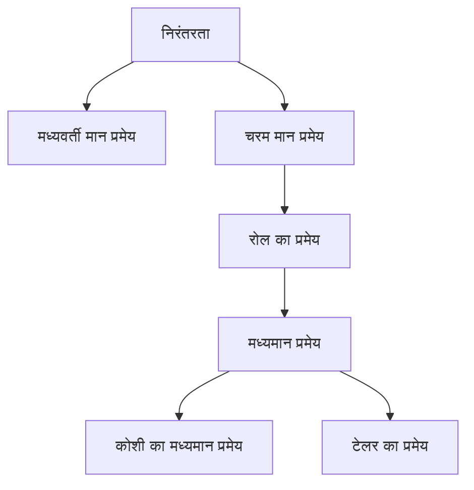

## 1. परिचय: कैलकुलस को रेखांकित करने वाला अंतर्ज्ञान और तर्क

कैलकुलस (Calculus) परिवर्तन को गणितीय रूप से पकड़ने के लिए एक शक्तिशाली ढांचा है। इसके सिद्धांत के मूल में "निरंतरता" (Continuity) और "अवकलनीयता" (Differentiability) जैसी अवधारणाएं हैं। ये अवधारणाएं उन सहज छवियों के कठोर गणितीय सूत्रीकरण हैं जिनका हम दैनिक रूप से सामना करते हैं, जैसे "जुड़ाव" और "चिकनापन"।

इस लेख में, हम कैलकुलस के दो सबसे महत्वपूर्ण और मौलिक प्रमेयों पर ध्यान केंद्रित करते हैं: **मध्यवर्ती मान प्रमेय** (Intermediate Value Theorem) और **मध्यमान प्रमेय** (Mean Value Theorem)। ये प्रमेय समीकरणों के हलों के अस्तित्व को साबित करने और फलनों के व्यवहार (जैसे उनकी एकदिष्टता या monotonicity) का विश्लेषण करने के लिए शक्तिशाली उपकरणों के रूप में कार्य करते हैं।

नीचे दिया गया आरेख निरंतरता और अवकलनीयता से प्राप्त विभिन्न प्रमेयों की तार्किक निर्भरता को दर्शाता है।

आइए विशिष्ट सूत्रों और सहज व्याख्याओं का उपयोग करके गहराई से समझें कि ये प्रमेय एक-दूसरे से कैसे जुड़े हुए हैं।

## 2. मध्यवर्ती मान प्रमेय

### प्रमेय का कथन

मध्यवर्ती मान प्रमेय निरंतर फलनों के सबसे बुनियादी और सहज गुणों में से एक है।

> **प्रमेय (मध्यवर्ती मान प्रमेय)**
> मान लीजिए कि एक फलन $f(x)$ बंद अंतराल $[a, b]$ पर निरंतर (continuous) है। यदि $f(a) \neq f(b)$ है, तो $f(a)$ और $f(b)$ के बीच किसी भी संख्या $k$ के लिए, खुले अंतराल $(a, b)$ में कम से कम एक $c$ ऐसा मौजूद होता है कि:
> $$f(c) = k$$

### सहज अर्थ और ज्यामितीय व्याख्या

यह प्रमेय जो कहता है वह अत्यंत सरल है: "जब आप बिंदु $(a, f(a))$ से बिंदु $(b, f(b))$ तक कागज से अपनी कलम उठाए बिना एक रेखा खींचते हैं, तो आपको ऊंचाई $k$ पर क्षैतिज रेखा को कम से कम एक बार अवश्य पार करना होगा"। चूँकि फलन **निरंतर** है, इसलिए यह मध्यवर्ती मानों को लांघ नहीं सकता।

### अनुप्रयोग: समीकरणों के हलों के अस्तित्व को सिद्ध करना

मध्यवर्ती मान प्रमेय का सबसे आम अनुप्रयोग किसी समीकरण के लिए वास्तविक मूलों (real roots) के अस्तित्व को प्रदर्शित करना है।

**उदाहरण:**
दिखाएं कि समीकरण $x^3 - x - 1 = 0$ का अंतराल $(1, 2)$ में कम से कम एक वास्तविक मूल है।

**हल:**
फलन $f(x) = x^3 - x - 1$ पर विचार करें। चूँकि बहुपद फलन (polynomial functions) सभी वास्तविक संख्याओं के लिए निरंतर होते हैं, $f(x)$ भी बंद अंतराल $[1, 2]$ पर निरंतर है।
अंतराल के दोनों सिरों पर मानों की गणना करने पर:
- $f(1) = 1^3 - 1 - 1 = -1 < 0$
- $f(2) = 2^3 - 2 - 1 = 5 > 0$

चूँकि $f(1) < 0 < f(2)$ है, मध्यवर्ती मान प्रमेय द्वारा, $(1, 2)$ में ऐसा $c$ मौजूद है कि $f(c) = 0$ हो। इसलिए, समीकरण का $(1, 2)$ सीमा में एक मूल है।

## 3. रोल का प्रमेय

मध्यमान प्रमेय को सिद्ध करने की दिशा में एक महत्वपूर्ण कदम के रूप में, हम पहले **रोल का प्रमेय** (Rolle's Theorem) प्रस्तुत करते हैं।

> **प्रमेय (रोल का प्रमेय)**
> मान लीजिए कि एक फलन $f(x)$ निम्नलिखित तीन शर्तों को पूरा करता है:
> 1. यह बंद अंतराल $[a, b]$ पर निरंतर है।
> 2. यह खुले अंतराल $(a, b)$ पर अवकलनीय (differentiable) है।
> 3. $f(a) = f(b)$ है।
> 
> तो, खुले अंतराल $(a, b)$ में कम से कम एक $c$ ऐसा मौजूद होता है कि $f'(c) = 0$ हो।

ज्यामितीय रूप से, इसका अर्थ यह है कि किसी भी चिकने वक्र (smooth curve) के लिए जहाँ प्रारंभिक और अंतिम ऊँचाइयाँ समान हों, वहाँ कम से कम एक बिंदु ऐसा होना चाहिए जहाँ स्पर्शरेखा क्षैतिज हो (ढलान 0 हो)।

## 4. मध्यमान प्रमेय

मध्यमान प्रमेय (लाग्रेंज का मध्यमान प्रमेय) को संपूर्ण कैलकुलस का समर्थन करने वाला केंद्रीय स्तंभ माना जा सकता है।

### प्रमेय का कथन

> **प्रमेय (मध्यमान प्रमेय)**
> मान लीजिए कि एक फलन $f(x)$ बंद अंतराल $[a, b]$ पर निरंतर है और खुले अंतराल $(a, b)$ पर अवकलनीय है। तो, खुले अंतराल $(a, b)$ में कम से कम एक $c$ ऐसा मौजूद होता है कि:
> $$f'(c) = \frac{f(b) - f(a)}{b - a}$$

### सहज अर्थ और ज्यामितीय व्याख्या

दाईं ओर का $\frac{f(b) - f(a)}{b - a}$ बिंदु $(a, f(a))$ और $(b, f(b))$ को जोड़ने वाली छेदक रेखा (secant line) के ढलान को दर्शाता है, जो संपूर्ण अंतराल पर फलन के **परिवर्तन की औसत दर** है।
बाईं ओर का $f'(c)$ बिंदु $c$ पर स्पर्शरेखा (tangent line) के ढलान को दर्शाता है, जो **परिवर्तन की तात्कालिक दर** है।

दूसरे शब्दों में, मध्यमान प्रमेय यह दावा करता है कि "रास्ते में एक ऐसा क्षण अवश्य होना चाहिए जहाँ तात्कालिक गति पूरे अंतराल की औसत गति के बिल्कुल बराबर हो"। यदि आप बिंदु A से बिंदु B तक $60 \text{ km/h}$ की औसत गति से गाड़ी चलाते हैं, तो आपकी यात्रा के दौरान किसी समय आपके स्पीडोमीटर ने बिल्कुल $60 \text{ km/h}$ की ओर इशारा किया होगा।

### मध्यमान प्रमेय का प्रमाण

मध्यमान प्रमेय को रोल के प्रमेय का चतुराई से उपयोग करके सिद्ध किया जाता है।

छेदक रेखा $g(x)$ के समीकरण पर विचार करें:
$$g(x) = f(a) + \frac{f(b) - f(a)}{b - a}(x - a)$$

मूल फलन $f(x)$ और छेदक रेखा $g(x)$ के बीच के अंतर को दर्शाने वाले एक नए फलन $h(x)$ को परिभाषित करें:
$$h(x) = f(x) - g(x) = f(x) - \left( f(a) + \frac{f(b) - f(a)}{b - a}(x - a) \right)$$

आइए फलन $h(x)$ के गुणों की जांच करें:
1. चूँकि $f(x)$ और $x$ में रैखिक समीकरण दोनों $[a, b]$ पर निरंतर हैं, $h(x)$ भी $[a, b]$ पर निरंतर है।
2. यह $(a, b)$ पर अवकलनीय है।
3. $h(a) = f(a) - f(a) = 0$
4. $h(b) = f(b) - \left( f(a) + f(b) - f(a) \right) = 0$

इस प्रकार, $h(a) = h(b) = 0$ है, जिसका अर्थ है कि फलन $h(x)$ रोल के प्रमेय की सभी शर्तों को पूरा करता है।
रोल के प्रमेय के अनुसार, $(a, b)$ में ऐसा $c$ मौजूद है कि $h'(c) = 0$ हो।

$h(x)$ का अवकलन (differentiating) करने पर, हमें प्राप्त होता है:
$$h'(x) = f'(x) - \frac{f(b) - f(a)}{b - a}$$
चूँकि $h'(c) = 0$ है, हमारे पास है:
$$f'(c) - \frac{f(b) - f(a)}{b - a} = 0 \implies f'(c) = \frac{f(b) - f(a)}{b - a}$$
इससे प्रमाण पूरा होता है।

### अनुप्रयोग: अचर फलन परीक्षण और एकदिष्टता को सिद्ध करना

मध्यमान प्रमेय किसी फलन के अवकलज के चिह्न से उसके व्यवहार को निर्धारित करने के लिए सैद्धांतिक आधार प्रदान करता है।

**उपप्रमेय 1: यदि अवकलज शून्य है, तो फलन अचर (constant) है**
> यदि किसी अंतराल $I$ में सभी $x$ के लिए $f'(x) = 0$ है, तो $I$ पर $f(x)$ अचर है।

**प्रमाण की रूपरेखा:**
अंतराल $I$ के भीतर कोई भी दो अलग-अलग बिंदु $x_1, x_2$ ($x_1 < x_2$) चुनें। मध्यमान प्रमेय के अनुसार, ऐसा $c \in (x_1, x_2)$ मौजूद है जो निम्नलिखित को संतुष्ट करता है:
$$f(x_2) - f(x_1) = f'(c)(x_2 - x_1)$$
हमारी धारणा के अनुसार, $f'(c) = 0$ है, इसलिए $f(x_2) - f(x_1) = 0$ है, जिसका अर्थ है $f(x_1) = f(x_2)$। चूँकि किन्हीं भी दो बिंदुओं पर मान समान हैं, इसलिए फलन अचर है।

**उपप्रमेय 2: एकदिष्ट वर्धमान और ह्रासमान फलन (Monotonically Increasing and Decreasing Functions)**
> यदि किसी अंतराल $I$ में सभी $x$ के लिए $f'(x) > 0$ है, तो $I$ पर $f(x)$ निरंतर वर्धमान (strictly increasing) है।

इस उपप्रमेय को भी बिल्कुल इसी तरह से सिद्ध किया जा सकता है। जब $x_1 < x_2$ हो, चूँकि $f'(c) > 0$ और $(x_2 - x_1) > 0$ है, इसलिए हमारे पास $f(x_2) - f(x_1) > 0$ है, जिसका अर्थ है $f(x_1) < f(x_2)$, जो कठोरता से दर्शाता है कि फलन निरंतर वर्धमान है।

इस तरह, चिह्न तालिकाओं (sign charts) के सिद्धांत जिनका उपयोग हम स्वाभाविक रूप से हाई स्कूल के गणित में करते हैं ("यदि अवकलज धनात्मक है तो यह बढ़ता है, यदि ऋणात्मक है तो यह घटता है") सभी इस **मध्यमान प्रमेय** द्वारा गारंटीकृत हैं।

## 5. कोशी का मध्यमान प्रमेय

कोशी का मध्यमान प्रमेय दो फलनों के लिए मध्यमान प्रमेय का एक विस्तार है।

> **प्रमेय (कोशी का मध्यमान प्रमेय)**
> मान लीजिए कि दो फलन $f(x)$ और $g(x)$ बंद अंतराल $[a, b]$ पर निरंतर हैं और खुले अंतराल $(a, b)$ पर अवकलनीय हैं, और सभी $x \in (a, b)$ के लिए $g'(x) \neq 0$ है। तो, $(a, b)$ में ऐसा $c$ मौजूद होता है कि:
> $$\frac{f(b) - f(a)}{g(b) - g(a)} = \frac{f'(c)}{g'(c)}$$

इस प्रमेय की व्याख्या प्राचलिक रूप से परिभाषित वक्र (parametrically defined curve) $(g(t), f(t))$ के लिए मध्यमान प्रमेय के रूप में की जा सकती है। यह एक आवश्यक प्रमेय भी है जिसका उपयोग **एल'हॉपिटल नियम** (L'Hôpital's Rule) के कठोर प्रमाण के लिए किया जाता है, जो सीमा गणना (limit calculations) में अत्यंत उपयोगी है।

## 6. निष्कर्ष

इस लेख में, हमने [मध्यवर्ती मान प्रमेय और मध्यमान प्रमेय](https://kenji.blog/p/intermediate-and-mean-value-theorem/) की व्याख्या की, जो कैलकुलस की नींव बनाते हैं।

- **मध्यवर्ती मान प्रमेय** निरंतर फलनों की "जुड़ी हुई" प्रकृति की गारंटी देता है और समीकरणों के हलों के अस्तित्व को इंगित करता है।
- **मध्यमान प्रमेय** किसी फलन के औसत परिवर्तन को उसके तात्कालिक परिवर्तन से जोड़ता है, जो अवकलज के गुणों का उपयोग करके फलन के समग्र व्यवहार (जैसे इसके बढ़ने या घटने की प्रवृत्तियों) को समझने के लिए एक अनिवार्य उपकरण के रूप में कार्य करता है।

पहली नज़र में, ये प्रमेय स्पष्ट बात कहते हुए प्रतीत हो सकते हैं। हालाँकि, कठोर तर्क के साथ अंतर्ज्ञान का समर्थन करना ही आधुनिक गणित के शक्तिशाली विकास के पीछे प्रेरक शक्ति है। प्रमेयों के कथनों को केवल याद न करके, बल्कि उनके ज्यामितीय अर्थों और उनके प्रमाणों के पीछे के विचारों की सराहना करके, आप गणित की गहरी समृद्धि का और भी अधिक आनंद ले पाएंगे।
