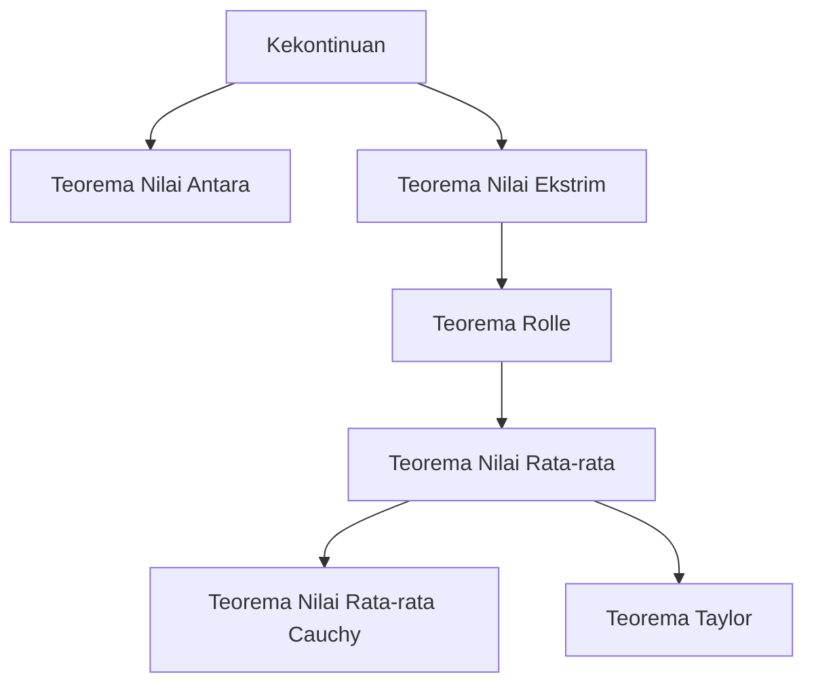

## 1. Pendahuluan: Intuisi dan Logika yang Mendasari Kalkulus

Kalkulus (Calculus) adalah kerangka kerja yang kuat untuk menangkap perubahan secara matematis. Pada inti teorinya terdapat konsep-konsep seperti "kekontinuan" dan "keterdiferensialan". Konsep-konsep ini adalah formulasi matematis yang ketat dari gambaran intuitif yang kita temui sehari-hari, seperti "keterhubungan" dan "kemulusan".

Dalam artikel ini, kita berfokus pada dua teorema yang paling penting dan mendasar dalam kalkulus: **Teorema Nilai Antara** (Intermediate Value Theorem) dan **Teorema Nilai Rata-rata** (Mean Value Theorem). Teorema-teorema ini berfungsi sebagai alat yang kuat untuk membuktikan keberadaan solusi persamaan dan menganalisis perilaku fungsi (seperti kemonotonannya).

Diagram di bawah ini menunjukkan ketergantungan logis dari berbagai teorema yang diturunkan dari kekontinuan dan keterdiferensialan.

Mari kita selami lebih dalam untuk memahami bagaimana teorema-teorema ini saling berhubungan, menggunakan rumus spesifik dan penjelasan intuitif.

## 2. Teorema Nilai Antara

### Pernyataan Teorema

Teorema Nilai Antara adalah salah satu sifat paling dasar dan intuitif dari fungsi kontinu.

> **Teorema (Teorema Nilai Antara)**
> Misalkan fungsi $f(x)$ kontinu pada interval tertutup $[a, b]$. Jika $f(a) \neq f(b)$, maka untuk sembarang bilangan $k$ di antara $f(a)$ dan $f(b)$, terdapat setidaknya satu $c$ dalam interval terbuka $(a, b)$ sedemikian rupa sehingga:
> $$f(c) = k$$

### Makna Intuitif dan Interpretasi Geometris

Apa yang dinyatakan oleh teorema ini sangat sederhana: "Ketika Anda menarik garis dari titik $(a, f(a))$ ke titik $(b, f(b))$ tanpa mengangkat pena dari kertas, Anda harus melewati garis horizontal pada ketinggian $k$ setidaknya satu kali". Karena fungsinya **kontinu**, fungsi tersebut tidak dapat melompati nilai-nilai perantara.

### Aplikasi: Membuktikan Keberadaan Solusi Persamaan

Aplikasi paling umum dari Teorema Nilai Antara adalah untuk menunjukkan keberadaan akar real untuk sebuah persamaan.

**Contoh:**
Tunjukkan bahwa persamaan $x^3 - x - 1 = 0$ memiliki setidaknya satu akar real dalam interval $(1, 2)$.

**Penyelesaian:**
Pertimbangkan fungsi $f(x) = x^3 - x - 1$. Karena fungsi polinomial kontinu untuk semua bilangan real, $f(x)$ juga kontinu pada interval tertutup $[1, 2]$.
Menghitung nilai di kedua ujung interval:
- $f(1) = 1^3 - 1 - 1 = -1 < 0$
- $f(2) = 2^3 - 2 - 1 = 5 > 0$

Karena $f(1) < 0 < f(2)$, berdasarkan Teorema Nilai Antara, terdapat $c \in (1, 2)$ sedemikian rupa sehingga $f(c) = 0$. Oleh karena itu, persamaan tersebut memiliki akar dalam rentang $(1, 2)$.

## 3. Teorema Rolle

Sebagai langkah penting menuju pembuktian Teorema Nilai Rata-rata, pertama-tama kita perkenalkan **Teorema Rolle**.

> **Teorema (Teorema Rolle)**
> Misalkan fungsi $f(x)$ memenuhi ketiga kondisi berikut:
> 1. Kontinu pada interval tertutup $[a, b]$.
> 2. Terdiferensialkan pada interval terbuka $(a, b)$.
> 3. $f(a) = f(b)$.
> 
> Maka, terdapat setidaknya satu $c$ dalam interval terbuka $(a, b)$ sedemikian rupa sehingga $f'(c) = 0$.

Secara geometris, ini berarti bahwa untuk setiap kurva mulus di mana ketinggian awal dan akhirnya sama, pasti ada setidaknya satu titik di mana garis singgungnya horizontal (kemiringannya 0).

## 4. Teorema Nilai Rata-rata

Teorema Nilai Rata-rata (Teorema Nilai Rata-rata Lagrange) dapat dianggap sebagai pilar utama yang menopang keseluruhan kalkulus.

### Pernyataan Teorema

> **Teorema (Teorema Nilai Rata-rata)**
> Misalkan fungsi $f(x)$ kontinu pada interval tertutup $[a, b]$ dan terdiferensialkan pada interval terbuka $(a, b)$. Maka, terdapat setidaknya satu $c$ dalam interval terbuka $(a, b)$ sedemikian rupa sehingga:
> $$f'(c) = \frac{f(b) - f(a)}{b - a}$$

### Makna Intuitif dan Interpretasi Geometris

Ruas kanan $\frac{f(b) - f(a)}{b - a}$ mewakili kemiringan garis potong (secant line) yang menghubungkan titik $(a, f(a))$ dan $(b, f(b))$, yang merupakan **laju perubahan rata-rata** dari fungsi tersebut di seluruh interval.
Ruas kiri $f'(c)$ mewakili kemiringan garis singgung pada titik $c$, yang merupakan **laju perubahan sesaat**.

Dengan kata lain, Teorema Nilai Rata-rata menegaskan bahwa "pasti ada suatu saat di sepanjang jalan di mana kecepatan sesaat persis sama dengan kecepatan rata-rata di seluruh interval". Jika Anda mengemudi dari titik A ke titik B dengan kecepatan rata-rata $60 \text{ km/jam}$, spidometer Anda pasti menunjuk tepat ke angka $60 \text{ km/jam}$ pada suatu saat selama perjalanan.

### Pembuktian Teorema Nilai Rata-rata

Teorema Nilai Rata-rata dibuktikan dengan memanfaatkan Teorema Rolle secara cerdik.

Pertimbangkan persamaan garis potong $g(x)$:
$$g(x) = f(a) + \frac{f(b) - f(a)}{b - a}(x - a)$$

Definisikan fungsi baru $h(x)$ yang mewakili selisih antara fungsi asli $f(x)$ dan garis potong $g(x)$:
$$h(x) = f(x) - g(x) = f(x) - \left( f(a) + \frac{f(b) - f(a)}{b - a}(x - a) \right)$$

Mari kita periksa sifat-sifat fungsi $h(x)$:
1. Karena baik $f(x)$ maupun persamaan linear dalam $x$ bersifat kontinu pada $[a, b]$, maka $h(x)$ juga kontinu pada $[a, b]$.
2. Terdiferensialkan pada $(a, b)$.
3. $h(a) = f(a) - f(a) = 0$
4. $h(b) = f(b) - \left( f(a) + f(b) - f(a) \right) = 0$

Dengan demikian, $h(a) = h(b) = 0$, yang berarti fungsi $h(x)$ memenuhi semua kondisi Teorema Rolle.
Berdasarkan Teorema Rolle, terdapat $c \in (a, b)$ sedemikian rupa sehingga $h'(c) = 0$.

Dengan mendiferensialkan $h(x)$, kita peroleh:
$$h'(x) = f'(x) - \frac{f(b) - f(a)}{b - a}$$
Karena $h'(c) = 0$, kita peroleh:
$$f'(c) - \frac{f(b) - f(a)}{b - a} = 0 \implies f'(c) = \frac{f(b) - f(a)}{b - a}$$
Ini melengkapi pembuktian tersebut.

### Aplikasi: Uji Fungsi Konstan dan Pembuktian Kemonotonan

Teorema Nilai Rata-rata memberikan dasar teoretis untuk menentukan perilaku suatu fungsi dari tanda turunannya.

**Akibat 1: Jika turunannya nol, fungsinya konstan**
> Jika $f'(x) = 0$ untuk semua $x$ dalam interval $I$, maka $f(x)$ konstan pada $I$.

**Garis Besar Pembuktian:**
Pilih sembarang dua titik berbeda $x_1, x_2$ ($x_1 < x_2$) di dalam interval $I$. Berdasarkan Teorema Nilai Rata-rata, terdapat $c \in (x_1, x_2)$ yang memenuhi:
$$f(x_2) - f(x_1) = f'(c)(x_2 - x_1)$$
Berdasarkan asumsi kita, $f'(c) = 0$, jadi $f(x_2) - f(x_1) = 0$, yang berarti $f(x_1) = f(x_2)$. Karena nilai-nilainya sama di sembarang dua titik, fungsinya konstan.

**Akibat 2: Fungsi Monoton Naik dan Turun**
> Jika $f'(x) > 0$ untuk semua $x$ dalam interval $I$, maka $f(x)$ naik secara ketat pada $I$.

Akibat ini dapat dibuktikan dengan cara yang persis sama. Ketika $x_1 < x_2$, karena $f'(c) > 0$ dan $(x_2 - x_1) > 0$, kita peroleh $f(x_2) - f(x_1) > 0$, yang berarti $f(x_1) < f(x_2)$, yang secara ketat menunjukkan bahwa fungsinya naik.

Dengan cara ini, prinsip-prinsip tabel tanda yang biasa kita gunakan dalam matematika sekolah menengah ("jika turunannya positif maka ia naik, jika negatif maka ia turun") semuanya dijamin oleh **Teorema Nilai Rata-rata** ini.

## 5. Teorema Nilai Rata-rata Cauchy

Teorema Nilai Rata-rata Cauchy adalah perluasan dari Teorema Nilai Rata-rata untuk dua fungsi.

> **Teorema (Teorema Nilai Rata-rata Cauchy)**
> Misalkan dua fungsi $f(x)$ dan $g(x)$ kontinu pada interval tertutup $[a, b]$ dan terdiferensialkan pada interval terbuka $(a, b)$, dan bahwa $g'(x) \neq 0$ untuk semua $x \in (a, b)$. Maka, terdapat $c \in (a, b)$ sedemikian rupa sehingga:
> $$\frac{f(b) - f(a)}{g(b) - g(a)} = \frac{f'(c)}{g'(c)}$$

Teorema ini dapat diinterpretasikan sebagai Teorema Nilai Rata-rata untuk kurva yang didefinisikan secara parametrik $(g(t), f(t))$. Ini juga merupakan teorema penting yang digunakan untuk pembuktian ketat dari **Aturan L'Hôpital**, yang sangat berguna dalam perhitungan limit.

## 6. Kesimpulan

Dalam artikel ini, kami menjelaskan Teorema Nilai Antara dan Teorema Nilai Rata-rata, yang membentuk dasar kalkulus.

- **Teorema Nilai Antara** menjamin sifat "terhubung" dari fungsi kontinu dan menunjukkan keberadaan solusi untuk persamaan.
- **Teorema Nilai Rata-rata** mengaitkan perubahan rata-rata suatu fungsi dengan perubahan sesaatnya, berfungsi sebagai alat yang sangat diperlukan untuk memahami perilaku keseluruhan suatu fungsi (seperti tren naik atau turunnya) menggunakan sifat-sifat turunan.

Sepintas, teorema-teorema ini mungkin tampak menyatakan hal yang sudah jelas. Namun, mendukung intuisi dengan logika yang ketat justru merupakan kekuatan pendorong di balik perkembangan pesat matematika modern. Dengan tidak sekadar menghafal pernyataan teorema, tetapi menghargai makna geometris dan ide-ide di balik pembuktiannya, Anda akan dapat lebih menikmati kekayaan matematika yang mendalam.
