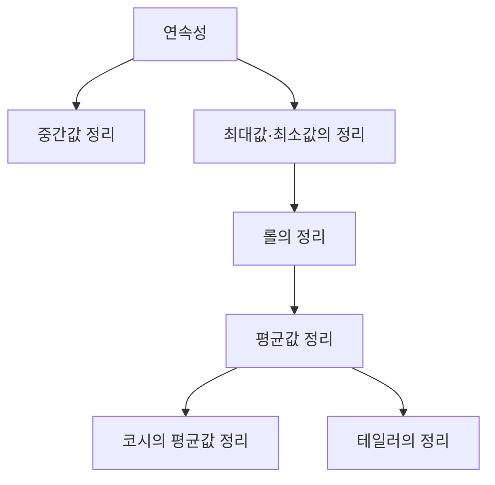
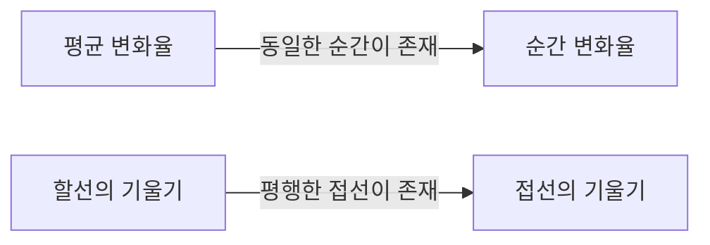

## 1. 서론: 미적분학을 지탱하는 직관과 논리

미적분학(Calculus)은 변화를 수학적으로 포착하기 위한 강력한 체계입니다. 그 이론의 근저에는 '연속성'이나 '미분 가능성'과 같은 개념이 존재합니다. 이러한 개념들은 우리가 일상적으로 갖는 '연결되어 있다', '매끄럽다'라는 직관적인 이미지를 엄밀한 수학적 언어로 정식화한 것입니다.

본 기사에서는 미적분학에서 가장 중요하고 기본적인 두 가지 정리, **중간값 정리** (Intermediate Value Theorem) 와 **평균값 정리** (Mean Value Theorem) 에 초점을 맞춥니다. 이 정리들은 방정식의 해의 존재를 증명하거나 함수의 거동(단조성 등)을 해석하기 위한 강력한 도구로 기능합니다.

아래 그림은 연속성과 미분 가능성으로부터 도출되는 각종 정리들의 논리적인 의존 관계를 보여줍니다.

이러한 정리들이 어떻게 연결되어 있는지, 구체적인 수식과 직관적인 설명을 곁들여 깊이 이해해 봅시다.

## 2. 중간값 정리 (Intermediate Value Theorem)

### 정리의 주장

중간값 정리는 연속 함수가 갖는 가장 기본적이고 직관적인 성질 중 하나입니다.

> **정리 (중간값 정리)**
> 함수 $f(x)$ 가 닫힌 구간 $[a, b]$ 에서 연속이라고 하자. $f(a) \neq f(b)$ 일 때, $f(a)$ 와 $f(b)$ 사이에 있는 임의의 수 $k$ 에 대하여,
> $$f(c) = k$$
> 를 만족하는 $c$ 가 열린 구간 $(a, b)$ 내에 적어도 하나 존재한다.

### 직관적인 의미와 기하학적 해석

이 정리가 말하고자 하는 바는 매우 단순합니다. "펜을 종이에서 떼지 않고 점 $(a, f(a))$ 에서 점 $(b, f(b))$ 까지 선을 그을 때, 그 높이가 $k$ 인 수평선을 반드시 적어도 한 번은 가로질러야 한다"는 것입니다. 함수가 **연속** 이기 때문에 중간의 값을 건너뛰고 점프할 수는 없습니다.

### 응용 사례: 방정식의 해의 존재 증명

중간값 정리의 가장 일반적인 응용은 방정식의 실수 해가 존재함을 보여주는 것입니다.

**예제:**
방정식 $x^3 - x - 1 = 0$ 이 구간 $(1, 2)$ 사이에 적어도 하나의 실수 해를 가짐을 증명하시오.

**해답:**
함수 $f(x) = x^3 - x - 1$ 을 생각합니다. 다항함수는 모든 실수에서 연속이므로, $f(x)$ 는 닫힌 구간 $[1, 2]$ 에서도 연속입니다.
구간의 양끝에서의 값을 계산하면,
- $f(1) = 1^3 - 1 - 1 = -1 < 0$
- $f(2) = 2^3 - 2 - 1 = 5 > 0$

$f(1) < 0 < f(2)$ 이므로, 중간값 정리에 의해 $f(c) = 0$ 을 만족하는 $c \in (1, 2)$ 가 존재합니다. 따라서 이 방정식은 $(1, 2)$ 의 범위에 해를 가집니다.

## 3. 롤의 정리 (Rolle's Theorem)

평균값 정리를 증명하기 위한 중요한 단계로서, 먼저 **롤의 정리** 를 도입합니다.

> **정리 (롤의 정리)**
> 함수 $f(x)$ 가 다음 3가지 조건을 만족한다고 하자.
> 1. 닫힌 구간 $[a, b]$ 에서 연속
> 2. 열린 구간 $(a, b)$ 에서 미분 가능
> 3. $f(a) = f(b)$
> 
> 이때, $f'(c) = 0$ 을 만족하는 $c$ 가 열린 구간 $(a, b)$ 내에 적어도 하나 존재한다.

기하학적으로는, 시작점과 끝점의 높이가 같은 매끄러운 곡선에는 반드시 접선이 수평(기울기가 0)이 되는 점이 적어도 하나 있다는 것을 의미합니다.

## 4. 평균값 정리 (Mean Value Theorem)

평균값 정리(라그랑주의 평균값 정리)는 미적분학 전체를 지탱하는 대들보라고도 할 수 있는 정리입니다.

### 정리의 주장

> **정리 (평균값 정리)**
> 함수 $f(x)$ 가 닫힌 구간 $[a, b]$ 에서 연속이고, 열린 구간 $(a, b)$ 에서 미분 가능하다고 하자. 이때,
> $$f'(c) = \frac{f(b) - f(a)}{b - a}$$
> 를 만족하는 $c$ 가 열린 구간 $(a, b)$ 내에 적어도 하나 존재한다.

### 직관적인 의미와 기하학적 해석

우변 $\frac{f(b) - f(a)}{b - a}$ 는 점 $(a, f(a))$ 와 점 $(b, f(b))$ 를 잇는 할선(secant line)의 기울기, 즉 구간 전체에서의 함수의 **평균 변화율** 을 나타냅니다.
좌변 $f'(c)$ 는 점 $c$ 에서의 접선의 기울기, 즉 **순간 변화율** 을 나타냅니다.

즉, 평균값 정리는 "구간 전체에서의 평균 속도와 동일한 속도(순간 속도)를 내는 순간이 도중에 반드시 존재한다"고 주장하고 있습니다. 자동차로 A지점에서 B지점까지 평균 시속 $60 \text{ km/h}$ 로 달렸다면, 가는 도중 어딘가에서 속도계가 정확히 $60 \text{ km/h}$ 를 가리킨 순간이 반드시 있다는 것입니다.

### 평균값 정리의 증명

평균값 정리는 롤의 정리를 교묘하게 이용함으로써 증명됩니다.

할선의 방정식 $g(x)$ 를 생각합니다.
$$g(x) = f(a) + \frac{f(b) - f(a)}{b - a}(x - a)$$

원래의 함수 $f(x)$ 와 할선 $g(x)$ 의 차이를 나타내는 새로운 함수 $h(x)$ 를 정의합니다.
$$h(x) = f(x) - g(x) = f(x) - \left( f(a) + \frac{f(b) - f(a)}{b - a}(x - a) \right)$$

함수 $h(x)$ 의 성질을 확인합니다:
1. $f(x)$ 와 $x$ 의 일차식은 모두 $[a, b]$ 에서 연속이므로, $h(x)$ 도 $[a, b]$ 에서 연속.
2. $(a, b)$ 에서 미분 가능.
3. $h(a) = f(a) - f(a) = 0$
4. $h(b) = f(b) - \left( f(a) + f(b) - f(a) \right) = 0$

따라서 $h(a) = h(b) = 0$ 이 되어, 함수 $h(x)$ 는 롤의 정리 조건을 모두 만족합니다.
롤의 정리에 의해 $h'(c) = 0$ 이 되는 $c \in (a, b)$ 가 존재합니다.

$h(x)$ 를 미분하면,
$$h'(x) = f'(x) - \frac{f(b) - f(a)}{b - a}$$
이므로, $h'(c) = 0$ 에서,
$$f'(c) - \frac{f(b) - f(a)}{b - a} = 0 \implies f'(c) = \frac{f(b) - f(a)}{b - a}$$
가 되어 증명이 완료됩니다.

### 응용 사례: 함수의 상수 판정 및 단조성 증명

평균값 정리는 도함수의 부호로부터 원래 함수의 거동을 결정하기 위한 이론적인 근거를 제공합니다.

**따름정리 1: 도함수가 0이면 상수함수**
> 구간 $I$ 의 모든 $x$ 에 대하여 $f'(x) = 0$ 이면, $f(x)$ 는 $I$ 위에서 상수이다.

**증명 개요:**
구간 $I$ 내의 임의의 서로 다른 두 점 $x_1, x_2$ ($x_1 < x_2$) 를 선택합니다. 평균값 정리에 의해,
$$f(x_2) - f(x_1) = f'(c)(x_2 - x_1)$$
를 만족하는 $c \in (x_1, x_2)$ 가 존재합니다. 가정에 의해 $f'(c) = 0$ 이므로, $f(x_2) - f(x_1) = 0$, 즉 $f(x_1) = f(x_2)$ 가 됩니다. 임의의 두 점에서 값이 같으므로 함수는 상수입니다.

**따름정리 2: 함수의 단조 증가와 단조 감소**
> 구간 $I$ 의 모든 $x$ 에 대하여 $f'(x) > 0$ 이면, $f(x)$ 는 $I$ 위에서 단조 증가한다.

이 따름정리 역시 완전히 동일하게 증명할 수 있습니다. $x_1 < x_2$ 라고 할 때, $f'(c) > 0$ 이고 $(x_2 - x_1) > 0$ 이므로, $f(x_2) - f(x_1) > 0$, 즉 $f(x_1) < f(x_2)$ 가 되어, 함수가 단조 증가함이 엄밀하게 증명됩니다.

이처럼 우리가 고등학교 수학에서 "미분해서 플러스면 증가, 마이너스면 감소"라고 당연하게 사용하는 증감표의 원리는 모두 이 **평균값 정리** 에 의해 보장되는 것입니다.

## 5. 코시의 평균값 정리 ([Cauchy](https://kenji.blog/ko/p/cauchy/)'s Mean Value Theorem)

평균값 정리를 두 개의 함수로 확장한 것이 코시의 평균값 정리입니다.

> **정리 (코시의 평균값 정리)**
> 두 함수 $f(x), g(x)$ 가 닫힌 구간 $[a, b]$ 에서 연속, 열린 구간 $(a, b)$ 에서 미분 가능하며, 모든 $x \in (a, b)$ 에 대하여 $g'(x) \neq 0$ 이라고 하자. 이때,
> $$\frac{f(b) - f(a)}{g(b) - g(a)} = \frac{f'(c)}{g'(c)}$$
> 를 만족하는 $c \in (a, b)$ 가 존재한다.

이 정리는 매개변수로 표현된 곡선 $(g(t), f(t))$ 에서의 평균값 정리로 해석할 수 있습니다. 또한, 극한 계산에 있어 매우 유용한 **로피탈의 정리** (L'Hôpital's Rule) 의 엄밀한 증명에 사용되는 중요한 정리입니다.

## 6. 결론

본 기사에서는 미적분학의 기반이 되는 [중간값 정리와 평균값 정리](https://kenji.blog/ko/p/intermediate-and-mean-value-theorem/)에 대해 해설했습니다.

- **중간값 정리** 는 연속함수의 "연결되어 있는" 성질을 보장하며, 방정식의 해의 존재 등을 보여줍니다.
- **평균값 정리** 는 함수의 평균적인 변화와 순간적인 변화를 결부시키며, 미분의 성질을 이용하여 함수 전체의 거동(증감 등)을 파악하기 위한 필수불가결한 도구입니다.

이러한 정리들은 언뜻 보면 당연한 것을 말하고 있는 것처럼 느껴질 수도 있습니다. 하지만 직관을 엄밀한 논리로 뒷받침하는 것이야말로 현대 수학의 강력한 발전을 지탱하는 원동력이 되고 있습니다. 정리의 주장을 암기하는 것뿐만 아니라, 그 기하학적인 의미나 증명의 아이디어를 음미함으로써 수학의 깊이를 한층 더 즐길 수 있을 것입니다.
