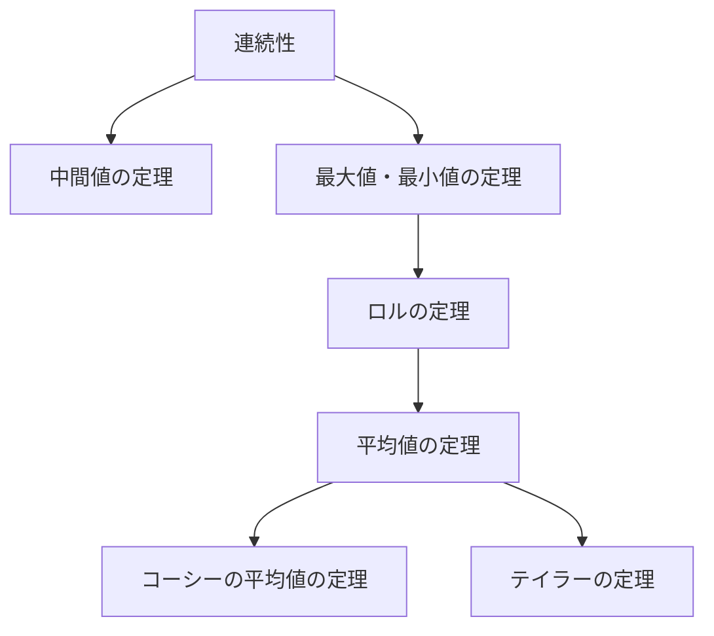
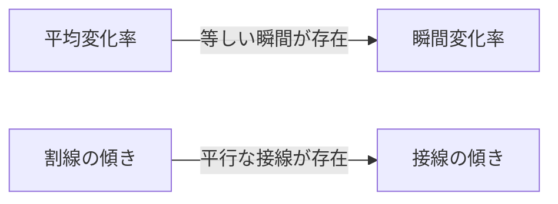

## 1. はじめに：微積分学を支える直感と論理

微積分学（Calculus）は、変化を数学的に捉えるための強力な体系です。その理論の根底には、「連続性」や「微分可能性」といった概念が存在します。これらの概念は、私たちが日常的に抱く「つながっている」「滑らかである」という直感的なイメージを、厳密な数学的言語で定式化したものです。

本記事では、微積分学における最も重要で基本的な二つの定理、 **中間値の定理** (Intermediate Value Theorem) と **平均値の定理** (Mean Value Theorem) に焦点を当てます。これらの定理は、方程式の解の存在証明や、関数の挙動（単調性など）を解析するための強力なツールとして機能します。

以下の図は、連続性と微分可能性から導かれる各種定理の論理的な依存関係を示しています。

これらの定理がどのように結びついているのか、具体的な数式と直感的な説明を交えて深く理解していきましょう。

## 2. 中間値の定理 (Intermediate Value Theorem)

### 定理の主張

中間値の定理は、連続関数が持つ最も基本的で直感的な性質の一つです。

> **定理（中間値の定理）**
> 関数 $f(x)$ が閉区間 $[a, b]$ で連続であるとする。$f(a) \neq f(b)$ であるとき、$f(a)$ と $f(b)$ の間にある任意の数 $k$ に対して、
> $$f(c) = k$$
> を満たす $c$ が開区間 $(a, b)$ 内に少なくとも1つ存在する。

### 直感的な意味と幾何学的解釈

この定理が言わんとしていることは非常にシンプルです。「ペンを紙から離さずに点 $(a, f(a))$ から点 $(b, f(b))$ まで線を引くとき、その高さ $k$ の水平線を必ず少なくとも一度は横切らなければならない」ということです。関数が **連続** であるからこそ、途中の値を飛ばしてジャンプすることはできません。

### 応用例：方程式の解の存在証明

中間値の定理の最も一般的な応用は、方程式の実数解の存在を示すことです。

**例題：**
方程式 $x^3 - x - 1 = 0$ が区間 $(1, 2)$ の間に少なくとも1つの実数解を持つことを示せ。

**解答：**
関数 $f(x) = x^3 - x - 1$ を考えます。多項式関数は全ての実数で連続であるため、$f(x)$ は閉区間 $[1, 2]$ でも連続です。
区間の両端での値を計算すると、
- $f(1) = 1^3 - 1 - 1 = -1 < 0$
- $f(2) = 2^3 - 2 - 1 = 5 > 0$

$f(1) < 0 < f(2)$ であるため、中間値の定理により、$f(c) = 0$ を満たす $c \in (1, 2)$ が存在します。したがって、方程式は $(1, 2)$ の範囲に解を持ちます。

## 3. ロルの定理 (Rolle's Theorem)

平均値の定理を証明するための重要なステップとして、まずは **ロルの定理** を導入します。

> **定理（ロルの定理）**
> 関数 $f(x)$ が以下の3つの条件を満たすとする。
> 1. 閉区間 $[a, b]$ で連続
> 2. 開区間 $(a, b)$ で微分可能
> 3. $f(a) = f(b)$
> 
> このとき、$f'(c) = 0$ を満たす $c$ が開区間 $(a, b)$ 内に少なくとも1つ存在する。

幾何学的には、始点と終点の高さが同じ滑らかな曲線には、必ず接線が水平（傾きが0）になる点が少なくとも1つある、ということを意味しています。

## 4. 平均値の定理 (Mean Value Theorem)

平均値の定理（ラグランジュの平均値の定理）は、微積分学全体を支える大黒柱とも言える定理です。

### 定理の主張

> **定理（平均値の定理）**
> 関数 $f(x)$ が閉区間 $[a, b]$ で連続であり、開区間 $(a, b)$ で微分可能であるとする。このとき、
> $$f'(c) = \frac{f(b) - f(a)}{b - a}$$
> を満たす $c$ が開区間 $(a, b)$ 内に少なくとも1つ存在する。

### 直感的な意味と幾何学的解釈

右辺 $\frac{f(b) - f(a)}{b - a}$ は、点 $(a, f(a))$ と点 $(b, f(b))$ を結ぶ割線（secant line）の傾き、すなわち区間全体における関数の **平均変化率** を表しています。
左辺 $f'(c)$ は、点 $c$ における接線の傾き、すなわち **瞬間変化率** を表しています。

つまり、平均値の定理は、「区間全体での平均の速度と同じ速度（瞬間速度）を出す瞬間が、途中に必ず存在する」と主張しています。車でA地点からB地点まで平均時速 $60 \text{ km/h}$ で走ったなら、道中のどこかでスピードメーターがちょうど $60 \text{ km/h}$ を指した瞬間が必ずある、ということです。

### 平均値の定理の証明

平均値の定理は、ロルの定理を巧みに利用することで証明されます。

割線の方程式 $g(x)$ を考えます。
$$g(x) = f(a) + \frac{f(b) - f(a)}{b - a}(x - a)$$

元の関数 $f(x)$ と割線 $g(x)$ の差を表す新しい関数 $h(x)$ を定義します。
$$h(x) = f(x) - g(x) = f(x) - \left( f(a) + \frac{f(b) - f(a)}{b - a}(x - a) \right)$$

関数 $h(x)$ の性質を確認します：
1. $f(x)$ と $x$ の一次式は共に $[a, b]$ で連続なので、$h(x)$ も $[a, b]$ で連続。
2. $(a, b)$ で微分可能。
3. $h(a) = f(a) - f(a) = 0$
4. $h(b) = f(b) - \left( f(a) + f(b) - f(a) \right) = 0$

したがって、$h(a) = h(b) = 0$ となり、関数 $h(x)$ はロルの定理の条件をすべて満たします。
ロルの定理より、$h'(c) = 0$ となる $c \in (a, b)$ が存在します。

$h(x)$ を微分すると、
$$h'(x) = f'(x) - \frac{f(b) - f(a)}{b - a}$$
なので、$h'(c) = 0$ より、
$$f'(c) - \frac{f(b) - f(a)}{b - a} = 0 \implies f'(c) = \frac{f(b) - f(a)}{b - a}$$
となり、証明が完了します。

### 応用例：関数の定数判定と単調性の証明

平均値の定理は、導関数の符号から元の関数の挙動を決定するための理論的な根拠を与えます。

**系1：導関数がゼロなら定数関数**
> 区間 $I$ のすべての $x$ に対して $f'(x) = 0$ ならば、$f(x)$ は $I$ 上で定数である。

**証明の概略：**
区間 $I$ 内の任意の異なる2点 $x_1, x_2$ ($x_1 < x_2$) を選びます。平均値の定理より、
$$f(x_2) - f(x_1) = f'(c)(x_2 - x_1)$$
を満たす $c \in (x_1, x_2)$ が存在します。仮定より $f'(c) = 0$ なので、$f(x_2) - f(x_1) = 0$、すなわち $f(x_1) = f(x_2)$ となります。任意の2点で値が等しいため、関数は定数です。

**系2：関数の単調増加と単調減少**
> 区間 $I$ のすべての $x$ に対して $f'(x) > 0$ ならば、$f(x)$ は $I$ 上で単調増加する。

この系も全く同様に証明できます。$x_1 < x_2$ としたとき、$f'(c) > 0$ であり $(x_2 - x_1) > 0$ であるため、$f(x_2) - f(x_1) > 0$、すなわち $f(x_1) < f(x_2)$ となり、関数が単調増加であることが厳密に示されます。

このように、私たちが高校数学で「微分してプラスなら増加、マイナスなら減少」と当たり前のように使っている増減表の原理は、すべてこの **平均値の定理** によって保証されているのです。

## 5. コーシーの平均値の定理 (Cauchy's Mean Value Theorem)

平均値の定理を2つの関数に拡張したものが、コーシーの平均値の定理です。

> **定理（コーシーの平均値の定理）**
> 2つの関数 $f(x), g(x)$ が閉区間 $[a, b]$ で連続、開区間 $(a, b)$ で微分可能であり、すべての $x \in (a, b)$ に対して $g'(x) \neq 0$ であるとする。このとき、
> $$\frac{f(b) - f(a)}{g(b) - g(a)} = \frac{f'(c)}{g'(c)}$$
> を満たす $c \in (a, b)$ が存在する。

この定理は、媒介変数表示された曲線 $(g(t), f(t))$ における平均値の定理と解釈できます。また、極限計算において非常に有用な **ロピタルの定理** (L'Hôpital's Rule) の厳密な証明に用いられる重要な定理です。

## 6. まとめ

本記事では、微積分学の基盤となる中間値の定理と平均値の定理について解説しました。

- **中間値の定理** は、連続関数の「つながっている」性質を保証し、方程式の解の存在などを示します。
- **平均値の定理** は、関数の平均的な変化と瞬間的な変化を結びつけ、微分の性質を用いて関数全体の挙動（増減など）を把握するための不可欠なツールです。

これらの定理は、一見すると当たり前のことを言っているように感じられるかもしれません。しかし、直感を厳密な論理で裏付けることこそが、現代数学の強力な発展を支える原動力となっています。定理の主張を暗記するだけでなく、その幾何学的な意味や証明のアイデアを味わうことで、数学の奥深さをより一層楽しむことができるでしょう。
