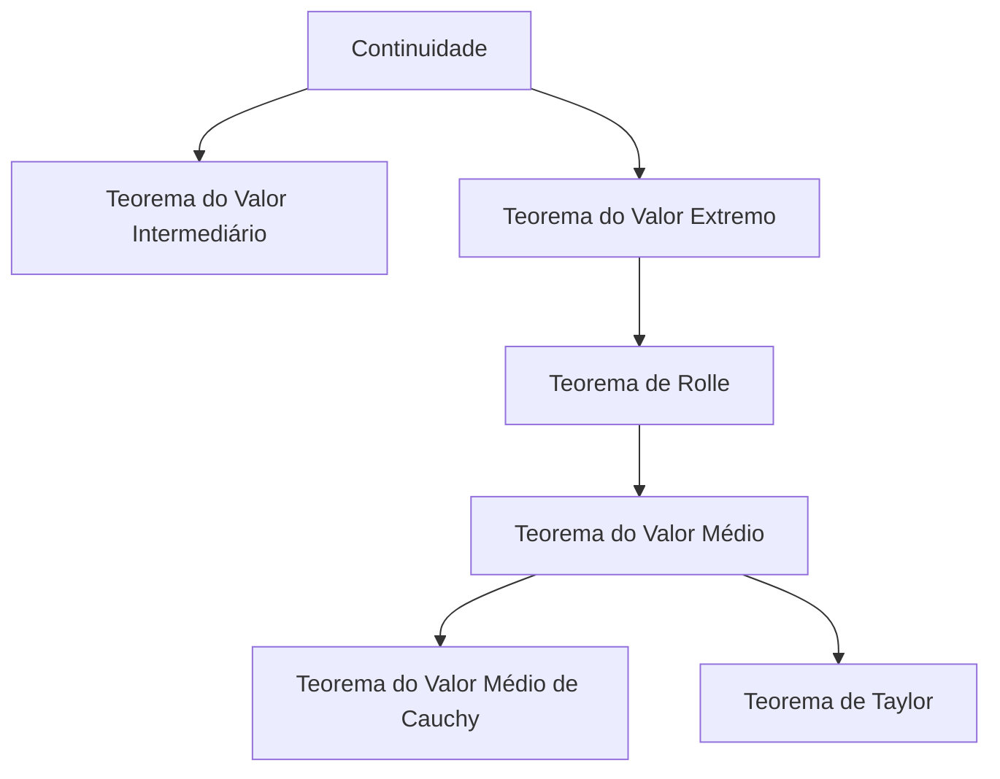
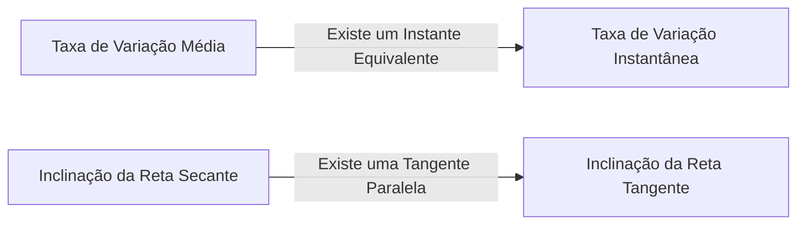

## 1. Introdução: A Intuição e a Lógica que Sustentam o Cálculo

O cálculo (Calculus) é uma estrutura poderosa para capturar matematicamente a mudança. No cerne de sua teoria estão conceitos como "continuidade" e "diferenciabilidade". Esses conceitos são formulações matemáticas rigorosas das imagens intuitivas que encontramos diariamente, como "conexão" e "suavidade".

Neste artigo, vamos nos concentrar em dois dos teoremas mais importantes e fundamentais do cálculo: o **Teorema do Valor Intermediário** (TVI) e o **Teorema do Valor Médio** (TVM). Esses teoremas serveem como ferramentas poderosas para provar a existência de soluções para equações e analisar o comportamento das funções (como sua monotonicidade).

O diagrama abaixo mostra as dependências lógicas de vários teoremas derivados da continuidade e da diferenciabilidade.

Vamos mergulhar profundamente para entender como esses teoremas estão interconectados, usando fórmulas específicas e explicações intuitivas.

## 2. Teorema do Valor Intermediário

### Enunciado do Teorema

O Teorema do Valor Intermediário é uma das propriedades mais básicas e intuitivas das funções contínuas.

> **Teorema (Teorema do Valor Intermediário)**
> Suponha que uma função $f(x)$ seja contínua no intervalo fechado $[a, b]$. Se $f(a) \neq f(b)$, então para qualquer número $k$ entre $f(a)$ e $f(b)$, existe pelo menos um $c$ no intervalo aberto $(a, b)$ tal que:
> $$f(c) = k$$

### Significado Intuitivo e Interpretação Geométrica

O que este teorema afirma é extremamente simples: "Ao traçar uma linha do ponto $(a, f(a))$ até o ponto $(b, f(b))$ sem tirar a caneta do papel, você deve cruzar a linha horizontal na altura $k$ pelo menos uma vez". Como a função é **contínua**, ela não pode pular os valores intermediários.

### Aplicação: Provando a Existência de Soluções de Equações

A aplicação mais comum do Teorema do Valor Intermediário é demonstrar a existência de raízes reais para uma equação.

**Exemplo:**
Mostre que a equação $x^3 - x - 1 = 0$ tem pelo menos uma raiz real no intervalo $(1, 2)$.

**Solução:**
Considere a função $f(x) = x^3 - x - 1$. Como as funções polinomiais são contínuas para todos os números reais, $f(x)$ também é contínua no intervalo fechado $[1, 2]$.
Calculando os valores em ambas as extremidades do intervalo:
- $f(1) = 1^3 - 1 - 1 = -1 < 0$
- $f(2) = 2^3 - 2 - 1 = 5 > 0$

Como $f(1) < 0 < f(2)$, pelo Teorema do Valor Intermediário, existe $c \in (1, 2)$ tal que $f(c) = 0$. Portanto, a equação tem uma raiz no intervalo $(1, 2)$.

## 3. Teorema de Rolle

Como um passo crucial em direção à prova do Teorema do Valor Médio, introduzimos primeiro o **Teorema de Rolle**.

> **Teorema (Teorema de Rolle)**
> Suponha que uma função $f(x)$ satisfaça as três seguintes condições:
> 1. É contínua no intervalo fechado $[a, b]$.
> 2. É diferenciável no intervalo aberto $(a, b)$.
> 3. $f(a) = f(b)$.
> 
> Então, existe pelo menos um $c$ no intervalo aberto $(a, b)$ tal que $f'(c) = 0$.

Geometricamente, isso significa que para qualquer curva suave onde as alturas inicial e final sejam iguais, deve haver pelo menos um ponto onde a tangente é horizontal (a inclinação é 0).

## 4. Teorema do Valor Médio

O Teorema do Valor Médio (Teorema do Valor Médio de Lagrange) pode ser considerado o pilar central que sustenta todo o cálculo.

### Enunciado do Teorema

> **Teorema (Teorema do Valor Médio)**
> Suponha que uma função $f(x)$ seja contínua no intervalo fechado $[a, b]$ e diferenciável no intervalo aberto $(a, b)$. Então, existe pelo menos um $c$ no intervalo aberto $(a, b)$ tal que:
> $$f'(c) = \frac{f(b) - f(a)}{b - a}$$

### Significado Intuitivo e Interpretação Geométrica

O lado direito $\frac{f(b) - f(a)}{b - a}$ representa a inclinação da reta secante (secant line) que conecta os pontos $(a, f(a))$ e $(b, f(b))$, que é a **taxa de variação média** da função em todo o intervalo.
O lado esquerdo $f'(c)$ representa a inclinação da reta tangente no ponto $c$, que é a **taxa de variação instantânea**.

Em outras palavras, o Teorema do Valor Médio afirma que "deve existir um instante ao longo do caminho em que a velocidade instantânea seja exatamente igual à velocidade média em todo o intervalo". Se você dirigir do ponto A ao ponto B a uma velocidade média de $60 \text{ km/h}$, seu velocímetro deve ter marcado exatamente $60 \text{ km/h}$ em algum momento da viagem.

### Prova do Teorema do Valor Médio

O Teorema do Valor Médio é provado utilizando engenhosamente o Teorema de Rolle.

Considere a equação da reta secante $g(x)$:
$$g(x) = f(a) + \frac{f(b) - f(a)}{b - a}(x - a)$$

Definimos uma nova função $h(x)$ representando a diferença entre a função original $f(x)$ e a reta secante $g(x)$:
$$h(x) = f(x) - g(x) = f(x) - \left( f(a) + \frac{f(b) - f(a)}{b - a}(x - a) \right)$$

Vamos verificar as propriedades da função $h(x)$:
1. Como tanto $f(x)$ quanto equações lineares em $x$ são contínuas em $[a, b]$, $h(x)$ também é contínua em $[a, b]$.
2. É diferenciável em $(a, b)$.
3. $h(a) = f(a) - f(a) = 0$
4. $h(b) = f(b) - \left( f(a) + f(b) - f(a) \right) = 0$

Portanto, $h(a) = h(b) = 0$, o que significa que a função $h(x)$ satisfaz todas as condições do Teorema de Rolle.
Pelo Teorema de Rolle, existe $c \in (a, b)$ tal que $h'(c) = 0$.

Diferenciando $h(x)$, obtemos:
$$h'(x) = f'(x) - \frac{f(b) - f(a)}{b - a}$$
Como $h'(c) = 0$, temos:
$$f'(c) - \frac{f(b) - f(a)}{b - a} = 0 \implies f'(c) = \frac{f(b) - f(a)}{b - a}$$
Isso conclui a prova.

### Aplicações: Teste de Função Constante e Prova de Monotonicidade

O Teorema do Valor Médio fornece a base teórica para determinar o comportamento de uma função a partir do sinal de sua derivada.

**Corolário 1: Se a derivada é zero, a função é constante**
> Se $f'(x) = 0$ para todo $x$ em um intervalo $I$, então $f(x)$ é constante em $I$.

**Esboço da Prova:**
Escolha quaisquer dois pontos distintos $x_1, x_2$ ($x_1 < x_2$) dentro do intervalo $I$. Pelo Teorema do Valor Médio, existe $c \in (x_1, x_2)$ que satisfaz:
$$f(x_2) - f(x_1) = f'(c)(x_2 - x_1)$$
Por nossa suposição, $f'(c) = 0$, então $f(x_2) - f(x_1) = 0$, o que significa que $f(x_1) = f(x_2)$. Como os valores são iguais em quaisquer dois pontos, a função é constante.

**Corolário 2: Funções Monotonamente Crescentes e Decrescentes**
> Se $f'(x) > 0$ para todo $x$ em um intervalo $I$, então $f(x)$ é estritamente crescente em $I$.

Este corolário pode ser provado exatamente da mesma maneira. Quando $x_1 < x_2$, como $f'(c) > 0$ e $(x_2 - x_1) > 0$, temos $f(x_2) - f(x_1) > 0$, o que significa que $f(x_1) < f(x_2)$, provando rigorosamente que a função é estritamente crescente.

Dessa forma, os princípios das tabelas de sinais que usamos naturalmente na matemática do ensino médio ("se a derivada é positiva aumenta, se é negativa diminui") são todos garantidos por este **Teorema do Valor Médio**.

## 5. Teorema do Valor Médio de Cauchy

O Teorema do Valor Médio de Cauchy é uma extensão do Teorema do Valor Médio para duas funções.

> **Teorema (Teorema do Valor Médio de Cauchy)**
> Suponha que duas funções $f(x)$ e $g(x)$ sejam contínuas no intervalo fechado $[a, b]$ e diferenciáveis no intervalo aberto $(a, b)$, e que $g'(x) \neq 0$ para todo $x \in (a, b)$. Então, existe $c \in (a, b)$ tal que:
> $$\frac{f(b) - f(a)}{g(b) - g(a)} = \frac{f'(c)}{g'(c)}$$

Este teorema pode ser interpretado como o Teorema do Valor Médio para uma curva definida parametricamente $(g(t), f(t))$. É também um teorema essencial utilizado para a prova rigorosa da **Regra de L'Hôpital**, que é extremamente útil em cálculos de limites.

## 6. Conclusão

Neste artigo, explicamos o Teorema do Valor Intermediário e o Teorema do Valor Médio, que formam a base do cálculo.

- O **Teorema do Valor Intermediário** garante a natureza "conectada" das funções contínuas e indica a existência de soluções para as equações.
- O **Teorema do Valor Médio** vincula a variação média de uma função à sua variação instantânea, servindo como uma ferramenta indispensável para compreender o comportamento global de uma função (como suas tendências de crescimento ou decrescimento) utilizando as propriedades das derivadas.

À primeira vista, esses teoremas podem parecer afirmar o óbvio. No entanto, respaldar a intuição com lógica rigorosa é precisamente a força motriz por trás do poderoso desenvolvimento da matemática moderna. Ao não se limitar a memorizar os enunciados dos teoremas, mas a apreciar seus significados geométricos e as ideias por trás de suas provas, você será capaz de desfrutar ainda mais da profunda riqueza da matemática.
