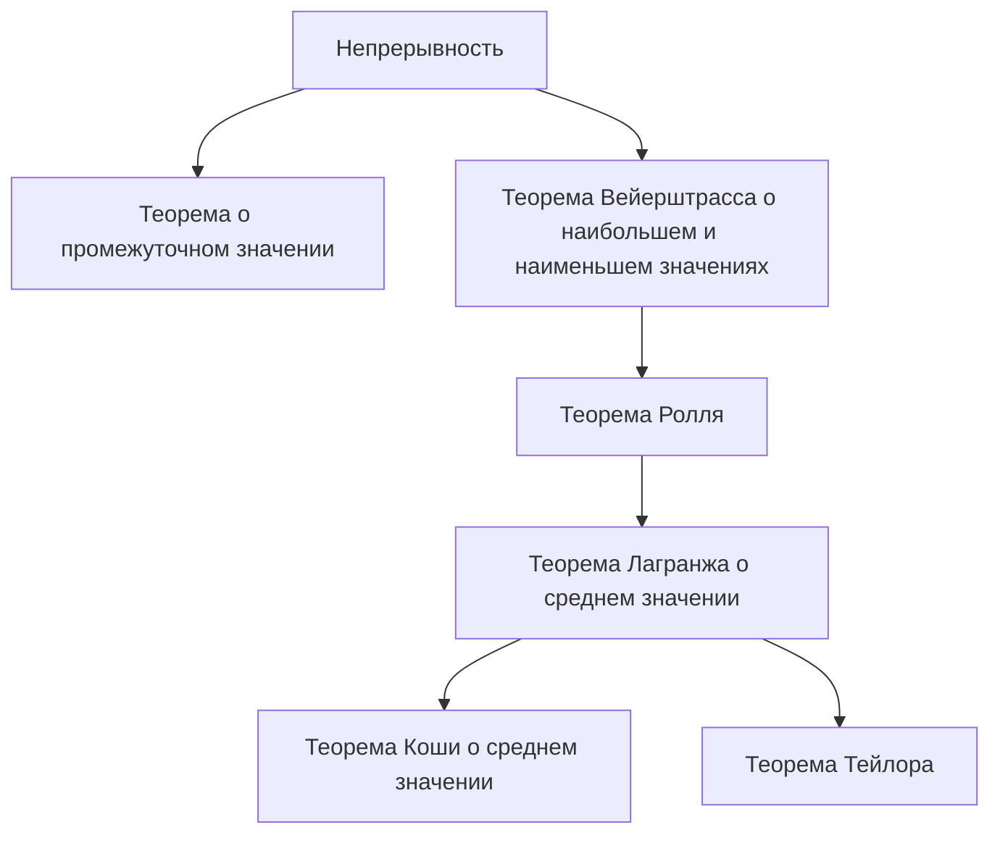

## 1. Введение: интуиция и логика, лежащие в основе математического анализа

Математический анализ (Calculus) — это мощная система для математического описания изменений. В основе его теории лежат такие концепции, как «непрерывность» и «дифференцируемость». Эти концепции являются строгими математическими формулировками интуитивных образов, с которыми мы сталкиваемся ежедневно, такими как «связность» и «гладкость».

В этой статье мы сосредоточимся на двух самых важных и фундаментальных теоремах математического анализа: **теореме о промежуточном значении** (Intermediate Value Theorem) и **теореме о среднем значении** (Mean Value Theorem). Эти теоремы служат мощными инструментами для доказательства существования решений уравнений и анализа поведения функций (например, их монотонности).

На диаграмме ниже показаны логические зависимости различных теорем, вытекающих из непрерывности и дифференцируемости.

Давайте глубоко погрузимся в понимание того, как эти теоремы взаимосвязаны, используя конкретные формулы и интуитивные объяснения.

## 2. Теорема о промежуточном значении

### Формулировка теоремы

Теорема о промежуточном значении — это одно из самых основных и интуитивно понятных свойств непрерывных функций.

> **Теорема (Теорема о промежуточном значении)**
> Пусть функция $f(x)$ непрерывна на отрезке (замкнутом интервале) $[a, b]$. Если $f(a) \neq f(b)$, то для любого числа $k$, лежащего между $f(a)$ и $f(b)$, существует хотя бы одно число $c$ в интервале (открытом интервале) $(a, b)$ такое, что:
> $$f(c) = k$$

### Интуитивный смысл и геометрическая интерпретация

То, о чем говорит эта теорема, предельно просто: «Если вы проведете линию от точки $(a, f(a))$ до точки $(b, f(b))$, не отрывая ручки от бумаги, вы должны будете пересечь горизонтальную линию на высоте $k$ хотя бы один раз». Поскольку функция **непрерывна**, она не может перепрыгнуть через промежуточные значения.

### Приложение: Доказательство существования решений уравнений

Наиболее распространенным применением теоремы о промежуточном значении является доказательство существования действительных корней уравнения.

**Пример:**
Докажите, что уравнение $x^3 - x - 1 = 0$ имеет по крайней мере один действительный корень на интервале $(1, 2)$.

**Решение:**
Рассмотрим функцию $f(x) = x^3 - x - 1$. Поскольку полиномиальные функции непрерывны для всех действительных чисел, $f(x)$ также непрерывна на отрезке $[1, 2]$.
Вычислим значения на обоих концах интервала:
- $f(1) = 1^3 - 1 - 1 = -1 < 0$
- $f(2) = 2^3 - 2 - 1 = 5 > 0$

Поскольку $f(1) < 0 < f(2)$, по теореме о промежуточном значении существует $c \in (1, 2)$ такое, что $f(c) = 0$. Следовательно, уравнение имеет корень в диапазоне $(1, 2)$.

## 3. Теорема Ролля

В качестве важного шага к доказательству теоремы о среднем значении мы сначала вводим **теорему Ролля**.

> **Теорема (Теорема Ролля)**
> Пусть функция $f(x)$ удовлетворяет следующим трем условиям:
> 1. Непрерывна на отрезке $[a, b]$.
> 2. Дифференцируема на интервале $(a, b)$.
> 3. $f(a) = f(b)$.
> 
> Тогда существует по крайней мере одно $c$ на интервале $(a, b)$ такое, что $f'(c) = 0$.

Геометрически это означает, что для любой гладкой кривой, у которой начальная и конечная высоты равны, должен быть по крайней мере один пукт, где касательная горизонтальна (наклон равен 0).

## 4. Теорема о среднем значении (Теорема Лагранжа)

Теорему о среднем значении (теорему Лагранжа о среднем значении) можно считать центральным столпом, поддерживающим весь математический анализ.

### Формулировка теоремы

> **Теорема (Теорема Лагранжа о среднем значении)**
> Пусть функция $f(x)$ непрерывна на отрезке $[a, b]$ и дифференцируема на интервале $(a, b)$. Тогда существует по крайней мере одно $c$ на интервале $(a, b)$ такое, что:
> $$f'(c) = \frac{f(b) - f(a)}{b - a}$$

### Интуитивный смысл и геометрическая интерпретация

Правая часть $\frac{f(b) - f(a)}{b - a}$ представляет собой наклон секущей (secant line), соединяющей точки $(a, f(a))$ и $(b, f(b))$, что является **средней скоростью изменения** функции на всем интервале.
Левая часть $f'(c)$ представляет собой наклон касательной в точке $c$, что является **мгновенной скоростью изменения**.

Другими словами, теорема о среднем значении утверждает, что «в пути должен быть момент, когда мгновенная скорость в точности равна средней скорости на всем интервале». Если вы едете из пункта А в пункт Б со средней скоростью $60 \text{ км/ч}$, ваш спидометр должен был показывать ровно $60 \text{ км/ч}$ в какой-то момент поездки.

### Доказательство теоремы о среднем значении

Теорема о среднем значении доказывается путем хитроумного использования теоремы Ролля.

Рассмотрим уравнение секущей $g(x)$:
$$g(x) = f(a) + \frac{f(b) - f(a)}{b - a}(x - a)$$

Определим новую функцию $h(x)$, представляющую разницу между исходной функцией $f(x)$ и секущей $g(x)$:
$$h(x) = f(x) - g(x) = f(x) - \left( f(a) + \frac{f(b) - f(a)}{b - a}(x - a) \right)$$

Проверим свойства функции $h(x)$:
1. Поскольку как $f(x)$, так и линейные уравнения относительно $x$ непрерывны на $[a, b]$, $h(x)$ также непрерывна на $[a, b]$.
2. Она дифференцируема на $(a, b)$.
3. $h(a) = f(a) - f(a) = 0$
4. $h(b) = f(b) - \left( f(a) + f(b) - f(a) \right) = 0$

Таким образом, $h(a) = h(b) = 0$, что означает, что функция $h(x)$ удовлетворяет всем условиям теоремы Ролля.
По теореме Ролля существует $c \in (a, b)$ такое, что $h'(c) = 0$.

Дифференцируя $h(x)$, получаем:
$$h'(x) = f'(x) - \frac{f(b) - f(a)}{b - a}$$
Поскольку $h'(c) = 0$, имеем:
$$f'(c) - \frac{f(b) - f(a)}{b - a} = 0 \implies f'(c) = \frac{f(b) - f(a)}{b - a}$$
Это завершает доказательство.

### Приложения: Признак постоянства функции и доказательство монотонности

Теорема о среднем значении обеспечивает теоретическую основу для определения поведения функции по знаку ее производной.

**Следствие 1: Если производная равна нулю, функция постоянна**
> Если $f'(x) = 0$ для всех $x$ на интервале $I$, то $f(x)$ постоянна на $I$.

**План доказательства:**
Выберем любые две различные точки $x_1, x_2$ ($x_1 < x_2$) внутри интервала $I$. По теореме о среднем значении существует $c \in (x_1, x_2)$, удовлетворяющее условию:
$$f(x_2) - f(x_1) = f'(c)(x_2 - x_1)$$
По нашему предположению $f'(c) = 0$, поэтому $f(x_2) - f(x_1) = 0$, что означает $f(x_1) = f(x_2)$. Поскольку значения равны в любых двух точках, функция постоянна.

**Следствие 2: Монотонно возрастающие и убывающие функции**
> Если $f'(x) > 0$ для всех $x$ на интервале $I$, то $f(x)$ строго возрастает на $I$.

Это следствие может быть доказано точно таким же образом. Когда $x_1 < x_2$, поскольку $f'(c) > 0$ и $(x_2 - x_1) > 0$, мы имеем $f(x_2) - f(x_1) > 0$, что означает $f(x_1) < f(x_2)$, строго показывая, что функция монотонно возрастает.

Таким образом, принципы таблиц знаков, которые мы естественно используем в школьной математике («если производная положительна, она возрастает, если отрицательна, она убывает»), все гарантируются этой **теоремой о среднем значении**.

## 5. Теорема Коши о среднем значении

Теорема Коши о среднем значении — это обобщение теоремы о среднем значении для двух функций.

> **Теорема (Теорема Коши о среднем значении)**
> Пусть две функции $f(x)$ и $g(x)$ непрерывны на отрезке $[a, b]$ и дифференцируемы на интервале $(a, b)$, и пусть $g'(x) \neq 0$ для всех $x \in (a, b)$. Тогда существует $c \in (a, b)$ такое, что:
> $$\frac{f(b) - f(a)}{g(b) - g(a)} = \frac{f'(c)}{g'(c)}$$

Эту теорему можно интерпретировать как теорему о среднем значении для параметрически заданной кривой $(g(t), f(t))$. Это также важная теорема, используемая для строгого доказательства **правила Лопиталя**, которое чрезвычайно полезно при вычислении пределов.

## 6. Заключение

В этой статье мы объяснили теорему о промежуточном значении и теорему о среднем значении, которые составляют основу математического анализа.

- **Теорема о промежуточном значении** гарантирует «связную» природу непрерывных функций и указывает на существование решений уравнений.
- **Теорема о среднем значении** связывает среднее изменение функции с ее мгновенным изменением, служа незаменимым инструментом для понимания общего поведения функции (такого как ее тенденции к возрастанию или убыванию) с использованием свойств производных.

На первый взгляд может показаться, что эти теоремы утверждают очевидное. Однако подкрепление интуиции строгой логикой является именно той движущей силой, которая стоит за мощным развитием современной математики. Не просто заучивая формулировки теорем, но оценивая их геометрический смысл и идеи, лежащие в основе их доказательств, вы сможете еще больше насладиться глубоким богатством математики.
