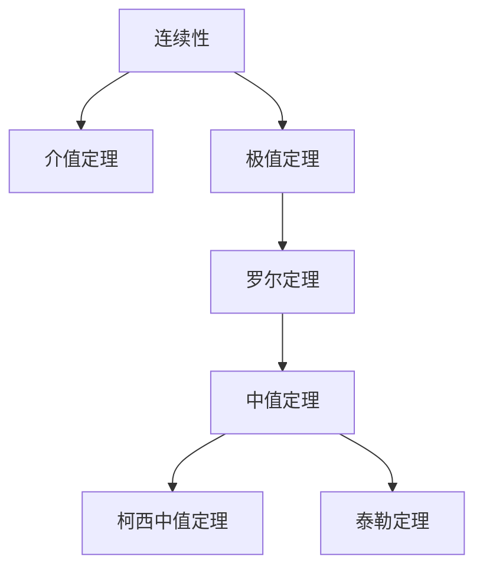
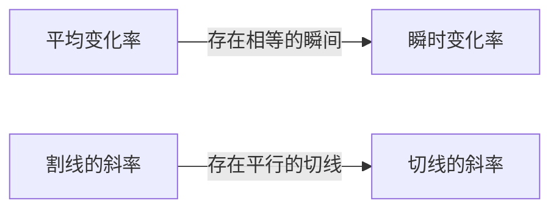

## 1. 引言：支撑微积分的直觉与逻辑

微积分（Calculus）是用于在数学上捕捉变化的强大体系。在其理论基础上，存在着“连续性”和“可导性”等概念。这些概念将我们在日常生活中抱有的“相连”、“平滑”等直观印象，使用严格的数学语言进行了形式化。

在本文中，我们将聚焦微积分中最重要且最基础的两个定理： **介值定理** (Intermediate Value Theorem) 与 **中值定理** (Mean Value Theorem)。这些定理在证明方程解的存在性，以及分析函数行为（如单调性）方面，发挥着强大工具的作用。

下图展示了从连续性和可导性推导出的各种定理的逻辑依赖关系。

让我们结合具体的数学公式和直观的解释，深入理解这些定理是如何相互联系的。

## 2. 介值定理 (Intermediate Value Theorem)

### 定理的表述

介值定理是连续函数所具有的最基本且最直观的性质之一。

> **定理（介值定理）**
> 假设函数 $f(x)$ 在闭区间 $[a, b]$ 上连续。若 $f(a) \neq f(b)$，则对于介于 $f(a)$ 和 $f(b)$ 之间的任意数 $k$，在开区间 $(a, b)$ 内至少存在一个 $c$，使得：
> $$f(c) = k$$

### 直观意义与几何解释

这个定理所要表达的含义非常简单：“当笔尖不离开纸面，从点 $(a, f(a))$ 画一条线到点 $(b, f(b))$ 时，必定会至少一次穿过高度为 $k$ 的水平线”。正因为函数是 **连续** 的，所以它不能跳跃过中间的值。

### 应用实例：方程解的存在性证明

介值定理最常见的应用是证明方程存在实数解。

**例题：**
证明方程 $x^3 - x - 1 = 0$ 在区间 $(1, 2)$ 之间至少存在一个实数解。

**解答：**
考虑函数 $f(x) = x^3 - x - 1$。由于多项式函数在所有实数上都连续，所以 $f(x)$ 在闭区间 $[1, 2]$ 上也是连续的。
计算区间两端的值：
- $f(1) = 1^3 - 1 - 1 = -1 < 0$
- $f(2) = 2^3 - 2 - 1 = 5 > 0$

因为 $f(1) < 0 < f(2)$，根据介值定理，存在 $c \in (1, 2)$ 使得 $f(c) = 0$。因此，该方程在 $(1, 2)$ 范围内有解。

## 3. 罗尔定理 (Rolle's Theorem)

作为证明中值定理的重要步骤，我们首先引入 **罗尔定理**。

> **定理（罗尔定理）**
> 假设函数 $f(x)$ 满足以下三个条件：
> 1. 在闭区间 $[a, b]$ 上连续
> 2. 在开区间 $(a, b)$ 内可导
> 3. $f(a) = f(b)$
> 
> 那么，在开区间 $(a, b)$ 内至少存在一个 $c$，使得 $f'(c) = 0$。

在几何上，这意味着对于起点和终点高度相同的平滑曲线，必然存在至少一个切线为水平（斜率为0）的点。

## 4. 中值定理 (Mean Value Theorem)

中值定理（拉格朗日中值定理）可以说是支撑整个微积分体系的顶梁柱定理。

### 定理的表述

> **定理（中值定理）**
> 假设函数 $f(x)$ 在闭区间 $[a, b]$ 上连续，在开区间 $(a, b)$ 内可导。那么，在开区间 $(a, b)$ 内至少存在一个 $c$，使得：
> $$f'(c) = \frac{f(b) - f(a)}{b - a}$$

### 直观意义与几何解释

等式右边的 $\frac{f(b) - f(a)}{b - a}$ 表示连接点 $(a, f(a))$ 和点 $(b, f(b))$ 的割线（secant line）的斜率，也就是函数在整个区间内的 **平均变化率**。
等式左边的 $f'(c)$ 表示在点 $c$ 处切线的斜率，也就是 **瞬时变化率**。

换句话说，中值定理主张的是：“在过程中必然存在一个瞬间，其瞬时速度等于整个区间的平均速度”。如果你开车从A地到B地的平均时速为 $60 \text{ km/h}$，那么在途中的某个地方，速度表必定在某个瞬间刚好指向 $60 \text{ km/h}$。

### 中值定理的证明

中值定理可以通过巧妙地利用罗尔定理来证明。

考虑割线的方程 $g(x)$：
$$g(x) = f(a) + \frac{f(b) - f(a)}{b - a}(x - a)$$

定义一个新的函数 $h(x)$，表示原函数 $f(x)$ 与割线 $g(x)$ 之间的差值：
$$h(x) = f(x) - g(x) = f(x) - \left( f(a) + \frac{f(b) - f(a)}{b - a}(x - a) \right)$$

检查函数 $h(x)$ 的性质：
1. 因为 $f(x)$ 和 $x$ 的一次式在 $[a, b]$ 上都连续，所以 $h(x)$ 在 $[a, b]$ 上也连续。
2. 在 $(a, b)$ 内可导。
3. $h(a) = f(a) - f(a) = 0$
4. $h(b) = f(b) - \left( f(a) + f(b) - f(a) \right) = 0$

因此，$h(a) = h(b) = 0$，函数 $h(x)$ 满足罗尔定理的所有条件。
由罗尔定理可知，存在 $c \in (a, b)$ 使得 $h'(c) = 0$。

对 $h(x)$ 求导，得到：
$$h'(x) = f'(x) - \frac{f(b) - f(a)}{b - a}$$
因为 $h'(c) = 0$，所以：
$$f'(c) - \frac{f(b) - f(a)}{b - a} = 0 \implies f'(c) = \frac{f(b) - f(a)}{b - a}$$
证明完毕。

### 应用实例：函数的常数判定与单调性证明

中值定理为通过导数的符号来决定原函数行为提供了理论依据。

**推论1：导数为零则为常数函数**
> 如果区间 $I$ 上的所有 $x$ 都有 $f'(x) = 0$，那么 $f(x)$ 在 $I$ 上为常数。

**证明概要：**
在区间 $I$ 内任取两个不同的点 $x_1, x_2$ ($x_1 < x_2$)。由中值定理可知，存在 $c \in (x_1, x_2)$ 满足：
$$f(x_2) - f(x_1) = f'(c)(x_2 - x_1)$$
根据假设 $f'(c) = 0$，因此 $f(x_2) - f(x_1) = 0$，即 $f(x_1) = f(x_2)$。由于任意两点的值相等，该函数为常数。

**推论2：函数的单调递增与单调递减**
> 如果区间 $I$ 上的所有 $x$ 都有 $f'(x) > 0$，那么 $f(x)$ 在 $I$ 上单调递增。

这个推论也可以用完全相同的方式证明。当 $x_1 < x_2$ 时，因为 $f'(c) > 0$ 且 $(x_2 - x_1) > 0$，所以 $f(x_2) - f(x_1) > 0$，即 $f(x_1) < f(x_2)$，这严格地证明了函数是单调递增的。

像这样，我们在高中数学中理所当然地使用的“导数为正即递增，为负即递减”的增减表原理，全都是由这个 **中值定理** 所保证的。

## 5. 柯西中值定理 ([Cauchy](https://kenji.blog/zh-cn/p/cauchy/)'s Mean Value Theorem)

将中值定理扩展到两个函数的情况，就是柯西中值定理。

> **定理（柯西中值定理）**
> 假设两个函数 $f(x), g(x)$ 在闭区间 $[a, b]$ 上连续，在开区间 $(a, b)$ 内可导，并且对于所有的 $x \in (a, b)$ 都有 $g'(x) \neq 0$。那么，存在 $c \in (a, b)$ 使得：
> $$\frac{f(b) - f(a)}{g(b) - g(a)} = \frac{f'(c)}{g'(c)}$$

这个定理可以被解释为参数方程表示的曲线 $(g(t), f(t))$ 上的中值定理。此外，它也是用于严格证明在极限计算中极其有用的 **洛必达法则** (L'Hôpital's Rule) 的重要定理。

## 6. 总结

在本文中，我们探讨了作为微积分基础的[介值定理与中值定理](https://kenji.blog/zh-cn/p/intermediate-and-mean-value-theorem/)。

- **介值定理** 保证了连续函数的“相连”性质，揭示了方程解的存在性。
- **中值定理** 将函数的平均变化与瞬时变化联系起来，是利用导数性质掌握函数整体行为（如增减性）的不可或缺的工具。

乍一看，这些定理似乎在讲述理所当然的事情。然而，用严格的逻辑来支撑直觉，正是推动现代数学强大发展的原动力。不仅要死记硬背定理的结论，更要品味其几何意义和证明的思路，这样您才能更深层地享受数学的奥妙。
