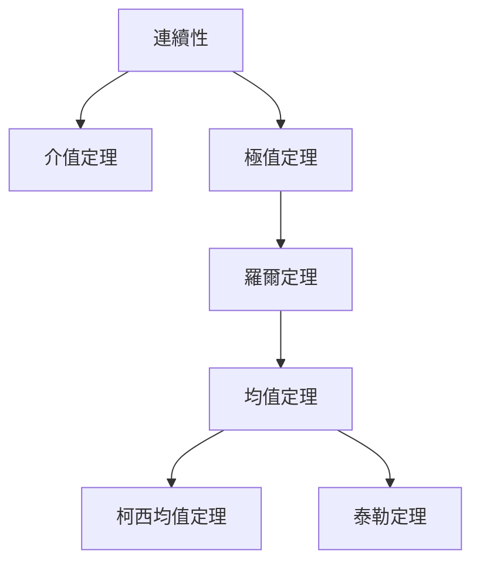
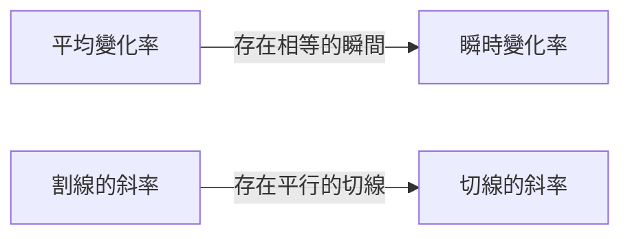

## 1. 引言：支撐微積分的直覺與邏輯

微積分（Calculus）是用於在數學上捕捉變化的強大體系。在其理論基礎上，存在著「連續性」和「可導性」等概念。這些概念將我們在日常生活中抱有的「相連」、「平滑」等直觀印象，使用嚴格的數學語言進行了形式化。

在本文中，我們將聚焦微積分中最重要且最基礎的兩個定理： **介值定理** (Intermediate Value Theorem) 與 **均值定理** (Mean Value Theorem)。這些定理在證明方程式解的存在性，以及分析函數行為（如單調性）方面，發揮著強大工具的作用。

下圖展示了從連續性和可導性推導出的各種定理的邏輯依賴關係。

讓我們結合具體的數學公式和直觀的解釋，深入理解這些定理是如何相互聯繫的。

## 2. 介值定理 (Intermediate Value Theorem)

### 定理的表述

介值定理是連續函數所具有的最基本且最直觀的性質之一。

> **定理（介值定理）**
> 假設函數 $f(x)$ 在閉區間 $[a, b]$ 上連續。若 $f(a) \neq f(b)$，則對於介於 $f(a)$ 和 $f(b)$ 之間的任意數 $k$，在開區間 $(a, b)$ 內至少存在一個 $c$，使得：
> $$f(c) = k$$

### 直觀意義與幾何解釋

這個定理所要表達的含義非常簡單：「當筆尖不離開紙面，從點 $(a, f(a))$ 畫一條線到點 $(b, f(b))$ 時，必定會至少一次穿過高度為 $k$ 的水平線」。正因為函數是 **連續** 的，所以它不能跳躍過中間的值。

### 應用實例：方程式解的存在性證明

介值定理最常見的應用是證明方程式存在實數解。

**例題：**
證明方程式 $x^3 - x - 1 = 0$ 在區間 $(1, 2)$ 之間至少存在一個實數解。

**解答：**
考慮函數 $f(x) = x^3 - x - 1$。由於多項式函數在所有實數上都連續，所以 $f(x)$ 在閉區間 $[1, 2]$ 上也是連續的。
計算區間兩端的值：
- $f(1) = 1^3 - 1 - 1 = -1 < 0$
- $f(2) = 2^3 - 2 - 1 = 5 > 0$

因為 $f(1) < 0 < f(2)$，根據介值定理，存在 $c \in (1, 2)$ 使得 $f(c) = 0$。因此，該方程式在 $(1, 2)$ 範圍內有解。

## 3. 羅爾定理 (Rolle's Theorem)

作為證明均值定理的重要步驟，我們先引入 **羅爾定理**。

> **定理（羅爾定理）**
> 假設函數 $f(x)$ 滿足以下三個條件：
> 1. 在閉區間 $[a, b]$ 上連續
> 2. 在開區間 $(a, b)$ 內可導
> 3. $f(a) = f(b)$
> 
> 那麼，在開區間 $(a, b)$ 內至少存在一個 $c$，使得 $f'(c) = 0$。

在幾何上，這意味著對於起點和終點高度相同的平滑曲線，必然存在至少一個切線為水平（斜率為0）的點。

## 4. 均值定理 (Mean Value Theorem)

均值定理（拉格朗日均值定理）可以說是支撐整個微積分體系的頂樑柱定理。

### 定理的表述

> **定理（均值定理）**
> 假設函數 $f(x)$ 在閉區間 $[a, b]$ 上連續，在開區間 $(a, b)$ 內可導。那麼，在開區間 $(a, b)$ 內至少存在一個 $c$，使得：
> $$f'(c) = \frac{f(b) - f(a)}{b - a}$$

### 直觀意義與幾何解釋

等式右邊的 $\frac{f(b) - f(a)}{b - a}$ 表示連接點 $(a, f(a))$ 和點 $(b, f(b))$ 的割線（secant line）的斜率，也就是函數在整個區間內的 **平均變化率**。
等式左邊的 $f'(c)$ 表示在點 $c$ 處切線的斜率，也就是 **瞬時變化率**。

換句話說，均值定理主張的是：「在過程中必然存在一個瞬間，其瞬時速度等於整個區間的平均速度」。如果您開車從A地到B地的平均時速為 $60 \text{ km/h}$，那麼在途中的某個地方，速度表必定在某個瞬間剛好指向 $60 \text{ km/h}$。

### 均值定理的證明

均值定理可以透過巧妙地利用羅爾定理來證明。

考慮割線的方程式 $g(x)$：
$$g(x) = f(a) + \frac{f(b) - f(a)}{b - a}(x - a)$$

定義一個新的函數 $h(x)$，表示原函數 $f(x)$ 與割線 $g(x)$ 之間的差值：
$$h(x) = f(x) - g(x) = f(x) - \left( f(a) + \frac{f(b) - f(a)}{b - a}(x - a) \right)$$

檢查函數 $h(x)$ 的性質：
1. 因為 $f(x)$ 和 $x$ 的一次式在 $[a, b]$ 上都連續，所以 $h(x)$ 在 $[a, b]$ 上也連續。
2. 在 $(a, b)$ 內可導。
3. $h(a) = f(a) - f(a) = 0$
4. $h(b) = f(b) - \left( f(a) + f(b) - f(a) \right) = 0$

因此，$h(a) = h(b) = 0$，函數 $h(x)$ 滿足羅爾定理的所有條件。
由羅爾定理可知，存在 $c \in (a, b)$ 使得 $h'(c) = 0$。

對 $h(x)$ 求導，得到：
$$h'(x) = f'(x) - \frac{f(b) - f(a)}{b - a}$$
因為 $h'(c) = 0$，所以：
$$f'(c) - \frac{f(b) - f(a)}{b - a} = 0 \implies f'(c) = \frac{f(b) - f(a)}{b - a}$$
證明完畢。

### 應用實例：函數的常數判定與單調性證明

均值定理為透過導數的符號來決定原函數行為提供了理論依據。

**推論1：導數為零則為常數函數**
> 如果區間 $I$ 上的所有 $x$ 都有 $f'(x) = 0$，那麼 $f(x)$ 在 $I$ 上為常數。

**證明概要：**
在區間 $I$ 內任取兩個不同的點 $x_1, x_2$ ($x_1 < x_2$)。由均值定理可知，存在 $c \in (x_1, x_2)$ 滿足：
$$f(x_2) - f(x_1) = f'(c)(x_2 - x_1)$$
根據假設 $f'(c) = 0$，因此 $f(x_2) - f(x_1) = 0$，即 $f(x_1) = f(x_2)$。由於任意兩點的值相等，該函數為常數。

**推論2：函數的單調遞增與單調遞減**
> 如果區間 $I$ 上的所有 $x$ 都有 $f'(x) > 0$，那麼 $f(x)$ 在 $I$ 上單調遞增。

這個推論也可以用完全相同的方式證明。當 $x_1 < x_2$ 時，因為 $f'(c) > 0$ 且 $(x_2 - x_1) > 0$，所以 $f(x_2) - f(x_1) > 0$，即 $f(x_1) < f(x_2)$，這嚴格地證明了函數是單調遞增的。

像這樣，我們在高中數學中理所當然地使用的「導數為正即遞增，為負即遞減」的增減表原理，全都是由這個 **均值定理** 所保證的。

## 5. 柯西均值定理 (Cauchy's Mean Value Theorem)

將均值定理擴展到兩個函數的情況，就是柯西均值定理。

> **定理（柯西均值定理）**
> 假設兩個函數 $f(x), g(x)$ 在閉區間 $[a, b]$ 上連續，在開區間 $(a, b)$ 內可導，並且對於所有的 $x \in (a, b)$ 都有 $g'(x) \neq 0$。那麼，存在 $c \in (a, b)$ 使得：
> $$\frac{f(b) - f(a)}{g(b) - g(a)} = \frac{f'(c)}{g'(c)}$$

這個定理可以被解釋為參數方程式表示的曲線 $(g(t), f(t))$ 上的均值定理。此外，它也是用於嚴格證明在極限計算中極其有用的 **羅必達法則** (L'Hôpital's Rule) 的重要定理。

## 6. 總結

在本文中，我們探討了作為微積分基礎的[介值定理與均值定理](https://kenji.blog/zh-tw/p/intermediate-and-mean-value-theorem/)。

- **介值定理** 保證了連續函數的「相連」性質，揭示了方程式解的存在性。
- **均值定理** 將函數的平均變化與瞬時變化聯繫起來，是利用導數性質掌握函數整體行為（如增減性）的不可或缺的工具。

乍看之下，這些定理似乎在講述理所當然的事情。然而，用嚴格的邏輯來支撐直覺，正是推動現代數學強大發展的原動力。不僅要死記硬背定理的結論，更要品味其幾何意義和證明的思路，這樣您才能更深層地享受數學的奧妙。
