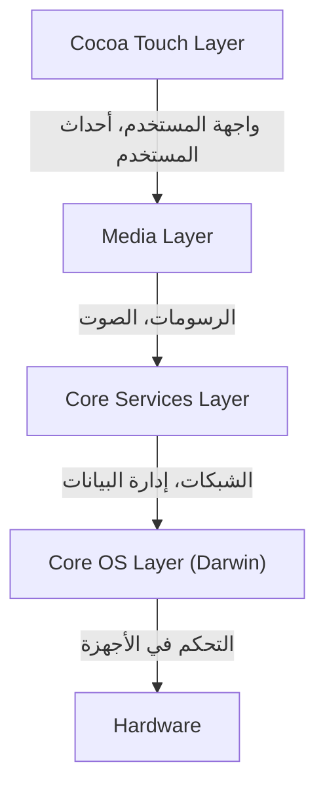
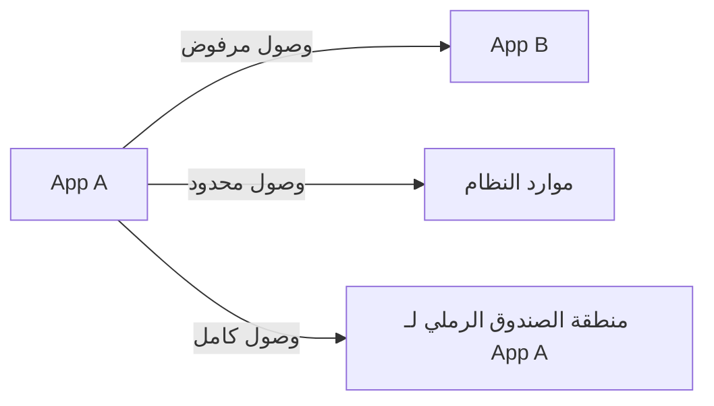

## مقدمة: سلالة NeXT وولادة iOS

نظام التشغيل المحمول "iOS" من Apple هو نظام تشغيل قوي يشغل مليارات الأجهزة حول العالم اليوم. ومع ذلك، فإن البنية التحتية الأساسية له تعود إلى "NeXTSTEP" الخاص بشركة NeXT، والتي أسسها ستيف جوبز خلال فترة ابتعاده عن Apple.

لم يولد iOS (والذي كان يُعرف في البداية باسم iPhone OS) كنظام تشغيل خفيف الوزن مخصص للهواتف المحمولة فحسب، بل ظهر كمجموعة فرعية من نظام Mac OS X (المعروف حالياً بـ macOS). وبعبارة أخرى، كان مشروعاً طموحاً يهدف إلى وضع نظام تشغيل قوي يعتمد على Unix بمستوى أنظمة سطح المكتب في جهاز بحجم راحة اليد.

في هذا المقال، سنقوم بتشريح البنية العميقة لنظام iOS الموروثة من NeXTSTEP بالتفصيل، بدءاً من أدنى مستوى في النواة (Kernel) وصولاً إلى أعلى مستوى في إطار عمل واجهة المستخدم (UI framework).

## بنية نظام iOS ذات الطبقات الأربع

تتكون بنية نظام iOS بشكل أساسي من أربع طبقات تجريدية (abstraction layers). كلما نزلنا إلى الطبقات السفلية، اقتربنا من الأجهزة (Hardware)، وكلما صعدنا إلى الطبقات العلوية، اقتربنا من واجهة المستخدم.

دعونا نلقي نظرة تفصيلية على كل طبقة.

### 1. طبقة Core OS ونظام Darwin (نواة XNU)

قلب بنية iOS والجزء الأكثر أساسية فيها هو **طبقة Core OS (Core OS Layer)**. تعتمد هذه الطبقة على نظام تشغيل متوافق مع Unix مفتوح المصدر يُعرف باسم "Darwin".

في صميم Darwin توجد **نواة XNU** (والتي تعني X is Not Unix). تتبنى XNU نهجاً فريداً يُعرف باسم "النواة الهجينة" (Hybrid Kernel)، وهي ليست نواة دقيقة (Microkernel) بحتة ولا نواة متجانسة (Monolithic Kernel) بحتة.

#### دمج نواة Mach الدقيقة ونظام BSD

تعد نواة XNU عبارة عن هجين يتكون أساساً من المكونين التاليين:

1.  **نواة Mach الدقيقة (Mach Microkernel)**: تستند إلى نواة Mach التي تم تطويرها في جامعة كارنيجي ميلون. توفر Mach وظائف منخفضة المستوى وأساسية للغاية مثل إدارة الذاكرة، وجدولة الخيوط (Thread Scheduling)، والاتصال بين العمليات (IPC). يعتمد الاتصال بين العمليات في Mach على "تمرير الرسائل" (Message Passing)، وهذا يشكل أساس متانة واستقرار نظام iOS.
2.  **BSD (Berkeley Software Distribution)**: يوفر نظام BSD الفرعي المبني فوق Mach واجهة برمجة تطبيقات (API) متوافقة مع POSIX، وحزمة الشبكة (مثل TCP/IP)، ونظام الملفات (مثل APFS)، ونموذج العمليات (Process Model). بفضل طبقة BSD هذه، يمكن للمطورين استخدام لغة C وواجهات برمجة تطبيقات POSIX لإجراء اتصالات الشبكة وعمليات الملفات.

بفضل هذا الهيكل الهجين، نجح iOS في الجمع بين نموذجية (Modularity) ومتانة النواة الدقيقة، مع أداء النواة المتجانسة (خاصة سرعة استدعاء النظام من جانب BSD).

### 2. طبقة Core Services

طبقة Core Services (Core Services Layer) هي الطبقة التي توفر خدمات النظام الأساسية التي تحتاجها جميع التطبيقات. تتم كتابة هذه الطبقة بشكل رئيسي بلغة C و Objective-C (وفي السنوات الأخيرة بـ Swift).

تشمل أطر العمل (Frameworks) الرئيسية ما يلي:

*   **Foundation / Core Foundation**: توفر الميزات الأساسية لـ Objective-C و Swift، بدءاً من أنواع البيانات الأساسية مثل السلاسل النصية (NSString / String)، والمصفوفات (NSArray / Array)، والقواميس (NSDictionary / Dictionary)، وصولاً إلى إدارة الخيوط، والاتصال بالشبكة (URLSession)، وإدارة الملفات.
*   **Core Data**: إطار عمل يعتمد على الرسم البياني للكائنات (Object Graph)، يقوم بإدارة نموذج بيانات التطبيق وتجريد عملية التخزين المستمر (Persisting) إلى قواعد بيانات محلية مثل SQLite.
*   **CloudKit**: يوفر الوصول إلى خدمات النهاية الخلفية (Backend) لمزامنة البيانات بين الأجهزة عبر iCloud.
*   **Grand Central Dispatch (GCD)**: واجهة برمجة تطبيقات تعتمد على لغة C للمعالجة المتزامنة الفعالة على المعالجات متعددة النوى. يحرر المطورين من تعقيد الإدارة المباشرة للخيوط؛ حيث يقوم النظام بتعيين الخيوط بشكل مثالي بمجرد قيام المطور بوضع المهام في طوابير الانتظار (Queuing).

### 3. طبقة Media

طبقة الوسائط (Media Layer) هي مجموعة من أطر العمل للتعامل مع قدرات الوسائط المتعددة القوية (الرسومات، الصوت، والفيديو) لأجهزة iOS.

*   **Core Graphics (Quartz 2D)**: محرك رسم للرسومات المتجهة (Vector Graphics) ثنائية الأبعاد. يقوم بتقديم (Rendering) ملفات PDF والرسم المتقدم للمسارات مع الاستفادة من تسريع الأجهزة (Hardware Acceleration).
*   **Core Animation**: الأساس لرسم الحركات المعقدة (Animations) بسلاسة فائقة (بمعدل 60 إطاراً في الثانية أو 120 إطاراً في الثانية). باستخدام مفهوم "الطبقات" (CALayer)، يتم نقل عمليات الرسم إلى وحدة معالجة الرسومات (GPU)، مما يقلل الحمل على وحدة المعالجة المركزية (CPU) ويحقق أداءً عالياً.
*   **Metal**: واجهة برمجة تطبيقات خاصة بـ Apple للرسومات منخفضة المستوى، وهي تبرز أداء وحدة معالجة الرسومات (GPU) إلى أقصى حد. تم تصميمها لتحل محل OpenGL ES القديم، ولا تُستخدم في الألعاب ثلاثية الأبعاد فحسب، بل تُستخدم أيضاً في حسابات التعلم الآلي (Metal Performance Shaders).
*   **AVFoundation**: إطار عمل للتحكم التفصيلي في تشغيل، وتسجيل، وتحرير الصوت والفيديو.

### 4. طبقة Cocoa Touch

في أعلى مستوى تقع **طبقة Cocoa Touch (Cocoa Touch Layer)**، وهي الأكثر شهرة بين المطورين والمستخدمين. توفر هذه الطبقة أطر عمل لبناء الواجهة المرئية وتفاعلات المستخدم في تطبيقات iOS.

*   **UIKit**: إطار عمل واجهة المستخدم الذي كان معياراً لتطوير تطبيقات iOS لسنوات عديدة. يوفر مكونات مثل الأزرار (UIButton)، والتسميات (UILabel)، وطرق عرض الجداول (UITableView)، ويتبنى نموذج برمجة يعتمد على الأحداث (مثل نمط Target-Action ونمط Delegate).
*   **SwiftUI**: إطار عمل حديث لواجهة المستخدم تم إصداره في عام 2019، يستخدم بناء جملة تعريفي (Declarative Syntax). يتميز بآلية يتم من خلالها تحديث واجهة المستخدم تلقائياً عند تغيير الحالة (State). يقلل SwiftUI بشكل كبير من كمية الكود مقارنة بـ UIKit، ويسمح ببناء واجهة مستخدم أكثر سهولة.

اسم "Cocoa Touch" في حد ذاته مستمد من إضافة مفهوم واجهة اللمس المتعدد (Touch) إلى "Cocoa"، وهو إطار عمل واجهة المستخدم لنظام Mac OS X.

## نموذج الأمان القوي: حماية التطبيقات (App Sandboxing) وحماية البيانات

بالإضافة إلى كونه نظام تشغيل مبنياً على Unix، قام iOS ببناء نموذج أمان صارم للغاية ومخصص لبيئة الأجهزة المحمولة.

### عزل التطبيقات (App Sandboxing)

يتم تشغيل جميع تطبيقات الطرف الثالث (Third-party Apps) على iOS في بيئة معزولة تسمى "صندوق الحماية" (Sandbox). يمنع هذا التطبيقات فعلياً من الوصول المباشر إلى نظام الملفات خارج الدليل الخاص بها، أو بيانات التطبيقات الأخرى، أو المناطق المهمة في النظام.

يجب على التطبيقات دائماً طلب إذن صريح من المستخدم للوصول إلى الموارد مثل جهات الاتصال، أو الكاميرا، أو الميكروفون، ويشكل هذا أساس حماية الخصوصية في iOS.

### توقيع الكود (Code Signing) والتمهيد الآمن (Secure Boot)

يجب أن تحتوي جميع البرامج التي تعمل على جهاز iOS (بدءاً من نظام التشغيل نفسه ووصولاً إلى تطبيقات الطرف الثالث) على توقيع مشفر تم التحقق منه بواسطة Apple.
وهذا يمنع تشغيل البرامج الضارة أو الأكواد التي تم التلاعب بها. عند بدء التشغيل، يتم تنفيذ "سلسلة التمهيد الآمن" (Secure Boot Chain)، والتي تتحقق بالتسلسل من صحة الكود بدءاً من "جذر الثقة" (Root of Trust) على مستوى الأجهزة (Hardware).

### حماية البيانات (Data Protection) و Secure Enclave

يتم تشفير البيانات الموجودة في مساحة تخزين الجهاز بقوة باستخدام محرك تشفير الأجهزة. عند تعيين رمز مرور (Passcode)، يتم إنشاء مفتاح تشفير الملفات عن طريق الجمع بين رمز المرور ومفتاح الجهاز الفريد (المخزن في Secure Enclave). وهذا يجعل من الصعب للغاية استخراج البيانات حتى لو تعرض الجهاز للسرقة الفعلية.

## الخلاصة

لا يعد iOS مجرد نظام يوفر واجهة مستخدم جميلة. ففي داخله ينبض قلب نظام Unix القوي (Darwin)، والذي تم تطويره وصقله على مدى عقود منذ NeXTSTEP.

الاستقرار الذي يوفره تمرير الرسائل في نواة Mach الدقيقة، ومتانة الشبكة ونظام الملفات من خلال BSD، وطبقات Core Services و Media المجردة للغاية التي تغلف ذلك كله، بالإضافة إلى طبقة Cocoa Touch البديهية.

إن العمل بتناغم تام بين هذه الطبقات الأربع، وحمايتها بصندوق حماية صارم، هو ما يبقي iOS نظام التشغيل المحمول الأكثر أماناً وتطوراً في العالم.
