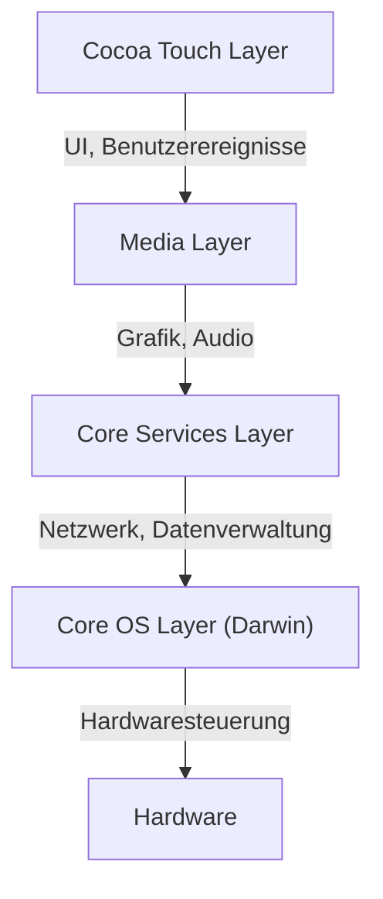
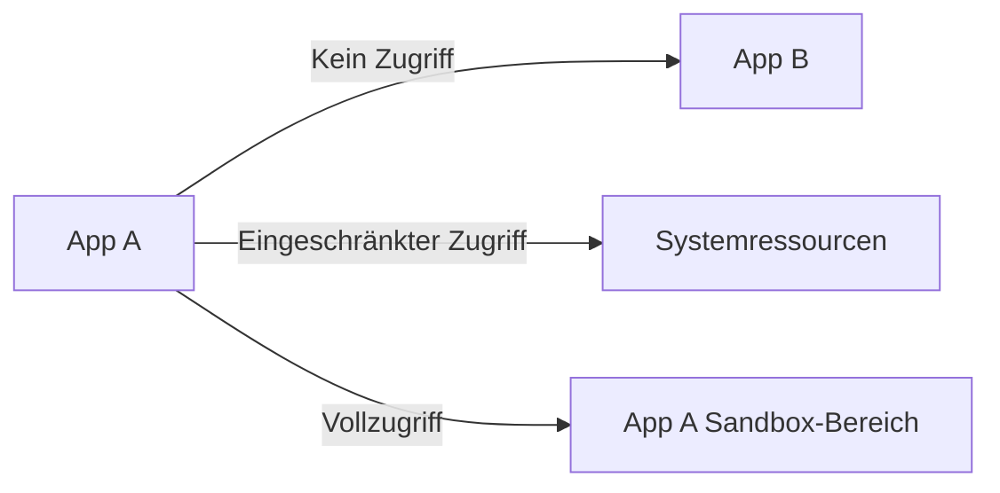

## Einführung: Die Abstammung von NeXT und die Geburt von iOS

Apples mobiles Betriebssystem „iOS“ ist ein leistungsstarkes Betriebssystem, das heute weltweit Milliarden von Geräten antreibt. Die zugrunde liegende Architektur geht jedoch auf „NeXTSTEP“ zurück, ein Betriebssystem, das von NeXT entwickelt wurde, dem Unternehmen, das Steve Jobs während seiner Abwesenheit von Apple gründete.

iOS (anfangs als iPhone OS bezeichnet) wurde nicht nur als leichtgewichtiges Betriebssystem für Mobiltelefone konzipiert, sondern als Teilmenge von Mac OS X (dem heutigen macOS). Es handelte sich um ein ambitioniertes Projekt, das darauf abzielte, ein leistungsstarkes, Unix-basiertes Betriebssystem der Desktop-Klasse in ein handtellergroßes Gerät zu integrieren.

In diesem Artikel werden wir die tiefgreifende Architektur von iOS, die aus NeXTSTEP hervorgegangen ist, im Detail analysieren – vom untersten Kernel bis hin zum obersten UI-Framework.

## Die 4-Schichten-Architektur von iOS

Die Systemarchitektur von iOS besteht im Wesentlichen aus vier Abstraktionsschichten. Je weiter unten sich eine Schicht befindet, desto näher ist sie an der Hardware; je weiter oben, desto näher am Benutzerinterface.

Lassen Sie uns jede Schicht im Detail betrachten.

### 1. Core OS Layer und Darwin (XNU-Kernel)

Das Herzstück und das grundlegendste Fundament der iOS-Architektur ist der **Core OS Layer**. Diese Schicht basiert auf einem Open-Source, Unix-kompatiblen Betriebssystem namens „Darwin“.

Den Kern von Darwin bildet der **XNU-Kernel** (X is Not Unix). XNU verfolgt einen einzigartigen Ansatz in Form eines „Hybrid-Kernels“, der weder ein reiner Mikrokernel noch ein monolithischer Kernel ist.

#### Die Verschmelzung des Mach-Mikrokernels und BSD

Der XNU-Kernel ist hauptsächlich ein Hybrid aus den folgenden zwei Komponenten:

1.  **Mach-Mikrokernel**: Basierend auf dem Mach-Kernel, der an der Carnegie Mellon University entwickelt wurde. Mach bietet extrem systemnahe und grundlegende Funktionen wie Speicherverwaltung, Thread-Scheduling und Interprozesskommunikation (IPC). Die Interprozesskommunikation von Mach basiert auf „Message Passing“, was die Grundlage für die Robustheit von iOS bildet.
2.  **BSD (Berkeley Software Distribution)**: Das auf Mach aufbauende BSD-Subsystem bietet POSIX-kompatible APIs, einen Netzwerk-Stack (TCP/IP), Dateisysteme (wie APFS) und das Prozessmodell. Es ist dieser BSD-Schicht zu verdanken, dass Entwickler C oder POSIX-APIs verwenden können, um Netzwerkkommunikation oder Dateioperationen durchzuführen.

Durch diese hybride Struktur gelingt es iOS, die Modularität und Stabilität eines Mikrokernels mit der Leistung eines monolithischen Kernels (insbesondere der Geschwindigkeit der Systemaufrufe auf der BSD-Seite) zu kombinieren.

### 2. Core Services Layer

Der Core Services Layer ist die Schicht, die grundlegende Systemdienste bereitstellt, die von allen Anwendungen benötigt werden. Diese Schicht ist hauptsächlich in C und Objective-C (in den letzten Jahren auch in Swift) geschrieben.

Zu den wichtigsten Frameworks gehören:

*   **Foundation / Core Foundation**: Bietet die zugrunde liegenden Funktionen für Objective-C und Swift, angefangen bei grundlegenden Datentypen wie Zeichenketten (NSString / String), Arrays (NSArray / Array) und Wörterbüchern (NSDictionary / Dictionary) bis hin zur Thread-Verwaltung, Netzwerkkommunikation (URLSession) und Dateiverwaltung.
*   **Core Data**: Ein Objektgraphen-Framework, das das Datenmodell der Anwendung verwaltet und die Persistenz in einer lokalen Datenbank wie SQLite abstrahiert.
*   **CloudKit**: Bietet Zugriff auf Backend-Dienste, um Daten geräteübergreifend über iCloud zu synchronisieren.
*   **Grand Central Dispatch (GCD)**: Eine C-basierte API für die effiziente parallele Verarbeitung auf Multi-Core-Prozessoren. Es befreit Entwickler von der Komplexität der direkten Thread-Verwaltung; durch einfaches Einreihen von Aufgaben in eine Warteschlange (Queue) nimmt das System die optimale Thread-Zuweisung vor.

### 3. Media Layer

Der Media Layer ist eine Sammlung von Frameworks für den Umgang mit den leistungsstarken Multimedia-Funktionen (Grafik, Audio, Video) von iOS-Geräten.

*   **Core Graphics (Quartz 2D)**: Die Zeichen-Engine für 2D-Vektorgrafiken. Sie nutzt Hardwarebeschleunigung für das Rendern von PDFs und fortgeschrittenes Pfadzeichnen.
*   **Core Animation**: Die Grundlage für das extrem flüssige Zeichnen von komplexen Animationen (mit 60fps oder 120fps). Durch das Konzept der Ebenen (CALayer) wird die Zeichenverarbeitung auf die GPU ausgelagert, was eine hohe Leistung bei gleichzeitiger Entlastung der CPU ermöglicht.
*   **Metal**: Apples eigene systemnahe Grafik-API, die die Leistung der GPU maximiert. Sie ersetzt das frühere OpenGL ES und wird nicht nur für 3D-Spiele, sondern auch für Berechnungen im Bereich des maschinellen Lernens (Metal Performance Shaders) eingesetzt.
*   **AVFoundation**: Ein Framework für die präzise Steuerung der Wiedergabe, Aufnahme und Bearbeitung von Audio und Video.

### 4. Cocoa Touch Layer

Ganz oben befindet sich der **Cocoa Touch Layer**, der Entwicklern und Benutzern am vertrautesten ist. Diese Schicht stellt die Frameworks zum Aufbau der visuellen Schnittstelle und der Benutzerinteraktion von iOS-Apps bereit.

*   **UIKit**: Das UI-Framework, das über viele Jahre der Standard für die iOS-App-Entwicklung war. Es bietet Komponenten wie Schaltflächen (UIButton), Beschriftungen (UILabel) und Tabellenansichten (UITableView) und verwendet ein ereignisgesteuertes Programmiermodell (Target-Action-Muster und Delegate-Muster).
*   **SwiftUI**: Das neueste UI-Framework, das 2019 eingeführt wurde und eine deklarative Syntax verwendet. Es verfügt über einen Mechanismus, der die Benutzeroberfläche automatisch aktualisiert, wenn sich der Zustand (State) ändert. Im Vergleich zu UIKit reduziert es die Menge des zu schreibenden Codes erheblich und ermöglicht eine intuitivere UI-Konstruktion.

Der Name „Cocoa Touch“ selbst leitet sich davon ab, dass das UI-Framework von Mac OS X, „Cocoa“, um das Konzept der Multi-Touch-Schnittstelle („Touch“) erweitert wurde.

## Ein robustes Sicherheitsmodell: App-Sandboxing und Datenschutz

Zusätzlich zu seiner Natur als Unix-basiertes Betriebssystem hat iOS ein extrem strenges Sicherheitsmodell aufgebaut, das speziell auf mobile Umgebungen zugeschnitten ist.

### App-Sandboxing

Alle Apps von Drittanbietern auf iOS werden in einer isolierten Umgebung, der sogenannten „Sandbox“, ausgeführt. Dies schränkt die Apps physisch ein, sodass sie nicht direkt auf das Dateisystem außerhalb ihres eigenen Verzeichnisses, auf die Daten anderer Apps oder auf kritische Systembereiche zugreifen können.

Damit eine App auf Ressourcen wie Kontakte, Kamera oder Mikrofon zugreifen kann, muss sie stets die ausdrückliche Erlaubnis (Berechtigung) des Benutzers einholen. Dies bildet den Kern des Datenschutzes unter iOS.

### Code-Signierung (Code Signing) und Secure Boot

Jede Software, die auf einem iOS-Gerät ausgeführt wird (vom Betriebssystem selbst bis hin zu Apps von Drittanbietern), muss über eine von Apple verifizierte kryptografische Signatur verfügen.
Dies verhindert die Ausführung von Malware oder manipuliertem Code. Beim Start wird eine „Secure Boot Chain“ (sichere Startkette) ausgeführt, die die Gültigkeit des Codes sequenziell ab dem hardwareseitigen „Root of Trust“ überprüft.

### Datenschutz (Data Protection) und Secure Enclave

Die Daten im Speicher des Geräts werden durch eine hardwarebasierte Verschlüsselungs-Engine stark verschlüsselt. Wenn ein Passcode festgelegt ist, wird der Dateiverschlüsselungsschlüssel durch die Kombination des Passcodes mit einem gerätespezifischen Hardware-Schlüssel (der in der Secure Enclave gespeichert ist) generiert. Dadurch wird das Extrahieren von Daten selbst bei physischem Diebstahl des Geräts extrem schwierig.

## Zusammenfassung

iOS ist nicht nur ein System, das eine schöne Benutzeroberfläche bietet. In seinem Inneren schlägt das Herz eines widerstandsfähigen Unix (Darwin), das über Jahrzehnte seit NeXTSTEP gereift ist.

Die Stabilität durch das Message Passing des Mach-Mikrokernels, das robuste Netzwerk und Dateisystem von BSD, der hochgradig abstrahierte Core Services und Media Layer, die dies umgeben, und schließlich das intuitive Cocoa Touch.

Gerade weil diese vier Schichten in perfekter Harmonie zusammenarbeiten und durch eine strikte Sandbox geschützt sind, bleibt iOS das sicherste und raffinierteste mobile Betriebssystem der Welt.
