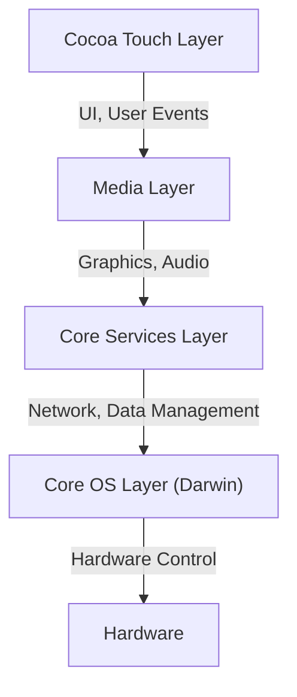
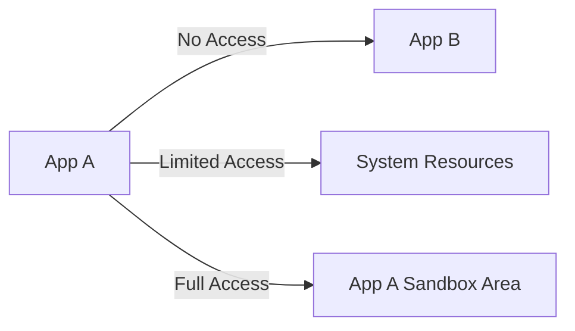

## Introduction: The Genealogy of NeXT and the Birth of iOS

Apple's mobile OS, "iOS," is a powerful operating system that drives billions of devices worldwide today. However, its underlying architecture traces back to "NeXTSTEP" from NeXT, the company Steve Jobs founded during his time away from Apple.

iOS (initially called iPhone OS) was not born simply as a lightweight OS for mobile phones, but as a subset of Mac OS X (now macOS). In other words, it was an ambitious project to fit a desktop-class, powerful Unix-based OS into a palm-sized device.

In this article, we will thoroughly dissect the profound architecture of iOS inherited from NeXTSTEP, from the lowest-level kernel to the highest-level UI framework.

## The 4-Layer Architecture of iOS

The system architecture of iOS is broadly composed of four abstraction layers. The lower you go, the closer you get to the hardware, and the higher you go, the closer you get to the user interface.

Let's look at each layer in detail.

### 1. Core OS Layer and Darwin (XNU Kernel)

The heart and most fundamental part of the iOS architecture is the **Core OS Layer**. This layer is based on the open-source Unix-compatible operating system called "Darwin."

At the core of Darwin is the **XNU Kernel** (X is Not Unix). XNU adopts a unique "hybrid kernel" approach, which is neither a pure microkernel nor a monolithic kernel.

#### Fusion of the Mach Microkernel and BSD

The XNU kernel is primarily a hybrid of the following two components:

1.  **Mach Microkernel**: Based on the Mach kernel developed at Carnegie Mellon University. Mach provides extremely low-level and fundamental functionalities such as memory management, thread scheduling, and inter-process communication (IPC). Mach's inter-process communication is based on "message passing," which forms the foundation of iOS's robustness.
2.  **BSD (Berkeley Software Distribution)**: The BSD subsystem built on top of Mach provides POSIX-compliant APIs, a network stack (TCP/IP), file systems (like APFS), and a process model. It is thanks to this BSD layer that developers can perform network communication and file operations using C and POSIX APIs.

Through this hybrid structure, iOS succeeds in combining the modularity and robustness of a microkernel with the performance of a monolithic kernel (especially the speed of system calls on the BSD side).

### 2. Core Services Layer

The Core Services Layer provides fundamental system services required by all applications. This layer is primarily written in C and Objective-C (and more recently, Swift).

Key frameworks include:

*   **Foundation / Core Foundation**: Provides the foundational functionalities for Objective-C and Swift, ranging from basic data types like strings (NSString / String), arrays (NSArray / Array), and dictionaries (NSDictionary / Dictionary), to thread management, network communication (URLSession), and file management.
*   **Core Data**: An object graph framework that manages an application's data model and abstracts persistence to local databases such as SQLite.
*   **CloudKit**: Provides access to backend services for syncing data across devices via iCloud.
*   **Grand Central Dispatch (GCD)**: A C-based API for efficient concurrent processing on multi-core processors. It frees developers from the complexities of directly managing threads; simply queueing tasks allows the system to perform optimal thread allocation.

### 3. Media Layer

The Media Layer is a collection of frameworks for handling the powerful multimedia capabilities (graphics, audio, and video) of iOS devices.

*   **Core Graphics (Quartz 2D)**: A 2D vector graphics drawing engine. It performs PDF rendering and advanced path drawing by leveraging hardware acceleration.
*   **Core Animation**: The foundation for rendering complex animations extremely smoothly (at 60fps or 120fps). By using the concept of layers (CALayer) to offload rendering processes to the GPU, it achieves high performance while reducing CPU load.
*   **Metal**: Apple's proprietary low-level graphics API, which extracts the maximum performance from the GPU. It replaces the older OpenGL ES and is used not only for 3D games but also for machine learning computations (Metal Performance Shaders).
*   **AVFoundation**: A framework for detailed control over the playback, recording, and editing of audio and video.

### 4. Cocoa Touch Layer

Situated at the highest level is the **Cocoa Touch Layer**, which is the most familiar to developers and users. This layer provides frameworks for building the visual interfaces and user interactions of iOS apps.

*   **UIKit**: The UI framework that has been the standard for iOS app development for many years. It provides components like buttons (UIButton), labels (UILabel), and table views (UITableView), and adopts an event-driven programming model (Target-Action pattern and Delegate pattern).
*   **SwiftUI**: A modern UI framework introduced in 2019 that uses declarative syntax. It features an automatic UI updating mechanism when state changes, drastically reducing the amount of code compared to UIKit and enabling more intuitive UI construction.

The name "Cocoa Touch" itself originates from adding the concept of multi-touch interfaces (Touch) to "Cocoa," the UI framework of Mac OS X.

## Robust Security Model: App Sandboxing and Data Protection

In addition to being a Unix-based OS, iOS has built an extremely strict security model tailored for the mobile environment.

### App Sandboxing

All third-party apps on iOS run in isolated environments called "sandboxes." This physically restricts an app from directly accessing the file system outside its own directory, the data of other apps, and critical areas of the system.

For an app to access resources like contacts, the camera, or the microphone, it must always request explicit permission from the user, which forms the cornerstone of privacy protection in iOS.

### Code Signing and Secure Boot

All software running on an iOS device (from the OS itself down to third-party apps) must carry a cryptographic signature verified by Apple.
This prevents the execution of malware or tampered code. Upon boot, a "secure boot chain" is executed, sequentially verifying the validity of the code starting from the hardware-level "Root of Trust."

### Data Protection and Secure Enclave

Data within the device's storage is strongly encrypted by a hardware encryption engine. When a passcode is set, the file encryption key is generated by combining the passcode with a hardware key unique to the device (stored in the Secure Enclave). As a result, even if the device is physically stolen, extracting the data is extremely difficult.

## Conclusion

iOS is not merely a system that provides a beautiful user interface. Beating inside it is a robust Unix (Darwin) heart that has matured over decades from NeXTSTEP.

The stability from the Mach microkernel's message passing, the robust network and file system from BSD, the highly abstracted Core Services and Media Layer that wrap around them, and the intuitive Cocoa Touch.

It is because these four layers play in perfect harmony and are guarded by a strict sandbox that iOS continues to be the safest and most refined mobile operating system in the world.
