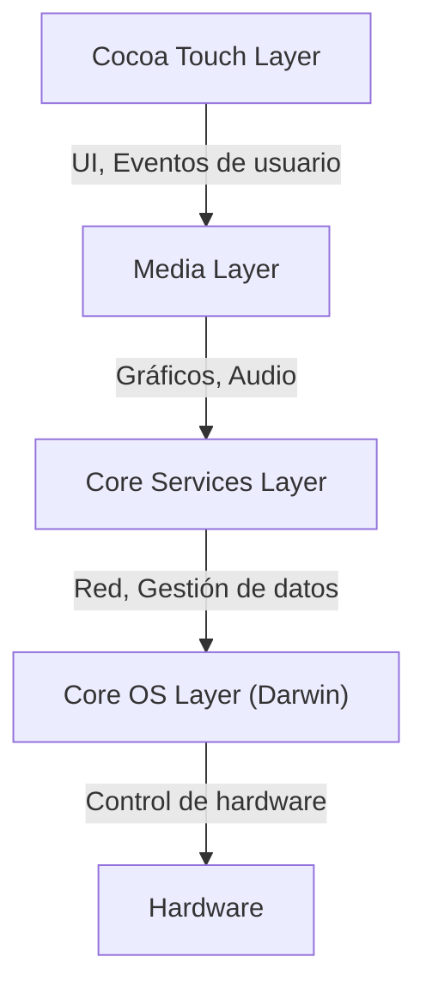
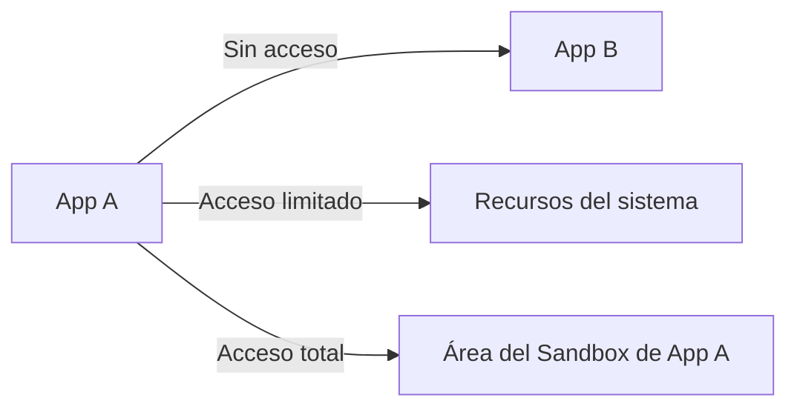

## Introducción: El linaje de NeXT y el nacimiento de iOS

El sistema operativo móvil de Apple, "iOS", es un potente sistema operativo que hoy en día impulsa miles de millones de dispositivos en todo el mundo. Sin embargo, su arquitectura subyacente se remonta a "NeXTSTEP" de NeXT, la compañía fundada por Steve Jobs durante su ausencia de Apple.

iOS (originalmente llamado iPhone OS) no nació simplemente como un sistema operativo ligero para teléfonos móviles, sino como un subconjunto de Mac OS X (ahora macOS). En otras palabras, fue un proyecto ambicioso para empaquetar un potente sistema operativo basado en Unix de clase de escritorio en un dispositivo del tamaño de la palma de la mano.

En este artículo, analizaremos en detalle la profunda arquitectura de iOS heredada de NeXTSTEP, desde el kernel de nivel más bajo hasta el framework de interfaz de usuario de nivel superior.

## La arquitectura de 4 capas de iOS

La arquitectura del sistema iOS se compone principalmente de cuatro capas de abstracción. Cuanto más baja es la capa, más cerca está del hardware, y cuanto más alta, más cerca de la interfaz de usuario.

Veamos cada capa en detalle.

### 1. Core OS Layer y Darwin (Kernel XNU)

El corazón de la arquitectura de iOS y su base más fundamental es la **Core OS Layer**. Esta capa se basa en el sistema operativo de código abierto compatible con Unix llamado "Darwin".

El núcleo de Darwin es el **Kernel XNU** (X is Not Unix). XNU emplea un enfoque único llamado "kernel híbrido", que no es puramente un microkernel ni un kernel monolítico.

#### Fusión del microkernel Mach y BSD

El kernel XNU es principalmente un híbrido de los dos componentes siguientes:

1.  **Microkernel Mach**: Basado en el kernel Mach desarrollado en la Universidad Carnegie Mellon. Mach proporciona funciones extremadamente fundamentales de bajo nivel como la gestión de memoria, la programación de hilos (thread scheduling) y la comunicación entre procesos (IPC). La comunicación entre procesos de Mach se basa en el "paso de mensajes" (message passing), que es la base de la robustez de iOS.
2.  **BSD (Berkeley Software Distribution)**: El subsistema BSD construido sobre Mach proporciona APIs compatibles con POSIX, la pila de red (TCP/IP), el sistema de archivos (como APFS) y el modelo de procesos. Gracias a esta capa BSD, los desarrolladores pueden utilizar lenguaje C o APIs POSIX para comunicaciones de red y operaciones de archivos.

Gracias a esta estructura híbrida, iOS logra combinar la modularidad y robustez del microkernel con el rendimiento del kernel monolítico (especialmente la velocidad de las llamadas al sistema del lado de BSD).

### 2. Core Services Layer

La Core Services Layer es la capa que proporciona los servicios básicos del sistema que todas las aplicaciones necesitan. Esta capa está escrita principalmente en C y Objective-C (y más recientemente en Swift).

Los frameworks principales incluyen:

*   **Foundation / Core Foundation**: Proporciona las funciones fundamentales para Objective-C y Swift, desde tipos de datos básicos como cadenas (NSString / String), arreglos (NSArray / Array) y diccionarios (NSDictionary / Dictionary), hasta la gestión de hilos, comunicación de red (URLSession) y gestión de archivos.
*   **Core Data**: Un framework de grafos de objetos que gestiona el modelo de datos de la aplicación y abstrae la persistencia en bases de datos locales como SQLite.
*   **CloudKit**: Proporciona acceso a servicios backend para sincronizar datos entre dispositivos a través de iCloud.
*   **Grand Central Dispatch (GCD)**: Una API basada en C para ejecutar eficientemente el procesamiento concurrente en procesadores multinúcleo. Libera a los desarrolladores de la complejidad de gestionar hilos directamente; el sistema asigna hilos de manera óptima simplemente poniendo tareas en una cola.

### 3. Media Layer

La Media Layer es un conjunto de frameworks para manejar las potentes capacidades multimedia (gráficos, audio y video) de los dispositivos iOS.

*   **Core Graphics (Quartz 2D)**: El motor de dibujo de gráficos vectoriales 2D. Realiza el renderizado de PDF y el dibujo avanzado de trazados utilizando aceleración de hardware.
*   **Core Animation**: La base para renderizar animaciones complejas de manera extremadamente fluida (a 60fps o 120fps). Utilizando el concepto de capas (CALayer), descarga el procesamiento de dibujo en la GPU, reduciendo la carga de la CPU mientras mantiene un alto rendimiento.
*   **Metal**: La API de gráficos de bajo nivel propia de Apple, que maximiza el rendimiento de la GPU. Reemplazando al antiguo OpenGL ES, se utiliza no solo para juegos 3D, sino también para cálculos de aprendizaje automático (Metal Performance Shaders).
*   **AVFoundation**: Un framework para el control detallado de la reproducción, grabación y edición de audio y video.

### 4. Cocoa Touch Layer

Ubicada en el nivel superior, se encuentra la **Cocoa Touch Layer**, que es la más familiar para desarrolladores y usuarios. Esta capa proporciona los frameworks para construir la interfaz visual y la interacción del usuario de las aplicaciones iOS.

*   **UIKit**: El framework de UI que ha sido el estándar para el desarrollo de aplicaciones iOS durante muchos años. Proporciona componentes como botones (UIButton), etiquetas (UILabel) y vistas de tabla (UITableView), y emplea modelos de programación basados en eventos (como el patrón Target-Action y el patrón Delegate).
*   **SwiftUI**: El último framework de UI introducido en 2019, que utiliza una sintaxis declarativa. Cuenta con un mecanismo donde la UI se actualiza automáticamente cuando cambia el estado (State), reduciendo significativamente la cantidad de código escrito en comparación con UIKit y permitiendo una construcción de UI más intuitiva.

El nombre "Cocoa Touch" proviene de la adición del concepto de interfaz multitáctil (Touch) al framework de UI de Mac OS X, "Cocoa".

## Modelo de seguridad robusto: App Sandboxing y protección de datos

Además de ser un sistema operativo basado en Unix, iOS ha construido un modelo de seguridad extremadamente estricto diseñado específicamente para entornos móviles.

### App Sandboxing (Aislamiento de aplicaciones)

Todas las aplicaciones de terceros en iOS se ejecutan en entornos aislados llamados "sandbox". Esto restringe físicamente que las aplicaciones accedan directamente al sistema de archivos fuera de su propio directorio, a los datos de otras aplicaciones o a áreas críticas del sistema.

Para que una aplicación acceda a recursos como contactos, cámara o micrófono, siempre debe solicitar un permiso explícito al usuario, lo cual forma la base de la protección de la privacidad en iOS.

### Firma de código (Code Signing) y arranque seguro

Todo el software que se ejecuta en un dispositivo iOS (desde el propio SO hasta aplicaciones de terceros) debe tener una firma criptográfica verificada por Apple.
Esto previene la ejecución de malware o código manipulado. En el arranque, se ejecuta una "cadena de arranque seguro" (secure boot chain) que verifica secuencialmente la validez del código a partir de una "Raíz de confianza" (Root of Trust) a nivel de hardware.

### Protección de datos (Data Protection) y Secure Enclave

Los datos en el almacenamiento del dispositivo están fuertemente encriptados por un motor de encriptación de hardware. Si se configura un código de acceso, la clave de encriptación de los archivos se genera combinando el código de acceso y una clave de hardware única del dispositivo (almacenada en el Secure Enclave). Esto hace que sea extremadamente difícil extraer datos incluso si el dispositivo es robado físicamente.

## Resumen

iOS no es solo un sistema que proporciona una hermosa interfaz de usuario. En su interior, late el fuerte corazón de Unix (Darwin), que ha madurado a lo largo de décadas desde NeXTSTEP.

La estabilidad mediante el paso de mensajes del microkernel Mach, la robusta red y sistema de archivos proporcionados por BSD, la abstracción de alto nivel de Core Services y Media Layer que los envuelve, y el intuitivo Cocoa Touch.

Precisamente porque estas cuatro capas tocan en perfecta armonía y están protegidas por un estricto sandbox, iOS sigue siendo el sistema operativo móvil más seguro y refinado del mundo.
