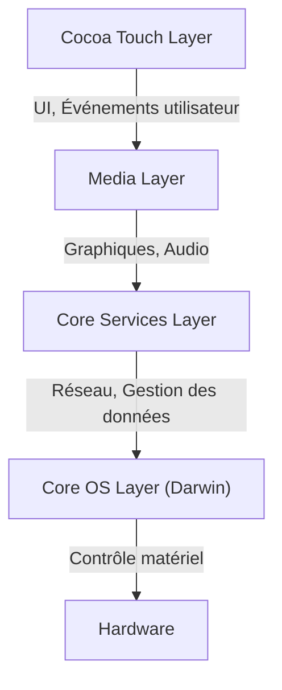
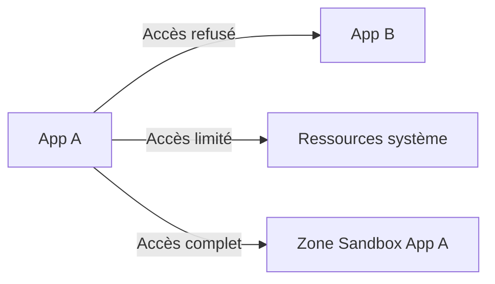

## Introduction : la généalogie de NeXT et la naissance d'iOS

"iOS", le système d'exploitation mobile d'Apple, est un puissant système d'exploitation qui anime des milliards d'appareils dans le monde aujourd'hui. Cependant, son architecture sous-jacente remonte à "NeXTSTEP" de la société NeXT, fondée par Steve Jobs à l'époque où il avait quitté Apple.

iOS (initialement appelé iPhone OS) n'est pas né simplement comme un OS léger pour les téléphones portables, mais comme un sous-ensemble de Mac OS X (actuellement macOS). En d'autres termes, il s'agissait d'un projet ambitieux visant à intégrer un puissant OS basé sur Unix de classe bureau dans un appareil tenant dans la paume de la main.

Dans cet article, nous disséquerons en détail la profonde architecture d'iOS héritée de NeXTSTEP, depuis le noyau au niveau le plus bas jusqu'au framework d'interface utilisateur au niveau le plus haut.

## L'architecture en 4 couches d'iOS

L'architecture du système iOS est composée de quatre grandes couches d'abstraction. Plus on descend, plus on se rapproche du matériel, et plus on monte, plus on se rapproche de l'interface utilisateur.

Examinons chaque couche en détail.

### 1. Couche Core OS et Darwin (Noyau XNU)

Le cœur de l'architecture iOS, à son niveau le plus fondamental, est la **Core OS Layer**. Cette couche est basée sur un système d'exploitation open source compatible Unix appelé "Darwin".

Le cœur de Darwin est le **noyau XNU** (X is Not Unix). XNU adopte une approche unique de "noyau hybride", n'étant ni un pur micro-noyau ni un noyau monolithique.

#### La fusion du micro-noyau Mach et de BSD

Le noyau XNU est principalement un hybride des deux composants suivants :

1.  **Micro-noyau Mach** : Basé sur le noyau Mach développé à l'Université Carnegie Mellon. Mach fournit des fonctions très bas niveau et fondamentales telles que la gestion de la mémoire, l'ordonnancement des threads et la communication inter-processus (IPC). La communication inter-processus de Mach est basée sur le "passage de messages", ce qui constitue la base de la robustesse d'iOS.
2.  **BSD (Berkeley Software Distribution)** : Le sous-système BSD construit au-dessus de Mach fournit des API compatibles POSIX, une pile réseau (TCP/IP), un système de fichiers (tel qu'APFS) et un modèle de processus. C'est grâce à cette couche BSD que les développeurs peuvent utiliser le langage C et les API POSIX pour les communications réseau et les opérations sur les fichiers.

Grâce à cette structure hybride, iOS a réussi à combiner la modularité et la robustesse d'un micro-noyau avec les performances d'un noyau monolithique (en particulier la rapidité des appels système du côté BSD).

### 2. Couche Core Services

La Core Services Layer est la couche qui fournit les services système fondamentaux requis par toutes les applications. Cette couche est principalement écrite en C et Objective-C (et plus récemment en Swift).

Les principaux frameworks incluent :

*   **Foundation / Core Foundation** : Fournit des types de données de base tels que les chaînes (NSString / String), les tableaux (NSArray / Array) et les dictionnaires (NSDictionary / Dictionary), ainsi que des fonctionnalités fondamentales pour Objective-C et Swift telles que la gestion des threads, la communication réseau (URLSession) et la gestion des fichiers.
*   **Core Data** : Un framework de graphe d'objets qui gère le modèle de données de l'application et abstrait la persistance vers des bases de données locales telles que SQLite.
*   **CloudKit** : Fournit l'accès aux services back-end pour synchroniser les données entre les appareils via iCloud.
*   **Grand Central Dispatch (GCD)** : Une API basée sur le langage C pour un traitement simultané efficace sur des processeurs multicœurs. Elle libère les développeurs de la complexité de la gestion directe des threads ; il suffit de mettre les tâches en file d'attente, et le système effectue l'allocation optimale des threads.

### 3. Couche Media

La Media Layer est un ensemble de frameworks permettant de gérer les puissantes capacités multimédias (graphiques, audio, vidéo) des appareils iOS.

*   **Core Graphics (Quartz 2D)** : Un moteur de dessin de graphiques vectoriels 2D. Il gère le rendu de PDF et le dessin de tracés avancés en tirant parti de l'accélération matérielle.
*   **Core Animation** : Une base pour le rendu d'animations complexes de manière extrêmement fluide (à 60 fps ou 120 fps). En utilisant le concept de couches (CALayer) et en déchargeant le traitement de dessin sur le GPU, il atteint des performances élevées tout en réduisant la charge du processeur.
*   **Metal** : L'API graphique de bas niveau propriétaire d'Apple, qui exploite au maximum les performances du GPU. Destinée à remplacer l'ancien OpenGL ES, elle est utilisée non seulement pour les jeux 3D, mais aussi pour les calculs d'apprentissage automatique (Metal Performance Shaders).
*   **AVFoundation** : Un framework pour contrôler en détail la lecture, l'enregistrement et le montage audio et vidéo.

### 4. Couche Cocoa Touch

Située tout en haut, la **Cocoa Touch Layer** est la plus familière pour les développeurs et les utilisateurs. Cette couche fournit les frameworks pour construire l'interface visuelle et les interactions utilisateur des applications iOS.

*   **UIKit** : Le framework d'interface utilisateur standard pour le développement d'applications iOS depuis de nombreuses années. Il fournit des composants tels que des boutons (UIButton), des étiquettes (UILabel) et des vues de tableau (UITableView), et adopte un modèle de programmation événementielle (modèle Cible-Action et modèle Délégué).
*   **SwiftUI** : Un framework d'interface utilisateur moderne introduit en 2019 qui utilise une syntaxe déclarative. Il dispose d'un mécanisme permettant à l'interface utilisateur de se mettre à jour automatiquement lorsque l'état (State) change, réduisant considérablement la quantité de code par rapport à UIKit et permettant une construction d'interface utilisateur plus intuitive.

Le nom "Cocoa Touch" lui-même vient de l'ajout du concept d'interface multi-touch (Touch) à "Cocoa", le framework d'interface utilisateur de Mac OS X.

## Un modèle de sécurité robuste : bac à sable des applications et protection des données

En plus d'être un système d'exploitation basé sur Unix, iOS a construit un modèle de sécurité extrêmement strict, spécialement conçu pour les environnements mobiles.

### App Sandboxing (Mise en bac à sable des applications)

Toutes les applications tierces sur iOS s'exécutent dans un environnement isolé appelé "bac à sable" (sandbox). Cela empêche physiquement l'application d'accéder directement au système de fichiers en dehors de son propre répertoire, aux données d'autres applications ou aux zones critiques du système.

Pour qu'une application accède à des ressources telles que les contacts, l'appareil photo ou le microphone, elle doit obligatoirement demander une autorisation explicite (permission) à l'utilisateur, ce qui constitue le fondement de la protection de la vie privée sur iOS.

### Signature de code (Code Signing) et démarrage sécurisé

Tous les logiciels exécutés sur un appareil iOS (du système d'exploitation lui-même aux applications tierces) doivent avoir une signature cryptographique vérifiée par Apple.
Cela empêche l'exécution de logiciels malveillants et de code falsifié. Au démarrage, une "chaîne de démarrage sécurisée" (secure boot chain) est exécutée, vérifiant séquentiellement la validité du code à partir d'une "Racine de confiance" (Root of Trust) au niveau matériel.

### Protection des données (Data Protection) et Secure Enclave

Les données contenues dans le stockage de l'appareil sont fortement cryptées par un moteur de cryptage matériel. Lorsqu'un code d'accès est défini, la clé de cryptage du fichier est générée en combinant le code d'accès et une clé matérielle spécifique à l'appareil (stockée dans la Secure Enclave). En conséquence, même si l'appareil est physiquement volé, l'extraction des données devient extrêmement difficile.

## Conclusion

iOS n'est pas simplement un système qui fournit une belle interface utilisateur. En son sein bat le cœur d'un Unix robuste (Darwin), mûri au fil des décennies depuis NeXTSTEP.

La stabilité grâce au passage de messages du micro-noyau Mach, le réseau et le système de fichiers robustes de BSD, les Core Services et Media Layer hautement abstraits qui les enveloppent, et le Cocoa Touch intuitif.

C'est parce que ces quatre couches fonctionnent en parfaite harmonie et sont protégées par un bac à sable strict qu'iOS reste le système d'exploitation mobile le plus sûr et le plus raffiné au monde.
