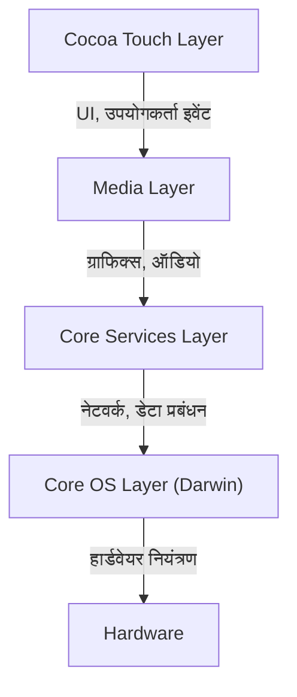
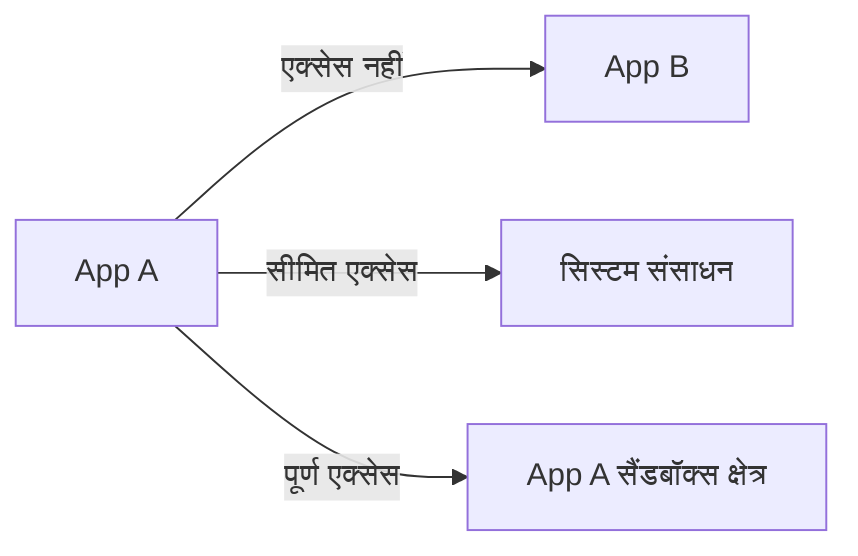

## परिचय: NeXT की वंशावली और iOS का जन्म

Apple का मोबाइल OS, "iOS", एक शक्तिशाली ऑपरेटिंग सिस्टम है जो आज दुनिया भर में अरबों उपकरणों को संचालित कर रहा है। हालाँकि, इसके अंतर्निहित आर्किटेक्चर की जड़ें "NeXTSTEP" तक जाती हैं, जिसे स्टीव जॉब्स ने Apple से दूर रहने के दौरान स्थापित की गई कंपनी NeXT में विकसित किया था।

iOS (शुरुआत में इसे iPhone OS कहा जाता था) का जन्म केवल मोबाइल फोन के लिए एक हल्के OS के रूप में नहीं हुआ था, बल्कि Mac OS X (अब macOS) के एक सबसेट के रूप में हुआ था। दूसरे शब्दों में, यह डेस्कटॉप-क्लास के शक्तिशाली यूनिक्स-आधारित OS को एक हथेली के आकार के डिवाइस में फिट करने का एक महत्वाकांक्षी प्रोजेक्ट था।

इस लेख में, हम NeXTSTEP से विरासत में मिले iOS के गहरे आर्किटेक्चर का विस्तार से विश्लेषण करेंगे, सबसे निचले स्तर के कर्नेल से लेकर सबसे ऊपरी UI फ्रेमवर्क तक।

## iOS का 4-लेयर आर्किटेक्चर

iOS का सिस्टम आर्किटेक्चर मुख्य रूप से चार एब्स्ट्रेक्शन लेयर्स (abstraction layers) से बना है। आप जितना नीचे जाएंगे, यह हार्डवेयर के उतना ही करीब होगा, और आप जितना ऊपर जाएंगे, यह यूजर इंटरफेस के उतना ही करीब होगा।

आइए प्रत्येक लेयर को विस्तार से देखें।

### 1. Core OS Layer और Darwin (XNU कर्नेल)

iOS आर्किटेक्चर का हृदय और इसका सबसे मूलभूत हिस्सा **Core OS Layer** है। यह लेयर "Darwin" नामक ओपन-सोर्स यूनिक्स-संगत ऑपरेटिंग सिस्टम पर आधारित है।

Darwin के मूल में **XNU कर्नेल** (X is Not Unix) है। XNU न तो एक शुद्ध माइक्रोकर्नेल है और न ही मोनोलिथिक कर्नेल, बल्कि यह "हाइब्रिड कर्नेल" (Hybrid Kernel) नामक एक अनूठा दृष्टिकोण अपनाता है।

#### Mach माइक्रोकर्नेल और BSD का विलय

XNU कर्नेल मुख्य रूप से निम्नलिखित दो घटकों का एक हाइब्रिड है:

1.  **Mach माइक्रोकर्नेल**: यह कार्नेगी मेलॉन विश्वविद्यालय में विकसित Mach कर्नेल पर आधारित है। Mach बहुत ही निम्न-स्तरीय और बुनियादी सुविधाएँ प्रदान करता है जैसे मेमोरी प्रबंधन, थ्रेड शेड्यूलिंग, और इंटर-प्रोसेस कम्युनिकेशन (IPC)। Mach का इंटर-प्रोसेस कम्युनिकेशन "मैसेज पासिंग" (message passing) पर आधारित है, जो iOS की मजबूती का आधार है।
2.  **BSD (Berkeley Software Distribution)**: Mach के ऊपर निर्मित BSD सबसिस्टम, POSIX-संगत API, नेटवर्क स्टैक (TCP/IP), फाइल सिस्टम (जैसे APFS), और प्रोसेस मॉडल प्रदान करता है। डेवलपर्स इस BSD लेयर के कारण नेटवर्क संचार और फ़ाइल संचालन करने के लिए C भाषा और POSIX API का उपयोग कर सकते हैं।

इस हाइब्रिड संरचना के कारण, iOS सफलतापूर्वक माइक्रोकर्नेल की मॉड्यूलरिटी और मजबूती को मोनोलिथिक कर्नेल के प्रदर्शन (विशेषकर BSD पक्ष पर तेज़ सिस्टम कॉल) के साथ जोड़ता है।

### 2. Core Services Layer

Core Services Layer वह लेयर है जो सभी एप्लिकेशन द्वारा आवश्यक बुनियादी सिस्टम सेवाएँ प्रदान करती है। यह लेयर मुख्य रूप से C और Objective-C (और हाल ही में Swift) में लिखी गई है।

प्रमुख फ्रेमवर्क्स में शामिल हैं:

*   **Foundation / Core Foundation**: यह Objective-C और Swift के लिए मूलभूत सुविधाएँ प्रदान करता है, जैसे स्ट्रिंग्स (NSString / String), एरेज़ (NSArray / Array), और डिक्शनरी (NSDictionary / Dictionary) जैसे बुनियादी डेटा प्रकार, साथ ही थ्रेड प्रबंधन, नेटवर्क संचार (URLSession), और फ़ाइल प्रबंधन।
*   **Core Data**: एक ऑब्जेक्ट ग्राफ़ फ्रेमवर्क जो एप्लिकेशन के डेटा मॉडल को प्रबंधित करता है और SQLite जैसे स्थानीय डेटाबेस में परसिस्टेंस (persistence) को एब्स्ट्रेक्ट करता है।
*   **CloudKit**: iCloud के माध्यम से उपकरणों के बीच डेटा सिंक करने के लिए बैकएंड सेवाओं तक पहुंच प्रदान करता है।
*   **Grand Central Dispatch (GCD)**: मल्टी-कोर प्रोसेसर पर एक साथ प्रोसेसिंग को कुशलतापूर्वक करने के लिए एक C-आधारित API। यह डेवलपर्स को सीधे थ्रेड्स को प्रबंधित करने की जटिलता से मुक्त करता है; बस कार्यों को एक कतार (queue) में रखें और सिस्टम इष्टतम थ्रेड आवंटन को संभाल लेगा।

### 3. Media Layer

Media Layer फ्रेमवर्क्स का एक समूह है जो iOS उपकरणों की शक्तिशाली मल्टीमीडिया क्षमताओं (ग्राफिक्स, ऑडियो और वीडियो) को संभालता है।

*   **Core Graphics (Quartz 2D)**: एक 2D वेक्टर ग्राफिक्स ड्राइंग इंजन। यह PDF रेंडरिंग और हार्डवेयर त्वरण (hardware acceleration) का उपयोग करके उन्नत पथ ड्राइंग (advanced path drawing) निष्पादित करता है।
*   **Core Animation**: अत्यंत सुचारू रूप से (60fps या 120fps पर) जटिल एनिमेशन बनाने के लिए आधार। लेयर्स (CALayer) की अवधारणा का उपयोग करके, यह ड्राइंग प्रोसेसिंग को GPU पर ऑफलोड करता है, जिससे CPU पर लोड कम होता है और उच्च प्रदर्शन प्राप्त होता है।
*   **Metal**: Apple का अपना निम्न-स्तरीय ग्राफिक्स API जो GPU के प्रदर्शन को अधिकतम करता है। यह पुराने OpenGL ES को प्रतिस्थापित करता है और न केवल 3D गेम्स के लिए बल्कि मशीन लर्निंग गणनाओं (Metal Performance Shaders) के लिए भी उपयोग किया जाता है।
*   **AVFoundation**: ऑडियो और वीडियो के प्लेबैक, रिकॉर्डिंग और संपादन को विस्तार से नियंत्रित करने के लिए एक फ्रेमवर्क।

### 4. Cocoa Touch Layer

सबसे ऊपरी स्तर पर **Cocoa Touch Layer** है, जो डेवलपर्स और उपयोगकर्ताओं के लिए सबसे परिचित है। यह लेयर iOS ऐप्स के विज़ुअल इंटरफेस और उपयोगकर्ता इंटरैक्शन को बनाने के लिए फ्रेमवर्क प्रदान करती है।

*   **UIKit**: UI फ्रेमवर्क जो कई वर्षों से iOS ऐप डेवलपमेंट के लिए मानक रहा है। यह बटन (UIButton), लेबल (UILabel), और टेबल व्यू (UITableView) जैसे घटक प्रदान करता है, और एक इवेंट-ड्रिवन प्रोग्रामिंग मॉडल (टारगेट-एक्शन पैटर्न और डेलीगेट पैटर्न) को अपनाता है।
*   **SwiftUI**: 2019 में पेश किया गया एक आधुनिक UI फ्रेमवर्क जो डिक्लेरेटिव सिंटैक्स (declarative syntax) का उपयोग करता है। जब स्टेट (State) बदलती है तो इसमें स्वचालित रूप से UI को अपडेट करने का तंत्र होता है, जिससे UIKit की तुलना में लिखे जाने वाले कोड की मात्रा काफी कम हो जाती है और अधिक सहज UI निर्माण सक्षम होता है।

"Cocoa Touch" नाम स्वयं Mac OS X के UI फ्रेमवर्क "Cocoa" में मल्टी-टच इंटरफ़ेस (Touch) की अवधारणा को जोड़ने से आया है।

## मजबूत सुरक्षा मॉडल: ऐप सैंडबॉक्सिंग और डेटा संरक्षण

एक यूनिक्स-आधारित OS होने के अलावा, iOS में मोबाइल वातावरण के लिए तैयार किया गया एक अत्यंत सख्त सुरक्षा मॉडल है।

### App Sandboxing (ऐप सैंडबॉक्सिंग)

iOS पर सभी थर्ड-पार्टी ऐप्स को "सैंडबॉक्स" (sandbox) नामक एक पृथक वातावरण में निष्पादित किया जाता है। यह ऐप्स को भौतिक रूप से अपनी निर्देशिका (directory) के बाहर के फ़ाइल सिस्टम, अन्य ऐप्स के डेटा या सिस्टम के महत्वपूर्ण क्षेत्रों तक सीधे पहुंचने से रोकता है।

ऐप्स को संपर्क (contacts), कैमरा, माइक्रोफ़ोन आदि जैसे संसाधनों तक पहुँचने के लिए हमेशा उपयोगकर्ता से स्पष्ट अनुमति (permission) मांगनी चाहिए, जो iOS गोपनीयता सुरक्षा का मूल है।

### कोड साइनिंग (Code Signing) और सुरक्षित बूट (Secure Boot)

iOS डिवाइस पर चलने वाले सभी सॉफ़्टवेयर (OS से लेकर थर्ड-पार्टी ऐप्स तक) में Apple द्वारा सत्यापित एक एन्क्रिप्टेड हस्ताक्षर (encrypted signature) होना चाहिए।
यह मैलवेयर या छेड़छाड़ किए गए कोड को निष्पादित होने से रोकता है। बूट अप करते समय, एक "सिक्योर बूट चेन" निष्पादित होती है जो हार्डवेयर-स्तर के "रूट ऑफ ट्रस्ट" (Root of Trust) से शुरू होकर अनुक्रमिक रूप से कोड की वैधता को सत्यापित करती है।

### डेटा संरक्षण (Data Protection) और Secure Enclave

डिवाइस के स्टोरेज पर मौजूद डेटा को हार्डवेयर एन्क्रिप्शन इंजन द्वारा मजबूती से एन्क्रिप्ट किया जाता है। यदि पासकोड सेट किया गया है, तो फ़ाइल एन्क्रिप्शन कुंजी (key) पासकोड और डिवाइस-विशिष्ट हार्डवेयर कुंजी (जो Secure Enclave में संग्रहीत है) के संयोजन का उपयोग करके उत्पन्न की जाती है। यह डिवाइस के भौतिक रूप से चोरी हो जाने पर भी डेटा को निकालना बेहद मुश्किल बना देता है।

## निष्कर्ष

iOS केवल एक सुंदर उपयोगकर्ता इंटरफ़ेस प्रदान करने वाला सिस्टम नहीं है। इसके भीतर एक मजबूत यूनिक्स (Darwin) दिल धड़कता है जो NeXTSTEP से दशकों तक परिपक्व हुआ है।

Mach माइक्रोकर्नेल के मैसेज पासिंग के माध्यम से स्थिरता, BSD द्वारा प्रदान किया गया मजबूत नेटवर्क और फाइल सिस्टम, और उन्हें समाहित करने वाले अत्यधिक एब्स्ट्रैक्ट Core Services और Media Layer, साथ ही सहज ज्ञान युक्त Cocoa Touch।

चूंकि ये चार परतें पूर्ण सामंजस्य में काम करती हैं और एक सख्त सैंडबॉक्स द्वारा संरक्षित हैं, iOS दुनिया का सबसे सुरक्षित और परिष्कृत मोबाइल ऑपरेटिंग सिस्टम बना हुआ है。
