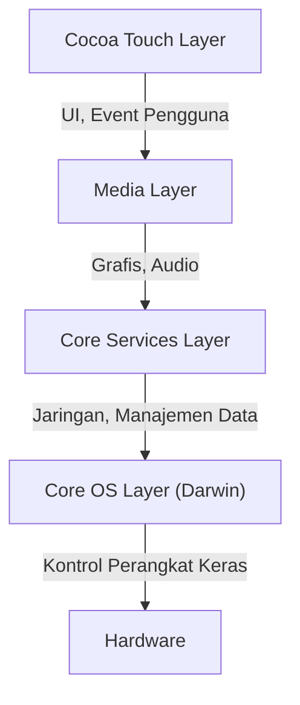
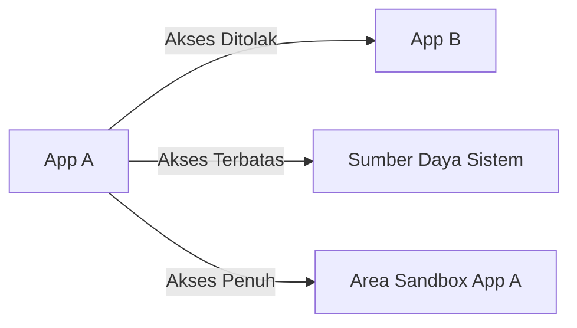

## Pengantar: Silsilah NeXT dan Kelahiran iOS

"iOS", sistem operasi seluler Apple, adalah sistem operasi kuat yang menggerakkan miliaran perangkat di seluruh dunia saat ini. Namun, arsitektur yang mendasarinya dapat ditelusuri kembali ke "NeXTSTEP" milik NeXT, perusahaan yang didirikan oleh Steve Jobs selama masa ketidakhadirannya dari Apple.

iOS (awalnya disebut iPhone OS) lahir tidak sekadar sebagai OS ringan untuk ponsel, melainkan sebagai bagian (subset) dari Mac OS X (sekarang macOS). Dengan kata lain, ini adalah proyek ambisius untuk memuat OS berbasis Unix sekelas desktop yang tangguh ke dalam perangkat seukuran telapak tangan.

Dalam artikel ini, kita akan membedah secara mendetail arsitektur mendalam iOS yang diwarisi dari NeXTSTEP, mulai dari lapisan kernel terbawah hingga framework UI teratas.

## Arsitektur 4 Lapis iOS

Arsitektur sistem iOS dapat dibagi secara garis besar menjadi empat lapisan abstraksi. Semakin ke bawah, semakin dekat dengan perangkat keras, dan semakin ke atas, semakin dekat dengan antarmuka pengguna (user interface).

Mari kita lihat setiap lapisan secara lebih detail.

### 1. Core OS Layer dan Darwin (Kernel XNU)

Jantung dari arsitektur iOS, yang berada pada tingkat paling dasar, adalah **Core OS Layer**. Lapisan ini didasarkan pada sistem operasi sumber terbuka (open-source) yang kompatibel dengan Unix bernama "Darwin".

Inti dari Darwin adalah **Kernel XNU** (X is Not Unix). XNU bukan murni mikrokernel (microkernel) dan bukan pula kernel monolitik (monolithic kernel), melainkan mengadopsi pendekatan unik yang disebut "kernel hibrida" (hybrid kernel).

#### Penggabungan Mikrokernel Mach dan BSD

Kernel XNU pada dasarnya adalah hibrida dari dua komponen utama berikut:

1.  **Mikrokernel Mach**: Berbasis pada kernel Mach yang dikembangkan di Universitas Carnegie Mellon. Mach menyediakan fungsionalitas tingkat sangat rendah dan esensial seperti manajemen memori, penjadwalan thread, dan komunikasi antar-proses (IPC - Inter-Process Communication). Komunikasi antar-proses di Mach didasarkan pada "message passing", yang merupakan dasar dari ketangguhan iOS.
2.  **BSD (Berkeley Software Distribution)**: Subsistem BSD yang dibangun di atas Mach menyediakan API yang kompatibel dengan POSIX, tumpukan jaringan (TCP/IP), sistem file (seperti APFS), dan model proses. Berkat lapisan BSD inilah pengembang dapat menggunakan bahasa C dan API POSIX untuk komunikasi jaringan dan operasi file.

Dengan struktur hibrida ini, iOS berhasil menggabungkan modularitas dan ketangguhan mikrokernel dengan kinerja kernel monolitik (terutama kecepatan system call pada sisi BSD).

### 2. Core Services Layer

Core Services Layer adalah lapisan yang menyediakan layanan sistem dasar yang dibutuhkan oleh semua aplikasi. Lapisan ini terutama ditulis dalam bahasa C dan Objective-C (dan pada tahun-tahun terakhir, Swift).

Framework utama pada lapisan ini meliputi:

*   **Foundation / Core Foundation**: Menyediakan fungsionalitas dasar untuk Objective-C dan Swift, mulai dari tipe data dasar seperti string (NSString / String), array (NSArray / Array), dan kamus (NSDictionary / Dictionary), hingga manajemen thread, komunikasi jaringan (URLSession), dan manajemen file.
*   **Core Data**: Framework object-graph yang mengelola model data aplikasi dan mengabstraksikan persistensi ke database lokal seperti SQLite.
*   **CloudKit**: Menyediakan akses ke layanan backend untuk menyinkronkan data di seluruh perangkat melalui iCloud.
*   **Grand Central Dispatch (GCD)**: API berbasis bahasa C untuk melakukan pemrosesan bersamaan (concurrent processing) secara efisien pada prosesor multi-core. Ini membebaskan pengembang dari kerumitan mengelola thread secara langsung; pengembang hanya perlu menempatkan tugas ke dalam antrean (queue), dan sistem akan mengalokasikan thread secara optimal.

### 3. Media Layer

Media Layer adalah kumpulan framework untuk menangani kemampuan multimedia yang tangguh pada perangkat iOS (grafis, audio, dan video).

*   **Core Graphics (Quartz 2D)**: Mesin rendering grafis vektor 2D. Ia menangani rendering PDF dan penggambaran jalur (path) tingkat lanjut menggunakan akselerasi perangkat keras.
*   **Core Animation**: Fondasi untuk merender animasi yang kompleks dengan sangat halus (pada 60fps atau 120fps). Dengan menggunakan konsep lapisan (CALayer) dan mengalihkan proses rendering ke GPU, lapisan ini mewujudkan kinerja tinggi sekaligus mengurangi beban CPU.
*   **Metal**: API grafis tingkat rendah milik Apple sendiri, yang mengeluarkan potensi maksimal dari GPU. API ini menggantikan OpenGL ES yang lama, dan tidak hanya digunakan untuk game 3D, tetapi juga untuk komputasi machine learning (Metal Performance Shaders).
*   **AVFoundation**: Framework untuk mengontrol secara mendetail pemutaran, perekaman, dan pengeditan audio dan video.

### 4. Cocoa Touch Layer

Terletak di lapisan paling atas, **Cocoa Touch Layer** adalah yang paling akrab bagi pengembang dan pengguna. Lapisan ini menyediakan framework untuk membangun antarmuka visual dan interaksi pengguna dari aplikasi iOS.

*   **UIKit**: Framework UI yang selama bertahun-tahun menjadi standar dalam pengembangan aplikasi iOS. Ia menyediakan komponen seperti tombol (UIButton), label (UILabel), dan tampilan tabel (UITableView), serta mengadopsi model pemrograman yang digerakkan oleh event (event-driven) seperti pola Target-Action dan pola Delegate.
*   **SwiftUI**: Framework UI modern yang diperkenalkan pada tahun 2019 yang menggunakan sintaks deklaratif (declarative syntax). UI ini memiliki mekanisme untuk memperbarui secara otomatis ketika status (State) berubah, secara signifikan mengurangi jumlah penulisan kode dibandingkan dengan UIKit, dan memungkinkan pembuatan UI yang lebih intuitif.

Nama "Cocoa Touch" sendiri berasal dari penambahan konsep antarmuka multi-sentuh (Touch) pada "Cocoa", yang merupakan framework UI dari Mac OS X.

## Model Keamanan Tangguh: App Sandboxing dan Perlindungan Data

Selain menjadi OS berbasis Unix, iOS telah membangun model keamanan yang sangat ketat dan dirancang khusus untuk lingkungan seluler.

### App Sandboxing (Sandboxing Aplikasi)

Semua aplikasi pihak ketiga di iOS berjalan di lingkungan yang terisolasi dan disebut "sandbox". Secara fisik, hal ini membatasi aplikasi untuk mengakses secara langsung sistem file di luar direktorinya sendiri, data dari aplikasi lain, atau area sistem yang penting.

Agar sebuah aplikasi dapat mengakses sumber daya seperti kontak, kamera, atau mikrofon, aplikasi tersebut wajib meminta izin yang jelas dari pengguna. Hal ini merupakan dasar perlindungan privasi di iOS.

### Tanda Tangan Kode (Code Signing) dan Boot Aman (Secure Boot)

Setiap perangkat lunak yang berjalan di perangkat iOS (mulai dari OS itu sendiri hingga aplikasi pihak ketiga) harus memiliki tanda tangan terenkripsi (cryptographic signature) yang diverifikasi oleh Apple.
Ini mencegah eksekusi perangkat lunak perusak (malware) dan kode yang telah dimodifikasi. Saat startup, "Secure Boot Chain" berjalan untuk memverifikasi keabsahan kode secara berurutan, dimulai dari tingkat perangkat keras yaitu "Root of Trust".

### Perlindungan Data (Data Protection) dan Secure Enclave

Data yang berada di penyimpanan perangkat dienkripsi dengan kuat oleh mesin enkripsi perangkat keras. Jika kode sandi (passcode) disetel, kunci enkripsi file dihasilkan dengan menggabungkan kode sandi dengan kunci perangkat keras khusus perangkat (yang disimpan di Secure Enclave). Hal ini membuat pencurian data sangat sulit bahkan jika perangkat secara fisik dicuri.

## Kesimpulan

iOS bukan sekadar sistem yang menyediakan antarmuka pengguna yang cantik. Jauh di dalamnya, jantung Unix (Darwin) yang tangguh dan telah matang selama beberapa dekade sejak NeXTSTEP, terus berdetak.

Stabilitas berkat message passing dari mikrokernel Mach, sistem file dan jaringan tangguh berkat BSD, dan dibungkus oleh abstraksi tingkat tinggi di Core Services dan Media Layer, serta Cocoa Touch yang intuitif.

Karena keempat lapisan ini bekerja dalam harmoni yang sempurna dan dilindungi oleh sandbox yang ketat, iOS terus menjadi sistem operasi seluler yang paling aman dan canggih di dunia.
