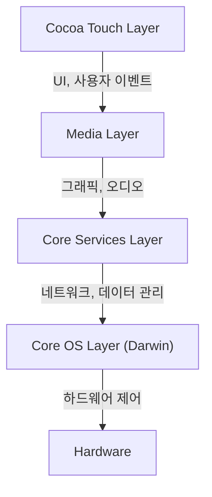
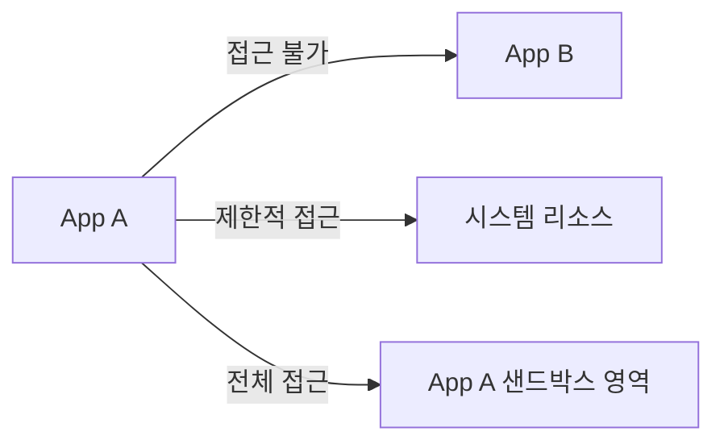

## 들어가며: NeXT의 계보와 iOS의 탄생

Apple의 모바일 OS인 'iOS'는 오늘날 전 세계 수십억 대의 기기를 구동하고 있는 강력한 운영 체제입니다. 하지만 그 근저에 있는 아키텍처는 스티브 잡스가 Apple을 떠나 있던 시절 설립한 NeXT사의 'NeXTSTEP'까지 거슬러 올라갑니다.

iOS(초기에는 iPhone OS라고 불렸습니다)는 단순한 휴대전화용 경량 OS가 아니라, Mac OS X(현재의 macOS)의 서브셋으로 탄생했습니다. 즉, 데스크톱 수준의 강력한 Unix 기반 OS를 손바닥 만한 기기에 담으려는 야심 찬 프로젝트였던 것입니다.

이 글에서는 NeXTSTEP으로부터 물려받은 iOS의 심연과도 같은 아키텍처를 최하단 커널부터 최상위 UI 프레임워크까지 상세히 해부해 보겠습니다.

## iOS의 4계층 아키텍처

iOS의 시스템 아키텍처는 크게 4개의 추상화 계층으로 구성되어 있습니다. 아래 계층으로 갈수록 하드웨어와 가깝고, 위 계층으로 갈수록 사용자 인터페이스와 가까워집니다.

각 계층에 대해 자세히 살펴보겠습니다.

### 1. Core OS Layer와 Darwin (XNU 커널)

iOS 아키텍처의 심장부이자 가장 밑바탕이 되는 곳이 **Core OS Layer**입니다. 이 계층은 'Darwin'이라고 불리는 오픈 소스 Unix 호환 운영 체제를 기반으로 합니다.

Darwin의 핵심을 이루는 것이 **XNU 커널**(X is Not Unix)입니다. XNU는 순수한 마이크로커널도, 모놀리식 커널도 아닌 '하이브리드 커널'이라는 독특한 방식을 채택하고 있습니다.

#### Mach 마이크로커널과 BSD의 융합

XNU 커널은 주로 다음 두 가지 컴포넌트의 하이브리드입니다.

1.  **Mach 마이크로커널**: 카네기 멜런 대학교에서 개발된 Mach 커널을 기반으로 합니다. Mach는 메모리 관리, 스레드 스케줄링, 프로세스 간 통신(IPC) 등 극히 저수준이며 기본적인 기능을 제공합니다. Mach의 프로세스 간 통신은 '메시지 패싱'을 기반으로 하며, 이것이 iOS의 견고함을 뒷받침하는 기초가 됩니다.
2.  **BSD (Berkeley Software Distribution)**: Mach 위에 구축된 BSD 서브 시스템은 POSIX 호환 API, 네트워크 스택(TCP/IP), 파일 시스템(APFS 등) 및 프로세스 모델을 제공합니다. 개발자가 C 언어나 POSIX API를 사용하여 네트워크 통신이나 파일 작업을 수행할 수 있는 것은 이 BSD 계층 덕분입니다.

이 하이브리드 구조를 통해 iOS는 마이크로커널의 모듈성과 견고함을 유지하면서도 모놀리식 커널의 성능(특히 BSD 쪽의 빠른 시스템 콜)을 겸비하는 데 성공했습니다.

### 2. Core Services Layer

Core Services Layer는 모든 애플리케이션이 필요로 하는 기본적인 시스템 서비스를 제공하는 계층입니다. 이 계층은 주로 C 언어와 Objective-C(최근에는 Swift)로 작성되었습니다.

주요 프레임워크에는 다음이 있습니다:

*   **Foundation / Core Foundation**: 문자열(NSString / String), 배열(NSArray / Array), 딕셔너리(NSDictionary / Dictionary) 등의 기본적인 데이터 타입부터 스레드 관리, 네트워크 통신(URLSession), 파일 관리까지 Objective-C 및 Swift의 기반이 되는 기능을 제공합니다.
*   **Core Data**: 애플리케이션의 데이터 모델을 관리하고 SQLite와 같은 로컬 데이터베이스에 대한 영속화를 추상화하는 객체 그래프 프레임워크입니다.
*   **CloudKit**: iCloud를 통해 기기 간 데이터를 동기화하기 위한 백엔드 서비스에 대한 접근을 제공합니다.
*   **Grand Central Dispatch (GCD)**: 멀티 코어 프로세서에서 동시성 처리를 효율적으로 수행하기 위한 C 언어 기반 API입니다. 스레드를 직접 관리하는 복잡성에서 개발자를 해방시키고, 작업을 큐에 넣기만 하면 시스템이 최적의 스레드 할당을 수행합니다.

### 3. Media Layer

Media Layer는 iOS 기기의 강력한 멀티미디어 기능(그래픽, 오디오, 비디오)을 다루기 위한 프레임워크 군입니다.

*   **Core Graphics (Quartz 2D)**: 2D 벡터 그래픽 그리기 엔진입니다. PDF 렌더링이나 고도화된 경로 그리기를 하드웨어 가속을 활용하여 수행합니다.
*   **Core Animation**: 복잡한 애니메이션을 매우 부드럽게(60fps 또는 120fps로) 그리기 위한 기반입니다. 레이어(CALayer)라는 개념을 사용하여 그리기 처리를 GPU로 오프로드함으로써 CPU 부하를 낮추면서 높은 성능을 구현합니다.
*   **Metal**: Apple의 독자적인 저수준 그래픽 API로, GPU의 성능을 극한까지 끌어냅니다. 과거의 OpenGL ES를 대체하는 것이며, 3D 게임뿐만 아니라 머신 러닝 연산(Metal Performance Shaders)에도 사용됩니다.
*   **AVFoundation**: 오디오와 비디오의 재생, 녹음, 편집을 세밀하게 제어하기 위한 프레임워크입니다.

### 4. Cocoa Touch Layer

최상위에 위치하는 것이 개발자와 사용자에게 가장 친숙한 **Cocoa Touch Layer**입니다. 이 계층은 iOS 앱의 시각적인 인터페이스와 사용자 상호 작용을 구축하기 위한 프레임워크를 제공합니다.

*   **UIKit**: 오랫동안 iOS 앱 개발의 표준이었던 UI 프레임워크입니다. 버튼(UIButton), 레이블(UILabel), 테이블 뷰(UITableView) 등의 컴포넌트를 제공하며, 이벤트 주도형 프로그래밍 모델(Target-Action 패턴이나 델리게이트 패턴)을 채택하고 있습니다.
*   **SwiftUI**: 2019년에 등장한, 선언형 구문을 사용하는 최신 UI 프레임워크입니다. 상태(State)가 변경되면 자동으로 UI가 업데이트되는 구조를 가지며, UIKit에 비해 코드 작성량을 대폭 줄여주고 더 직관적인 UI 구축을 가능하게 합니다.

'Cocoa Touch'라는 이름 자체는 Mac OS X의 UI 프레임워크인 'Cocoa'에 멀티 터치 인터페이스(Touch) 개념을 추가한 데서 유래했습니다.

## 강력한 보안 모델: App Sandboxing과 데이터 보호

Unix 기반 OS일 뿐만 아니라, iOS는 모바일 환경에 특화된 매우 엄격한 보안 모델을 구축하고 있습니다.

### App Sandboxing (앱의 샌드박스화)

iOS의 모든 서드파티 앱은 '샌드박스'라고 불리는 격리된 환경에서 실행됩니다. 이를 통해 앱은 자신의 디렉터리 외부의 파일 시스템이나 다른 앱의 데이터, 시스템의 중요 영역에 직접 접근하는 것이 물리적으로 제한됩니다.

앱이 연락처, 카메라, 마이크 등의 리소스에 접근하려면 반드시 사용자에게 명시적인 허가(권한)를 요청해야 하며, 이는 iOS 개인정보 보호의 근간을 이룹니다.

### 코드 서명 (Code Signing)과 보안 부팅

iOS 기기에서 실행되는 모든 소프트웨어(OS 자체부터 서드파티 앱까지)는 Apple이 검증한 암호화 서명을 가지고 있어야 합니다.
이를 통해 악성 코드나 변조된 코드가 실행되는 것을 방지합니다. 부팅 시에는 하드웨어 수준의 'Root of Trust'에서부터 순차적으로 코드의 정당성을 검증하는 '보안 부팅 체인'이 실행됩니다.

### 데이터 보호 (Data Protection)와 Secure Enclave

기기 스토리지 내의 데이터는 하드웨어 암호화 엔진에 의해 강력하게 암호화됩니다. 암호가 설정되어 있는 경우, 파일의 암호화 키는 암호와 기기 고유의 하드웨어 키(Secure Enclave에 저장됨)를 조합하여 생성됩니다. 이로 인해 기기를 물리적으로 도난당하더라도 데이터 추출이 매우 어려워집니다.

## 마무리

iOS는 단순히 아름다운 사용자 인터페이스를 제공하는 시스템이 아닙니다. 그 내면에는 NeXTSTEP에서부터 수십 년에 걸쳐 숙성된 강인한 Unix(Darwin)의 심장이 고동치고 있습니다.

Mach 마이크로커널의 메시지 패싱이 가져다주는 안정성, BSD에 의한 견고한 네트워크와 파일 시스템, 그리고 이를 감싸는 고도로 추상화된 Core Services와 Media Layer, 나아가 직관적인 Cocoa Touch.

이 4개의 계층이 완벽한 조화를 이루고 엄격한 샌드박스에 의해 보호받고 있기 때문에, iOS는 세계에서 가장 안전하고 세련된 모바일 운영 체제로 남아있을 수 있는 것입니다.
