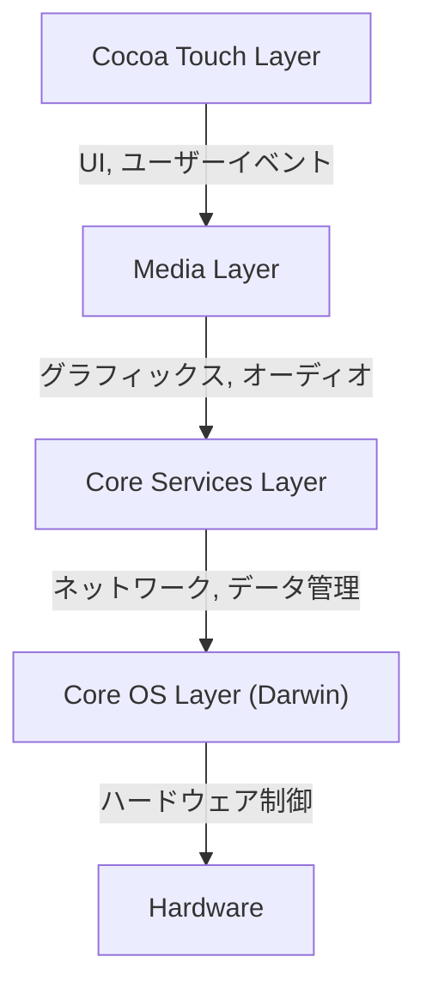
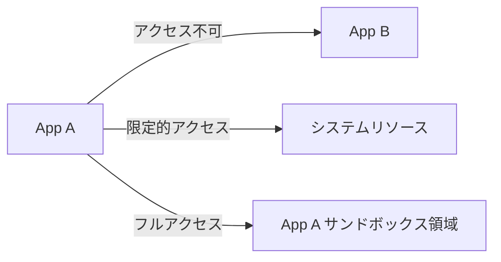

## はじめに：NeXTの系譜とiOSの誕生

AppleのモバイルOSである「iOS」は、今日の世界中で数十億台のデバイスを駆動している強力なオペレーティングシステムです。しかし、その根底にあるアーキテクチャは、スティーブ・ジョブズがAppleを離れていた時代に設立したNeXT社の「NeXTSTEP」にまで遡ります。

iOS（初期はiPhone OSと呼ばれました）は、単なる携帯電話向けの軽量OSとしてではなく、Mac OS X（現在のmacOS）のサブセットとして誕生しました。つまり、デスクトップクラスの強力なUnixベースのOSを、手のひらサイズのデバイスに収めるという野心的なプロジェクトだったのです。

本記事では、このNeXTSTEPから受け継がれたiOSの深淵なるアーキテクチャを、最下層のカーネルから最上位のUIフレームワークまで、詳細に解剖していきます。

## iOSの4層アーキテクチャ

iOSのシステムアーキテクチャは、大きく分けて4つの抽象化レイヤーから構成されています。下層に行くほどハードウェアに近く、上層に行くほどユーザーインターフェースに近くなります。

各レイヤーについて、詳細に見ていきましょう。

### 1. Core OS LayerとDarwin（XNUカーネル）

iOSアーキテクチャの心臓部であり、最も根底にあるのが**Core OS Layer**です。この層は「Darwin」と呼ばれるオープンソースのUnix互換オペレーティングシステムを基盤としています。

Darwinの中核を成すのが**XNUカーネル**（X is Not Unix）です。XNUは、純粋なマイクロカーネルでも、モノリシックカーネルでもない、「ハイブリッドカーネル」という独特のアプローチを採用しています。

#### MachマイクロカーネルとBSDの融合

XNUカーネルは、主に以下の2つのコンポーネントのハイブリッドです。

1.  **Machマイクロカーネル**: カーネギーメロン大学で開発されたMachカーネルをベースにしています。Machは、メモリ管理、スレッドスケジューリング、プロセス間通信（IPC）などの極めて低レベルで基本的な機能を提供します。Machのプロセス間通信は「メッセージパッシング」に基づいており、これがiOSの堅牢性の基礎となっています。
2.  **BSD（Berkeley Software Distribution）**: Machの上に構築されたBSDサブシステムは、POSIX互換のAPI、ネットワークスタック（TCP/IP）、ファイルシステム（APFSなど）、およびプロセスモデルを提供します。開発者がC言語やPOSIX APIを使ってネットワーク通信やファイル操作を行えるのは、このBSD層のおかげです。

このハイブリッド構造により、iOSはマイクロカーネルのモジュール性と堅牢性を持ちながら、モノリシックカーネルのパフォーマンス（特にBSD側のシステムコールの高速さ）を兼ね備えることに成功しました。

### 2. Core Services Layer

Core Services Layerは、すべてのアプリケーションが必要とする基本的なシステムサービスを提供する層です。この層は、主にC言語とObjective-C（近年ではSwift）で記述されています。

主要なフレームワークには以下のものがあります：

*   **Foundation / Core Foundation**: 文字列（NSString / String）、配列（NSArray / Array）、辞書（NSDictionary / Dictionary）などの基本的なデータ型から、スレッド管理、ネットワーク通信（URLSession）、ファイル管理まで、Objective-CおよびSwiftの基盤となる機能を提供します。
*   **Core Data**: アプリケーションのデータモデルを管理し、SQLiteなどのローカルデータベースへの永続化を抽象化するオブジェクトグラフ・フレームワークです。
*   **CloudKit**: iCloudを介してデバイス間でデータを同期するためのバックエンドサービスへのアクセスを提供します。
*   **Grand Central Dispatch (GCD)**: マルチコアプロセッサ上で並行処理を効率的に行うためのC言語ベースのAPIです。スレッドを直接管理する複雑さから開発者を解放し、タスクをキューにキューイングするだけでシステムが最適なスレッド割り当てを行います。

### 3. Media Layer

Media Layerは、iOSデバイスの強力なマルチメディア機能（グラフィックス、オーディオ、ビデオ）を扱うためのフレームワーク群です。

*   **Core Graphics (Quartz 2D)**: 2Dベクターグラフィックスの描画エンジンです。PDFのレンダリングや、高度なパス描画をハードウェアアクセラレーションを活用して行います。
*   **Core Animation**: 複雑なアニメーションを極めて滑らかに（60fpsまたは120fpsで）描画するための基盤です。レイヤー（CALayer）という概念を用いて、描画処理をGPUにオフロードすることで、CPUの負荷を下げつつ高いパフォーマンスを実現します。
*   **Metal**: Apple独自の低レベルグラフィックスAPIであり、GPUの性能を極限まで引き出します。かつてのOpenGL ESを置き換えるものであり、3Dゲームだけでなく、機械学習の計算（Metal Performance Shaders）にも利用されます。
*   **AVFoundation**: オーディオとビデオの再生、録音、編集を詳細に制御するためのフレームワークです。

### 4. Cocoa Touch Layer

最上位に位置するのが、開発者やユーザーにとって最も馴染み深い**Cocoa Touch Layer**です。この層は、iOSアプリの視覚的なインターフェースとユーザーインタラクションを構築するためのフレームワークを提供します。

*   **UIKit**: 長年にわたりiOSアプリ開発の標準であったUIフレームワークです。ボタン（UIButton）、ラベル（UILabel）、テーブルビュー（UITableView）などのコンポーネントを提供し、イベント駆動型のプログラミングモデル（Target-Actionパターンやデリゲートパターン）を採用しています。
*   **SwiftUI**: 2019年に登場した、宣言型シンタックスを用いる最新のUIフレームワークです。状態（State）が変わると自動的にUIが更新される仕組みを持ち、UIKitに比べてコード記述量を大幅に削減し、より直感的なUI構築を可能にします。

「Cocoa Touch」という名前自体が、Mac OS XのUIフレームワークである「Cocoa」に、マルチタッチインターフェース（Touch）の概念を追加したことに由来しています。

## 堅牢なセキュリティモデル：App Sandboxingとデータ保護

UnixベースのOSであることに加え、iOSはモバイル環境に特化した極めて厳格なセキュリティモデルを構築しています。

### App Sandboxing（アプリのサンドボックス化）

iOS上のすべてのサードパーティ製アプリは、「サンドボックス」と呼ばれる隔離された環境で実行されます。これにより、アプリは自身のディレクトリ外のファイルシステムや、他のアプリのデータ、システムの重要領域に直接アクセスすることが物理的に制限されます。

アプリが連絡先、カメラ、マイクなどのリソースにアクセスするには、必ずユーザーに明示的な許可（パーミッション）を求める必要があり、これはiOSのプライバシー保護の根幹を成しています。

### コード署名（Code Signing）とセキュアブート

iOSデバイスで実行されるすべてのソフトウェア（OS自体からサードパーティ製アプリまで）は、Appleによって検証された暗号化署名を持っていなければなりません。
これにより、マルウェアや改ざんされたコードが実行されるのを防ぎます。起動時にはハードウェアレベルの「Root of Trust」から順次コードの正当性を検証する「セキュアブートチェーン」が実行されます。

### データ保護（Data Protection）とSecure Enclave

デバイスのストレージ内のデータは、ハードウェアの暗号化エンジンによって強力に暗号化されます。パスコードが設定されている場合、ファイルの暗号化キーはパスコードと本体固有のハードウェアキー（Secure Enclaveに保存されている）を組み合わせて生成されます。これにより、デバイスが物理的に盗難に遭っても、データの取り出しは極めて困難になります。

## まとめ

iOSは、単に美しいユーザーインターフェースを提供するだけのシステムではありません。その内側には、NeXTSTEPから数十年かけて熟成された強靭なUnix（Darwin）の心臓が脈打っています。

Machマイクロカーネルのメッセージパッシングによる安定性、BSDによる堅牢なネットワークとファイルシステム、そしてそれを包み込む高度に抽象化されたCore ServicesとMedia Layer、さらには直感的なCocoa Touch。

これら4つのレイヤーが完璧なハーモニーを奏で、厳格なサンドボックスによって守られているからこそ、iOSは世界で最も安全で、かつ洗練されたモバイルオペレーティングシステムであり続けているのです。
