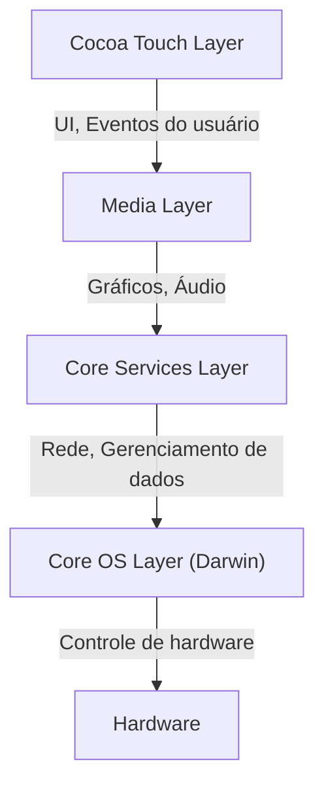
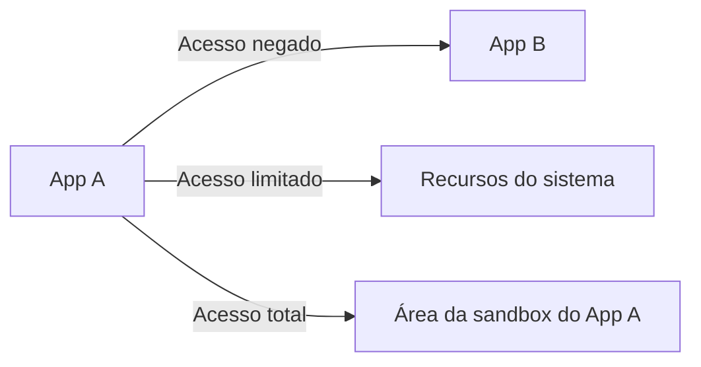

## Introdução: A linhagem da NeXT e o nascimento do iOS

O "iOS", o sistema operacional móvel da Apple, é um poderoso sistema operacional que impulsiona bilhões de dispositivos em todo o mundo hoje. No entanto, a sua arquitetura subjacente remonta ao "NeXTSTEP" da NeXT, empresa fundada por Steve Jobs durante o período em que esteve fora da Apple.

O iOS (inicialmente chamado de iPhone OS) não nasceu simplesmente como um sistema operacional leve para telefones celulares, mas como um subconjunto do Mac OS X (atualmente macOS). Ou seja, foi um projeto ambicioso para encaixar um poderoso sistema operacional baseado em Unix de classe de desktop em um dispositivo que cabe na palma da sua mão.

Neste artigo, dissecaremos detalhadamente a profunda arquitetura do iOS herdada do NeXTSTEP, desde o kernel no nível mais baixo até as estruturas de interface de usuário (UI) no nível mais alto.

## A arquitetura de 4 camadas do iOS

A arquitetura do sistema iOS é composta basicamente por quatro camadas de abstração. Quanto mais baixa a camada, mais próxima ela está do hardware, e quanto mais alta, mais próxima está da interface do usuário.

Vamos examinar cada camada em detalhes.

### 1. Core OS Layer e Darwin (Kernel XNU)

O coração e a base da arquitetura do iOS é a **Core OS Layer**. Esta camada é baseada em um sistema operacional de código aberto compatível com Unix chamado "Darwin".

No núcleo do Darwin está o **kernel XNU** (X is Not Unix). O XNU adota uma abordagem única chamada de "kernel híbrido", que não é nem um microkernel puro nem um kernel monolítico.

#### A fusão do microkernel Mach e do BSD

O kernel XNU é principalmente um híbrido dos dois componentes a seguir:

1. **Microkernel Mach**: Baseado no kernel Mach desenvolvido na Universidade Carnegie Mellon. O Mach fornece funções básicas de nível extremamente baixo, como gerenciamento de memória, agendamento de threads e comunicação entre processos (IPC). A comunicação entre processos do Mach é baseada em "passagem de mensagens" (message passing), que é a base da robustez do iOS.
2. **BSD (Berkeley Software Distribution)**: O subsistema BSD construído sobre o Mach fornece uma API compatível com POSIX, pilha de rede (TCP/IP), sistema de arquivos (como APFS) e um modelo de processo. É graças a essa camada BSD que os desenvolvedores podem realizar comunicação de rede e operações de arquivo usando a linguagem C ou a API POSIX.

Graças a essa estrutura híbrida, o iOS conseguiu combinar a modularidade e a robustez de um microkernel com o desempenho de um kernel monolítico (especialmente a velocidade das chamadas de sistema no lado do BSD).

### 2. Core Services Layer

A Core Services Layer é a camada que fornece os serviços básicos do sistema exigidos por todos os aplicativos. Esta camada é escrita principalmente em C e Objective-C (mais recentemente, Swift).

Os principais frameworks incluem:

* **Foundation / Core Foundation**: Fornece as funções fundamentais para Objective-C e Swift, desde tipos de dados básicos como strings (NSString / String), matrizes (NSArray / Array) e dicionários (NSDictionary / Dictionary) até gerenciamento de threads, comunicação de rede (URLSession) e gerenciamento de arquivos.
* **Core Data**: Um framework de gráfico de objetos que gerencia o modelo de dados de um aplicativo e abstrai a persistência para bancos de dados locais, como SQLite.
* **CloudKit**: Fornece acesso a serviços de back-end para sincronizar dados entre dispositivos por meio do iCloud.
* **Grand Central Dispatch (GCD)**: Uma API baseada em C para executar de forma eficiente o processamento simultâneo em processadores de vários núcleos. Ele libera os desenvolvedores da complexidade de gerenciar threads diretamente; basta enfileirar tarefas em uma fila e o sistema faz a alocação de threads ideal.

### 3. Media Layer

A Media Layer é um conjunto de frameworks para lidar com os poderosos recursos multimídia (gráficos, áudio e vídeo) dos dispositivos iOS.

* **Core Graphics (Quartz 2D)**: Um motor de renderização de gráficos vetoriais 2D. Ele usa aceleração de hardware para renderização de PDF e desenho de caminhos complexos.
* **Core Animation**: A base para renderizar animações complexas de forma extremamente suave (a 60 fps ou 120 fps). Usando o conceito de camadas (CALayer), ele descarrega o processo de renderização para a GPU, alcançando alto desempenho enquanto reduz a carga na CPU.
* **Metal**: A API de gráficos de baixo nível proprietária da Apple que maximiza o desempenho da GPU. Substitui o antigo OpenGL ES e é usado não apenas para jogos 3D, mas também para cálculos de aprendizado de máquina (Metal Performance Shaders).
* **AVFoundation**: Um framework para controle detalhado de reprodução, gravação e edição de áudio e vídeo.

### 4. Cocoa Touch Layer

Posicionada no topo está a **Cocoa Touch Layer**, que é a mais familiar para desenvolvedores e usuários. Esta camada fornece os frameworks para a construção da interface visual e da interação do usuário de aplicativos iOS.

* **UIKit**: O framework de UI que tem sido o padrão para o desenvolvimento de aplicativos iOS há muitos anos. Ele fornece componentes como botões (UIButton), rótulos (UILabel) e visualizações de tabela (UITableView), e adota um modelo de programação orientado a eventos (padrão Target-Action e padrão Delegate).
* **SwiftUI**: O mais recente framework de UI, introduzido em 2019, que usa uma sintaxe declarativa. Ele possui um mecanismo que atualiza automaticamente a UI quando o estado (State) muda, reduzindo significativamente a quantidade de código escrito em comparação com o UIKit e permitindo a construção de UI de forma mais intuitiva.

O próprio nome "Cocoa Touch" deriva da adição do conceito de uma interface multitoque (Touch) ao "Cocoa", o framework de UI do Mac OS X.

## Modelo de segurança robusto: App Sandboxing e proteção de dados

Além de ser um sistema operacional baseado em Unix, o iOS construiu um modelo de segurança extremamente rigoroso, projetado especificamente para o ambiente móvel.

### App Sandboxing (Isolamento de aplicativos)

Todos os aplicativos de terceiros no iOS são executados em um ambiente isolado chamado de "sandbox" (caixa de areia). Isso restringe fisicamente o aplicativo de acessar diretamente o sistema de arquivos fora de seu próprio diretório, dados de outros aplicativos ou áreas críticas do sistema.

Para que um aplicativo possa acessar recursos como contatos, câmera ou microfone, ele deve sempre solicitar permissão explícita do usuário, e essa é a base da proteção de privacidade do iOS.

### Assinatura de código (Code Signing) e Inicialização segura (Secure Boot)

Todo software executado em um dispositivo iOS (desde o próprio sistema operacional até os aplicativos de terceiros) deve ter uma assinatura criptográfica verificada pela Apple.
Isso impede a execução de malware ou código adulterado. Durante a inicialização, é executada uma "cadeia de inicialização segura" que verifica sequencialmente a validade do código a partir da "Raiz de Confiança" (Root of Trust) no nível do hardware.

### Proteção de dados (Data Protection) e Secure Enclave

Os dados no armazenamento do dispositivo são fortemente criptografados por um mecanismo de criptografia de hardware. Quando uma senha (passcode) é definida, a chave de criptografia de arquivo é gerada combinando a senha e uma chave de hardware específica do dispositivo (armazenada no Secure Enclave). Isso torna a extração de dados extremamente difícil, mesmo se o dispositivo for fisicamente roubado.

## Conclusão

O iOS não é simplesmente um sistema que fornece uma bela interface de usuário. Por dentro, bate o coração de um Unix (Darwin) forte e amadurecido ao longo de décadas desde o NeXTSTEP.

A estabilidade da passagem de mensagens do microkernel Mach, a rede e o sistema de arquivos robustos do BSD, as camadas altamente abstraídas Core Services e Media Layer que os envolvem e o intuitivo Cocoa Touch.

É precisamente porque essas quatro camadas tocam em perfeita harmonia e são protegidas por uma rigorosa sandbox que o iOS continua a ser o sistema operacional móvel mais seguro e sofisticado do mundo.
