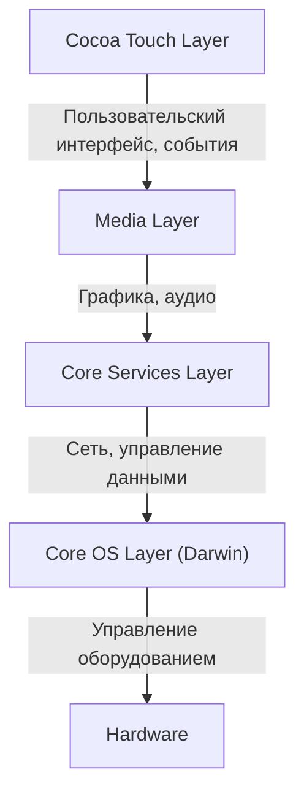
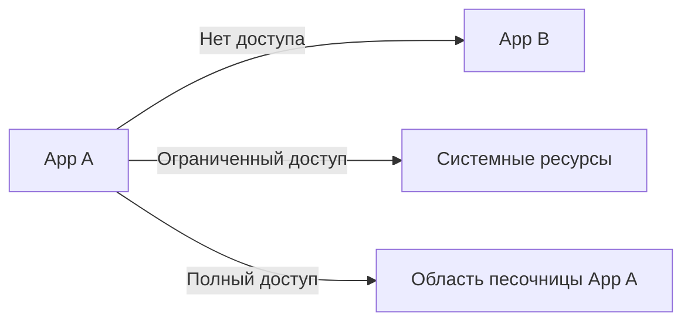

## Введение: Наследие NeXT и рождение iOS

Мобильная ОС Apple, «iOS», — это мощная операционная система, которая сегодня работает на миллиардах устройств по всему миру. Однако её базовая архитектура восходит к «NeXTSTEP» компании NeXT, основанной Стивом Джобсом в период его ухода из Apple.

iOS (первоначально называвшаяся iPhone OS) создавалась не просто как легковесная ОС для мобильных телефонов, а как подмножество Mac OS X (ныне macOS). Иными словами, это был амбициозный проект по переносу мощной Unix-подобной ОС десктопного класса на устройство размером с ладонь.

В этой статье мы подробно разберем глубокую архитектуру iOS, унаследованную от NeXTSTEP, начиная с самого нижнего уровня ядра и заканчивая высокоуровневыми фреймворками пользовательского интерфейса.

## 4-уровневая архитектура iOS

Системная архитектура iOS состоит из четырёх основных уровней абстракции. Чем ниже уровень, тем ближе он к аппаратному обеспечению, а чем выше — тем ближе к пользовательскому интерфейсу.

Давайте рассмотрим каждый уровень подробнее.

### 1. Уровень Core OS и Darwin (Ядро XNU)

Сердцем архитектуры iOS и её самым фундаментальным компонентом является **уровень Core OS (Core OS Layer)**. Этот уровень базируется на «Darwin» — операционной системе с открытым исходным кодом, совместимой с Unix.

Ядром Darwin является **ядро XNU** (X is Not Unix). XNU использует уникальный подход, называемый «гибридным ядром», не являясь ни чистым микроядром, ни монолитным ядром.

#### Слияние микроядра Mach и BSD

Ядро XNU в основном представляет собой гибрид следующих двух компонентов:

1.  **Микроядро Mach**: Основано на ядре Mach, разработанном в Университете Карнеги-Меллона. Mach предоставляет чрезвычайно низкоуровневые и базовые функции, такие как управление памятью, планирование потоков и межпроцессное взаимодействие (IPC). Межпроцессное взаимодействие в Mach основано на «передаче сообщений», что является основой надежности iOS.
2.  **BSD (Berkeley Software Distribution)**: Подсистема BSD, построенная поверх Mach, предоставляет POSIX-совместимый API, сетевой стек (TCP/IP), файловую систему (например, APFS) и модель процессов. Именно благодаря этому уровню BSD разработчики могут использовать язык C и POSIX API для сетевых коммуникаций и файловых операций.

Благодаря такой гибридной структуре iOS удалось объединить модульность и надежность микроядра с производительностью монолитного ядра (в частности, высокой скоростью системных вызовов со стороны BSD).

### 2. Уровень Core Services

Уровень Core Services (Core Services Layer) предоставляет базовые системные службы, необходимые всем приложениям. Этот уровень в основном написан на языках C и Objective-C (а в последние годы и на Swift).

Основные фреймворки включают:

*   **Foundation / Core Foundation**: Предоставляет базовые функции для Objective-C и Swift, от основных типов данных, таких как строки (NSString / String), массивы (NSArray / Array) и словари (NSDictionary / Dictionary), до управления потоками, сетевых коммуникаций (URLSession) и управления файлами.
*   **Core Data**: Фреймворк объектного графа, который управляет моделью данных приложения и абстрагирует их сохранение в локальные базы данных, такие как SQLite.
*   **CloudKit**: Предоставляет доступ к внутренним службам для синхронизации данных между устройствами через iCloud.
*   **Grand Central Dispatch (GCD)**: API на базе языка C для эффективной параллельной обработки на многоядерных процессорах. Он избавляет разработчиков от сложности прямого управления потоками: достаточно поместить задачи в очередь, и система сама назначит оптимальные потоки.

### 3. Уровень Media

Уровень Media (Media Layer) — это набор фреймворков для работы с мощными мультимедийными возможностями (графика, аудио, видео) устройств iOS.

*   **Core Graphics (Quartz 2D)**: Движок рендеринга 2D-векторной графики. Выполняет рендеринг PDF и сложную отрисовку путей с использованием аппаратного ускорения.
*   **Core Animation**: Фундамент для отрисовки сложных анимаций с исключительной плавностью (при 60 или 120 кадрах в секунду). Используя концепцию слоев (CALayer), он перекладывает обработку рендеринга на GPU, снижая нагрузку на CPU и обеспечивая высокую производительность.
*   **Metal**: Собственный низкоуровневый графический API Apple, который максимально раскрывает потенциал GPU. Заменяя устаревший OpenGL ES, он используется не только для 3D-игр, но и для вычислений машинного обучения (Metal Performance Shaders).
*   **AVFoundation**: Фреймворк для детального управления воспроизведением, записью и редактированием аудио и видео.

### 4. Уровень Cocoa Touch

На самом верхнем уровне находится **уровень Cocoa Touch (Cocoa Touch Layer)**, наиболее знакомый разработчикам и пользователям. Этот уровень предоставляет фреймворки для создания визуальных интерфейсов и взаимодействия с пользователем в приложениях iOS.

*   **UIKit**: Фреймворк пользовательского интерфейса, который долгие годы был стандартом для разработки приложений под iOS. Предоставляет такие компоненты, как кнопки (UIButton), метки (UILabel) и табличные представления (UITableView), и использует модель программирования, управляемую событиями (паттерны Target-Action и Delegate).
*   **SwiftUI**: Новейший фреймворк пользовательского интерфейса, представленный в 2019 году, использующий декларативный синтаксис. Он имеет механизм автоматического обновления интерфейса при изменении состояния (State), что значительно сокращает объем кода по сравнению с UIKit и позволяет создавать интерфейсы более интуитивно.

Само название «Cocoa Touch» происходит от добавления концепции мультитач-интерфейса (Touch) к «Cocoa», фреймворку пользовательского интерфейса Mac OS X.

## Надежная модель безопасности: «Песочница» приложений и защита данных

Помимо того, что iOS является ОС на базе Unix, в ней реализована чрезвычайно строгая модель безопасности, специально адаптированная для мобильных сред.

### App Sandboxing (Изоляция приложений в песочнице)

Все сторонние приложения на iOS выполняются в изолированной среде, называемой «песочницей» (sandbox). Это физически ограничивает прямой доступ приложения к файловой системе за пределами собственного каталога, к данным других приложений и к важным системным областям.

Чтобы приложение могло получить доступ к таким ресурсам, как контакты, камера или микрофон, оно всегда должно запрашивать у пользователя явное разрешение, что является основой защиты конфиденциальности в iOS.

### Code Signing (Подпись кода) и Secure Boot (Безопасная загрузка)

Всё программное обеспечение, запускаемое на устройствах iOS (от самой операционной системы до сторонних приложений), должно иметь криптографическую подпись, проверенную Apple.
Это предотвращает запуск вредоносного ПО и измененного кода. Во время запуска выполняется «цепочка безопасной загрузки» (secure boot chain), которая последовательно проверяет легитимность кода, начиная с аппаратного «Корня доверия» (Root of Trust).

### Data Protection (Защита данных) и Secure Enclave

Данные в хранилище устройства надежно шифруются аппаратным криптографическим движком. Если установлен код-пароль, ключ шифрования файлов генерируется путем комбинации этого пароля с уникальным аппаратным ключом устройства (хранящимся в Secure Enclave). Таким образом, даже в случае физической кражи устройства извлечь данные будет крайне сложно.

## Заключение

iOS — это не просто система, предоставляющая красивый пользовательский интерфейс. Внутри неё бьется сильное сердце Unix (Darwin), совершенствовавшееся десятилетиями со времен NeXTSTEP.

Стабильность, обеспечиваемая передачей сообщений микроядра Mach, надежная сеть и файловая система от BSD, а также обволакивающие их высокоабстрактные уровни Core Services и Media Layer, и, наконец, интуитивно понятный Cocoa Touch.

Именно потому, что эти четыре уровня работают в идеальной гармонии и защищены строгой песочницей, iOS продолжает оставаться самой безопасной и совершенной мобильной операционной системой в мире.
