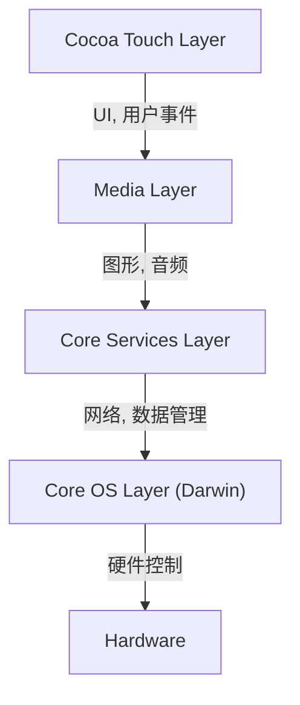
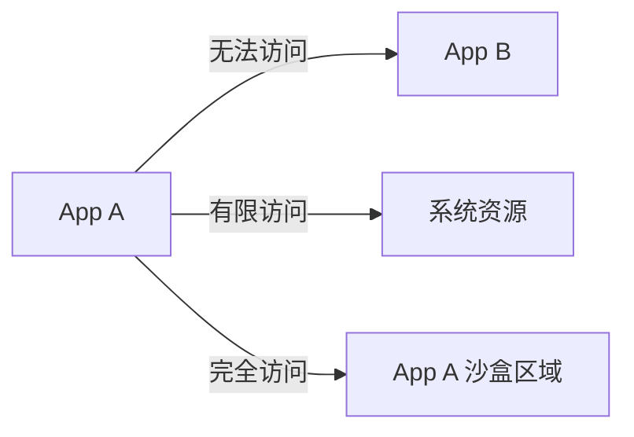

## 引言：NeXT 的谱系与 iOS 的诞生

Apple 的移动操作系统“iOS”是一个强大的操作系统，如今驱动着全球数十亿台设备。然而，其底层架构可以追溯到史蒂夫·乔布斯离开 Apple 期间创立的 NeXT 公司的“NeXTSTEP”。

iOS（最初称为 iPhone OS）并非仅仅作为一个针对手机的轻量级操作系统诞生，而是作为 Mac OS X（现在的 macOS）的子集而诞生。换句话说，这是一个将桌面级强大的基于 Unix 的操作系统放入手掌大小设备中的野心勃勃的项目。

在本文中，我们将详细剖析从 NeXTSTEP 继承下来的 iOS 深层架构，从最底层的内核到最高层的 UI 框架。

## iOS 的四层架构

iOS 的系统架构主要由四个抽象层组成。越靠下越接近硬件，越靠上越接近用户界面。

让我们详细了解每一层。

### 1. Core OS 层与 Darwin（XNU 内核）

位于 iOS 架构心脏部位且最底层的是**Core OS 层**。该层以名为“Darwin”的开源 Unix 兼容操作系统为基础。

构成 Darwin 核心的是**XNU 内核**（X is Not Unix）。XNU 既不是纯粹的微内核，也不是宏内核，而是采用了一种被称为“混合内核”的独特方法。

#### Mach 微内核与 BSD 的融合

XNU 内核主要是以下两个组件的混合体：

1.  **Mach 微内核**：基于卡内基梅隆大学开发的 Mach 内核。Mach 提供了极其底层的基本功能，如内存管理、线程调度和进程间通信（IPC）。Mach 的进程间通信基于“消息传递”，这是 iOS 稳健性的基础。
2.  **BSD（Berkeley Software Distribution）**：构建在 Mach 之上的 BSD 子系统提供了 POSIX 兼容的 API、网络堆栈（TCP/IP）、文件系统（如 APFS）以及进程模型。得益于这个 BSD 层，开发者可以使用 C 语言或 POSIX API 进行网络通信和文件操作。

通过这种混合结构，iOS 既拥有了微内核的模块化和稳健性，又成功兼具了宏内核的性能（特别是 BSD 端系统调用的高速度）。

### 2. Core Services 层

Core Services 层是提供所有应用程序所需的基本系统服务的层。该层主要使用 C 语言和 Objective-C（近年来使用 Swift）编写。

主要框架包括：

*   **Foundation / Core Foundation**：从字符串（NSString / String）、数组（NSArray / Array）、字典（NSDictionary / Dictionary）等基本数据类型，到线程管理、网络通信（URLSession）和文件管理，提供了 Objective-C 和 Swift 的基础功能。
*   **Core Data**：一个对象图框架，用于管理应用程序的数据模型，并抽象化到本地数据库（如 SQLite）的持久化。
*   **CloudKit**：提供对后端服务的访问，以便通过 iCloud 在设备之间同步数据。
*   **Grand Central Dispatch (GCD)**：一个基于 C 语言的 API，用于在多核处理器上高效执行并发处理。它将开发者从直接管理线程的复杂性中解放出来，只需将任务排入队列，系统就会进行最佳的线程分配。

### 3. Media 层

Media 层是用于处理 iOS 设备强大的多媒体功能（图形、音频、视频）的框架群。

*   **Core Graphics (Quartz 2D)**：2D 矢量图形渲染引擎。利用硬件加速进行 PDF 渲染和高级路径绘制。
*   **Core Animation**：用于极其流畅地（以 60fps 或 120fps）绘制复杂动画的基础。它使用图层（CALayer）的概念，将绘制处理卸载到 GPU，从而在降低 CPU 负载的同时实现高性能。
*   **Metal**：Apple 专有的底层图形 API，可将 GPU 性能发挥到极致。它是昔日 OpenGL ES 的替代品，不仅用于 3D 游戏，还用于机器学习计算（Metal Performance Shaders）。
*   **AVFoundation**：用于精细控制音频和视频的播放、录制和编辑的框架。

### 4. Cocoa Touch 层

位于最顶层的是开发者和用户最熟悉的**Cocoa Touch 层**。该层提供了用于构建 iOS 应用程序的视觉界面和用户交互的框架。

*   **UIKit**：多年来一直是 iOS 应用程序开发标准的 UI 框架。它提供了按钮（UIButton）、标签（UILabel）、表格视图（UITableView）等组件，并采用事件驱动的编程模型（Target-Action 模式和代理模式）。
*   **SwiftUI**：2019 年推出的使用声明式语法的最新 UI 框架。它具有状态（State）改变时自动更新 UI 的机制，与 UIKit 相比大幅减少了代码编写量，使更直观的 UI 构建成为可能。

“Cocoa Touch”这个名字本身来源于在 Mac OS X 的 UI 框架“Cocoa”中加入了多点触控（Touch）的概念。

## 稳健的安全模型：App 沙盒与数据保护

除了是基于 Unix 的操作系统外，iOS 还构建了专为移动环境量身定制的极其严格的安全模型。

### App 沙盒化（App Sandboxing）

iOS 上的所有第三方应用程序都在被称为“沙盒”的隔离环境中运行。这在物理上限制了应用程序直接访问其自身目录之外的文件系统、其他应用程序的数据以及系统的重要区域。

应用程序如果要访问联系人、相机、麦克风等资源，必须明确要求用户授权（权限），这构成了 iOS 隐私保护的基础。

### 代码签名（Code Signing）与安全启动

在 iOS 设备上运行的所有软件（从操作系统本身到第三方应用程序）都必须具有经过 Apple 验证的加密签名。
这可以防止恶意软件或被篡改的代码被执行。在启动时，会执行一个“安全启动链”，从硬件级别的“信任根（Root of Trust）”开始，依次验证代码的合法性。

### 数据保护（Data Protection）与 Secure Enclave

设备存储中的数据通过硬件加密引擎进行强加密。如果设置了密码，文件的加密密钥将由密码和设备固有的硬件密钥（存储在 Secure Enclave 中）组合生成。这使得即使设备被物理盗窃，提取数据也变得极其困难。

## 总结

iOS 并非仅仅是一个提供精美用户界面的系统。在其内部，跳动着从 NeXTSTEP 经过数十年磨砺出的强韧的 Unix（Darwin）心脏。

Mach 微内核消息传递带来的稳定性、BSD 带来的稳健的网络和文件系统，以及包围着它们的高度抽象化的 Core Services 和 Media 层，还有直观的 Cocoa Touch。

正是这四个层的完美协同，以及严格沙盒的保护，才使得 iOS 能够始终保持为世界上最安全且最精致的移动操作系统。
