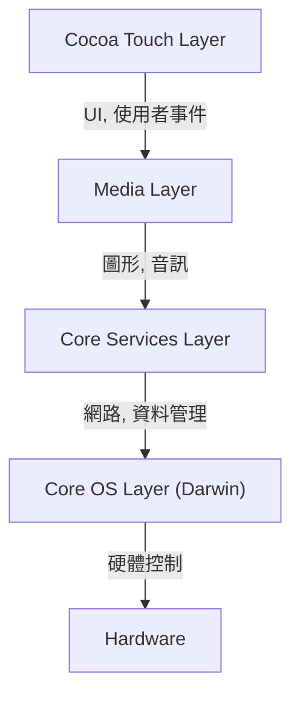
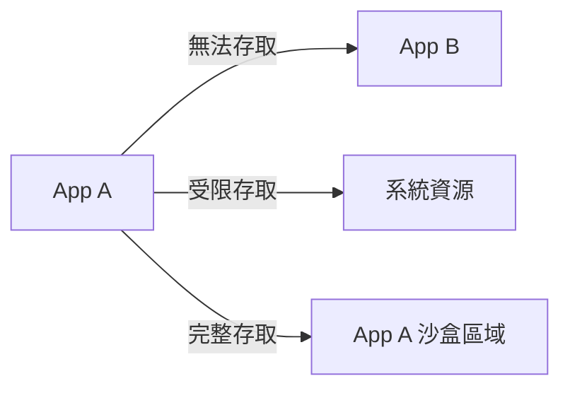

## 前言：NeXT 的系譜與 iOS 的誕生

Apple 的行動作業系統「iOS」是如今驅動全球數十億台裝置的強大作業系統。然而，其底層架構可以追溯至史蒂夫·賈伯斯（Steve Jobs）離開 Apple 期間所創立的 NeXT 公司的「NeXTSTEP」。

iOS（早期稱為 iPhone OS）並非僅僅作為一款針對手機的輕量級作業系統而誕生，而是作為 Mac OS X（現為 macOS）的子集（subset）應運而生。也就是說，這是一項將桌面級強大的 Unix 基礎作業系統，放入手掌大小裝置中的野心勃勃的專案。

在本文中，我們將從最底層的核心（Kernel）到最頂層的 UI 框架，詳細解剖這套繼承自 NeXTSTEP 的 iOS 深奧架構。

## iOS 的四層架構

iOS 的系統架構大致可以分為四個抽象化層（Layers）。越底層越接近硬體，越頂層則越接近使用者介面。

讓我們來詳細探討各個分層。

### 1. Core OS Layer 與 Darwin（XNU 核心）

作為 iOS 架構的心臟，最底層的便是 **Core OS Layer**。這一層是以被稱為「Darwin」的開源 Unix 相容作業系統為基礎。

構成 Darwin 核心的是 **XNU 核心**（X is Not Unix）。XNU 既不是純粹的微核心（Microkernel），也不是單核心（Monolithic kernel），而是採用了被稱為「混合核心（Hybrid kernel）」的獨特設計。

#### Mach 微核心與 BSD 的融合

XNU 核心主要由以下兩個元件混合而成：

1.  **Mach 微核心**：以卡內基美隆大學開發的 Mach 核心為基礎。Mach 提供了記憶體管理、執行緒排程、行程間通訊（IPC）等極低階且基本的功能。Mach 的行程間通訊是基於「訊息傳遞（Message passing）」，這也是 iOS 系統穩固性的基礎。
2.  **BSD（Berkeley Software Distribution）**：建立在 Mach 之上的 BSD 子系統，提供了與 POSIX 相容的 API、網路堆疊（TCP/IP）、檔案系統（如 APFS）以及行程模型（Process model）。開發者能夠使用 C 語言或 POSIX API 進行網路通訊和檔案操作，正是歸功於這個 BSD 層。

透過這種混合架構，iOS 成功地兼具了微核心的模組化與穩固性，以及單核心的效能（特別是 BSD 側系統呼叫的高速性）。

### 2. Core Services Layer

Core Services Layer 提供了所有應用程式都需要的基礎系統服務。這一層主要以 C 語言和 Objective-C（近年來也包含 Swift）撰寫。

主要的框架包含以下幾種：

*   **Foundation / Core Foundation**：從字串（NSString / String）、陣列（NSArray / Array）、字典（NSDictionary / Dictionary）等基本資料型態，到執行緒管理、網路通訊（URLSession）、檔案管理等，為 Objective-C 與 Swift 提供了基礎功能。
*   **Core Data**：用來管理應用程式的資料模型，並將 SQLite 等本機資料庫的持久化操作予以抽象化的物件圖框架（Object graph framework）。
*   **CloudKit**：提供後端服務存取，讓裝置之間能夠透過 iCloud 進行資料同步。
*   **Grand Central Dispatch (GCD)**：為了在多核心處理器上高效執行並行處理（Concurrency）而設計的 C 語言基礎 API。它將開發者從直接管理執行緒的複雜性中解放出來，只需將任務推入佇列（Queue），系統就會自動進行最佳的執行緒分配。

### 3. Media Layer

Media Layer 是用來處理 iOS 裝置強大且豐富的多媒體功能（圖形、音訊、視訊）的框架群。

*   **Core Graphics (Quartz 2D)**：2D 向量圖形渲染引擎。它利用硬體加速來進行 PDF 的渲染與進階的路徑繪製。
*   **Core Animation**：以極度流暢的方式（60fps 或 120fps）渲染複雜動畫的基礎框架。透過圖層（CALayer）的概念，將繪圖處理卸載至 GPU 執行，在降低 CPU 負載的同時實現高效能。
*   **Metal**：Apple 獨有的低階圖形 API，旨在將 GPU 的效能發揮到極致。它取代了過去的 OpenGL ES，不僅用於 3D 遊戲，也被應用於機器學習的計算（Metal Performance Shaders）。
*   **AVFoundation**：用於詳細控制音訊與視訊的播放、錄製及編輯的框架。

### 4. Cocoa Touch Layer

位於最頂層，同時也是開發者與使用者最熟悉的，便是 **Cocoa Touch Layer**。這一層提供了構建 iOS 應用程式視覺化介面及使用者互動的框架。

*   **UIKit**：多年來一直是 iOS 應用程式開發標準的 UI 框架。提供按鈕（UIButton）、標籤（UILabel）、表格視圖（UITableView）等元件，並採用事件驅動的程式設計模型（如 Target-Action 模式和 Delegate 模式）。
*   **SwiftUI**：於 2019 年登場，使用宣告式語法（Declarative syntax）的最新 UI 框架。具備當狀態（State）改變時便會自動更新 UI 的機制，與 UIKit 相比大幅減少了程式碼的編寫量，使得 UI 構建更加直觀。

「Cocoa Touch」這個名字本身，便是源自於在 Mac OS X 的 UI 框架「Cocoa」中，加入了多點觸控（Touch）介面的概念而來。

## 穩固的安全模型：App 沙盒化與資料保護

除了身為以 Unix 為基礎的作業系統之外，iOS 還針對行動環境構建了極為嚴格的安全模型。

### App Sandboxing（App 沙盒化）

iOS 上所有第三方應用程式都在被稱為「沙盒（Sandbox）」的隔離環境中執行。這物理性地限制了應用程式直接存取自身目錄以外的檔案系統、其他應用程式的資料以及系統的重要區域。

應用程式若要存取聯絡人、相機、麥克風等資源，必須向使用者明確要求授權（Permission），這構成了 iOS 隱私保護的根基。

### 程式碼簽章（Code Signing）與安全啟動（Secure Boot）

在 iOS 裝置上執行的所有軟體（從 OS 本身到第三方應用程式），都必須具有經過 Apple 驗證的加密簽章。
這能防止惡意軟體或被竄改的程式碼遭到執行。在開機時，系統會執行「安全啟動鏈（Secure Boot Chain）」，從硬體等級的「信任根（Root of Trust）」開始，依序驗證程式碼的合法性。

### 資料保護（Data Protection）與 Secure Enclave

裝置儲存空間內的資料會被硬體加密引擎強力加密。如果設定了密碼，檔案的加密金鑰就會是由密碼與本機特有的硬體金鑰（儲存在 Secure Enclave 中）組合生成。因此，即使裝置在物理上遭到竊取，要取出其中的資料也是極其困難的。

## 總結

iOS 並不只是一個單純提供精美使用者介面的系統。在其內部，跳動著一顆從 NeXTSTEP 歷經數十年淬鍊而成的強韌 Unix（Darwin）心臟。

藉由 Mach 微核心訊息傳遞帶來的穩定性、BSD 建構的穩固網路與檔案系統、將其包覆其中且高度抽象化的 Core Services 與 Media Layer，以及直觀的 Cocoa Touch。

正是這四個分層譜出了完美的和諧樂章，加上嚴格的沙盒機制保護，使得 iOS 能夠持續作為世界上最安全且最精緻的行動作業系統。
