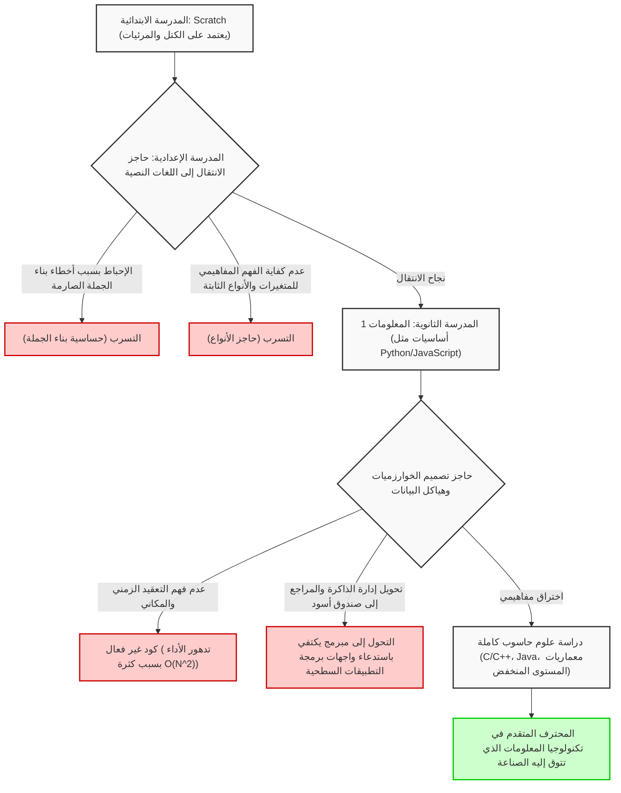
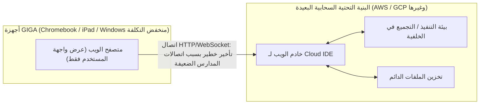

## 1. المقدمة: النور والظلام اللذان جلبهما إلزامية تعليم البرمجة

مع جعل تعليم البرمجة إلزاميًا في المدارس الابتدائية في السنة المالية 2020، والتوسع في مناهج التكنولوجيا والاقتصاد المنزلي في المدارس الإعدادية في السنة المالية 2021، وجعل المادة الجديدة "المعلومات 1" إلزامية في المدارس الثانوية في عام 2022، شهد تعليم تكنولوجيا المعلومات والمعلومات في اليابان في السنوات الأخيرة نقلة نوعية غير مسبوقة. في أساس هذه السلسلة من السياسات توجد متطلبات وطنية ملحة للغاية لتعزيز التفكير المنطقي (التفكير البرمجي) اللازم للبقاء في عصر المجتمع 5.0 (المجتمع فائق الذكاء) وحل النقص المزمن في الموارد البشرية المتقدمة في مجال تكنولوجيا المعلومات في الصناعة.

ومع ذلك، وبالنظر إلى الخطوط الأمامية للتعليم، أصبح من الواضح أن هناك فجوة هائلة بين المثالية التي رسمتها الدولة والواقع. المشكلة الأكثر خطورة هي الخلط التام بين "تعلم البرمجة كوسيلة" و "إتقان علوم الحاسوب كتخصص أكاديمي". علاوة على ذلك، هناك جبل من التحديات الهيكلية التي يجب حلها، مثل القيود التقنية بسبب القيود في مواصفات البنية التحتية لتكنولوجيا المعلومات التي تم إنشاؤها في وقت واحد على الصعيد الوطني، ونقص مجموعة المهارات المتخصصة بين المعلمين الذين هم في جانب التدريس.

في هذا المقال، سنلخص "ما بعد" جعل تعليم البرمجة إلزاميًا في اليابان، ونحلل التحديات الأساسية والهيكلية التي يواجهها تعليم تكنولوجيا المعلومات حاليًا بتفصيل كبير وتقنيًا من منظور نظريات علوم الحاسوب، وقيود بنية الأجهزة، والتنافسية الصناعية العالمية. هذا ليس مجرد نقاش تعليمي، بل مقال يتكون من 10000 حرف يتأمل في مستقبل اليابان من منظور هندسة البرمجيات.

## 2. فخ البرمجة المرئية: الفجوة العميقة والوعرة من Scratch إلى كتابة الأكواد النصية

لغات البرمجة المرئية (البرمجة القائمة على الكتل) التي تمثلها "Scratch"، والتي طورها مختبر MIT Media Lab، تسود كمعيار واقعي في تعليم البرمجة في المدارس الابتدائية. باستخدام واجهة رسومية بديهية ودمج الكتل مثل الألغاز، يمكن للطلاب تعلم هياكل التحكم الأساسية الثلاثة للخوارزميات بشكل مرئي وبديهي: "التسلسل"، و "الاختيار"، و "التكرار"، وهو اختراع عظيم يجب تقييمه بشدة كتعليم تمهيدي.

ومع ذلك، هناك فخ خطير هنا، وهو ما يسمى بـ "فخ التجريد". إنها الحقيقة القاسية المتمثلة في أنه "من الصعب للغاية الانتقال من البرمجة المرئية إلى لغات البرمجة النصية الكاملة (مثل Python و JavaScript و C++ و Rust وغيرها)، ويفشل العديد من المتعلمين في هذه المرحلة".

### حاجز التجريد وتحويل علوم الحاسوب إلى صندوق أسود

تقوم بيئات البرمجة المرئية، بما في ذلك Scratch، بتجريد وإخفاء (تغليف) العناصر المهمة التي تشكل أساس علوم الحاسوب، مثل البنية المعقدة للبرمجة (Syntax)، ونظام الأنواع الصارم (Type system)، وإدارة دورة حياة الذاكرة، عن قصد. هذا ممتاز لتقليل العبء المعرفي للمبتدئين، ولكنه يصبح عقبة ضخمة عند الانتقال إلى الخطوة التالية وهي الهندسة الحقيقية. ففي موقع تطوير البرمجيات الفعلي، يعد فهم نطاق المتغيرات (المتغيرات المحلية والعامة)، وهياكل البيانات المعقدة (المصفوفات، والقوائم المرتبطة، وجداول التجزئة، وأشجار البحث الثنائية، والرسوم البيانية)، وعمليات المؤشرات، ومناطق الكومة والمكدس للذاكرة أمرًا ضروريًا تمامًا.

يوضح مخطط Mermaid التالي بصريًا العقبات التعليمية ونقاط التسرب التي يواجهها المبتدئون في عملية الانتقال من البرمجة المرئية إلى علوم الحاسوب الكاملة.



كما هو واضح من مخطط التدفق هذا، فإن مجرد اكتساب الخبرة في "كتابة التعليمات البرمجية لتحريك شخصية على الشاشة" لا يطور مهندسي برمجيات حقيقيين قادرين على تصميم معماريات أنظمة موزعة قابلة للتطوير وتحسين الأداء على مستوى أجزاء من الألف من الثانية. يوجد انقطاع مفاهيمي مطلق بين مهمة دمج كتل Scratch الملونة بالماوس ومهمة قراءة التعليمات البرمجية المصدرية بلغة C لنواة Linux وتتبع سلوك مكدس TCP/IP، والذي لا يمكن رفضه ببساطة كـ "اختلاف في اللغة المستخدمة".

## 3. حدود كتابة الأكواد بدون "الرياضيات" و "المنطق المنفصل": نهج من نظرية التعقيد

أكبر نقطة ضعف، وربما العيب القاتل في المنهج الياباني لتعليم البرمجة، هو النقص الساحق في الارتباط بين "مهارات البرمجة" و "الرياضيات / الرياضيات المتقطعة (Discrete Mathematics)". في التعليم المتقدم لعلوم الحاسوب في الولايات المتحدة والهند ودول أخرى، ينصب التركيز على كفاءة الخوارزميات، والمنطق الرياضي، والإثباتات الرياضية أكثر من قواعد لغات البرمجة نفسها. لأن الكود ما هو إلا ترجمة للمعادلات الرياضية.

### الهيمنة المطلقة للتعقيد الزمني والتعقيد المكاني (Big O Notation)

عند تقييم وتصميم أداء البرمجيات، لا يمكن تجنب مفاهيم التعقيد الزمني (Time Complexity) والتعقيد المكاني (Space Complexity). عندما يكون حجم البيانات المدخلة لخوارزمية معينة هو $N$، فإن تدوين لانداو المقارب (Big O Notation) يشير إلى كيفية زيادة وقت التنفيذ واستهلاك الذاكرة.

كتعريف رياضي، يُعرف $f(x) = O(g(x))$ بشكل صارم على النحو التالي:

$$
\exists C > 0, \exists x_0 > 0, \forall x > x_0, |f(x)| \le C \cdot |g(x)|
$$

في تعليم المعلوماتية الياباني، على سبيل المثال عند تعلم كيفية فرز البيانات (عملية الفرز)، هناك العديد من الحالات التي ينتهي فيها الأمر ببساطة باستدعاء الطريقة المدمجة `array.sort()` في Python. ومع ذلك، ما هو مطلوب حقًا كمهندس معلومات هو الفهم والإثبات الرياضي لسبب عدم استخدام خوارزمية الفرز الفقاعي البسيطة أبدًا في المجالات العملية، وسبب اعتماد خوارزميات مثل الفرز السريع (Quick Sort)، وفرز الدمج (Merge Sort)، أو [Timsort](https://kenji.blog/ar/p/sorting-algorithms/) كمكتبات قياسية.

فيما يلي متوسط التعقيد الزمني لخوارزميات الفرز التمثيلية.

- الفرز الفقاعي (Bubble Sort): $O(N^2)$
- فرز الاختيار (Selection Sort): $O(N^2)$
- فرز الإدراج (Insertion Sort): $O(N^2)$
- فرز الدمج (Merge Sort): $O(N \log N)$
- الفرز السريع (Quick Sort): $O(N \log N)$
- فرز الكومة (Heap Sort): $O(N \log N)$

على سبيل المثال، يتم التعبير عن التعقيد الزمني لفرز الدمج $T(N)$ من خلال معادلة التكرار التالية من خلال نموذج "فرق تسد" (Divide and Conquer).

$$
T(N) = 2T\left(\frac{N}{2}\right) + O(N)
$$

من خلال توسيع وحل علاقة التكرار هذه باستخدام المبرهنة الرئيسية (Master Theorem)، يتم اشتقاق التعقيد المثالي $T(N) = O(N \log N)$.

$$
T(N) = \Theta(N \log_2 N)
$$

في تحليلات البيانات الضخمة الحديثة ومعالجة حركة المرور على مستوى الويب، يصبح $N$ طلبًا ضخمًا بمئات الملايين أو المليارات. إذا قام مبرمج جاهل بتنفيذ خوارزمية غير فعالة بقيمة $O(N^2)$، فستتطلب البيانات التي حجمها $N = 10^6$ مقدار $10^{12}$ (تريليون) عملية مقارنة غير مجدية، مما يؤدي إلى تجميد النظام فعليًا وتعطله. من ناحية أخرى، مع $O(N \log N)$، يكتمل الأمر بحوالي $2 \times 10^7$ (20 مليون) عملية. الادعاء بـ "أنا أستطيع البرمجة" دون هذا الدعم الرياضي القاسي يشبه بناء ناطحة سحاب دون معرفة الميكانيكا الهيكلية، وهو أمر خطير للغاية.

## 4. إدارة الذاكرة وتحويل بنية النظام إلى صندوق أسود

كمشكلة في طبقة أعمق، هناك افتقار كامل لفهم إدارة الذاكرة وبنية وحدة المعالجة المركزية (CPU). لن يدرك المتعلمون الذين تعلموا فقط اللغات عالية المستوى مع جمع القمامة (GC) مثل Python و JavaScript التي يتم تدريسها حاليًا في المدارس أبدًا أين يتم وضع المتغيرات والكائنات في الذاكرة المادية (RAM) (سواء في منطقة الكومة أو منطقة المكدس)، وكيف يتم تخصيصها، ومتى وكيف يتم تحريرها.

```c
// مثال على التخصيص المباشر والصريح للذاكرة وعمليات المؤشر في لغة C
#include <stdio.h>
#include <stdlib.h>

int main() {
    int n = 1000000;
    // تخصيص متتالي للذاكرة ديناميكيًا في منطقة الكومة (استدعاء نظام لنظام التشغيل)
    int *array = (int*)malloc(n * sizeof(int));
    
    if (array == NULL) {
        fprintf(stderr, "Memory allocation failed! Out of memory.\n");
        return 1;
    }
    
    // تهيئة المصفوفة باستخدام حساب المؤشرات
    for(int i = 0; i < n; i++) {
        *(array + i) = i * 2; // يكافئ array[i] = i * 2
    }
    
    // تحرير الموارد الصريح لمنع تسرب الذاكرة (Memory Leak)
    free(array);
    array = NULL; // منع المؤشرات المعلقة
    
    return 0;
}
```

المعرفة بالمؤشرات (الإشارة المباشرة لعناوين الذاكرة)، وتخطيط البيانات (Data Locality) لتعظيم معدل ضربات التسلسل الهرمي لذاكرة التخزين المؤقت لوحدة المعالجة المركزية (ذاكرة التخزين المؤقت L1/L2/L3)، وحالات السباق (Race Condition) والتحكم الحصري (Mutex/Semaphore) في بيئات تعدد الخيوط ضرورية تمامًا عند تطوير أنظمة خلفية عالية الأداء، أو محركات ألعاب ثلاثية الأبعاد، أو أنظمة مضمنة لإنترنت الأشياء (IoT). المنهج الحالي لوزارة التعليم والعلوم والتكنولوجيا يقتصر على "تشغيل التطبيقات السطحية"، ولا يسعنا إلا أن نقول إنه ينحرف بشكل كبير عن الهدف الأكاديمي الأصلي المتمثل في "فهم أعماق علوم الحاسوب".

## 5. حاجز قواعد البيانات والاستمرارية: غياب الجبر العلائقي

في التطبيقات الحديثة، يعد حفظ البيانات واسترجاعها (الاستمرارية) موضوعًا لا مفر منه. ومع ذلك، يظل الكثير من التعليم المدرسي يقتصر على "معالجة البيانات في الذاكرة" التي تختفي بمجرد انتهاء تنفيذ البرنامج. نادرًا ما يتم تدريس النظرية الرياضية وراء قواعد البيانات العلائقية (RDBMS) و SQL، وهي "الجبر العلائقي (Relational Algebra)" التي اقترحها الدكتور إدغار ف. كود.

يتم تعريف عمليات قواعد البيانات من خلال العمليات الأساسية التالية القائمة على نظرية المجموعات.

- الاختيار (Selection, $\sigma$): استخراج المجموعات (الصفوف) التي تفي بالشرط
- الإسقاط (Projection, $\pi$): استخراج سمات (أعمدة) محددة
- الربط (Join, $\bowtie$): التقاطع المشروط لعلاقات متعددة

علاوة على ذلك، يعد تعلم بنية "فهرس B-Tree" للبحث الفوري عن البيانات المطلوبة من سجلات ضخمة هو أفضل ممارسة لتطبيق هياكل البيانات. تضمن أشجار B-Tree سرعة بحث تبلغ $O(\log N)$ مع تقليل عدد عمليات الإدخال / الإخراج للقرص إلى الحد الأدنى. لا يمكنك بناء نظام قوي دون معرفة خصائص ACID (الذرية، والاتساق، والعزل، والمتانة) للمعاملات.

## 6. الأمن ونظرية التشفير: البنية التحتية الاجتماعية المدعومة بصعوبة التحليل إلى عوامل أولية

في تعليم محو الأمية المعلوماتية، يتم تدريس تعليم أمني سطحي مثل "لنجعل كلمات المرور معقدة" أو "لا تنقر على روابط مشبوهة"، ولكن نادرًا ما يتم تدريس رياضيات "نظرية التشفير" التي تدعم أساس مجتمع الإنترنت.

تتم حماية اتصالات HTTPS والتوقيعات الرقمية التي نستخدمها يوميًا بواسطة تشفير المفتاح العام مثل تشفير RSA. يعتمد أمان تشفير RSA على الصعوبة الرياضية (التي تعتبر مشكلة NP-intermediate) المتمثلة في أن "تحليل الأعداد الصحيحة الضخمة إلى عوامل أولية لا يمكن حله في وقت عملي بواسطة أجهزة الكمبيوتر الكلاسيكية الحالية".

الصيغ الرياضية التي تشكل أساس تشفير RSA هي تطبيقات جميلة لدالة مؤشر أويلر ونظرية فيرما الصغرى.

1. اختر عددين أوليين ضخمين $p$ و $q$
2. احسب $n = p \times q$ (هذا يشكل جزءًا من المفتاح العام)
3. احسب $\phi(n) = (p-1)(q-1)$
4. اختر $e$ و $d$ بحيث $e \times d \equiv 1 \pmod{\phi(n)}$
5. التشفير: $C \equiv M^e \pmod{n}$
6. فك التشفير: $M \equiv C^d \pmod{n}$

بهذه الطريقة، يُظهر تعليم البرمجة قوته الحقيقية فقط عندما يرتبط ارتباطًا وثيقًا بتعليم الرياضيات. إن عملية ترجمة الصيغ الرياضية إلى تعليمات برمجية وتنفيذها في المجتمع هي متعة العلم الحقيقية.

## 7. مبادرة مدرسة GIGA والقيود اليائسة للبنية التحتية: Chromebook و Cloud IDE

عند الحديث عن تعليم تكنولوجيا المعلومات في اليابان، من المستحيل تجاهل "مبادرة مدرسة GIGA"، التي تم الترويج لها من قبل وزارة التعليم والعلوم والتكنولوجيا بميزانية ضخمة. كان من المتوقع أن يكون هذا المشروع الوطني، الذي يوفر "جهازًا واحدًا لكل طالب" وبيئة شبكة عالية السرعة لجميع طلاب المدارس الابتدائية والإعدادية في جميع أنحاء البلاد، بمثابة حافز للتعويض عن التأخير في الرقمنة. ومع ذلك، أصبحت مواصفات الأجهزة وهندسة الأجهزة الموزعة بالفعل عقبة خطيرة أمام تعليم البرمجة الكامل.

### الأجهزة منخفضة المواصفات وفقدان بيئة التطوير المحلية

العديد من الأجهزة المقدمة كمواصفات قياسية لمبادرة مدرسة GIGA هي أجهزة Chromebook أو iPad أو أجهزة Windows منخفضة التكلفة للغاية. مواصفاتها القياسية هي كما يلي:

- وحدة المعالجة المركزية (CPU): Intel Celeron أو معالج ARM منخفض التكلفة
- الذاكرة (RAM): 4 جيجابايت (سعة بالكاد تكفي لتشغيل نظام تشغيل حديث)
- التخزين (eMMC): 32 جيجابايت إلى 64 جيجابايت (سرعات إدخال / إخراج بطيئة للغاية)

بسبب قيود الأجهزة الضعيفة هذه، يكاد يكون من المستحيل إعداد "بيئة تطوير محلية" يستخدمها المهندسون المحترفون يوميًا. إن بدء تشغيل حاويات Linux باستخدام Docker، أو تشغيل بيئات تطوير متكاملة (IDE) ثقيلة مثل Visual Studio Code بكامل ميزاتها، أو بدء تشغيل خوادم محلية لـ Node.js أو Python وتثبيت مكتبات ثقيلة، سيؤدي على الفور إلى استنفاد الذاكرة وتجميد النظام.

نتيجة لذلك، تُجبر المواقع التعليمية على الاعتماد كليًا على بيئات التطوير المتكاملة السحابية (Cloud IDEs) التي تعمل في المتصفح (مثل Google Colaboratory، و Replit، أو أدوات الويب خفيفة الوزن الخاصة بشركات الكتب المدرسية).



يؤدي الاعتماد الكامل على Cloud IDEs إلى النواقص الخطيرة التالية من الناحية التعليمية:

1. **عدم فهم نظام الملفات وبنية نظام التشغيل**: نظرًا لعدم وجود بيئة محلية، فإن المعرفة الأساسية (محو الأمية بـ UNIX) التي يجب أن يتعامل معها مهندسو تكنولوجيا المعلومات بشكل طبيعي كالتنفس، مثل هياكل الدلائل، ومفاهيم المسارات المطلقة والنسبية، وإعدادات المتغيرات البيئية، وأذونات الملفات، وعمليات نظام التشغيل باستخدام واجهة سطر الأوامر (CLI)، لا يتم اكتسابها على الإطلاق.
2. **تأخير الشبكة وهشاشة البنية التحتية**: نظرًا لأنه يفترض اتصالاً مستمرًا، فعندما يصل جميع الطلاب في المدرسة إلى النظام في نفس الوقت، يتم الضغط على النطاق الترددي لشبكة المدرسة، وتتجمد المتصفحات، وتتوقف عملية التعلم تمامًا - وهي حوادث تحدث بشكل متكرر في جميع أنحاء البلاد.
3. **الحرمان من تجربة التحكم في الإصدار (Git)**: يُحرم الطلاب من فرصة تعلم مفاهيم Git و GitHub من خلال شاشة المحطة الطرفية السوداء (Terminal)، والتي تُستخدم لإدارة تاريخ التغيير في الكود المصدري وتطويره بشكل تعاوني مع فرق في جميع أنحاء العالم.

عندما يقوم مهندسو البرمجيات المحترفون بالتطوير، فإن العمليات على المحطة الطرفية (الصدفة أو Shell) هي الأساس المطلق. بدون الخبرة العملية المتمثلة في كتابة أوامر مثل `ls` و `cd` و `grep` و `chmod` و `git rebase` والتفاعل المباشر مع نواة نظام التشغيل (OS Kernel) المحلي، من المستحيل تمامًا تطوير موارد بشرية حقيقية في مجال تكنولوجيا المعلومات. من خلال اللعب فقط في صندوق حماية (Sandbox) لـ Chromebook، لن يولد مهندس متكامل (Full-stack engineer) يمكنه رؤية النظام بأكمله.

## 8. الفجوة اليائسة مع العالم: الانفصال بين مستويات متطلبات الصناعة والتعليم المدرسي

التحدي الأخير، والذي يمكن القول إنه أزمة وطنية تواجه تعليم تكنولوجيا المعلومات في اليابان، هو الانخفاض الساحق في القدرة التنافسية في السياق العالمي.

### التعليم الشرس لعلوم الحاسوب في بلدان أخرى

في المملكة المتحدة (UK)، كانت مادة "الحوسبة (Computing)" إلزامية منذ سن الخامسة (المرحلة الأساسية 1) اعتبارًا من عام 2014. لا يقتصر منهجهم الدراسي على مجرد "تجربة برمجة"، بل يتعامل مع علوم حاسوب أكاديمية ومنهجية وواقعية للغاية، من التصميم المنطقي للخوارزميات وفهم الدوائر المنطقية باستخدام الجبر البولياني (Boolean algebra) إلى طوبولوجيا الشبكات ومعمارية الأجهزة.

في الولايات المتحدة، يوجد منهج قياسي صارم لـ K-12 (من رياض الأطفال إلى التخرج من المدرسة الثانوية) وضعته CSTA (رابطة معلمي علوم الحاسوب)، وفي مساق AP (التنسيب المتقدم) Computer Science A الذي يأخذه طلاب المدارس الثانوية، يُطلب فهم البرمجة الكائنية الموجهة الحقيقية باستخدام Java، وتعدد الأشكال (Polymorphism)، والمعالجة العودية (Recursion)، وتنفيذ هياكل البيانات، وتقييم تعقيد الخوارزميات بمستوى عالٍ يعادل السنة الأولى في الجامعة. لا حاجة لذكر شراسة تعليم STEM في الهند والصين وسمك طبقة النخبة التي يتم إنتاجها هناك.

### الفجوة اليائسة بين المهارات المطلوبة والمهارات التي يتم تدريسها

تتطور المتطلبات التي تتطلبها الصناعة الحديثة، وخاصة المشاريع الضخمة وعمالقة التكنولوجيا (مثل GAFAM) التي تتوسع عالميًا، من مهندسي البرمجيات حديثي التخرج بسرعة مخيفة عامًا بعد عام. مطلوب خبرة واسعة وعميقة، مثل بناء بنية تحتية سحابية أصلية (AWS، GCP، Kubernetes)، وتصميم أنظمة موزعة لمعمارية الخدمات المصغرة (Microservices)، وتنفيذ خطوط أنابيب التعلم الآلي، والمعرفة الأمنية المتقدمة.

يوضح الرسم البياني التالي بشكل مفاهيمي الفجوة اليائسة بين مستوى المهارات المقدمة حاليًا في التعليم المدرسي الياباني ومستوى المهارات التي تتطلبها الصناعة في الخطوط الأمامية.

```mermaid
xychart-beta
    title المهارات المقدمة في التعليم المدرسي الياباني مقابل مستويات المهارة المطلوبة في الصناعة
    x-axis ["اللغات المرئية", "التركيب الأساسي/المتغيرات", "الخوارزميات/التعقيد", "نظام التشغيل/الشبكات", "قواعد البيانات/تصميم النظام", "السحابة/المعمارية الموزعة"]
    y-axis "مستوى الإنجاز / المتطلبات (%)" 0 --> 100
    line "مستوى الإنجاز الحالي في التعليم المدرسي" [95, 60, 15, 5, 2, 0]
    line "المستوى المطلوب من قبل الصناعة وشركات التكنولوجيا" [0, 20, 85, 90, 95, 100]
```

لسد هذه الفجوة الضخمة (وادي الموت أو Death Valley)، هناك حاجة إلى تحول جذري في النموذج التعليمي المدرسي واستثمارات ضخمة. في ظل النقص الشديد في المعلمين المتخصصين في "المعلوماتية" على الصعيد الوطني، والنظام الحالي حيث يقوم معلمو الرياضيات أو العلوم أو التكنولوجيا/الاقتصاد المنزلي بتدريس البرمجة في أوقات فراغهم من واجباتهم الأصلية مع تدريب غير كافٍ، من المستحيل على الإطلاق إنتاج مهندسين من الدرجة الأولى يمكنهم التنافس على مستوى العالم.

## 9. انهيار قيمة "كتابة الأكواد" في عصر الذكاء الاصطناعي (LLM)

مما يعقد الوضع أكثر هو الانتشار الهائل للنماذج اللغوية الكبيرة (LLMs) الممثلة في ChatGPT ومساعدي برمجة الذكاء الاصطناعي مثل GitHub Copilot. في العصر الحديث حيث يمكن للذكاء الاصطناعي إنشاء كود مثالي على الفور من التعليمات باللغة الطبيعية وحتى كتابة كود الاختبار، تتدهور القيمة السوقية لما يسمى بـ "المبرمجين (Coders)" الذين "يعرفون فقط قواعد لغة Python" أو "يعرفون كيفية استخدام واجهات برمجة التطبيقات (API)" بسرعة.

ما يُطلب من المهندسين البشريين في عصر الذكاء الاصطناعي ليس القدرة على حفظ قواعد لغات البرمجة. بل هي القدرات التالية:

1. **تحديد المتطلبات ونمذجة المجال (Domain Modeling)**: القدرة على استخراج مشاكل العالم الحقيقي المعقدة التي يجب حلها ونمذجتها كنظام.
2. **تصميم المعمارية**: القدرة على رسم مخطط للنظام بأكمله يضمن قابلية التوسع والتوافر وقابلية الصيانة.
3. **التحقق الرياضي والمنطقي**: القدرة على التحقق وإثبات النظريات عما إذا كان الكود الذي تم إنشاؤه بواسطة الذكاء الاصطناعي يحتوي على ثغرات أمنية أو اختناقات في التعقيد الحسابي.

ومن المفارقات أن كل هذه المجالات تنتمي إلى "علوم الحاسوب والرياضيات" العميقة والمجردة، وليس "البرمجة السطحية". إذا كان التعليم الياباني يعلم فقط "مهارات العمليات النهائية التي يسهل على الذكاء الاصطناعي استبدالها"، فلا يسعنا إلا أن نقول إنها خسارة وطنية.

## 10. نحو دمج العلوم الرياضية والبرمجة: مقترحات لتعليم الجيل القادم

المهمة الملحة في تعليم تكنولوجيا المعلومات في اليابان في المستقبل هي التخلص من "جعل البرمجة هدفًا ووسيلة" والعودة إلى "استكشاف علوم الحاسوب كعلم رياضي". لغات البرمجة ليست سوى أدوات للتعبير عن الأفكار، والهيكل الرياضي والمنطقي الذي يكمن في جذورها هو الذي يحمل قيمة عالمية لا تتلاشى حتى مع تغير الزمن.

على سبيل المثال، تتشابك الجبر الخطي (عمليات المصفوفات والموترات Tensor)، وحساب التفاضل والتكامل متعدد المتغيرات (طريقة الانحدار التدريجي)، والإحصاء الاحتمالي (الاستدلال البايزي وكمية المعلومات) بشكل وثيق في جذور الذكاء الاصطناعي (AI) والتعلم الآلي. يتم صياغة تحسين الأوزان في الشبكات العصبية للتعلم العميق بواسطة قاعدة السلسلة (Chain Rule) باستخدام المشتقات الجزئية والانتشار العكسي (Backpropagation).

$$
\frac{\partial L}{\partial w_{ij}^{(l)}} = \frac{\partial L}{\partial z_i^{(l+1)}} \cdot \frac{\partial z_i^{(l+1)}}{\partial w_{ij}^{(l)}} = \delta_i^{(l+1)} \cdot a_j^{(l)}
$$

الأفراد القادرون على ترجمة مثل هذه الصيغ الرياضية المعقدة إلى تعليمات برمجية وتنفيذ الحوسبة المتوازية (Parallel Computing) مع تحسينها إلى أقصى حد مع مراعاة البنية المادية لوحدة معالجة الرسومات (GPU (CUDA)) أو وحدة المعالجة الموترة (TPU)، هم من سيقودون صناعة تكنولوجيا المعلومات في الجيل القادم. لهذا السبب بالذات، يجب علينا التخلي فورًا عن التعليم السطحي الذي يتطلب فقط حفظ البنية السطحية والتوجه نحو تعليم عميق يتساءل عن المبادئ الأساسية (First Principles) للحوسبة.

## 11. الخلاصة: الطريق الوعر نحو دولة حقيقية في تكنولوجيا المعلومات وتصميمنا

لا شك في أن الإلزامية في تعليم البرمجة في العقد الأول من القرن الحادي والعشرين كان خطوة أكيدة من حيث جعل المجتمع الياباني ككل يدرك على نطاق واسع "أهمية تكنولوجيا المعلومات والمعلومات". ومع ذلك، فهذا مجرد "إحماء" في رحلة طويلة.

الخروج من متعة تحريك شخصية قطة في Scratch، والشعور بالتأثر بالجمال الرياضي لخوارزمية $O(N \log N)$، وتعليم الإثارة للتفاعل مع خوادم حول العالم من خلال حزم TCP من شاشة محطة طرفية سوداء. إعادة بناء بنية تحتية تعليمية جديدة للتغلب على قيود الأجهزة لمبادرة مدرسة GIGA، وتدريب وتعيين قادة ذوي خبرة متقدمة في علوم الحاسوب (CS)، وإشراك مهندسين محترفين خارجيين بجرأة في التعليم المدرسي أحيانًا.

التحديات التي يواجهها تعليم تكنولوجيا المعلومات في اليابان عميقة للغاية ومترسخة ومعقدة. ومع ذلك، فقط عندما لا ندير ظهورنا لهذه التحديات، ونتعاون بجدية بين الصناعة والأوساط الأكاديمية والحكومة لحلها، ونبني نظامًا بيئيًا يمكنه باستمرار إنتاج "مهندسين حقيقيين يمكنهم تصميم وبناء أنظمة من الصفر" بدلاً من "عمال يمكنهم فقط كتابة الكود وفقًا للمواصفات"، ستتمكن اليابان من قيادة العالم مرة أخرى كدولة رائدة في مجال تكنولوجيا المعلومات بالمعنى الحقيقي.

كيف سننجو من مرحلة "ما بعد" الإلزامية في تعليم البرمجة، وهي المرحلة الأصعب والأكثر أهمية؟ الآن بالذات، يتم اختبار جدية وتصميمنا نحن البالغين.

---

*في هذا المقال، أوضحنا نظرية التعقيد والقيود على البنية التحتية لمبادرة مدرسة GIGA. بالنسبة لموضوعات علوم الحاسوب الأكثر تخصصًا (مثل خوارزميات الأنظمة الموزعة والتفاصيل حول طرق إدارة الذاكرة منخفضة المستوى)، نخطط لتغطيتها بالتسلسل في المقالات المستقبلية.*


