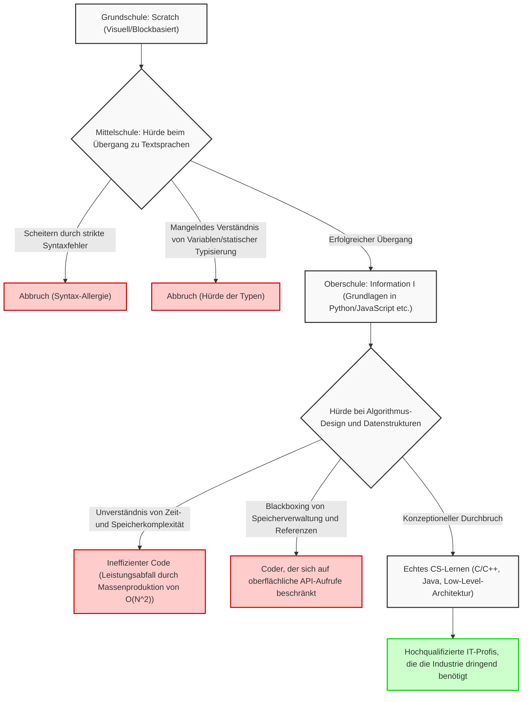
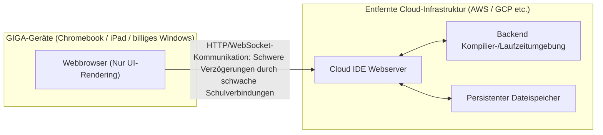
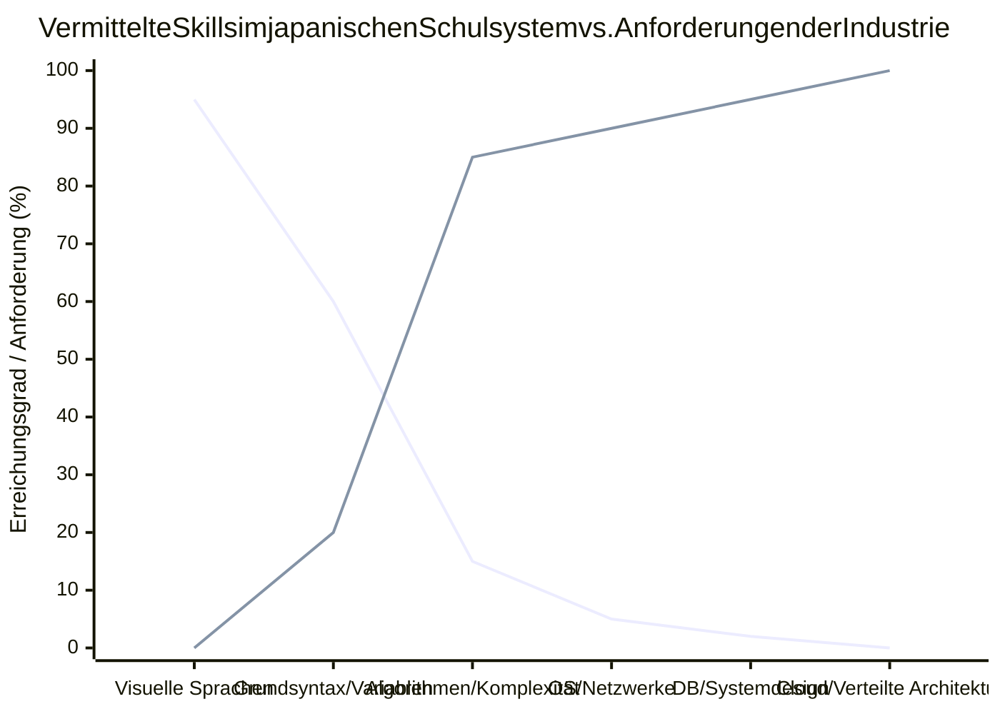

## 1. Einleitung: Licht und Schatten der obligatorischen Programmierung

Die obligatorische Einführung der Programmierausbildung an Grundschulen im Jahr 2020, die Ausweitung im Fach Technik und Hauswirtschaft an Mittelschulen im Jahr 2021 und die Einführung des neuen Pflichtfachs „Information I“ an Oberschulen im Jahr 2022 haben der japanischen IT- und Informationsbildung in den letzten Jahren einen beispiellosen Paradigmenwechsel beschert. Hinter dieser Reihe von Maßnahmen steht das äußerst dringliche und nationale Bedürfnis, logisches Denken (programmiertechnisches Denken) für das Überleben in der Ära von Society 5.0 (einer super-smarten Gesellschaft) zu fördern und den chronischen Mangel an hochqualifizierten IT-Fachkräften in der Industrie zu beheben.

Betrachtet man jedoch die vorderste Front der Bildungspraxis, so wird deutlich, dass eine riesige Kluft zwischen dem vom Staat entworfenen Ideal und der Realität entstanden ist. Das schwerwiegendste Problem ist die völlige Vermischung von „das Programmieren als Mittel lernen“ und „Informatik (Computer Science) als akademische Disziplin meistern“. Darüber hinaus gibt es einen Berg struktureller Herausforderungen, die gelöst werden müssen, wie die technischen Einschränkungen durch die Spezifikationen der landesweit bereitgestellten IT-Infrastruktur und den Mangel an fachlichen Fähigkeiten der Lehrkräfte.

Dieser Artikel fasst die „Folgen“ der Einführung des obligatorischen Programmierunterrichts in Japan zusammen und beleuchtet die grundlegenden und strukturellen Probleme, mit denen die IT-Bildung derzeit konfrontiert ist, aus der Perspektive der Informatiktheorie, der Einschränkungen von Hardware-Architekturen und der globalen industriellen Wettbewerbsfähigkeit äußerst detailliert und technisch. Es ist eine 10.000-Zeichen-Abhandlung, die über eine bloße Bildungsdiskussion hinausgeht und die Zukunft Japans aus der Sicht des Software-Engineerings betrachtet.

## 2. Die Falle der visuellen Programmierung: Der tiefe und steile Graben von Scratch zur Textprogrammierung

Der De-facto-Standard in der Programmierausbildung an Grundschulen sind visuelle Programmiersprachen (Blockprogrammierung), wie beispielsweise das vom MIT Media Lab entwickelte „Scratch“. Die Möglichkeit, die drei grundlegenden Kontrollstrukturen von Algorithmen – „Sequenz“ (Folge), „Selektion“ (Verzweigung) und „Iteration“ (Wiederholung) – visuell und intuitiv durch das Zusammensetzen von Blöcken wie bei einem Puzzle über eine grafische Benutzeroberfläche zu erlernen, ist eine großartige Erfindung, die als Einstiegsbildung hoch bewertet werden sollte.

Hier lauert jedoch eine große Falle, sozusagen die „Falle der Abstraktion“. Es ist die grausame Tatsache, dass „der Übergang von der visuellen Programmierung zu vollwertigen textbasierten Programmiersprachen (Python, JavaScript, C++, [Rust](https://kenji.blog/de/p/webassembly-wasm-current-future/) usw.) extrem schwierig ist und viele Lernende in dieser Phase scheitern“.

### Die Mauer der Abstraktion und das Blackboxing der Informatik

Visuelle Programmierumgebungen wie Scratch abstrahieren stark und verbergen (kapseln) absichtlich Schlüsselelemente, die den Kern der Informatik bilden, wie die komplexe Syntax von Programmiersprachen, strikte Typsysteme (Type Systems) und die Verwaltung des Lebenszyklus von Speicher. Dies ist hervorragend geeignet, um die kognitive Belastung für Anfänger zu senken, wird jedoch zu einem massiven Hindernis beim Übergang zum echten Engineering im nächsten Schritt. Denn in der tatsächlichen Softwareentwicklung ist das Verständnis von Variablen-Gültigkeitsbereichen (lokale und globale Variablen), komplexen Datenstrukturen (Arrays, verkettete Listen, Hashtabellen, binäre Suchbäume, Graphen), Zeigeroperationen und den [Heap](https://kenji.blog/de/p/c-language-pointers-memory-management-stack-heap/)- und [Stack](https://kenji.blog/de/p/c-language-pointers-memory-management-stack-heap/)-Bereichen des Speichers absolut unerlässlich.

Das folgende Mermaid-Diagramm visualisiert die Lernhürden und Drop-off-Punkte (Abbrüche), mit denen Anfänger beim Übergang von der visuellen Programmierung zur echten Informatik konfrontiert sind.



Wie aus diesem Flussdiagramm deutlich wird, bringt das bloße Sammeln von Erfahrungen mit dem „Schreiben von Code, um einen Charakter auf dem Bildschirm zu bewegen“, keine echten Software-Ingenieure hervor, die skalierbare verteilte Systemarchitekturen entwerfen und die Leistung im Millisekundenbereich optimieren können. Zwischen dem Zusammensetzen bunter Blöcke in Scratch mit der Maus und dem Entschlüsseln des C-Quellcodes des Linux-Kernels sowie dem Verfolgen des Verhaltens eines [TCP](https://kenji.blog/de/p/http3-quic-protocol-tcp-udp/)/IP-Stacks besteht eine absolute konzeptionelle Lücke, die nicht einfach mit den Worten „Unterschied in der verwendeten Sprache“ abgetan werden kann.

## 3. Die Grenzen des Codings ohne „Mathematik“ und „diskrete Logik“: Ein Ansatz aus der Komplexitätstheorie

Die größte Schwäche und wohl auch der fatale Fehler im japanischen Lehrplan für die Programmierausbildung ist der überwältigende Mangel an Verbindung zwischen „Coding-Fähigkeiten“ und „Mathematik / diskreter Mathematik (Discrete Mathematics)“. In der hochkarätigen Informatikausbildung in Ländern wie den USA und Indien wird mehr Wert auf die Effizienz von Algorithmen, die mathematische Logik und mathematische Beweise gelegt als auf die Grammatik der Programmiersprache selbst. Denn Code ist nichts anderes als die Übersetzung mathematischer Formeln.

### Die absolute Dominanz von Zeitkomplexität und Speicherkomplexität ([Big O](https://kenji.blog/de/p/time-space-complexity-big-o-notation-examples/) Notation)

Bei der Bewertung und dem Entwurf der Leistung von Software sind die Konzepte der Zeitkomplexität (Time Complexity) und Speicherkomplexität (Space Complexity) unvermeidlich. Die Landau-Notation (Big O Notation) gibt an, wie die Ausführungszeit und der Speicherverbrauch wachsen, wenn die Größe der Eingabedaten eines Algorithmus $N$ ist.

Als mathematische Definition wird $f(x) = O(g(x))$ wie folgt streng definiert:

$$
\exists C > 0, \exists x_0 > 0, \forall x > x_0, |f(x)| \le C \cdot |g(x)|
$$

Im japanischen Informatikunterricht ist es beispielsweise beim Erlernen der Datensortierung üblich, dass die Schüler einfach die integrierte Methode `array.sort()` in Python aufrufen und es damit belassen. Was in der Informatik jedoch wirklich gefordert ist, ist das mathematische Verständnis und der Beweis, warum ein einfaches Bubble Sort niemals in der Praxis verwendet wird und warum stattdessen Quick Sort, Merge Sort oder [Timsort](https://kenji.blog/de/p/sorting-algorithms/) ([Timsort](https://kenji.blog/de/p/sorting-algorithms/)) in Standardbibliotheken implementiert werden.

Im Folgenden sind die durchschnittlichen Zeitkomplexitäten typischer Sortieralgorithmen aufgeführt.

- Bubble Sort: $O(N^2)$
- Selection Sort (Auswahlsortieren): $O(N^2)$
- Insertion Sort (Einfügesortieren): $O(N^2)$
- Merge Sort: $O(N \log N)$
- Quick Sort: $O(N \log N)$
- [Heap](https://kenji.blog/de/p/c-language-pointers-memory-management-stack-heap/) Sort: $O(N \log N)$

Beispielsweise lässt sich die Zeitkomplexität $T(N)$ von Merge Sort durch das Paradigma „Teile und Herrsche“ (Divide and Conquer) mit der folgenden Rekursionsgleichung ausdrücken:

$$
T(N) = 2T\left(\frac{N}{2}\right) + O(N)
$$

Indem man diese rekursive Gleichung mit dem Master-Theorem (Master Theorem) erweitert und löst, ergibt sich die ideale Komplexität von $T(N) = O(N \log N)$.

$$
T(N) = \Theta(N \log_2 N)
$$

Bei moderner Big-Data-Analyse und der Verarbeitung von Traffic im Web-Maßstab erreicht $N$ gigantische Größenordnungen von Hunderten von Millionen oder Milliarden. Wenn ein unwissender Programmierer einen ineffizienten $O(N^2)$-Algorithmus implementiert, sind für Daten der Größe $N = 10^6$ astronomische $10^{12}$ (1 Billion) nutzlose Vergleichsoperationen erforderlich, was faktisch zum Einfrieren und Absturz des Systems führt. Ein $O(N \log N)$-Algorithmus ist hingegen in etwa $2 \times 10^7$ (20 Millionen) Operationen abgeschlossen. Zu behaupten, „ich kann programmieren“, ohne dieses grausame mathematische Fundament, ist so gefährlich, wie ein Hochhaus zu bauen, ohne etwas von Strukturmechanik zu verstehen.

## 4. Speicherverwaltung und das Blackboxing der Systemarchitektur

Ein Problem auf einer noch tieferen Ebene ist, dass das Verständnis für Speicherverwaltung ([Memory Management](https://kenji.blog/de/p/memory-management-garbage-collection/)) und CPU-Architektur komplett fehlt. Lernende, die nur High-Level-Sprachen mit [Garbage Collection](https://kenji.blog/de/p/memory-management-garbage-collection/) (GC) wie Python und JavaScript gelernt haben, die derzeit in Schulen unterrichtet werden, werden sich in ihrem ganzen Leben nie bewusst machen, wo Variablen und Objekte im physischen Speicher (RAM) abgelegt ([Heap](https://kenji.blog/de/p/c-language-pointers-memory-management-stack-heap/) oder [Stack](https://kenji.blog/de/p/c-language-pointers-memory-management-stack-heap/)), wie sie allokiert und wann und wie sie freigegeben werden.

```c
// Ein Beispiel für explizite und direkte Speicherallokation und Zeigeroperationen in C
#include <stdio.h>
#include <stdlib.h>

int main() {
    int n = 1000000;
    // Kontinuierliche dynamische Speicherallokation auf dem Heap (Systemaufruf an das OS)
    int *array = (int*)malloc(n * sizeof(int));
    
    if (array == NULL) {
        fprintf(stderr, "Speicherallokation fehlgeschlagen! Out of memory.\n");
        return 1;
    }
    
    // Initialisierung des Arrays durch Zeigerarithmetik
    for(int i = 0; i < n; i++) {
        *(array + i) = i * 2; // Äquivalent zu array[i] = i * 2
    }
    
    // Explizite Freigabe von Ressourcen zur Vermeidung von Speicherlecks (Memory Leaks)
    free(array);
    array = NULL; // Verhindert Dangling Pointer
    
    return 0;
}
```

Das Konzept der Zeiger (direkte Verweise auf Speicheradressen), die Datenplatzierung zur Maximierung der Trefferrate der CPU-Cache-Hierarchie (L1/L2/L3-Cache) (Data Locality) sowie das Wissen über Race Conditions und gegenseitigen Ausschluss (Mutex/Semaphore) in Multi-Threading-Umgebungen sind absolut unerlässlich bei der Entwicklung hochperformanter Backend-Systeme, 3D-Spiele-Engines oder eingebetteter Systeme (IoT). Es muss gesagt werden, dass sich die aktuellen Lehrpläne des Bildungsministeriums darauf beschränken, „oberflächliche Anwendungen auszuführen“, und stark vom eigentlichen akademischen Ziel abweichen, „die Tiefen der Informatik zu verstehen“.

## 5. Die Hürde von Datenbanken und Persistenz: Das Fehlen der relationalen Algebra

In modernen Anwendungen ist das Speichern und Abrufen von Daten (Persistenz) ein unvermeidliches Thema. Viele schulische Ausbildungen beschränken sich jedoch auf „Datenverarbeitung im Speicher“, die verschwindet, wenn die Ausführung des Programms endet. Die mathematische Theorie hinter relationalen Datenbanken ([RDBMS](https://kenji.blog/de/p/rdbms-transaction-acid-isolation-level-lock/)) und SQL, nämlich die von Dr. Edgar F. Codd vorgeschlagene „relationale Algebra (Relational Algebra)“, wird selten unterrichtet.

Datenbankoperationen sind durch die folgenden Grundoperationen definiert, die auf der Mengenlehre basieren:

- Selektion (Selection, $\sigma$): Extrahieren von Tupeln (Zeilen), die Bedingungen erfüllen
- Projektion (Projection, $\pi$): Extrahieren bestimmter Attribute (Spalten)
- Join ($\bowtie$): Bedingte Schnittmenge mehrerer Relationen

Darüber hinaus ist das Erlernen der Struktur von „[B-Tree](https://kenji.blog/de/p/b-tree-database-index-theory/) (B-Baum)-Indizes“, mit denen man gewünschte Daten in großen Mengen an Datensätzen sofort durchsuchen kann, die beste praktische Anwendung von Datenstrukturen. B-Bäume garantieren eine Suchgeschwindigkeit von $O(\log N)$ bei gleichzeitiger Minimierung der Anzahl an Festplatten-I/Os. Ohne Kenntnis der [ACID](https://kenji.blog/de/p/rdbms-transaction-acid-isolation-level-lock/)-Eigenschaften von Transaktionen (Atomicity, [Consistency](https://kenji.blog/de/p/cap-theorem-distributed-systems-tradeoff/), Isolation, Durability) kann man kein robustes System aufbauen.

## 6. Sicherheit und Kryptographie: Eine soziale Infrastruktur, die auf der Schwierigkeit der Primfaktorzerlegung basiert

In der Ausbildung zur Informationskompetenz wird zwar eine oberflächliche Sicherheitserziehung vermittelt („Mach dein Passwort komplexer“, „Klicke nicht auf verdächtige Links“), aber die Mathematik der „Kryptographie“, die die Internetgesellschaft grundlegend stützt, wird fast nie gelehrt.

Die HTTPS-Kommunikation und die digitalen Signaturen, die wir täglich nutzen, werden durch asymmetrische Kryptosysteme wie [RSA](https://kenji.blog/de/p/modern-cryptography-public-key-hash-signature/) geschützt. Die Sicherheit der RSA-Verschlüsselung beruht auf der mathematischen Schwierigkeit (die als NP-intermediäres Problem gilt), dass „die Primfaktorzerlegung gigantischer ganzer Zahlen mit aktuellen klassischen Computern nicht in realistischer Zeit gelöst werden kann“.

Die mathematischen Formeln, die der RSA-Verschlüsselung zugrunde liegen, sind schöne Anwendungen der Eulerschen Phi-Funktion und des kleinen Satzes von [Fermat](https://kenji.blog/de/p/fermat/).

1. Wähle zwei gigantische Primzahlen $p$ und $q$
2. Berechne $n = p \times q$ (Dies wird Teil des öffentlichen Schlüssels)
3. Berechne $\phi(n) = (p-1)(q-1)$
4. Wähle $e$ und $d$ so, dass $e \times d \equiv 1 \pmod{\phi(n)}$
5. Verschlüsselung: $C \equiv M^e \pmod{n}$
6. Entschlüsselung: $M \equiv C^d \pmod{n}$

Auf diese Weise entfaltet die Programmierausbildung erst dann ihre wahre Stärke, wenn sie eng mit der Mathematikausbildung verknüpft ist. Der Prozess, Formeln in Code umzusetzen und gesellschaftlich zu implementieren, ist der wahre Reiz der Wissenschaft.

## 7. GIGA School-Konzept und die verzweifelten Grenzen der Infrastruktur: Chromebooks und Cloud-IDEs

Wenn man über IT-Bildung in Japan spricht, kommt man nicht am „GIGA School-Konzept“ vorbei, einem nationalen Projekt, das vom Bildungsministerium mit enormem Budget vorangetrieben wurde. Dieses Projekt, das landesweit Grund- und Mittelschülern ein Endgerät pro Schüler und eine High-Speed-Netzwerkumgebung bereitstellt, sollte als Katalysator dienen, um den Rückstand bei der Digitalisierung aufzuholen. Die Hardware-Spezifikationen und die Architektur der tatsächlich verteilten Endgeräte stellen jedoch ein massives Hindernis für eine vollwertige Programmierausbildung dar.

### Schwache Endgeräte und der Verlust lokaler Entwicklungsumgebungen

Viele der Endgeräte, die als Standard des GIGA School-Konzepts eingeführt wurden, sind extrem günstige Chromebooks, iPads oder billige Windows-Geräte. Ihre Standard-Spezifikationen sind wie folgt:

- CPU: Intel Celeron oder billige ARM-Prozessoren
- Speicher (RAM): 4GB (gerade genug, um ein modernes OS zu betreiben)
- Speicherplatz (eMMC): 32GB ~ 64GB (extrem langsame I/O-Geschwindigkeit)

Aufgrund dieser dürftigen Hardware-Einschränkungen ist es praktisch unmöglich, eine „lokale Entwicklungsumgebung“ aufzubauen, wie sie professionelle Ingenieure täglich nutzen. Das Starten von Linux-[Container](https://kenji.blog/de/p/docker-container-namespace-cgroups-layers/)n mit [Docker](https://kenji.blog/de/p/docker-container-namespace-[cgroups](https://kenji.blog/de/p/docker-container-namespace-cgroups-layers/)-layers/), der Betrieb einer ressourcenintensiven IDE wie Visual Studio Code mit allen Funktionen oder das Starten von Node.js- oder Python-Lokalservern zur Installation schwerer Bibliotheken führt sofort zu Speichermangel und Systemabstürzen.

Infolgedessen sind die Schulen in eine Situation gezwungen, in der sie sich vollständig auf browserbasierte Cloud-IDEs (Google Colaboratory, Replit oder leichtgewichtige Web-Tools von Schulbuchverlagen) verlassen müssen.



Die vollständige Abhängigkeit von Cloud-IDEs verursacht aus pädagogischer Sicht die folgenden äußerst schwerwiegenden Mängel:

1. **Unverständnis von Dateisystemen und OS-Architekturen**: Da es keine lokale Umgebung gibt, werden essentielle Kenntnisse (UNIX-Literacy), die IT-Ingenieure im Schlaf beherrschen müssen – wie Verzeichnisstrukturen, absolute und relative Pfade, das Setzen von Umgebungsvariablen, Dateiberechtigungen und OS-Operationen in der Kommandozeile (CLI) – überhaupt nicht erworben.
2. **Netzwerkverzögerungen und Schwachstellen in der Infrastruktur**: Da eine ständige Verbindung vorausgesetzt wird, kommt es landesweit häufig zu Zwischenfällen, bei denen die Netzwerkbandbreite der Schule überlastet wird, sobald alle Schüler gleichzeitig auf das Netz zugreifen, wodurch der Browser einfriert und das Lernen vollständig zum Stillstand kommt.
3. **Entzug der Erfahrung mit Versionsverwaltung (Git)**: Die Chance, durch einen schwarzen Terminalbildschirm die Konzepte von Git und GitHub kennenzulernen – die zur Verwaltung des Änderungsverlaufs von Quellcode und zur kollaborativen Entwicklung mit Teams weltweit dienen –, wird ihnen genommen.

Wenn professionelle Software-Ingenieure entwickeln, sind Operationen im Terminal (Shell) die absolute Basis. Ohne die schmutzige Erfahrung, Befehle wie `ls`, `cd`, `grep`, `chmod`, `git rebase` einzugeben und direkt mit dem lokalen OS-Kernel zu interagieren, ist die Heranbildung echter IT-Talente absolut unmöglich. Nur in der Sandbox (Sandkasten) eines Chromebooks zu spielen, bringt keine Full-[Stack](https://kenji.blog/de/p/c-language-pointers-memory-management-stack-heap/)-Ingenieure hervor, die das gesamte System überblicken können.

## 8. Die verzweifelte Kluft zur Welt: Die Diskrepanz zwischen den Anforderungen der Industrie und der Schulbildung

Die letzte und vielleicht nationale Krise für die japanische IT-Bildung ist der drastische Rückgang der Wettbewerbsfähigkeit im globalen Kontext.

### Der harte Informatikunterricht im Ausland

Im Vereinigten Königreich (UK) wurde das Fach „Computing“ bereits 2014 für Kinder ab 5 Jahren (Key Stage 1) verpflichtend eingeführt. Ihr Lehrplan geht weit über reine „Programmiererfahrungen“ hinaus und behandelt äußerst akademische und systematische Computerwissenschaften, von der logischen Gestaltung von Algorithmen über das Verständnis logischer Schaltungen mithilfe der Booleschen Algebra (Boolean algebra) und Netzwerktopologien bis hin zur Hardwarearchitektur.

In den USA gibt es strenge Standardlehrpläne für K-12 (vom Kindergarten bis zum Highschool-Abschluss), die von der CSTA (Computer Science Teachers Association) festgelegt wurden. Im Kurs AP (Advanced Placement) Computer Science A, den Highschool-Schüler belegen, werden auf dem Niveau des ersten Studienjahres Kenntnisse in echter objektorientierter Programmierung in [Java](https://kenji.blog/de/p/programming-languages-history-paradigm-evolution/), Polymorphismus, rekursiver Verarbeitung, der Implementierung von Datenstrukturen und der Bewertung algorithmischer Komplexität verlangt. Die Strenge der MINT-Bildung in Indien oder China und die Tiefe der daraus resultierenden Elite muss hier nicht weiter erwähnt werden.

### Die verzweifelte Diskrepanz zwischen geforderten und gelehrten Fähigkeiten

Die Anforderungen, die die moderne Industrie – insbesondere global agierende Mega-Ventures und Tech-Giganten (GAFAM usw.) – an neue Software-Ingenieure stellt, steigen von Jahr zu Jahr in erschreckendem Tempo. Gefordert wird eine breite und tiefe Expertise, wie z.B. der Aufbau Cloud-nativer Infrastrukturen (AWS, GCP, [Kubernetes](https://kenji.blog/de/p/kubernetes-k8s-architecture-pod-service-ingress/)), das Design verteilter Systeme mit [Microservice](https://kenji.blog/de/p/microservices-architecture-bff-api-gateway/)-Architekturen, die Implementierung von Machine-Learning-[Pipeline](https://kenji.blog/de/p/cicd-pipeline-github-actions-best-practices/)s und fortgeschrittenes Sicherheitswissen.

Die folgende Grafik veranschaulicht konzeptionell die verzweifelte Diskrepanz zwischen dem Niveau der Fähigkeiten, die derzeit im japanischen Schulsystem vermittelt werden, und den Anforderungen der vordersten Industrie.



Um diese riesige Lücke (Death Valley) zu schließen, sind ein radikaler Paradigmenwechsel in der Schulbildung und massive Investitionen erforderlich. Angesichts eines extremen Mangels an spezialisierten Lehrkräften für das Fach „Information“ im ganzen Land und der Tatsache, dass Lehrer für Mathematik, Naturwissenschaften oder Technik/Hauswirtschaft das Programmieren neben ihrer eigentlichen Arbeit mit unzureichender Schulung unterrichten, ist es unmöglich, weltweit wettbewerbsfähige Top-Tier-Ingenieure hervorzubringen.

## 9. Der Wertverfall des „Codings“ in der KI-Ära ([LLM](https://kenji.blog/de/p/large-language-models-llm-transformer-prompt-engineering/))

Was die Situation weiter verkompliziert, ist die explosionsartige Verbreitung von großen Sprachmodellen (LLMs) wie ChatGPT und KI-Coding-Assistenten wie GitHub Copilot. In einer Zeit, in der KI aus natürlichsprachlichen Anweisungen sofort perfekten Code generieren und sogar Testcode schreiben kann, sinkt der Marktwert sogenannter „Coder“, die lediglich „die Syntax von Python kennen“ oder „wissen, wie man eine API aufruft“, rapide ab.

In der KI-Ära wird von menschlichen Ingenieuren nicht mehr das Auswendiglernen von Syntax verlangt. Vielmehr sind folgende Fähigkeiten gefragt:

1. **Anforderungsdefinition und Domain-Modellierung**: Die Fähigkeit, komplexe reale Probleme zu extrahieren und sie als System zu modellieren.
2. **Architektur-Design**: Die Fähigkeit, Baupläne für ganze Systeme zu entwerfen, die Skalierbarkeit, Verfügbarkeit und Wartbarkeit gewährleisten.
3. **Mathematische und logische Verifizierung**: Die Fähigkeit, von der KI generierten Code theoretisch zu überprüfen und zu beweisen, dass er keine Sicherheitslücken oder Komplexitäts-Engpässe aufweist.

Ironischerweise gehören diese alle nicht in den Bereich der „oberflächlichen Programmierung“, sondern in die tieferen, abstrakten Bereiche der „Informatik und Mathematik“. Wenn das japanische Bildungssystem nur Fähigkeiten im Downstream-Prozess lehrt, die leicht von KI ersetzt werden können, muss man dies als nationalen Verlust bezeichnen.

## 10. Auf dem Weg zur Verschmelzung von Mathematik und Programmierung: Vorschläge für die Bildung der nächsten Generation

Was in der japanischen IT-Ausbildung künftig dringend erforderlich sein wird, ist die Abkehr von der „Programmierung als Selbstzweck oder bloßes Mittel“ und die Rückkehr zur „Erforschung der Informatik als mathematische Wissenschaft“. Programmiersprachen sind lediglich Werkzeuge, um Gedanken auszudrücken, und es sind die zugrunde liegenden mathematischen und logischen Strukturen, die einen universellen Wert besitzen, der auch dann nicht verblasst, wenn sich die Zeiten ändern.

Beispielsweise sind die Grundlagen der Künstlichen Intelligenz (KI) und des maschinellen Lernens eng mit linearer Algebra (Matrizen und Tensoren), multivariater Infinitesimalrechnung (Gradientenabstieg) und Wahrscheinlichkeitsrechnung/Statistik (Bayesianische Inferenz und Informationstheorie) verknüpft. Die Optimierung von Gewichten in den neuronalen Netzen des Deep Learnings wird durch die Kettenregel (Chain Rule) unter Verwendung partieller Ableitungen und Backpropagation formuliert.

$$
\frac{\partial L}{\partial w_{ij}^{(l)}} = \frac{\partial L}{\partial z_i^{(l+1)}} \cdot \frac{\partial z_i^{(l+1)}}{\partial w_{ij}^{(l)}} = \delta_i^{(l+1)} \cdot a_j^{(l)}
$$

Fachkräfte, die in der Lage sind, solch fortgeschrittene mathematische Formeln in Code zu übersetzen und paralleles Rechnen (Parallel Computing) extrem zu optimieren und zu implementieren – und dabei die Hardware-Architektur von GPUs (CUDA) oder TPUs im Blick zu behalten –, werden die IT-Branche der nächsten Generation anführen. Genau deshalb müssen wir uns sofort von einer flachen Bildung verabschieden, die Schüler nur oberflächliche Syntax auswendig lernen lässt, und uns einer tiefgreifenden Bildung zuwenden, die die Grundprinzipien des Rechnens (First Principles) hinterfragt.

## 11. Fazit: Der steile Weg zur wahren IT-Nation und unsere Entschlossenheit

Die Einführung der obligatorischen Programmierausbildung in den 2020er Jahren war zweifellos ein wichtiger Schritt, um die gesamte japanische Gesellschaft für die „Bedeutung von IT und Information“ zu sensibilisieren. Dennoch war dies nur ein bloßes „Aufwärmen“ auf einem langen Weg.

Es geht darum, über den Spaß hinauszugehen, eine Katzenfigur in Scratch zu bewegen, und die mathematische Schönheit eines $O(N \log N)$-Algorithmus zu bewundern. Es geht darum, die Spannung zu vermitteln, über [TCP](https://kenji.blog/de/p/http3-quic-protocol-tcp-udp/)-Pakete von einem schwarzen Terminalbildschirm aus mit Servern weltweit zu kommunizieren. Es erfordert den Wiederaufbau einer neuen Bildungsinfrastruktur, um die Hardware-Einschränkungen des GIGA School-Konzepts zu überwinden, die Ausbildung und Vermittlung von Lehrkräften mit hoher CS-Expertise und mitunter die mutige Einbindung externer professioneller Ingenieure in die Schulbildung.

Die Herausforderungen, vor denen die IT-Bildung in Japan steht, sind extrem tief, hartnäckig und komplex. Wenn sich jedoch Industrie, Wissenschaft und Regierung ernsthaft zusammenschließen, um sich diesen Problemen zu stellen und ein Ökosystem aufzubauen, das kontinuierlich „echte Ingenieure, die Systeme von Grund auf entwerfen und erschaffen können“ hervorbringt – anstatt nur „Arbeiter, die Code nach Spezifikation schreiben können“ –, wird Japan als wahre IT-Nation wieder eine weltweite Führungsrolle übernehmen können.

Wie wir diese schwierigste und wichtigste Phase, die Zeit „nach“ der obligatorischen Programmierung, meistern werden: Genau jetzt ist die Entschlossenheit und Ernsthaftigkeit von uns Erwachsenen gefragt.

---

*In diesem Artikel haben wir die Komplexitätstheorie und die infrastrukturellen Grenzen des GIGA School-Konzepts skizziert. Noch spezifischere Themen der Informatik (wie Algorithmen für verteilte Systeme und Details zu Low-Level-Speicherverwaltungsmethoden) werden in zukünftigen Beiträgen dieser Reihe nach und nach behandelt.*


