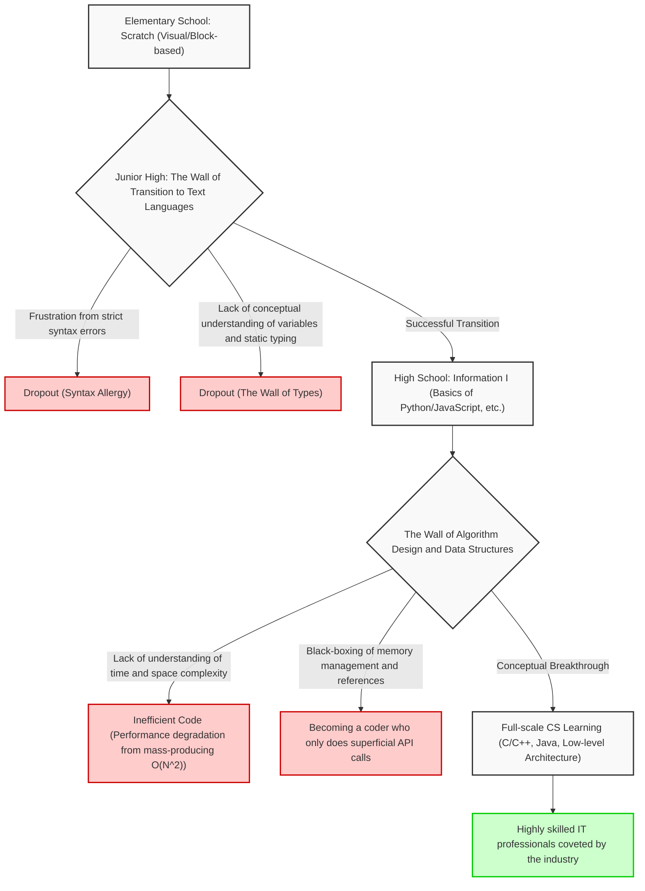
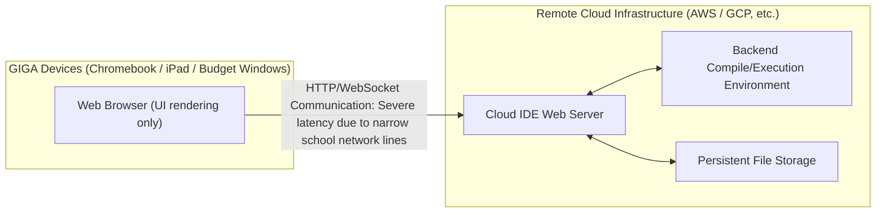
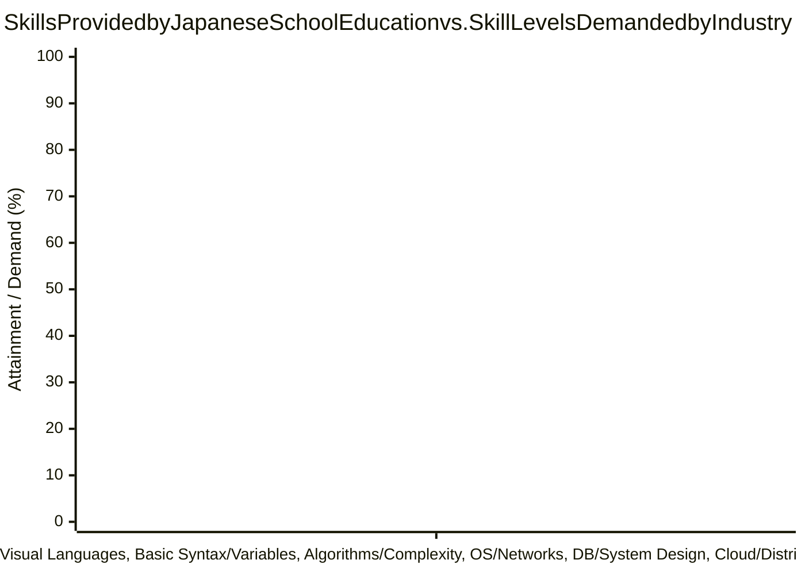

## 1. Introduction: The Light and Shadow Brought by Mandatory Programming Education

With the mandatory implementation of programming education in elementary schools in 2020, its expansion in junior high school technology and home economics classes in 2021, and the mandatory introduction of the new subject "Information I" in high schools in 2022, IT and information education in Japan have experienced an unprecedented paradigm shift in recent years. At the root of this series of policies lies a very pressing national demand: the cultivation of logical thinking skills (programming thinking) necessary to survive in the Society 5.0 (Super Smart Society) era, and the resolution of the chronic shortage of highly skilled IT professionals in the industry.

However, looking at the front lines of education, it has become apparent that there is a massive disconnect between the ideal envisioned by the government and reality. The most serious issue is the complete conflation of "learning programming as a tool" and "mastering the academic discipline of computer science." Furthermore, structural challenges are piling up, including the technical limitations due to the hardware specs of the nationwide IT infrastructure, and the lack of professional skill sets among the teachers who are supposed to instruct the students.

This article summarizes the "aftermath" of the mandatory programming education in Japan and explores in detail and technically the fundamental and structural problems facing IT education today. It examines these issues from the perspectives of computer science theory, hardware architecture constraints, and global industrial competitiveness. Spanning approximately 10,000 characters, this is not just an educational discourse, but an essay that considers the future of Japan from the viewpoint of software engineering.

## 2. The Trap of Visual Programming: The Deep and Steep Chasm from Scratch to Text Coding

The de facto standard in elementary school programming education is visual programming languages (block programming), represented by "Scratch" developed by the MIT Media Lab. The fact that it allows beginners to visually and intuitively learn the three basic algorithmic control structures—sequence, selection, and iteration—by combining puzzle-like blocks using an intuitive graphical interface makes it a great invention that deserves high praise as introductory education.

However, there is a major pitfall here, which can be called the "trap of abstraction." That is the cruel reality that "transitioning from visual programming to a full-fledged text-based programming language (Python, JavaScript, C++, [Rust](https://kenji.blog/en/p/webassembly-wasm-current-future/), etc.) is extremely difficult, and many learners drop out at this stage."

### The Wall of Abstraction and the Black-Boxing of Computer Science

Visual programming environments like Scratch highly abstract and intentionally hide (encapsulate) the fundamental elements of computer science, such as the complex syntax of programming, strict type systems, and memory lifecycle management. While this is excellent for lowering the cognitive load on beginners, it becomes a massive barrier when advancing to genuine engineering. In actual software development, an understanding of variable scope (local and global variables), complex data structures (arrays, linked lists, hash tables, binary search trees, graphs), pointer manipulation, and memory heap and stack regions is absolutely essential.

The following Mermaid diagram visualizes the learning hurdles and dropout points that beginners face during the transition from visual programming to authentic computer science.



As is evident from this flowchart, merely accumulating the experience of "writing code to move characters on a screen" will not cultivate true software engineers who can design scalable distributed system architectures and optimize performance down to the millisecond. Between the task of assembling colorful Scratch blocks with a mouse and reading the C source code of the Linux kernel to trace the behavior of the [TCP](https://kenji.blog/en/p/http3-quic-protocol-tcp-udp/)/IP stack, there lies an absolute conceptual disconnect that cannot be dismissed simply as "a difference in the language used."

## 3. The Limits of Coding Without "Mathematics" and "Discrete Logic": An Approach from Computational Complexity Theory

The greatest weakness and a potentially fatal flaw in Japan's programming education curriculum is the overwhelming lack of integration between "coding skills" and "mathematics / discrete mathematics." In top-tier computer science education, such as in the United States and India, the emphasis is placed on algorithm efficiency, mathematical logic, and mathematical proofs rather than the syntax of the programming language itself. This is because code is merely a translation of mathematical formulas.

### The Absolute Dominance of Time Complexity and Space Complexity ([Big O](https://kenji.blog/en/p/time-space-complexity-big-o-notation-examples/) Notation)

When evaluating and designing software performance, the concepts of Time Complexity and Space Complexity are unavoidable. Landau's asymptotic notation (Big O Notation) indicates how execution time and memory consumption increase when the input data size to an algorithm is $N$.

Mathematically, $f(x) = O(g(x))$ is strictly defined as follows:

$$
\exists C > 0, \exists x_0 > 0, \forall x > x_0, |f(x)| \le C \cdot |g(x)|
$$

In Japan's information education, when learning about data sorting, for example, there are cases where it simply ends with calling a built-in method like `array.sort()` in Python. However, what is truly required in information engineering is the mathematical understanding and proof of why the simple Bubble Sort is never used in practical domains, and why Quick Sort, Merge Sort, or [Timsort](https://kenji.blog/en/p/sorting-algorithms/) are adopted as standard libraries.

Below are the average time complexities of representative sorting algorithms.

- Bubble Sort: $O(N^2)$
- Selection Sort: $O(N^2)$
- Insertion Sort: $O(N^2)$
- Merge Sort: $O(N \log N)$
- Quick Sort: $O(N \log N)$
- [Heap](https://kenji.blog/en/p/c-language-pointers-memory-management-stack-heap/) Sort: $O(N \log N)$

For instance, the time complexity $T(N)$ of Merge Sort is expressed by the following recurrence relation based on the Divide and Conquer paradigm.

$$
T(N) = 2T\left(\frac{N}{2}\right) + O(N)
$$

By expanding and solving this recursive relation using the Master Theorem, the ideal computational complexity $T(N) = O(N \log N)$ is derived.

$$
T(N) = \Theta(N \log_2 N)
$$

In modern big data analytics and web-scale traffic processing, the order of $N$ is massive, reaching hundreds of millions or billions. If an ignorant programmer implements an inefficient $O(N^2)$ algorithm, it would require a staggering $10^{12}$ (1 trillion) useless comparison operations for data size $N = 10^6$, effectively causing the system to freeze and crash. On the other hand, $O(N \log N)$ would complete in about $2 \times 10^7$ (20 million) operations. To claim "I can program" without this cruelly rigorous mathematical backing is like building a skyscraper without knowing structural mechanics, which is extremely dangerous.

## 4. The Black-Boxing of [Memory Management](https://kenji.blog/en/p/memory-management-garbage-collection/) and System Architecture

At an even deeper layer is the complete omission of the understanding of [Memory Management](https://kenji.blog/en/p/c-language-pointers-memory-management-stack-heap/) and CPU architecture. Learners who have only been taught high-level languages with [Garbage Collection](https://kenji.blog/en/p/memory-management-garbage-collection/) (GC), like Python and JavaScript, in schools today will never in their lives be conscious of where variables and objects are physically allocated in RAM (heap vs. stack), how they are assigned, and when and how they are freed.

```c
// Example of explicit and direct memory allocation and pointer manipulation in C
#include <stdio.h>
#include <stdlib.h>

int main() {
    int n = 1000000;
    // Dynamically allocate memory consecutively in the heap (System call to the OS)
    int *array = (int*)malloc(n * sizeof(int));
    
    if (array == NULL) {
        fprintf(stderr, "Memory allocation failed! Out of memory.\n");
        return 1;
    }
    
    // Initializing the array using pointer arithmetic
    for(int i = 0; i < n; i++) {
        *(array + i) = i * 2; // Equivalent to array[i] = i * 2
    }
    
    // Explicit resource deallocation to prevent Memory Leaks
    free(array);
    array = NULL; // Prevent dangling pointers
    
    return 0;
}
```

Knowledge of pointers (direct references to memory addresses), data placement to maximize CPU cache hierarchy (L1/L2/L3 cache) hit rates (Data Locality), and Race Conditions and mutual exclusion (Mutex/Semaphores) in multi-threaded environments are absolutely essential for developing high-performance backend systems, 3D game engines, or embedded systems for IoT. The current curriculum by the Ministry of Education, Culture, Sports, Science and Technology is focused solely on "running superficial applications" and has severely deviated from the original academic goal of "understanding the depths of computer science."

## 5. The Wall of Databases and Persistence: The Absence of Relational Algebra

In modern applications, data saving and retrieval (persistence) is an unavoidable theme. However, much of school education remains stuck in "data processing in memory," which disappears once the program finishes executing. The mathematical theory behind Relational Databases ([RDBMS](https://kenji.blog/en/p/rdbms-transaction-acid-isolation-level-lock/)) and SQL, namely the "Relational Algebra" proposed by Dr. Edgar F. Codd, is rarely taught.

Database operations are defined by the following basic operations based on set theory:

- Selection ($\sigma$): Extracting tuples (rows) that satisfy a condition
- Projection ($\pi$): Extracting specific attributes (columns)
- Join ($\bowtie$): Conditional intersection of multiple relations

Furthermore, learning the structure of the "[B-Tree](https://kenji.blog/en/p/b-tree-database-index-theory/) index" to instantly search for the desired data from a vast number of records is the best practical application of data structures. The B-Tree minimizes disk I/O operations while guaranteeing a search speed of $O(\log N)$. Without knowing the ACID properties (Atomicity, [Consistency](https://kenji.blog/en/p/cap-theorem-distributed-systems-tradeoff/), Isolation, Durability) of a transaction, it is impossible to build robust systems.

## 6. Security and [Crypto](https://kenji.blog/en/p/cryptocurrency-and-bitcoin/)graphy: The Social Infrastructure Supported by the Difficulty of Prime Factorization

While superficial security education like "Let's make passwords complex" and "Don't click on suspicious links" is conducted in information literacy education, the mathematics of "[Crypto](https://kenji.blog/en/p/cryptocurrency-and-bitcoin/)graphy" that fundamentally supports internet society is almost never taught.

The HTTPS communications and digital signatures we use every day are protected by public-key cryptography, such as [RSA](https://kenji.blog/en/p/modern-cryptography-public-key-hash-signature/) cryptography. The security of RSA relies on the mathematical difficulty (considered an NP-intermediate problem) that "the prime factorization of massive integers cannot be solved within a realistic time frame by current classical computers."

The mathematical formulas underlying RSA cryptography are beautiful applications of Euler's totient function and [Fermat's Little Theorem](https://kenji.blog/en/p/fermats-little-theorem/).

1. Choose two massive prime numbers $p$ and $q$
2. Calculate $n = p \times q$ (This becomes part of the public key)
3. Calculate $\phi(n) = (p-1)(q-1)$
4. Choose $e$ and $d$ such that $e \times d \equiv 1 \pmod{\phi(n)}$
5. Encryption: $C \equiv M^e \pmod{n}$
6. Decryption: $M \equiv C^d \pmod{n}$

In this way, programming education only truly unleashes its power when closely linked with mathematics education. The process of translating mathematical formulas into code and implementing them in society is the true essence of science.

## 7. The GIGA School Concept and the Hopeless Limits of Infrastructure: Chromebooks and Cloud IDEs

When discussing IT education in Japan, one cannot ignore the "GIGA School Concept," a national project promoted by the Ministry of Education with a massive budget. This initiative to provide "one device per student" and high-speed network environments to elementary and junior high school students nationwide was expected to be a catalyst to catch up on the delay in digitalization. However, the hardware specs and architectures of the devices actually distributed have become a severe hindrance to full-scale programming education.

### Low-Spec Devices and the Loss of Local Development Environments

Many of the devices introduced as standard under the GIGA School Concept are extremely cheap Chromebooks, iPads, or budget Windows devices. Their standard specs are as follows:

- CPU: Intel Celeron or budget ARM processors
- Memory (RAM): 4GB (barely enough to run a modern OS)
- Storage (eMMC): 32GB to 64GB (extremely slow I/O speeds)

Due to these weak hardware constraints, it is virtually impossible to set up the "local development environments" that professional engineers use daily. Attempting to launch Linux containers using [Docker](https://kenji.blog/en/p/docker-container-namespace-[cgroups](https://kenji.blog/en/p/docker-container-namespace-cgroups-layers/)-layers/), running heavy IDEs like Visual Studio Code with full features, or starting local Node.js or Python servers to install heavy libraries will immediately lead to memory exhaustion and system freezes.

As a result, educational frontlines are forced to rely entirely on cloud IDEs that run in the browser (such as Google Colaboratory, Replit, or lightweight web tools proprietary to textbook publishers).



Complete reliance on cloud IDEs causes the following critical educational deficiencies:

1. **Lack of understanding of file systems and OS architecture**: Without a local environment, students never acquire UNIX literacy—essential knowledge that IT engineers should use as naturally as breathing, such as directory structures, absolute and relative paths, environment variables, file permissions, and OS operations via the CLI (Command Line Interface).
2. **Network latency and infrastructure vulnerabilities**: Because constant connectivity is assumed, there are frequent nationwide incidents where school network bandwidth becomes congested the moment all students access it simultaneously, causing browsers to freeze and learning to completely stop.
3. **Deprivation of version control (Git) experience**: Students are robbed of the opportunity to have the concepts of Git and GitHub hammered into them through a black terminal screen, preventing them from learning how to manage source code history and collaborate globally.

When professional software engineers develop, operating within a terminal (shell) is the absolute foundation. Without the gritty experience of running commands like `ls`, `cd`, `grep`, `chmod`, and `git rebase` to interact directly with the local OS kernel, cultivating true IT talent is impossible. Playing solely within the sandbox of a Chromebook will never produce full-stack engineers who can oversee the entire system.

## 8. The Despairing Gap with the World: The Disconnect Between Industry Demands and School Education

The final and arguably national crisis-level challenge facing Japan's IT education is the overwhelming decline in competitiveness in a global context.

### Fierce Computer Science Education in Other Countries

In the UK, the subject "Computing" has been mandatory from age 5 (Key Stage 1) since as early as 2014. Their curriculum goes far beyond mere "programming experiences," dealing with highly academic and systematic computer science, from logical algorithm design and understanding logic circuits via Boolean algebra, to network topologies and hardware architecture.

In the US, there are rigorous standard K-12 curriculums established by the CSTA (Computer Science Teachers Association). In the AP (Advanced Placement) Computer Science A course taken by high school students, they are tested on authentic object-oriented programming using [Java](https://kenji.blog/en/p/programming-languages-history-paradigm-evolution/), polymorphism, recursion, implementation of data structures, and algorithmic complexity evaluation at a level comparable to a first-year university course. The fierce STEM education in countries like India and China, and the depth of the elite talent they produce, hardly need further mention.

### The Despairing Disconnect Between Required Skills and Taught Skills

The requirements that modern industries—especially globally expanding mega-ventures and tech giants (like GAFAM)—demand of new graduate software engineers are advancing at a terrifying speed every year. Extensive and deep expertise is required, including the construction of cloud-native infrastructure (AWS, GCP, [Kubernetes](https://kenji.blog/en/p/kubernetes-k8s-architecture-pod-service-ingress/)), the design of distributed systems using microservice architectures, the implementation of machine learning pipelines, and advanced security knowledge.

The graph below conceptually illustrates the despairing gap between the skill attainment levels provided by Japan's current school education and the skill levels demanded by the frontline industry.



To bridge this massive gap (Death Valley), a radical paradigm shift in school education and enormous investment are required. With an overwhelming nationwide shortage of specialized "Information" teachers, math, science, or technology and home economics teachers are currently teaching programming on the side with insufficient training. Under this system, Japan will never be able to produce top-tier engineers who can compete globally.

## 9. The Plummeting Value of "Coding" in the AI Era (LLMs)

Further complicating the situation is the explosive spread of [Large Language Models](https://kenji.blog/en/p/large-language-models-llm-transformer-prompt-engineering/) (LLMs) like ChatGPT and AI coding assistants like GitHub Copilot. In an era where AI can instantly generate perfect code from natural language instructions and even write test codes, the market value of so-called "Coders" who merely "know Python syntax" or "know how to call an API" is rapidly plummeting.

What is required of human engineers in the AI era is not the memorization of programming language syntax. It is the following abilities:

1. **Requirements Definition and Domain Modeling**: The ability to extract complex real-world problems to be solved and model them as a system.
2. **Architecture Design**: The ability to draw a system-wide blueprint that guarantees scalability, availability, and maintainability.
3. **Mathematical and Logical Verification**: The ability to theoretically verify and prove whether the AI-generated code has security holes or computational bottlenecks.

Ironically, all of these lie not in "superficial programming," but in the deep and abstract realms of "computer science and mathematics." If Japanese education is only teaching "downstream skills that are easily replaced by AI," it must be called a national loss.

## 10. Towards the Integration of Mathematical Sciences and Programming: A Proposal for Next-Generation Education

The urgent task for future IT education in Japan is to break away from "making programming the goal or a mere tool" and to return to the "exploration of computer science as a mathematical science." A programming language is merely a tool to express thought, and the mathematical and logical structures underlying it possess universal value that will not fade even as times change.

For example, at the core of Artificial Intelligence (AI) and machine learning, linear algebra (matrix operations and tensors), multivariable calculus (gradient descent), and probability and statistics (Bayesian inference and information theory) are intricately intertwined. The optimization of weights in deep learning neural networks is formulated by the Chain Rule using partial derivatives and backpropagation.

$$
\frac{\partial L}{\partial w_{ij}^{(l)}} = \frac{\partial L}{\partial z_i^{(l+1)}} \cdot \frac{\partial z_i^{(l+1)}}{\partial w_{ij}^{(l)}} = \delta_i^{(l+1)} \cdot a_j^{(l)}
$$

Professionals who can translate such advanced mathematical formulas into code, and optimally implement Parallel Computing while remaining conscious of GPU (CUDA) and TPU hardware architectures, are the ones who will lead the next-generation IT industry. That is why we must immediately steer away from superficial education that just makes students memorize syntax, and shift towards profound education that questions the First Principles of computation.

## 11. Conclusion: The Steep Path to a True IT Nation and Our Resolve

There is no doubt that making programming education mandatory in the 2020s was a solid step forward in terms of making Japanese society as a whole widely recognize the "importance of IT and information." However, it is merely "warm-up exercises" in a long journey.

We must step beyond the fun of moving a cat character in Scratch, move students with the mathematical beauty of an $O(N \log N)$ algorithm, and teach them the excitement of conversing with servers around the world via [TCP](https://kenji.blog/en/p/http3-quic-protocol-tcp-udp/) packets from a black terminal screen. We must rebuild new educational infrastructures to overcome the hardware constraints of the GIGA School Concept, train and deploy instructors with advanced CS expertise, and sometimes boldly involve external professional engineers in school education.

The challenges facing Japan's IT education are extremely deep, persistent, and complex. However, if we do not avert our eyes from these issues, and if industry, academia, and government work together in earnest to build an ecosystem that continuously produces not just "laborers who can write code according to specifications," but "genuine engineers who can design and create systems from scratch," Japan will once again be able to lead the world as a true IT nation.

How we fight through the "aftermath" of mandatory programming—the most difficult and important phase—is testing the absolute seriousness and resolve of us adults right now.

---

*This article outlined the computational complexity theory and the infrastructural limits of the GIGA School Concept. We plan to cover more specialized computer science topics (such as details of distributed system algorithms and low-level memory management techniques) sequentially in future series.*


