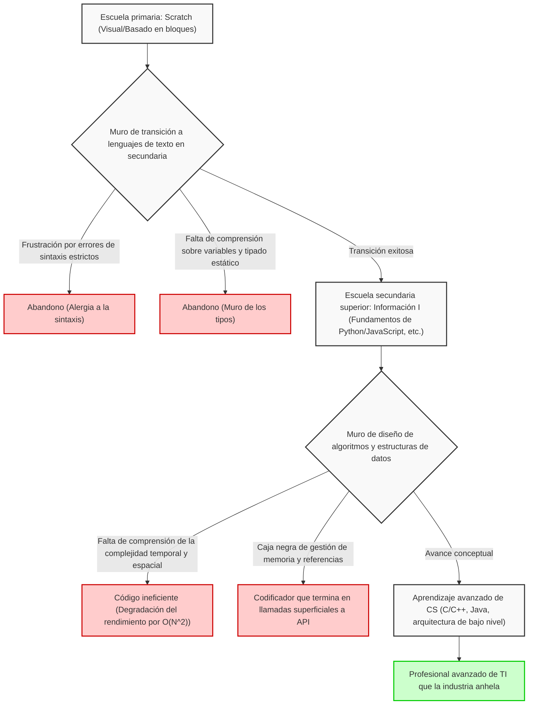
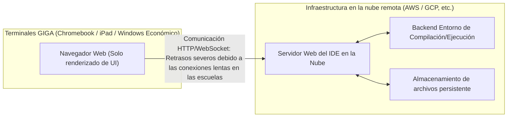
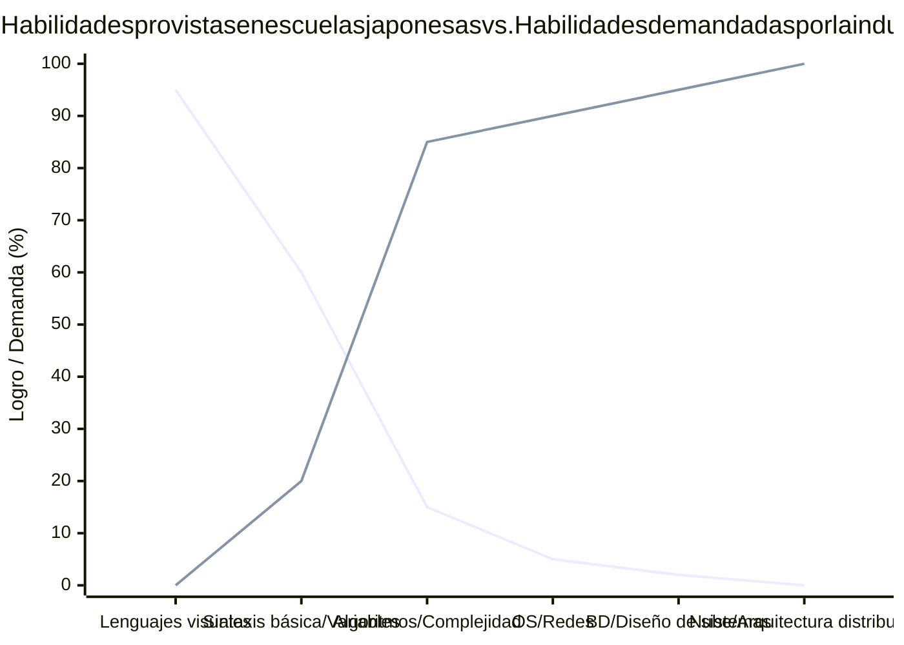

## 1. Introducción: La luz y la sombra que trajo consigo la programación obligatoria

La educación en TI e informática en Japón ha experimentado un cambio de paradigma de una escala sin precedentes en los últimos años, con la educación en programación haciéndose obligatoria en las escuelas primarias en el año fiscal 2020, la expansión en tecnología y economía doméstica en las escuelas secundarias en 2021 y el nuevo curso obligatorio "Información I" en las escuelas secundarias superiores en 2022. En la base de esta serie de políticas existe un requisito nacional extremadamente urgente: fomentar el pensamiento lógico (pensamiento computacional) para sobrevivir en la era de la Sociedad 5.0 (sociedad súper inteligente) y resolver la escasez crónica de talento avanzado en TI en la industria.

Sin embargo, si miramos a la primera línea del campo de la educación, se hace evidente que se ha creado una enorme brecha entre el ideal dibujado por el país y la realidad. El problema más grave es que el "aprendizaje de la programación como medio" se confunde completamente con el "estudio de las ciencias de la computación como disciplina". Además, existe una montaña de problemas estructurales por resolver, como los límites técnicos debidos a las limitaciones de las especificaciones de la infraestructura de TI desarrollada simultáneamente en todo el país, y la falta de un conjunto de habilidades profesionales de los profesores que enseñan.

En este artículo, resumimos el "después" de hacer obligatoria la educación en programación en Japón, y desenmarañamos los problemas esenciales y estructurales de la educación en TI que enfrentamos en curso, de manera extremadamente detallada y técnica, desde la perspectiva de la teoría de las ciencias de la computación, las limitaciones de la arquitectura de hardware y la competitividad industrial global. No es una mera teoría educativa, sino una discusión de 10,000 caracteres que considera el futuro de Japón desde la perspectiva de la ingeniería de software.

## 2. La trampa de la programación visual: La zanja profunda y empinada desde Scratch a la codificación de texto

Lo que reina como un estándar de facto en la educación de programación en las escuelas primarias son los lenguajes de programación visual (programación basada en bloques), representados por "Scratch" desarrollado por el MIT Media Lab. El uso de una interfaz gráfica intuitiva para combinar bloques como un rompecabezas para aprender de forma visual e intuitiva las tres estructuras básicas de control algorítmico de "secuencia", "selección" e "iteración" es un gran invento que debe ser altamente valorado como educación introductoria.

Sin embargo, hay un problema grave aquí, una "trampa de la abstracción", por así decirlo. Es el hecho cruel de que "la transición de la programación visual a un lenguaje de programación basado en texto real (Python, JavaScript, C++, [Rust](https://kenji.blog/es/p/webassembly-wasm-current-future/), etc.) es extremadamente difícil, y muchos estudiantes se frustran en esta etapa".

### El muro de la abstracción y la caja negra de las ciencias de la computación

Los entornos de programación visual como Scratch abstraen altamente y ocultan intencionalmente (encapsulan) los elementos importantes que forman la base de la informática, como la sintaxis compleja de la programación, los sistemas de tipos estrictos y la gestión del ciclo de vida de la memoria. Si bien esto es excelente para reducir la carga cognitiva para los principiantes, se convierte en un gran obstáculo al pasar al siguiente paso de la ingeniería real. Esto se debe a que en el campo real del desarrollo de software, la comprensión del alcance de las variables (variables locales y globales), estructuras de datos complejas (matrices, listas enlazadas, tablas hash, árboles de búsqueda binaria, grafos), operaciones de punteros y memoria del montón (heap) y de la pila (stack) son absolutamente esenciales.

El siguiente diagrama Mermaid visualiza los obstáculos de aprendizaje y los puntos de deserción que enfrentan los principiantes en el proceso de transición de la programación visual a las ciencias de la computación a gran escala.



Como se desprende claramente de este diagrama de flujo, el simple hecho de acumular experiencia en "escribir código que mueve personajes en una pantalla" no criará verdaderos ingenieros de software capaces de diseñar arquitecturas de sistemas distribuidos escalables y optimizar el rendimiento a nivel de milisegundos. Existe una desconexión absoluta en la comprensión conceptual, que no se puede explicar con las simples palabras "diferencia en el lenguaje utilizado", entre la tarea de combinar bloques coloridos en Scratch con un mouse y la tarea de descifrar el código fuente en lenguaje C del núcleo de Linux y rastrear el comportamiento de la pila [TCP](https://kenji.blog/es/p/http3-quic-protocol-tcp-udp/)/IP.

## 3. Los límites de la codificación sin "Matemáticas" y "Lógica Discreta": Un enfoque desde la teoría de la complejidad computacional

La debilidad más grande y quizás un defecto fatal en el plan de estudios de la educación en programación de Japón, es la abrumadora falta de conexión entre las "habilidades de codificación" y las "matemáticas y matemáticas discretas". En la educación de ciencias de la computación de primer nivel en países como Estados Unidos e India, se hace mayor hincapié en la eficiencia algorítmica, la lógica matemática y las demostraciones matemáticas que en la propia gramática de los lenguajes de programación. Esto se debe a que el código no es más que una traducción de fórmulas matemáticas.

### El dominio absoluto de la complejidad de tiempo y espacio (Notación Big O)

Al evaluar y diseñar el rendimiento del software, no se puede evitar el concepto de complejidad temporal (Time Complexity) y complejidad espacial (Space Complexity). La notación asintótica de Landau (Notación Big O) muestra cómo el tiempo de ejecución y el consumo de memoria aumentan cuando el tamaño de los datos de entrada de un algoritmo es $N$.

Como definición matemática, $f(x) = O(g(x))$ se define estrictamente de la siguiente manera:

$$
\exists C > 0, \exists x_0 > 0, \forall x > x_0, |f(x)| \le C \cdot |g(x)|
$$

En la educación en informática en Japón, al aprender a ordenar datos, por ejemplo, se ve con frecuencia el caso de simplemente llamar al método incorporado `array.sort()` en Python y darlo por terminado. Sin embargo, lo que realmente se requiere como ingeniería de la información es comprender matemáticamente y demostrar por qué un simple Bubble Sort nunca se usa en áreas prácticas, y por qué Quick Sort, Merge Sort o [Timsort](https://kenji.blog/es/p/sorting-algorithms/) se adoptan como bibliotecas estándar.

A continuación se muestra la complejidad temporal promedio de los algoritmos de ordenamiento representativos.

- Ordenamiento de burbuja (Bubble Sort): $O(N^2)$
- Ordenamiento por selección (Selection Sort): $O(N^2)$
- Ordenamiento por inserción (Insertion Sort): $O(N^2)$
- Ordenamiento por mezcla (Merge Sort): $O(N \log N)$
- Ordenamiento rápido (Quick Sort): $O(N \log N)$
- Ordenamiento por montículos (Heap Sort): $O(N \log N)$

Por ejemplo, la complejidad temporal $T(N)$ del Merge Sort se expresa mediante la siguiente relación de recurrencia, de acuerdo con el paradigma de Divide y Vencerás.

$$
T(N) = 2T\left(\frac{N}{2}\right) + O(N)
$$

Al expandir y resolver esta relación de recurrencia recursiva utilizando el Teorema Maestro (Master Theorem), se deriva la complejidad ideal de $T(N) = O(N \log N)$.

$$
T(N) = \Theta(N \log_2 N)
$$

En el análisis moderno de Big Data o el procesamiento de tráfico a escala web, $N$ se convierte en un orden masivo de cientos de millones a miles de millones. Si un programador ignorante implementa un algoritmo ineficiente de $O(N^2)$, para datos de $N = 10^6$, se requerirían asombrosamente $10^{12}$ (un billón) de operaciones de comparación inútiles, y el sistema se congelaría o colapsaría virtualmente. Por otro lado, un enfoque $O(N \log N)$ se completaría en unos $2 \times 10^7$ (20 millones) de operaciones. Afirmar "saber programar" sin este apoyo matemático cruelmente necesario es como construir un rascacielos sin conocer la mecánica estructural, lo cual es extremadamente peligroso.

## 4. La caja negra de la gestión de memoria y la arquitectura del sistema

Como un problema de un nivel aún más profundo, existe el hecho de que la comprensión de la gestión de memoria ([Memory Management](https://kenji.blog/es/p/memory-management-garbage-collection/)) y la arquitectura de la CPU está completamente ausente. Los estudiantes que solo han aprendido lenguajes de alto nivel con recolección de basura (GC) como Python y JavaScript, que se enseñan actualmente en las escuelas, nunca en su vida sabrán dónde se colocan las variables y los objetos en la memoria física (RAM) (si en el área del montón o en el área de la pila), cómo se asignan, o cuándo y cómo se liberan.

```c
// Ejemplo de asignación de memoria explícita y directa y operaciones de punteros en C
#include <stdio.h>
#include <stdlib.h>

int main() {
    int n = 1000000;
    // Asignar memoria dinámicamente de forma continua en la región del montón (Llamada al sistema del OS)
    int *array = (int*)malloc(n * sizeof(int));
    
    if (array == NULL) {
        fprintf(stderr, "¡Fallo en la asignación de memoria! Sin memoria.\n");
        return 1;
    }
    
    // Inicialización del arreglo mediante aritmética de punteros
    for(int i = 0; i < n; i++) {
        *(array + i) = i * 2; // Equivalente a array[i] = i * 2
    }
    
    // Liberación explícita de recursos para prevenir fugas de memoria (Memory Leak)
    free(array);
    array = NULL; // Prevenir punteros colgantes (Dangling Pointers)
    
    return 0;
}
```

El concepto de punteros (referencias directas a direcciones de memoria), la disposición de datos (Data Locality) para maximizar la tasa de aciertos de la jerarquía de memoria caché de la CPU (Caché L1/L2/L3), y el conocimiento sobre condiciones de carrera (Race Condition) y control de exclusión (Mutex/Semaphore) en entornos multihilo son conocimientos absolutamente indispensables al desarrollar sistemas de backend de alto rendimiento, motores de juegos 3D o sistemas integrados para IoT. Se debe decir que el plan de estudios actual del Ministerio de Educación, Cultura, Deportes, Ciencia y Tecnología se centra en "hacer funcionar aplicaciones superficiales", desviándose significativamente del objetivo académico original de "comprender los abismos de las ciencias de la computación".

## 5. El muro de las bases de datos y la persistencia: La ausencia del álgebra relacional

En las aplicaciones modernas, guardar y buscar datos (persistencia) es un tema inevitable. Sin embargo, gran parte de la educación escolar se detiene en el "procesamiento de datos en la memoria", que desaparece una vez finalizada la ejecución del programa. Rara vez se enseña la teoría matemática detrás de las bases de datos relacionales (RDBMS) y SQL, a saber, el "álgebra relacional" propuesta por el Dr. Edgar F. Codd.

Las operaciones de bases de datos se definen por las siguientes operaciones básicas basadas en la teoría de conjuntos:

- Selección (Selection, $\sigma$): Extracción de tuplas (filas) que satisfacen una condición
- Proyección (Projection, $\pi$): Extracción de atributos específicos (columnas)
- Reunión (Join, $\bowtie$): Intersección condicional de múltiples relaciones

Además, aprender la estructura de los índices "[B-Tree](https://kenji.blog/es/p/b-tree-database-index-theory/) (Árbol B)" para buscar instantáneamente los datos deseados en grandes volúmenes de registros es la mejor práctica de aplicación de estructuras de datos. B-Tree garantiza una velocidad de búsqueda de $O(\log N)$ minimizando el número de E/S de disco. Uno no puede construir sistemas robustos sin conocer las propiedades ACID de las transacciones (Atomicidad, Consistencia, Aislamiento, Durabilidad).

## 6. Seguridad y teoría criptográfica: La infraestructura social sustentada por la dificultad de la factorización prima

Aunque en la educación sobre alfabetización informacional se brinda educación de seguridad superficial como "hagamos contraseñas complejas" o "no hagamos clic en enlaces sospechosos", casi nunca se enseñan las matemáticas de la "teoría criptográfica" que sustenta fundamentalmente a la sociedad de Internet.

Las comunicaciones HTTPS y las firmas electrónicas que usamos a diario están protegidas por sistemas de cifrado de clave pública como RSA. La seguridad del cifrado RSA se basa en la dificultad matemática (considerada un problema NP-intermedio) de que "la factorización de enteros gigantes no se puede resolver en un tiempo realista con las computadoras clásicas actuales".

Las fórmulas matemáticas que forman la base del cifrado RSA son hermosas y aplican la función indicatriz de Euler y el pequeño teorema de [Fermat](https://kenji.blog/es/p/fermat/).

1. Seleccionar dos grandes números primos $p$ y $q$
2. Calcular $n = p \times q$ (esto forma parte de la clave pública)
3. Calcular $\phi(n) = (p-1)(q-1)$
4. Elegir $e$ y $d$ tales que $e \times d \equiv 1 \pmod{\phi(n)}$
5. Cifrado: $C \equiv M^e \pmod{n}$
6. Descifrado: $M \equiv C^d \pmod{n}$

De esta forma, la educación en programación demuestra su verdadero poder sólo cuando está estrechamente vinculada a la educación matemática. El proceso de traducir fórmulas matemáticas en código e implementarlas en la sociedad es la verdadera esencia de la ciencia.

## 7. La iniciativa de Escuela GIGA y los desesperantes límites de la infraestructura: Chromebook y los IDE en la nube

Al hablar de la educación en TI en Japón, no se puede obviar la "Iniciativa de Escuela GIGA", promovida por el Ministerio de Educación, Cultura, Deportes, Ciencia y Tecnología con un enorme presupuesto. Este proyecto nacional, que proporciona "un dispositivo por estudiante" y entornos de red de alta velocidad a estudiantes de primaria y secundaria de todo el país, se esperaba que sirviera como catalizador para recuperar el retraso en la digitalización. Sin embargo, las especificaciones de hardware y arquitectura de los dispositivos realmente distribuidos se han convertido en un grave impedimento para una educación en programación en toda regla.

### Dispositivos de baja especificación y la pérdida de entornos de desarrollo locales

Muchos de los dispositivos introducidos como especificaciones estándar bajo la Iniciativa GIGA School son Chromebooks, iPads o dispositivos Windows económicos de muy bajo costo. Sus especificaciones estándar son las siguientes:

- CPU: Intel Celeron o procesadores ARM económicos
- Memoria (RAM): 4GB (Una capacidad apenas suficiente para ejecutar un sistema operativo moderno)
- Almacenamiento (eMMC): 32GB a 64GB (Velocidades de E/S extremadamente lentas)

Debido a esta pobre restricción de hardware, es prácticamente imposible construir un "entorno de desarrollo local" que los ingenieros profesionales usan a diario. Iniciar contenedores Linux con Docker, ejecutar IDE pesados como Visual Studio Code con todas sus funciones, o iniciar servidores locales de Node.js o Python e instalar bibliotecas pesadas conducirá inmediatamente al agotamiento de la memoria y la congelación del sistema.

Como resultado, la primera línea educativa se ve obligada a depender completamente de los IDE en la nube basados en el navegador (Google Colaboratory, Replit o herramientas web ligeras propias de los editores de libros de texto, etc.).



La dependencia total de los IDE en la nube provoca deficiencias extremadamente graves desde el punto de vista educativo:

1. **Ignorancia de los sistemas de archivos y la arquitectura del sistema operativo**: Como no hay un entorno local, los estudiantes nunca adquieren conocimientos esenciales (alfabetización en UNIX) que un ingeniero de TI debería manejar con la naturalidad de respirar, como estructuras de directorios, conceptos de rutas absolutas y relativas, configuración de variables de entorno, permisos de archivos y operaciones del sistema operativo en CLI (Interfaces de Línea de Comandos).
2. **Latencia de red y vulnerabilidades de la infraestructura**: Como se asume una conexión constante, hay numerosos incidentes en todo el país donde el ancho de banda de la red de la escuela se ve abrumado en el momento en que todos los estudiantes acceden simultáneamente, causando que los navegadores se congelen y el aprendizaje se detenga por completo.
3. **Privación de la experiencia de control de versiones (Git)**: Se les niega la oportunidad de asimilar los conceptos de Git y GitHub para gestionar historiales de cambios de código fuente y desarrollar cooperativamente en equipos de todo el mundo a través de una pantalla negra de terminal.

Cuando los ingenieros de software profesionales desarrollan, las operaciones en el terminal (shell) son una base absoluta. Sin la ardua experiencia de ejecutar comandos como `ls`, `cd`, `grep`, `chmod`, y `git rebase` e interactuar directamente con el núcleo del sistema operativo local, nunca se logrará el verdadero desarrollo de talento informático. Jugar en el entorno aislado (sandbox) de un Chromebook no creará ingenieros full-stack con una visión general del sistema.

## 8. La brecha desesperada con el mundo: La divergencia entre los estándares de la industria y la educación escolar

El último y que podríamos considerar un problema de crisis nacional al que se enfrenta la educación informática japonesa, es el abrumador declive de la competitividad en un contexto global.

### La feroz educación en ciencias de la computación en otros países

En el Reino Unido (UK), desde 2014, una asignatura llamada "Computing" se ha vuelto obligatoria desde los 5 años (Key Stage 1). Su plan de estudios va más allá de una simple "experiencia de programación" y aborda la ciencia de la computación académica, sistemática y rigurosa, desde el diseño lógico de algoritmos y la comprensión de circuitos lógicos con álgebra booleana hasta las topologías de red y la arquitectura de hardware.

En Estados Unidos, existe un riguroso plan de estudios estándar K-12 (desde jardín de infantes hasta el último año de secundaria) establecido por la CSTA (Computer Science Teachers Association), y en AP (Advanced Placement) Computer Science A que toman los estudiantes de secundaria, se requiere programación orientada a objetos de nivel avanzado con Java, polimorfismo, procesamiento recursivo, implementación de estructuras de datos y evaluación de la complejidad de algoritmos, todo con altos estándares equivalentes al nivel del primer año de la universidad. La feroz educación STEM en India y China y el enorme estrato de élite producido a partir de allí apenas necesitan mencionarse.

### La brecha desesperada entre las habilidades demandadas y las habilidades enseñadas

Los requisitos que la industria moderna, en particular las megacorporaciones y gigantes tecnológicos que operan globalmente (GAFAM, etc.), demandan a los ingenieros de software recién graduados se vuelven más sofisticados a una velocidad aterradora cada año. Se requiere una experiencia amplia y profunda, como la construcción de infraestructura nativa de la nube (AWS, GCP, Kubernetes), el diseño de sistemas distribuidos con arquitecturas de microservicios, la implementación de canalizaciones de aprendizaje automático y un alto nivel de conocimiento de seguridad.

El siguiente gráfico muestra conceptualmente la desconexión desesperada entre los niveles de habilidades proporcionados por la educación escolar japonesa actual y los niveles de habilidades exigidos por la vanguardia de la industria.



Para cerrar esta enorme brecha (El Valle de la Muerte), se requiere un cambio de paradigma radical en la educación escolar y una inversión masiva. En una situación donde los profesores especializados en "Información" escasean abrumadoramente en todo el país, y donde los profesores de matemáticas, ciencias, o tecnología y economía doméstica enseñan programación a tiempo parcial sin un entrenamiento adecuado, es absolutamente imposible producir ingenieros de primer nivel que puedan competir globalmente.

## 9. El colapso del valor de la "codificación" en la era de la IA (LLM)

Complicando aún más la situación está la proliferación explosiva de modelos de lenguaje grandes (LLM) como ChatGPT, y asistentes de codificación de inteligencia artificial como GitHub Copilot. En una época en la que la IA puede generar instantáneamente un código perfecto e incluso escribir código de prueba a partir de instrucciones en lenguaje natural, el valor de mercado de los llamados "codificadores", que simplemente "conocen la sintaxis de Python" y "saben cómo hacer llamadas de API", está cayendo rápidamente.

Lo que se exigirá de los ingenieros humanos en la era de la IA no es la memoria sintáctica de los lenguajes de programación. Son las siguientes capacidades:

1. **Definición de requerimientos y modelado de dominios**: La capacidad de extraer los problemas complejos de la realidad a resolver y modelarlos como un sistema.
2. **Diseño de arquitecturas**: La capacidad de esbozar el diseño de todo un sistema garantizando la escalabilidad, alta disponibilidad y facilidad de mantenimiento.
3. **Verificación matemática y lógica**: La capacidad de verificar lógicamente y demostrar si el código generado por IA no tiene vulnerabilidades de seguridad ni cuellos de botella de complejidad computacional.

Irónicamente, todos estos están dentro de los dominios profundos y abstractos de la "ciencia de la computación y las matemáticas", en lugar de una "programación superficial". Si la educación japonesa solo está enseñando "habilidades en procesos aguas abajo que son fácilmente reemplazables por la IA", debe considerarse una pérdida nacional.

## 10. Hacia una fusión de ciencias matemáticas y programación: Propuesta para la educación de la próxima generación

La tarea urgente para la educación informática de Japón en el futuro es salir del enfoque de la "programación como fin/medio" y volver a una "exploración de las ciencias de la computación como ciencias matemáticas". Los lenguajes de programación no son más que herramientas para expresar pensamientos, y es la estructura matemática y lógica subyacente la que tiene un valor universal que nunca se desvanecerá sin importar cómo cambien los tiempos.

Por ejemplo, el núcleo de la inteligencia artificial (IA) y el aprendizaje automático está intrincadamente entrelazado con el álgebra lineal (operaciones con matrices y tensores), el cálculo multivariable (descenso de gradiente) y la estadística de probabilidad (estimación bayesiana e información). La optimización de pesos en redes neuronales de aprendizaje profundo (Deep Learning) se formula utilizando la regla de la cadena (Chain Rule) y la retropropagación con derivadas parciales.

$$
\frac{\partial L}{\partial w_{ij}^{(l)}} = \frac{\partial L}{\partial z_i^{(l+1)}} \cdot \frac{\partial z_i^{(l+1)}}{\partial w_{ij}^{(l)}} = \delta_i^{(l+1)} \cdot a_j^{(l)}
$$

Es el talento capaz de traducir tales fórmulas matemáticas avanzadas en código, e implementar y optimizar drásticamente la computación paralela (Parallel Computing) teniendo en cuenta la arquitectura de hardware de GPU (CUDA) y TPU lo que liderará a la industria de la tecnología de la información de la próxima generación. Es por eso que debemos abandonar de inmediato la educación superficial que solo hace memorizar sintaxis a los estudiantes, y debemos girar hacia una educación profunda que indague en los principios fundamentales (First Principles) del cálculo.

## 11. Conclusión: El escarpado camino hacia una verdadera nación de TI y nuestra determinación

No hay duda de que hacer que la educación en programación fuera obligatoria en la década de 2020 fue un paso firme al lograr que la sociedad japonesa en general reconociera la "importancia de la TI y la información". Sin embargo, esto es un mero "calentamiento" en un largo viaje.

Dar un paso adelante desde la diversión de mover un personaje de gato en Scratch para que se emocionen con la belleza matemática de un algoritmo $O(N \log N)$ y enseñarles la emoción de comunicarse con servidores de todo el mundo a través de paquetes [TCP](https://kenji.blog/es/p/http3-quic-protocol-tcp-udp/) desde la pantalla negra de la terminal. Debemos reconstruir una nueva infraestructura educativa para superar las limitaciones de hardware de la Iniciativa GIGA School, fomentar y colocar instructores con experiencia avanzada en CS, y en ocasiones, involucrar valientemente a ingenieros profesionales externos en la educación escolar.

Los desafíos que enfrenta la educación de TI en Japón son extremadamente profundos, arraigados y complejos. Sin embargo, no debemos apartar la mirada de estos desafíos, y cuando la industria, la academia y el gobierno colaboren seriamente para abordarlos y puedan construir un ecosistema que produzca continuamente no "trabajadores que solo pueden escribir código de acuerdo a las especificaciones", sino "verdaderos ingenieros que pueden diseñar y crear sistemas desde cero", Japón sin duda volverá a liderar el mundo como una verdadera nación de TI.

Cómo lucharemos a través de la fase más importante y difícil del "después" de hacer obligatoria la programación. Ahora mismo, se está poniendo a prueba la seriedad y determinación de los adultos.

---

*En este artículo describimos en términos generales la teoría de la complejidad computacional y los límites de infraestructura de la Iniciativa GIGA School. En futuras publicaciones de esta serie cubriremos temas aún más especializados en ciencias de la computación (como detalles sobre algoritmos de sistemas distribuidos y métodos de gestión de memoria de bajo nivel).*


