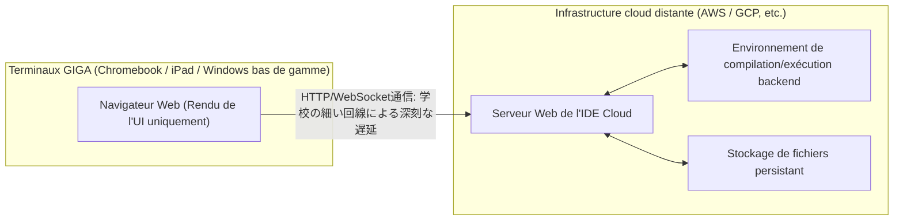

## 1. Introduction : La lumière et l'ombre de la programmation obligatoire

L'enseignement de l'informatique au Japon a connu un changement de paradigme sans précédent ces dernières années, avec la programmation devenue obligatoire dans les écoles primaires en 2020, étendue dans les cours de technologie des collèges en 2021, et la nouvelle matière obligatoire « Information I » dans les lycées en 2022. À la base de cette série de politiques se trouve une demande nationale et pressante : cultiver la pensée logique (pensée algorithmique) pour survivre à l'ère de la Society 5.0 (société super-intelligente) et résoudre la pénurie chronique de ressources humaines informatiques hautement qualifiées dans l'industrie.

Cependant, en regardant la ligne de front de l'enseignement, un fossé énorme apparaît entre l'idéal imaginé par le gouvernement et la réalité. Le problème le plus grave est la confusion totale entre « apprendre la programmation comme moyen » et « maîtriser l'informatique (Computer Science) comme discipline universitaire ». De plus, des problèmes structurels s'accumulent et doivent être résolus, tels que les limites techniques dues aux contraintes matérielles de l'infrastructure informatique déployée simultanément à l'échelle nationale, et le manque de compétences professionnelles des enseignants.

Cet article résume les conséquences de la programmation obligatoire au Japon et détaille de manière approfondie et technique les problèmes structurels et fondamentaux actuels de l'enseignement de l'informatique, du point de vue de la théorie de l'informatique, des contraintes d'architecture matérielle et de la compétitivité industrielle mondiale. Ce n'est pas seulement une théorie éducative, mais une réflexion de 10 000 mots sur l'avenir du Japon du point de vue du génie logiciel.

## 2. Le piège de la programmation visuelle : Le fossé profond entre Scratch et le codage textuel

Le standard de facto de l'enseignement de la programmation à l'école primaire est le langage de programmation visuelle (programmation par blocs), représenté par « Scratch » développé par le MIT Media Lab. L'utilisation d'une interface graphique intuitive pour assembler des blocs comme un puzzle permet d'apprendre de manière visuelle et intuitive les trois structures de contrôle algorithmiques de base : « séquence », « sélection » et « itération ». C'est une grande invention qui mérite d'être saluée comme une introduction à la programmation.

Cependant, il y a un piège majeur ici, que l'on pourrait appeler le « piège de l'abstraction ». Il s'agit du fait cruel qu'« il est extrêmement difficile de passer de la programmation visuelle à de vrais langages de programmation textuels (Python, JavaScript, C++, [Rust](https://kenji.blog/fr/p/webassembly-wasm-current-future/), etc.), et que de nombreux apprenants abandonnent à ce stade ».

### Le mur de l'abstraction et la boîte noire de l'informatique

Les environnements de programmation visuelle comme Scratch abstraient et cachent (encapsulent) intentionnellement des éléments importants qui constituent le fondement de l'informatique, tels que la syntaxe complexe de la programmation, les systèmes de typage stricts et la gestion du cycle de vie de la mémoire. C'est excellent pour réduire la charge cognitive des débutants, mais cela devient un énorme obstacle pour passer à la véritable ingénierie à l'étape suivante. Dans le développement de logiciels réel, la compréhension de la portée des variables (variables locales et globales), des structures de données complexes (tableaux, listes chaînées, tables de hachage, arbres binaires de recherche, graphes), des pointeurs et des zones mémoire de tas et de pile est absolument indispensable.

Le diagramme Mermaid ci-dessous visualise les obstacles d'apprentissage et les points d'abandon (décrochage) auxquels les débutants sont confrontés lors de la transition de la programmation visuelle vers l'informatique fondamentale.

```mermaid
flowchart TD
    A["École primaire : Scratch (Visuel / par blocs)"] --> B{"Collège : Le mur du passage aux langages textuels"}
    B -->|"Abandon dû à des erreurs de syntaxe strictes"| C["Décrochage (Allergie à la syntaxe)"]
    B -->|"Manque de compréhension des variables et du typage statique"| D["Décrochage (Le mur des types)"]
    B -->|"Transition réussie"| E["Lycée : Information I (Bases de Python/JavaScript, etc.)"]
    E --> F{"Le mur de la conception d'algorithmes et des structures de données"}
    F -->|"Ignorance de la complexité temporelle et spatiale"| G["Code inefficace (Dégradation des performances par création massive de O("N^2"))"]
    F -->|"Boîte noire de la gestion de la mémoire et des références"| H["Devenir un simple codeur se limitant aux appels d'API superficiels"]
    F -->|"Percée conceptuelle"| I["Apprentissage approfondi de la CS (C/C++, Java, architecture bas niveau)"]
    I --> J["Professionnel de l'informatique de haut niveau ardemment désiré par l'industrie"]
    
    classDef default fill:#f9f9f9,stroke:#333,stroke-width:2px;
    classDef error fill:#ffcccc,stroke:#cc0000,stroke-width:2px;
    classDef success fill:#ccffcc,stroke:#00cc00,stroke-width:2px;
    class C,D,G,H error;
    class J success;
```

Comme le montre clairement cet organigramme, le simple fait d'accumuler l'expérience d'écrire « du code pour déplacer un personnage à l'écran » ne permet pas de former de véritables ingénieurs logiciels capables de concevoir des architectures de systèmes distribués évolutives et d'optimiser les performances à la milliseconde près. Entre la tâche d'assembler des blocs colorés dans Scratch avec une souris et celle de décrypter le code source en C du noyau Linux pour suivre le comportement de la pile [TCP](https://kenji.blog/fr/p/http3-quic-protocol-tcp-udp/)/IP, il y a un gouffre de compréhension conceptuelle absolu qui ne peut se résumer à une simple « différence de langage utilisé ».

## 3. Les limites du codage sans « mathématiques » et sans « logique discrète » : L'approche par la théorie de la complexité

La plus grande faiblesse et le défaut fatal du programme d'enseignement de la programmation au Japon est le manque écrasant d'intégration entre les « compétences de codage » et les « mathématiques discrètes ». Dans l'enseignement de l'informatique de premier plan, comme aux États-Unis ou en Inde, l'accent est mis sur l'efficacité algorithmique, la logique mathématique et les preuves mathématiques plutôt que sur la syntaxe du langage de programmation elle-même. En effet, le code n'est qu'une traduction de formules mathématiques.

### La domination absolue de la complexité temporelle et spatiale (Notation Grand O)

Pour évaluer et concevoir les performances d'un logiciel, les concepts de complexité temporelle (Time Complexity) et de complexité spatiale (Space Complexity) sont incontournables. La notation asymptotique de Landau ([Big O](https://kenji.blog/fr/p/time-space-complexity-big-o-notation-examples/) Notation) montre comment le temps d'exécution et la consommation de mémoire augmentent en fonction de la taille $N$ des données d'entrée d'un algorithme.

La définition mathématique stricte de $f(x) = O(g(x))$ est la suivante :

$$
\exists C > 0, \exists x_0 > 0, \forall x > x_0, |f(x)| \le C \cdot |g(x)|
$$

Dans l'enseignement de l'informatique au Japon, lorsqu'on apprend par exemple le tri de données, il arrive souvent que l'on se contente d'appeler la méthode intégrée `array.sort()` en Python. Cependant, ce qui est vraiment requis en ingénierie informatique, c'est de comprendre mathématiquement et de prouver pourquoi le tri à bulles simple n'est jamais utilisé en pratique, et pourquoi le tri rapide, le tri fusion ou le [Timsort](https://kenji.blog/fr/p/sorting-algorithms/) sont adoptés comme bibliothèques standard.

Voici les complexités temporelles moyennes des algorithmes de tri représentatifs :

- [Tri](https://kenji.blog/fr/p/sorting-algorithms/) à bulles (Bubble Sort) : $O(N^2)$
- [Tri](https://kenji.blog/fr/p/sorting-algorithms/) par sélection (Selection Sort) : $O(N^2)$
- [Tri](https://kenji.blog/fr/p/sorting-algorithms/) par insertion (Insertion Sort) : $O(N^2)$
- [Tri](https://kenji.blog/fr/p/sorting-algorithms/) fusion (Merge Sort) : $O(N \log N)$
- [Tri](https://kenji.blog/fr/p/sorting-algorithms/) rapide (Quick Sort) : $O(N \log N)$
- [Tri](https://kenji.blog/fr/p/sorting-algorithms/) par tas ([Heap](https://kenji.blog/fr/p/c-language-pointers-memory-management-stack-heap/) Sort) : $O(N \log N)$

Par exemple, la complexité temporelle $T(N)$ du tri fusion est exprimée par la relation de récurrence suivante, basée sur le paradigme « diviser pour régner » :

$$
T(N) = 2T\left(\frac{N}{2}\right) + O(N)
$$

En résolvant cette équation de récurrence à l'aide du théorème maître (Master Theorem), on en déduit la complexité idéale $T(N) = O(N \log N)$ :

$$
T(N) = \Theta(N \log_2 N)
$$

Dans l'analyse de données massives moderne et le traitement du trafic à l'échelle du web, $N$ atteint l'ordre de centaines de millions ou de milliards. Si un programmeur ignorant implémente un algorithme inefficace en $O(N^2)$, un volume de données $N = 10^6$ nécessitera $10^{12}$ (mille milliards) d'opérations de comparaison inutiles, ce qui figera et plantera de facto le système. En revanche, un algorithme en $O(N \log N)$ s'achèvera en environ $2 \times 10^7$ (20 millions) d'opérations. Prétendre « savoir programmer » sans ces fondements mathématiques cruels revient à construire un gratte-ciel sans connaître la mécanique des structures ; c'est extrêmement dangereux.

## 4. La boîte noire de la gestion de la mémoire et de l'architecture des systèmes

Un problème plus profond est l'absence totale de compréhension de la gestion de la mémoire et de l'architecture CPU. Les apprenants qui n'ont appris que des langages de haut niveau dotés de ramasse-miettes (GC), comme Python et JavaScript enseignés aujourd'hui dans les écoles, ne se soucieront jamais de l'endroit où les variables et les objets sont placés dans la mémoire physique (RAM) (tas ou pile), comment ils sont alloués, et quand ou comment ils sont libérés.

```c
// Exemple d'allocation de mémoire explicite et directe et de manipulation de pointeurs en langage C
#include <stdio.h>
#include <stdlib.h>

int main() {
    int n = 1000000;
    // Allocation dynamique et continue de mémoire dans la zone du tas (Appel système à l'OS)
    int *array = (int*)malloc(n * sizeof(int));
    
    if (array == NULL) {
        fprintf(stderr, "Memory allocation failed! Out of memory.\n");
        return 1;
    }
    
    // Initialisation du tableau via l'arithmétique des pointeurs
    for(int i = 0; i < n; i++) {
        *(array + i) = i * 2; // Équivalent à array[i] = i * 2
    }
    
    // Libération explicite des ressources pour éviter les fuites de mémoire
    free(array);
    array = NULL; // Prévention des pointeurs fantômes
    
    return 0;
}
```

La connaissance du concept de pointeurs (référence directe à une adresse mémoire), de la disposition des données pour maximiser le taux de réussite de la hiérarchie de la mémoire cache du CPU (caches L1/L2/L3), ainsi que des conditions de concurrence et du contrôle d'exclusion mutuelle (Mutex/Semaphore) dans des environnements multithreads est absolument indispensable pour développer des systèmes backend hautes performances, des moteurs de jeux 3D, ou des systèmes embarqués pour l'IoT. Le programme actuel du ministère de l'Éducation se limite à « faire fonctionner des applications de manière superficielle » et s'écarte considérablement de l'objectif académique originel de « comprendre les profondeurs de l'informatique ».

## 5. Le mur des bases de données et de la persistance : L'absence de l'algèbre relationnelle

Dans les applications modernes, le stockage et la recherche de données (persistance) sont des thèmes inévitables. Cependant, une grande partie de l'enseignement scolaire se limite au « traitement des données en mémoire », qui disparaissent à la fin de l'exécution du programme. La théorie mathématique qui sous-tend les bases de données relationnelles (SGBDR) et SQL, à savoir l'« algèbre relationnelle » proposée par le Dr Edgar F. Codd, est rarement enseignée.

Les opérations sur les bases de données sont définies par les opérations fondamentales de la théorie des ensembles :

- Sélection (Selection, $\sigma$) : Extraction des n-uplets (lignes) remplissant une condition
- Projection (Projection, $\pi$) : Extraction d'attributs (colonnes) spécifiques
- Jointure (Join, $\bowtie$) : Intersection conditionnelle de plusieurs relations

De plus, l'apprentissage de la structure de l'« index [B-Tree](https://kenji.blog/fr/p/b-tree-database-index-theory/) », qui permet de rechercher instantanément les données cibles parmi un nombre massif d'enregistrements, constitue la meilleure application pratique des structures de données. Le B-Tree garantit une vitesse de recherche de $O(\log N)$ tout en minimisant le nombre d'E/S disque. Il est impossible de construire un système robuste sans connaître les propriétés ACID (Atomicity, [Consistency](https://kenji.blog/fr/p/cap-theorem-distributed-systems-tradeoff/), Isolation, Durability) des transactions.

## 6. Sécurité et cryptographie : La difficulté de la factorisation des nombres premiers, pilier des infrastructures sociales

L'enseignement de l'informatique aborde une éducation superficielle à la sécurité, du type « Utilisons des mots de passe complexes » ou « Ne cliquons pas sur des liens suspects », mais n'enseigne presque jamais les mathématiques de la « cryptographie » qui soutient fondamentalement la société d'Internet.

Les communications HTTPS et les signatures numériques que nous utilisons quotidiennement sont protégées par la cryptographie à clé publique, comme le chiffrement [RSA](https://kenji.blog/fr/p/modern-cryptography-public-key-hash-signature/). La sécurité du chiffrement RSA repose sur la difficulté mathématique (considérée comme un problème NP-intermédiaire) qu'« il est impossible pour un ordinateur classique actuel de factoriser d'énormes nombres entiers en nombres premiers dans un délai raisonnable ».

Les formules mathématiques à la base du chiffrement RSA sont une belle application de la fonction indicatrice d'Euler et du petit théorème de [Fermat](https://kenji.blog/fr/p/fermat/).

1. Choisir deux grands nombres premiers $p$ et $q$.
2. Calculer $n = p \times q$ (cela fait partie de la clé publique).
3. Calculer $\phi(n) = (p-1)(q-1)$.
4. Choisir $e$ et $d$ tels que $e \times d \equiv 1 \pmod{\phi(n)}$.
5. Chiffrement : $C \equiv M^e \pmod{n}$
6. Déchiffrement : $M \equiv C^d \pmod{n}$

Ainsi, l'enseignement de la programmation ne révèle sa véritable puissance que lorsqu'il est étroitement lié à l'enseignement des mathématiques. Le processus de traduction des formules mathématiques en code et de leur implémentation sociale est l'essence même de la science.

## 7. Le concept GIGA School et les limites désespérantes des infrastructures : Chromebook et IDE cloud

Pour évoquer l'enseignement de l'informatique au Japon, il est impossible d'ignorer le « Concept GIGA School », un projet national impulsé par le ministère de l'Éducation avec un budget colossal. Ce projet, qui dote chaque élève d'école primaire et de collège à travers le pays d'« un terminal par personne » et d'un environnement réseau à haut débit, était censé servir de catalyseur pour rattraper le retard numérique. Cependant, les spécifications matérielles et l'architecture des terminaux distribués constituent un frein majeur à un véritable enseignement de la programmation.

### Terminaux bas de gamme et perte de l'environnement de développement local

La plupart des terminaux déployés comme normes du concept GIGA School sont des Chromebooks, des iPads ou des appareils Windows d'entrée de gamme extrêmement bon marché. Leurs spécifications typiques sont les suivantes :

- CPU : Intel Celeron ou processeurs ARM d'entrée de gamme
- Mémoire (RAM) : 4 [Go](https://kenji.blog/fr/p/programming-languages-history-paradigm-evolution/) (À peine suffisant pour faire tourner un OS moderne)
- Stockage (eMMC) : 32 Go à 64 Go (Vitesse d'E/S extrêmement lente)

Avec ces contraintes matérielles dérisoires, il est pratiquement impossible de mettre en place un « environnement de développement local » comme le font quotidiennement les ingénieurs professionnels. Lancer des conteneurs Linux avec [Docker](https://kenji.blog/fr/p/docker-container-namespace-[cgroups](https://kenji.blog/fr/p/docker-container-namespace-cgroups-layers/)-layers/), exécuter un IDE lourd comme Visual Studio Code avec toutes ses fonctionnalités, ou démarrer un serveur local Node.js ou Python et installer de lourdes bibliothèques provoque instantanément un épuisement de la mémoire et un gel du système.

En conséquence, les établissements scolaires se retrouvent acculés à dépendre entièrement des IDE cloud qui fonctionnent dans le navigateur (Google Colaboratory, Replit, ou des outils Web légers propriétaires des éditeurs de manuels).



La dépendance totale aux IDE cloud entraîne les graves lacunes pédagogiques suivantes :

1. **Incompréhension du système de fichiers et de l'architecture de l'OS** : Sans environnement local, les connaissances indispensables qu'un ingénieur informatique devrait manier comme sa propre respiration, telles que la structure des répertoires, les concepts de chemins absolus et relatifs, la configuration des variables d'environnement, les permissions de fichiers et les opérations de l'OS en CLI (Command Line Interface), ne sont jamais acquises.
2. **Latence réseau et vulnérabilité de l'infrastructure** : Comme une connexion permanente est requise, dès que tous les élèves de l'école se connectent simultanément, la bande passante du réseau de l'école sature, les navigateurs gèlent et l'apprentissage s'arrête complètement, un incident qui se produit fréquemment dans tout le pays.
3. **Privation de l'expérience du contrôle de version (Git)** : Les élèves sont privés de l'occasion d'assimiler, via un écran de terminal noir, les concepts de Git et de GitHub permettant de gérer l'historique des modifications du code source et de développer en collaboration avec des équipes du monde entier.

Lorsqu'un ingénieur logiciel professionnel développe, la manipulation dans le terminal (shell) est un fondement absolu. Taper des commandes comme `ls`, `cd`, `grep`, `chmod`, `git rebase` et expérimenter l'interaction directe et ardue avec le noyau de l'OS local est absolument nécessaire pour former de véritables talents informatiques. Se contenter de jouer dans le bac à sable d'un Chromebook ne produira jamais des ingénieurs full-stack capables d'avoir une vue d'ensemble du système.

## 8. Un fossé désespéré avec le reste du monde : Le décalage entre les exigences de l'industrie et l'enseignement scolaire

Le dernier défi, et non des moindres, auquel l'enseignement de l'informatique au Japon est confronté, qui peut être qualifié de crise nationale, est le déclin écrasant de sa compétitivité dans un contexte mondial.

### L'enseignement féroce de l'informatique à l'étranger

Au Royaume-Uni (UK), une matière appelée « Computing » est obligatoire dès l'âge de 5 ans (Key Stage 1) depuis 2014. Leur programme ne se limite pas à une simple « expérience de programmation », mais aborde une informatique académique et systématique très poussée, allant de la conception logique d'algorithmes à la compréhension des circuits logiques via l'algèbre de Boole, la topologie des réseaux et l'architecture matérielle.

Aux États-Unis, il existe un programme standard strict allant de la maternelle à la fin du lycée (K-12), défini par la CSTA (Computer Science Teachers Association). Dans le cours AP (Advanced Placement) Computer Science A, suivi par les lycéens, la programmation orientée objet en [Java](https://kenji.blog/fr/p/programming-languages-history-paradigm-evolution/), le polymorphisme, le traitement récursif, l'implémentation de structures de données et l'évaluation de la complexité algorithmique sont exigés à un niveau élevé, équivalent à la première année d'université. Il n'est plus nécessaire de mentionner la sévérité de l'enseignement STEM en Inde ou en Chine, ni la profondeur de l'élite qui en émerge.

### Le décalage désespérant entre les compétences requises et les compétences enseignées

Les exigences de l'industrie moderne, en particulier des méga-entreprises mondiales (comme les GAFAM), envers les nouveaux ingénieurs logiciels nouvellement diplômés se durcissent à une vitesse effrayante d'année en année. Une expertise vaste et approfondie est requise, allant de la construction d'infrastructures cloud natives (AWS, GCP, [Kubernetes](https://kenji.blog/fr/p/kubernetes-k8s-architecture-pod-service-ingress/)) à la conception de systèmes distribués à base de microservices, l'implémentation de pipelines de Machine Learning et des connaissances pointues en sécurité.

Le graphique ci-dessous illustre conceptuellement le gouffre désespérant entre le niveau de compétences fourni par l'enseignement scolaire actuel au Japon et le niveau exigé par la ligne de front de l'industrie.

```mermaid
xychart-beta
    title Compétences enseignées à l'école au Japon vs Niveau requis par l'industrie
    x-axis ["Langages visuels", "Syntaxe de base/variables", "Algorithmes/Complexité", "OS/Réseaux", "DB/Conception de systèmes", "Cloud/Architecture distribuée"]
    y-axis "Niveau d'atteinte / Exigence (%)" 0 --> 100
    line "Niveau atteint dans l'enseignement scolaire actuel" [95, 60, 15, 5, 2, 0]
    line "Niveau exigé par l'industrie et la tech" [0, 20, 85, 90, 95, 100]
```

Pour combler ce fossé énorme (Death Valley), un changement de paradigme radical de l'enseignement scolaire et des investissements massifs sont nécessaires. Alors qu'il y a une pénurie nationale flagrante de professeurs spécialisés en « Information », le système actuel, où des professeurs de mathématiques, de sciences ou de technologie enseignent la programmation à temps partiel et sans formation suffisante, ne pourra jamais former des ingénieurs de premier plan capables de rivaliser au niveau mondial.

## 9. L'effondrement de la valeur du « codage » à l'ère de l'IA ([LLM](https://kenji.blog/fr/p/large-language-models-llm-transformer-prompt-engineering/))

Ce qui complique encore la situation, c'est la prolifération explosive des grands modèles de langage (LLM) comme ChatGPT et des assistants de codage IA comme GitHub Copilot. À une époque où l'IA peut instantanément générer un code parfait à partir d'instructions en langage naturel et rédiger même les codes de test, la valeur marchande d'un simple « codeur (Coder) » qui ne fait que « connaître la syntaxe Python » ou « savoir appeler une API » s'effondre rapidement.

À l'ère de l'IA, on n'attend pas d'un ingénieur humain qu'il ait de la mémoire pour la syntaxe des langages de programmation. Les compétences exigées sont les suivantes :

1. **Définition des exigences et modélisation du domaine** : La capacité d'extraire des problèmes complexes du monde réel à résoudre et de les modéliser en tant que système.
2. **Conception d'architecture** : La capacité de concevoir le plan d'ensemble d'un système pour garantir son évolutivité, sa disponibilité et sa maintenabilité.
3. **Vérification mathématique et logique** : La capacité de vérifier théoriquement et de prouver que le code généré par l'IA ne comporte pas de failles de sécurité ou de goulots d'étranglement de complexité.

Ironiquement, toutes ces compétences ne relèvent pas de la « programmation superficielle », mais des domaines profonds et abstraits de l'« informatique et des mathématiques ». Si l'éducation japonaise se contente d'enseigner des « compétences en aval facilement remplaçables par l'IA », on ne peut que qualifier cela de perte nationale.

## 10. Vers l'intégration des sciences mathématiques et de la programmation : Une proposition pour l'éducation de la prochaine génération

Dans le futur de l'enseignement de l'informatique au Japon, il est urgent de s'éloigner de l'idée que « la programmation est un but ou un simple outil » et de revenir à « l'exploration de l'informatique en tant que science mathématique ». Les langages de programmation ne sont que des outils pour exprimer la pensée, et ce sont les structures mathématiques et logiques qui les sous-tendent qui ont une valeur universelle ne s'estompant pas avec le temps.

Par exemple, le cœur de l'intelligence artificielle (IA) et du Machine Learning est étroitement lié à l'algèbre linéaire (calculs matriciels et tenseurs), au calcul différentiel et intégral à plusieurs variables (descente de gradient) et aux probabilités et statistiques (inférence bayésienne et théorie de l'information). L'optimisation des poids dans les réseaux de neurones du Deep Learning est formulée par la règle de dérivation en chaîne (Chain Rule) à l'aide de dérivées partielles et de la rétropropagation.

$$
\frac{\partial L}{\partial w_{ij}^{(l)}} = \frac{\partial L}{\partial z_i^{(l+1)}} \cdot \frac{\partial z_i^{(l+1)}}{\partial w_{ij}^{(l)}} = \delta_i^{(l+1)} \cdot a_j^{(l)}
$$

Ce sont les personnes capables de traduire ces équations mathématiques complexes en code et d'implémenter le calcul parallèle en l'optimisant à l'extrême tout en tenant compte de l'architecture matérielle des GPU (CUDA) et des TPU qui tireront l'industrie informatique de la prochaine génération. C'est pourquoi nous devons immédiatement cesser cet enseignement superficiel consistant à faire mémoriser par cœur une syntaxe de surface, et nous orienter vers un enseignement approfondi qui interroge les principes fondamentaux (First Principles) de l'informatique.

## 11. Conclusion : Le chemin escarpé vers une véritable nation informatique et notre détermination

L'obligation d'enseigner la programmation dans les années 2020 a indéniablement constitué un pas en avant en faisant prendre conscience à la société japonaise de « l'importance de l'informatique et de l'information ». Cependant, il ne s'agit là que de simples « échauffements » dans un long voyage.

Aller au-delà du plaisir de faire bouger un chat dans Scratch pour enseigner l'émotion ressentie devant la beauté mathématique d'un algorithme en $O(N \log N)$ et l'excitation de dialoguer avec des serveurs du monde entier via des paquets [TCP](https://kenji.blog/fr/p/http3-quic-protocol-tcp-udp/) depuis un écran noir de terminal. Reconstruire une nouvelle infrastructure éducative pour surmonter les contraintes matérielles du concept GIGA School, former et affecter des enseignants ayant une haute expertise en informatique, et parfois impliquer de manière audacieuse des ingénieurs professionnels externes dans l'enseignement scolaire.

Les défis auxquels l'enseignement de l'informatique au Japon est confronté sont extrêmement profonds, tenaces et complexes. Cependant, en ne détournant pas les yeux de ces défis, et en travaillant sérieusement et en collaboration entre l'industrie, le monde universitaire et le gouvernement, si nous parvenons à construire un écosystème capable de produire en continu non pas des « travailleurs capables de coder selon un cahier des charges », mais de « véritables ingénieurs capables de concevoir et de créer des systèmes à partir de zéro », alors le Japon pourra à nouveau mener le monde en tant que véritable nation informatique.

Comment traverser la phase de « l'après » programmation obligatoire, qui est la plus difficile et la plus importante ? C'est le moment même où notre sérieux et notre détermination d'adultes sont mis à l'épreuve.

---

*Dans cet article, nous avons esquissé la théorie de la complexité et les limites d'infrastructure du concept GIGA School. Nous aborderons des sujets informatiques plus spécialisés (comme les algorithmes de systèmes distribués et les détails de la gestion de la mémoire de bas niveau) dans les prochains articles de cette série.*


