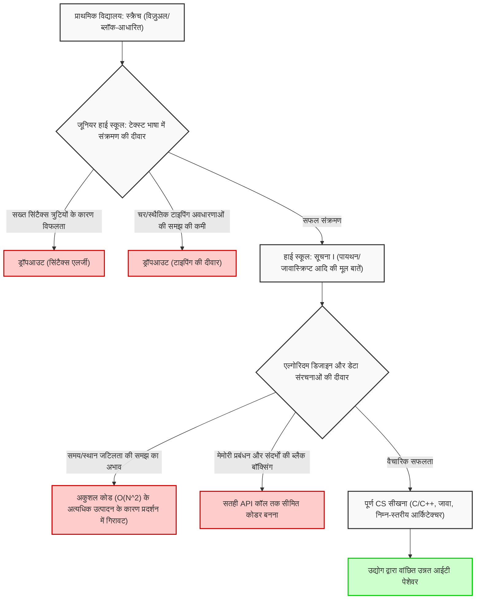
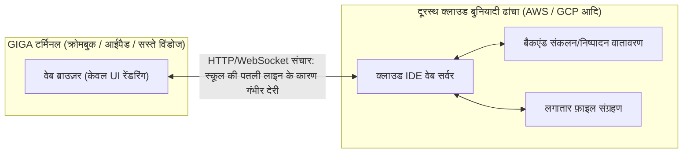
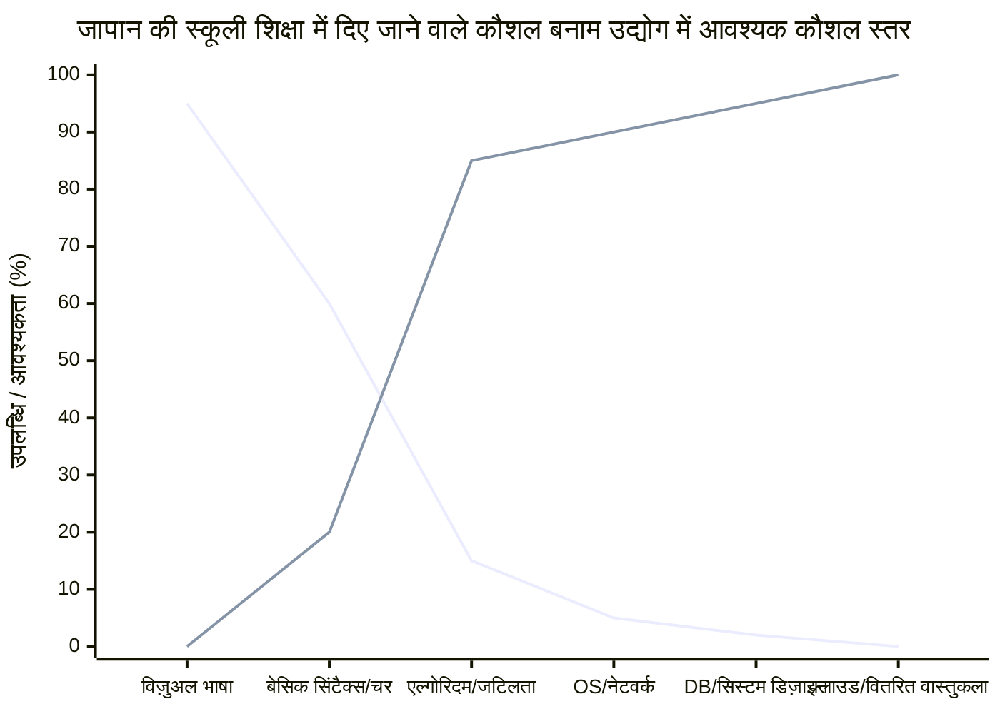

## 1. परिचय: प्रोग्रामिंग अनिवार्य होने का प्रकाश और अंधकार

2020 में प्राथमिक विद्यालयों में प्रोग्रामिंग शिक्षा का अनिवार्य होना, 2021 में जूनियर हाई स्कूलों में प्रौद्योगिकी और गृह अर्थशास्त्र का विस्तार, और 2022 में हाई स्कूलों में एक नए विषय "सूचना I" का अनिवार्य होना—इन सबके साथ, जापान की आईटी और सूचना शिक्षा ने पिछले कुछ वर्षों में अभूतपूर्व पैमाने पर एक प्रतिमान विस्थापन (paradigm shift) का अनुभव किया है। नीतियों की इस श्रृंखला के मूल में सोसाइटी 5.0 (सुपर स्मार्ट सोसाइटी) के युग में जीवित रहने के लिए तार्किक सोच (प्रोग्रामिंग थिंकिंग) को बढ़ावा देने और उद्योग में उन्नत आईटी प्रतिभाओं की पुरानी कमी को हल करने की अत्यंत गंभीर और राष्ट्रीय आवश्यकता निहित है।

हालाँकि, जब हम शिक्षा के मोर्चे पर नज़र डालते हैं, तो यह स्पष्ट हो जाता है कि सरकार द्वारा कल्पित आदर्श और वास्तविकता के बीच एक बहुत बड़ी खाई उत्पन्न हो गई है। सबसे गंभीर समस्या यह है कि "एक उपकरण के रूप में प्रोग्रामिंग सीखना" और "कंप्यूटर विज्ञान के अनुशासन में महारत हासिल करना" पूरी तरह से मिला दिए गए हैं। इसके अलावा, देश भर में स्थापित आईटी बुनियादी ढांचे के विनिर्देशों की सीमाओं के कारण तकनीकी बाधाएं, और पढ़ाने वाले शिक्षकों के पेशेवर कौशल की कमी जैसी कई संरचनात्मक चुनौतियां हैं जिन्हें हल करने की आवश्यकता है।

इस लेख में, हम जापान में अनिवार्य प्रोग्रामिंग शिक्षा के "बाद" का सार प्रस्तुत करेंगे और वर्तमान में सामने आ रही आईटी शिक्षा की मूलभूत और संरचनात्मक समस्याओं को कंप्यूटर विज्ञान सिद्धांत, हार्डवेयर आर्किटेक्चर की सीमाओं और वैश्विक औद्योगिक प्रतिस्पर्धा के दृष्टिकोण से अत्यंत विस्तृत और तकनीकी रूप से स्पष्ट करेंगे। यह केवल एक शैक्षिक सिद्धांत नहीं है, बल्कि सॉफ्टवेयर इंजीनियरिंग के दृष्टिकोण से जापान के भविष्य पर विचार करने वाला 10,000 शब्दों का एक लेख है।

## 2. विजुअल प्रोग्रामिंग का जाल: स्क्रैच से टेक्स्ट कोडिंग तक की गहरी और कठिन खाई

एमआईटी मीडिया लैब द्वारा विकसित "स्क्रैच" जैसी विजुअल प्रोग्रामिंग भाषाएं (ब्लॉक प्रोग्रामिंग) प्राथमिक स्कूल प्रोग्रामिंग शिक्षा में वास्तविक मानक (de facto standard) के रूप में राज कर रही हैं। यह एक महान आविष्कार है जिसे प्रारंभिक शिक्षा के रूप में अत्यधिक महत्व दिया जाना चाहिए, क्योंकि यह पहेली की तरह ब्लॉकों को जोड़कर "अनुक्रम" (sequence), "शाखा" (selection), और "पुनरावृत्ति" (iteration) के तीन बुनियादी नियंत्रण संरचनाओं को नेत्रहीन और सहज रूप से सीखने के लिए एक सहज ग्राफिकल इंटरफ़ेस का उपयोग करता है।

हालाँकि, यहाँ एक गंभीर नुकसान है, जिसे "अमूर्तता का जाल" कहा जा सकता है। यह क्रूर सत्य है कि "विजुअल प्रोग्रामिंग से पूर्ण विकसित टेक्स्ट-आधारित प्रोग्रामिंग भाषाओं (पायथन, जावास्क्रिप्ट, सी++, रस्ट आदि) में संक्रमण बेहद मुश्किल है, और कई शिक्षार्थी इस स्तर पर हार मान लेते हैं।"

### अमूर्तता की दीवार और कंप्यूटर विज्ञान का ब्लैक बॉक्सिंग

स्क्रैच और अन्य विज़ुअल प्रोग्रामिंग वातावरण जानबूझकर कंप्यूटर विज्ञान के मूल तत्वों को अत्यधिक अमूर्त और छिपा (encapsulate) देते हैं, जैसे प्रोग्रामिंग का जटिल सिंटैक्स, सख्त प्रकार प्रणाली (type system), और मेमोरी का जीवनचक्र प्रबंधन। यह शुरुआती लोगों के संज्ञानात्मक भार (cognitive load) को कम करने के लिए उत्कृष्ट है, लेकिन वास्तविक इंजीनियरिंग के अगले चरण में जाने पर यह एक बड़ी बाधा बन जाता है। ऐसा इसलिए है क्योंकि वास्तविक सॉफ्टवेयर विकास में, चर का दायरा (स्थानीय और वैश्विक चर), जटिल डेटा संरचनाएं (एरे, लिंक्ड लिस्ट, हैश टेबल, बाइनरी सर्च ट्री, ग्राफ), पॉइंटर संचालन, और मेमोरी के हीप (heap) और स्टैक (stack) क्षेत्रों की समझ नितांत आवश्यक है।

नीचे दिया गया मरमेड आरेख (Mermaid diagram) विजुअल प्रोग्रामिंग से पूर्ण कंप्यूटर विज्ञान में संक्रमण की प्रक्रिया में शुरुआती लोगों द्वारा सामना की जाने वाली सीखने की बाधाओं और ड्रॉपऑफ़ बिंदुओं को दर्शाता है।



जैसा कि इस फ़्लोचार्ट से स्पष्ट है, केवल "स्क्रीन पर एक चरित्र को स्थानांतरित करने के लिए कोड लिखने" के अनुभव को जमा करने से, एक सच्चा सॉफ्टवेयर इंजीनियर नहीं बनेगा जो स्केलेबल वितरित सिस्टम आर्किटेक्चर को डिज़ाइन कर सकता है और मिलीसेकंड स्तर पर प्रदर्शन को अनुकूलित कर सकता है। स्क्रैच के रंगीन ब्लॉकों को माउस से संयोजित करने और लिनक्स कर्नेल के सी भाषा स्रोत कोड को पढ़ने और टीसीपी/आईपी स्टैक के व्यवहार को ट्रैक करने के बीच एक पूर्ण वैचारिक विच्छेदन (disconnect) है, जिसे केवल "उपयोग की गई भाषा में अंतर" के रूप में खारिज नहीं किया जा सकता है।

## 3. "गणित" और "असतत तर्क" के बिना कोडिंग की सीमाएं: कम्प्यूटेशनल जटिलता सिद्धांत से दृष्टिकोण

जापान के प्रोग्रामिंग शिक्षा पाठ्यक्रम में सबसे बड़ी कमजोरी, और संभवतः एक घातक दोष, "कोडिंग कौशल" और "गणित/असतत गणित (Discrete Mathematics)" के बीच एकीकरण की भारी कमी है। संयुक्त राज्य अमेरिका और भारत सहित शीर्ष-स्तरीय कंप्यूटर विज्ञान शिक्षा में, प्रोग्रामिंग भाषा के व्याकरण की तुलना में एल्गोरिदम दक्षता, गणितीय तर्क और गणितीय प्रमाणों पर अधिक जोर दिया जाता है। कोड गणितीय सूत्रों के अनुवाद से ज्यादा कुछ नहीं है।

### समय जटिलता और अंतरिक्ष जटिलता (Big O Notation) का पूर्ण प्रभुत्व

सॉफ्टवेयर प्रदर्शन का मूल्यांकन और डिजाइन करते समय समय जटिलता (Time Complexity) और अंतरिक्ष जटिलता (Space Complexity) की अवधारणाएं अपरिहार्य हैं। लैंडौ का स्पर्शोन्मुख संकेतन (Big O Notation) यह दर्शाता है कि जब किसी एल्गोरिदम में इनपुट किए गए डेटा का आकार $N$ होता है, तो निष्पादन समय और स्मृति की खपत कैसे बढ़ती है।

गणितीय रूप से, $f(x) = O(g(x))$ को सख्ती से इस प्रकार परिभाषित किया गया है:

$$
\exists C > 0, \exists x_0 > 0, \forall x > x_0, |f(x)| \le C \cdot |g(x)|
$$

जापान की सूचना शिक्षा में, उदाहरण के लिए, जब डेटा छँटाई (सॉर्टिंग) सीखी जाती है, तो ऐसे मामले होते हैं जहाँ इसे केवल पायथन में `array.sort()` बिल्ट-इन मेथड कॉल करके छोड़ दिया जाता है। हालाँकि, सूचना इंजीनियरिंग के रूप में जो वास्तव में आवश्यक है, वह गणितीय रूप से यह समझना और साबित करना है कि साधारण बबल सॉर्ट का उपयोग व्यावहारिक क्षेत्र में कभी क्यों नहीं किया जाता है, और क्विक सॉर्ट, मर्ज सॉर्ट या टिमसॉर्ट को मानक पुस्तकालयों (standard libraries) के रूप में क्यों अपनाया जाता है।

नीचे विशिष्ट सॉर्टिंग एल्गोरिदम की औसत समय जटिलता दी गई है।

- बबल सॉर्ट (Bubble Sort): $O(N^2)$
- चयन सॉर्ट (Selection Sort): $O(N^2)$
- इंसर्शन सॉर्ट (Insertion Sort): $O(N^2)$
- मर्ज सॉर्ट (Merge Sort): $O(N \log N)$
- क्विक सॉर्ट (Quick Sort): $O(N \log N)$
- हीप सॉर्ट (Heap Sort): $O(N \log N)$

उदाहरण के लिए, मर्ज सॉर्ट की समय जटिलता $T(N)$, फूट डालो और राज करो (Divide and Conquer) प्रतिमान के आधार पर निम्नलिखित पुनरावृत्ति संबंध द्वारा व्यक्त की जाती है।

$$
T(N) = 2T\left(\frac{N}{2}\right) + O(N)
$$

मास्टर थ्योरम (Master Theorem) का उपयोग करके इस पुनरावर्ती समीकरण का विस्तार और समाधान करके, आदर्श कम्प्यूटेशनल जटिलता $T(N) = O(N \log N)$ प्राप्त की जाती है।

$$
T(N) = \Theta(N \log_2 N)
$$

आधुनिक बिग डेटा विश्लेषण और वेब-स्केल ट्रैफ़िक प्रोसेसिंग में, $N$ करोड़ों या अरबों के विशाल क्रम (order) का हो जाता है। यदि एक अज्ञानी प्रोग्रामर $O(N^2)$ के एक अकुशल एल्गोरिदम को लागू करता है, तो $N = 10^6$ डेटा के लिए $10^{12}$ (1 ट्रिलियन) अनावश्यक तुलना संचालन की आवश्यकता होगी, और सिस्टम प्रभावी ढंग से फ्रीज और क्रैश हो जाएगा। दूसरी ओर, यदि यह $O(N \log N)$ है, तो यह लगभग $2 \times 10^7$ (20 मिलियन) संचालन में पूरा हो जाएगा। इस क्रूर गणितीय समर्थन के बिना यह दावा करना कि "मैं प्रोग्रामिंग कर सकता हूँ" संरचनात्मक यांत्रिकी को जाने बिना गगनचुंबी इमारत बनाने जैसा है, और यह बेहद खतरनाक है।

## 4. मेमोरी प्रबंधन और सिस्टम आर्किटेक्चर का ब्लैक बॉक्सिंग

एक गहरी परत की समस्या के रूप में, मेमोरी प्रबंधन (Memory Management) और सीपीयू आर्किटेक्चर की समझ पूरी तरह से गायब है। शिक्षार्थी जिन्होंने केवल पायथन या जावास्क्रिप्ट जैसी उच्च-स्तरीय भाषाएं सीखी हैं जो वर्तमान में स्कूलों में पढ़ाई जाती हैं और जिनमें कचरा संग्रहण (Garbage Collection, GC) की सुविधा होती है, उन्हें यह कभी एहसास नहीं होगा कि चर और ऑब्जेक्ट भौतिक मेमोरी (RAM) में कहाँ स्थित हैं (हीप या स्टैक क्षेत्र में), उन्हें कैसे आवंटित किया जाता है, और कब और कैसे मुक्त किया जाता है।

```c
// C भाषा में स्पष्ट और प्रत्यक्ष मेमोरी आवंटन और पॉइंटर संचालन का उदाहरण
#include <stdio.h>
#include <stdlib.h>

int main() {
    int n = 1000000;
    // हीप क्षेत्र में गतिशील रूप से मेमोरी को लगातार आवंटित करें (OS को सिस्टम कॉल)
    int *array = (int*)malloc(n * sizeof(int));
    
    if (array == NULL) {
        fprintf(stderr, "Memory allocation failed! Out of memory.\n");
        return 1;
    }
    
    // पॉइंटर अंकगणित द्वारा एरे का आरंभीकरण
    for(int i = 0; i < n; i++) {
        *(array + i) = i * 2; // array[i] = i * 2 के समतुल्य
    }
    
    // मेमोरी लीक (Memory Leak) को रोकने के लिए स्पष्ट संसाधन मुक्ति
    free(array);
    array = NULL; // डैंगलिंग पॉइंटर को रोकें
    
    return 0;
}
```

पॉइंटर (मेमोरी पते का सीधा संदर्भ) की अवधारणा, सीपीयू कैश मेमोरी पदानुक्रम (L1/L2/L3 कैश) की हिट दर को अधिकतम करने के लिए डेटा प्लेसमेंट (Data Locality), और मल्टी-थ्रेडेड वातावरण में रेस कंडीशन (Race Condition) और पारस्परिक बहिष्करण (Mutex/Semaphore) का ज्ञान उच्च-प्रदर्शन वाले बैकएंड सिस्टम, 3D गेम इंजन, या IoT के लिए एम्बेडेड सिस्टम विकसित करने के लिए नितांत आवश्यक है। यह कहना होगा कि शिक्षा, संस्कृति, खेल, विज्ञान और प्रौद्योगिकी मंत्रालय (MEXT) का वर्तमान पाठ्यक्रम "सतही अनुप्रयोगों को चलाने" पर केंद्रित है, जो "कंप्यूटर विज्ञान की गहराई को समझने" के मूल शैक्षणिक लक्ष्य से काफी भटक गया है।

## 5. डेटाबेस और दृढ़ता की दीवार: रिलेशनल बीजगणित की अनुपस्थिति

आधुनिक अनुप्रयोगों में, डेटा का भंडारण और पुनर्प्राप्ति (persistence) एक अपरिहार्य विषय है। हालाँकि, स्कूली शिक्षा का अधिकांश भाग "मेमोरी में डेटा प्रोसेसिंग" तक ही सीमित है, जो प्रोग्राम के निष्पादन के समाप्त होने पर गायब हो जाता है। रिलेशनल डेटाबेस (RDBMS) और SQL के पीछे का गणितीय सिद्धांत, अर्थात् डॉ. एडगर एफ. कॉड द्वारा प्रस्तावित "रिलेशनल बीजगणित (Relational Algebra)" शायद ही कभी पढ़ाया जाता है।

डेटाबेस संचालन सेट सिद्धांत पर आधारित निम्नलिखित बुनियादी संचालन द्वारा परिभाषित किए जाते हैं:

- चयन (Selection, $\sigma$): शर्त को पूरा करने वाले टुपल्स (पंक्तियों) का निष्कर्षण
- प्रक्षेपण (Projection, $\pi$): विशिष्ट विशेषताओं (कॉलम) का निष्कर्षण
- जुड़ाव (Join, $\bowtie$): कई संबंधों का सशर्त प्रतिच्छेदन

इसके अलावा, "B-Tree (B-ट्री) इंडेक्स" की संरचना सीखना, जो एक पल में बड़ी मात्रा में रिकॉर्ड से लक्षित डेटा की खोज करता है, डेटा संरचनाओं के अनुप्रयोग के रूप में सबसे अच्छा अभ्यास है। B-Tree डिस्क I/O की संख्या को कम करते हुए $O(\log N)$ की खोज गति की गारंटी देता है। आप लेनदेन (transaction) की ACID विशेषताओं (Atomicity, Consistency, Isolation, Durability) को जाने बिना एक मजबूत प्रणाली नहीं बना सकते।

## 6. सुरक्षा और क्रिप्टोग्राफी: बुनियादी ढांचा जिसे प्रधान गुणनखंडन (Prime Factorization) की कठिनाई का समर्थन प्राप्त है

सूचना साक्षरता शिक्षा में, "पासवर्ड जटिल बनाएं" और "संदिग्ध लिंक पर क्लिक न करें" जैसी सतही सुरक्षा शिक्षा प्रदान की जाती है, लेकिन इंटरनेट समाज को रेखांकित करने वाले "क्रिप्टोग्राफी सिद्धांत" का गणित शायद ही कभी पढ़ाया जाता है।

एचटीटीपीएस संचार और डिजिटल हस्ताक्षर जिनका उपयोग हम हर दिन करते हैं, सार्वजनिक-कुंजी क्रिप्टोग्राफी (public-key cryptography) जैसे RSA एन्क्रिप्शन द्वारा सुरक्षित हैं। RSA एन्क्रिप्शन की सुरक्षा गणितीय कठिनाई पर निर्भर करती है (जिसे एक NP-मध्यम समस्या माना जाता है) कि "वर्तमान शास्त्रीय कंप्यूटरों के लिए उचित समय के भीतर बड़े पूर्णांकों का प्रधान गुणनखंडन हल नहीं किया जा सकता है।"

RSA एन्क्रिप्शन का अंतर्निहित गणितीय सूत्र यूलर के टॉटिएंट फ़ंक्शन (Euler's totient function) और फर्मेट के छोटे प्रमेय (Fermat's little theorem) को लागू करने वाला एक सुंदर सूत्र है।

1. 2 विशाल अभाज्य संख्याएँ $p$ और $q$ चुनें
2. $n = p \times q$ की गणना करें (यह सार्वजनिक कुंजी का हिस्सा बन जाता है)
3. $\phi(n) = (p-1)(q-1)$ की गणना करें
4. $e$ और $d$ चुनें ताकि $e \times d \equiv 1 \pmod{\phi(n)}$ हो
5. एन्क्रिप्शन: $C \equiv M^e \pmod{n}$
6. डिक्रिप्शन: $M \equiv C^d \pmod{n}$

इस प्रकार, प्रोग्रामिंग शिक्षा गणित शिक्षा के साथ निकटता से जुड़े होने पर ही अपनी वास्तविक शक्ति दिखाती है। गणितीय सूत्रों को कोड में बदलने और उन्हें समाज में लागू करने की प्रक्रिया विज्ञान का सार है।

## 7. GIGA स्कूल की पहल और बुनियादी ढांचे की निराशाजनक सीमाएँ: क्रोमबुक और क्लाउड IDE

जापान की आईटी शिक्षा के बारे में बात करते समय एक अनिवार्य विषय "GIGA स्कूल पहल" है, जिसे शिक्षा, संस्कृति, खेल, विज्ञान और प्रौद्योगिकी मंत्रालय ने भारी बजट निवेश के साथ बढ़ावा दिया है। देश भर में प्राथमिक और जूनियर हाई स्कूल के छात्रों के लिए "प्रति छात्र एक डिवाइस" और एक हाई-स्पीड नेटवर्क वातावरण प्रदान करने की यह राष्ट्रीय परियोजना डिजिटलीकरण में देरी को दूर करने के लिए एक उत्प्रेरक के रूप में अपेक्षित थी। हालाँकि, वास्तव में वितरित किए गए उपकरणों के हार्डवेयर विनिर्देश और वास्तुकला पूर्ण पैमाने पर प्रोग्रामिंग शिक्षा के लिए एक गंभीर बाधा बन रहे हैं।

### कम-कल्पित उपकरण और स्थानीय विकास वातावरण का नुकसान

GIGA स्कूल पहल के मानक विनिर्देशों के रूप में पेश किए गए अधिकांश उपकरण बहुत सस्ते क्रोमबुक, आईपैड या कम लागत वाले विंडोज डिवाइस हैं। उनके मानक विनिर्देश इस प्रकार हैं:

- CPU: Intel Celeron या कम लागत वाला ARM प्रोसेसर
- मेमोरी (RAM): 4GB (आधुनिक OS चलाने के लिए बस न्यूनतम क्षमता)
- स्टोरेज (eMMC): 32GB ~ 64GB (बेहद धीमी I/O गति)

इस खराब हार्डवेयर की बाधाओं के कारण, एक "स्थानीय विकास वातावरण" बनाना लगभग असंभव है जिसका उपयोग पेशेवर इंजीनियर दैनिक आधार पर करते हैं। डॉकर (Docker) का उपयोग करके लिनक्स कंटेनर शुरू करना, विजुअल स्टूडियो कोड (Visual Studio Code) जैसे भारी IDE को पूर्ण कार्यक्षमता के साथ चलाना, या भारी पुस्तकालयों को स्थापित करने के लिए Node.js या पायथन के स्थानीय सर्वर को शुरू करने से तुरंत मेमोरी की कमी हो जाएगी और सिस्टम फ्रीज हो जाएगा।

परिणामस्वरूप, शिक्षा के मोर्चे पर, हमें ब्राउज़र में चलने वाले क्लाउड IDE (Google Colaboratory, Replit, या पाठ्यपुस्तक कंपनियों के अपने हल्के वेब टूल आदि) पर पूरी तरह भरोसा करने के लिए मजबूर होना पड़ रहा है।



क्लाउड IDE पर पूर्ण निर्भरता शैक्षणिक रूप से निम्नलिखित अत्यंत गंभीर कमियों का कारण बनती है:

1. **फ़ाइल सिस्टम और OS आर्किटेक्चर की समझ की कमी**: क्योंकि उनके पास कोई स्थानीय वातावरण नहीं है, आवश्यक ज्ञान (UNIX साक्षरता) जिसे आईटी इंजीनियरों को सहज रूप से संभालना चाहिए, जैसे कि निर्देशिका संरचना, पूर्ण/सापेक्ष पथ की अवधारणा, पर्यावरण चर (environment variables) की सेटिंग, फ़ाइल अनुमतियाँ, और CLI (कमांड लाइन इंटरफ़ेस) के साथ OS संचालन, बिल्कुल भी नहीं सीखा जाता है।
2. **नेटवर्क विलंबता और बुनियादी ढांचे की भेद्यता**: चूंकि निरंतर कनेक्शन एक पूर्व शर्त है, जिस क्षण पूरे स्कूल के छात्र एक ही समय में एक्सेस करते हैं, स्कूल का नेटवर्क बैंडविड्थ तंग हो जाता है, और देश भर में लगातार ऐसी घटनाएँ होती हैं जहाँ ब्राउज़र फ़्रीज़ हो जाता है और सीखना पूरी तरह से बंद हो जाता है।
3. **संस्करण नियंत्रण (Git) अनुभव से वंचित**: स्रोत कोड के परिवर्तन इतिहास को प्रबंधित करने और दुनिया भर की टीमों में सहयोगी रूप से विकसित करने के लिए एक काली टर्मिनल स्क्रीन के माध्यम से Git और GitHub की अवधारणा को शामिल करने का अवसर छीन लिया जाता है।

जब पेशेवर सॉफ़्टवेयर इंजीनियर विकसित करते हैं, तो टर्मिनल (शेल) संचालन पूर्ण आधार होता है। `ls`, `cd`, `grep`, `chmod`, `git rebase` जैसे कमांड को टाइप करने और स्थानीय ओएस कर्नेल के साथ सीधे बातचीत करने के कठिन अनुभव के बिना, सच्चे आईटी मानव संसाधनों का विकास कभी हासिल नहीं किया जा सकता है। केवल क्रोमबुक सैंडबॉक्स में खेलने से फुल-स्टैक इंजीनियर पैदा नहीं होंगे जो संपूर्ण सिस्टम को देख सकते हैं।

## 8. दुनिया के साथ निराशाजनक अंतर: उद्योग मानकों और स्कूली शिक्षा के बीच की खाई

जापान की आईटी शिक्षा के सामने अंतिम और राष्ट्रीय संकट के रूप में सामने आने वाली चुनौती वैश्विक संदर्भ में प्रतिस्पर्धात्मकता में भारी गिरावट है।

### अन्य देशों में गहन कंप्यूटर विज्ञान शिक्षा

यूनाइटेड किंगडम (यूके) में, 2014 से 5 साल की उम्र (Key Stage 1) से "कम्प्यूटिंग (Computing)" विषय को अनिवार्य कर दिया गया है। उनका पाठ्यक्रम केवल "प्रोग्रामिंग अनुभव" तक सीमित नहीं है, बल्कि एल्गोरिदम के तार्किक डिजाइन, बूलियन बीजगणित (Boolean algebra) का उपयोग करके तर्क सर्किट की समझ, नेटवर्क टोपोलॉजी और हार्डवेयर आर्किटेक्चर सहित अत्यधिक अकादमिक और व्यवस्थित पूर्ण कंप्यूटर विज्ञान से संबंधित है।

संयुक्त राज्य अमेरिका में, CSTA (कंप्यूटर साइंस टीचर्स एसोसिएशन) द्वारा स्थापित K-12 (किंडरगार्टन से हाई स्कूल ग्रेजुएशन तक) के लिए एक सख्त मानक पाठ्यक्रम है। एपी (एडवांस्ड प्लेसमेंट) कंप्यूटर साइंस ए, जो हाई स्कूल के छात्रों द्वारा लिया जाता है, जावा का उपयोग करके पूर्ण-स्तरीय ऑब्जेक्ट-ओरिएंटेड प्रोग्रामिंग, पॉलीमोर्फिज्म, रिकर्सन (पुनरावृत्ति प्रसंस्करण), डेटा संरचनाओं के कार्यान्वयन और एल्गोरिथम जटिलता मूल्यांकन को विश्वविद्यालय के प्रथम वर्ष के स्तर पर उच्च मानक के साथ पूछता है। भारत और चीन में एसटीईएम (STEM) शिक्षा की तीव्रता और उनके द्वारा उत्पादित अभिजात वर्ग की मोटाई का उल्लेख करने की आवश्यकता नहीं है।

### आवश्यक कौशल और सिखाए गए कौशल के बीच निराशाजनक अलगाव

आधुनिक उद्योग, विशेष रूप से विश्व स्तर पर विस्तार करने वाले मेगा-वेंचर और टेक दिग्गज (GAFAM, आदि) द्वारा नए स्नातक सॉफ्टवेयर इंजीनियरों से अपेक्षित आवश्यकताएं हर साल भयावह गति से अधिक परिष्कृत होती जा रही हैं। क्लाउड-नेटिव इन्फ्रास्ट्रक्चर (AWS, GCP, Kubernetes) का निर्माण, माइक्रो-सर्विसेज आर्किटेक्चर के वितरित सिस्टम डिज़ाइन, मशीन लर्निंग पाइपलाइन का कार्यान्वयन, और उन्नत सुरक्षा ज्ञान जैसी व्यापक और गहरी विशेषज्ञता की आवश्यकता है।

नीचे दिया गया ग्राफ वर्तमान जापानी स्कूली शिक्षा में प्रदान किए गए कौशल की उपलब्धि के स्तर और सबसे आगे उद्योग द्वारा आवश्यक कौशल के स्तर के बीच निराशाजनक अंतर को वैचारिक रूप से दर्शाता है।



इस विशाल अंतर (Death Valley) को पाटने के लिए, स्कूली शिक्षा और बड़े निवेश में आमूलचूल बदलाव की आवश्यकता है। जब "सूचना" के विशेष शिक्षकों की देश भर में भारी कमी है, तो गणित, विज्ञान, या प्रौद्योगिकी और गृह अर्थशास्त्र के शिक्षक अपने मुख्य काम के अलावा अपर्याप्त प्रशिक्षण के साथ प्रोग्रामिंग पढ़ा रहे हैं। ऐसी व्यवस्था के तहत दुनिया में प्रतिस्पर्धा कर सकने वाले शीर्ष-स्तरीय इंजीनियरों का उत्पादन करना पूर्णतः असंभव है।

## 9. एआई युग (LLM) में "कोडिंग" के मूल्य में गिरावट

स्थिति को और भी जटिल बनाने वाली बात है ChatGPT जैसे बड़े भाषा मॉडल (LLM) और GitHub Copilot जैसे AI कोडिंग सहायकों का विस्फोटक प्रसार। आज के युग में जहाँ AI प्राकृतिक भाषा के निर्देशों से तुरंत उत्तम कोड जनरेट कर सकता है और यहाँ तक कि परीक्षण कोड भी लिख सकता है, एक तथाकथित "कोडर" (Coder) का बाजार मूल्य, जो केवल "पायथन सिंटैक्स जानता है" या "API को कॉल करना जानता है", तेजी से गिर रहा है।

एआई युग में मानव इंजीनियरों से प्रोग्रामिंग भाषाओं के सिंटैक्स को याद रखने की क्षमता की आवश्यकता नहीं है। निम्नलिखित क्षमताएं आवश्यक हैं:

1. **आवश्यकता परिभाषा और डोमेन मॉडलिंग**: हल की जाने वाली जटिल वास्तविक दुनिया की समस्याओं को निकालने और उन्हें एक सिस्टम के रूप में मॉडल करने की क्षमता।
2. **आर्किटेक्चर डिज़ाइन**: स्केलेबिलिटी, उपलब्धता और रखरखाव सुनिश्चित करने वाले संपूर्ण सिस्टम के लिए ब्लूप्रिंट बनाने की क्षमता।
3. **गणितीय और तार्किक सत्यापन**: सैद्धांतिक रूप से सत्यापित करने और साबित करने की क्षमता कि एआई-जनरेटेड कोड में कोई सुरक्षा छेद या कम्प्यूटेशनल जटिलता की बाधाएं नहीं हैं।

विडंबना यह है कि, ये सभी "सतही प्रोग्रामिंग" के क्षेत्र नहीं हैं, बल्कि "कंप्यूटर विज्ञान और गणित" के गहरे और अमूर्त क्षेत्र हैं। यदि जापानी शिक्षा केवल "निचले स्तर के कौशल जो आसानी से एआई द्वारा प्रतिस्थापित किए जा सकते हैं" सिखा रही है, तो इसे एक राष्ट्रीय नुकसान कहा जाना चाहिए।

## 10. गणितीय विज्ञान और प्रोग्रामिंग के एकीकरण की ओर: अगली पीढ़ी की शिक्षा के लिए प्रस्ताव

भविष्य में जापान की आईटी शिक्षा में सबसे जरूरी काम "प्रोग्रामिंग को एक लक्ष्य/साधन के रूप में देखने" से दूर हटना और "गणितीय विज्ञान के रूप में कंप्यूटर विज्ञान की खोज" पर वापस लौटना है। प्रोग्रामिंग भाषाएं विचारों को व्यक्त करने के लिए मात्र उपकरण हैं, और उनके अंतर्गत आने वाली गणितीय और तार्किक संरचनाओं का एक सार्वभौमिक मूल्य है जो समय बदलने पर भी फीका नहीं पड़ता है।

उदाहरण के लिए, कृत्रिम बुद्धिमत्ता (AI) और मशीन लर्निंग के मूल में रैखिक बीजगणित (मैट्रिक्स संचालन और टेंसर), बहु-चर कलन (ग्रैडिएंट डिसेंट), और संभाव्यता आँकड़े (बायेसियन अनुमान और सूचना सिद्धांत) बारीकी से आपस में जुड़े हुए हैं। डीप लर्निंग न्यूरल नेटवर्क में वजन (weights) का अनुकूलन आंशिक डेरिवेटिव (partial derivatives) और बैकप्रोपेगेशन का उपयोग करके श्रृंखला नियम (Chain Rule) द्वारा तैयार किया जाता है।

$$
\frac{\partial L}{\partial w_{ij}^{(l)}} = \frac{\partial L}{\partial z_i^{(l+1)}} \cdot \frac{\partial z_i^{(l+1)}}{\partial w_{ij}^{(l)}} = \delta_i^{(l+1)} \cdot a_j^{(l)}
$$

मानव संसाधन जो ऐसे उन्नत गणितीय सूत्रों को कोड में अनुवाद कर सकते हैं और चरम सीमा तक समानांतर कंप्यूटिंग (Parallel Computing) को अनुकूलित करके लागू करने के लिए GPU (CUDA) और TPU के हार्डवेयर आर्किटेक्चर के प्रति सचेत हो सकते हैं, अगली पीढ़ी के आईटी उद्योग का नेतृत्व करेंगे। इसलिए, हमें तुरंत उथली शिक्षा से दूर जाना चाहिए जो शिक्षार्थियों को केवल सतही वाक्यरचना को याद करने के लिए मजबूर करती है, और एक गहरी शिक्षा की ओर बढ़ना चाहिए जो गणना के पहले सिद्धांतों (First Principles) पर सवाल उठाती है।

## 11. निष्कर्ष: सच्चे आईटी राष्ट्र की ओर कठिन राह और हमारा संकल्प

इसमें कोई संदेह नहीं है कि 2020 के दशक में प्रोग्रामिंग शिक्षा का अनिवार्य होना जापानी समाज को समग्र रूप से "आईटी और सूचना के महत्व" से अवगत कराने में एक निश्चित कदम था। हालाँकि, यह एक लंबी यात्रा में "वार्म-अप व्यायाम" मात्र है।

स्क्रैच के साथ एक बिल्ली के चरित्र को स्थानांतरित करने के आनंद से एक कदम आगे बढ़ना, $O(N \log N)$ एल्गोरिदम की गणितीय सुंदरता से प्रभावित होना, और टर्मिनल की काली स्क्रीन से टीसीपी पैकेट के माध्यम से दुनिया भर के सर्वर के साथ बातचीत करने का उत्साह सिखाना। GIGA स्कूल पहल की हार्डवेयर सीमाओं को पार करने के लिए नए शैक्षिक बुनियादी ढांचे का पुनर्निर्माण करना, उन्नत CS विशेषज्ञता के साथ नेताओं को प्रशिक्षित करना और तैनात करना, और कभी-कभी बाहरी पेशेवर इंजीनियरों को स्कूली शिक्षा में साहसपूर्वक शामिल करना।

जापान की आईटी शिक्षा के सामने आने वाली चुनौतियां अत्यंत गहरी, जड़ें जमाए हुए और जटिल हैं। हालाँकि, इन चुनौतियों से आंखें मूंदने के बजाय, अगर उद्योग, शिक्षा और सरकार उन्हें हल करने के लिए मिलकर काम कर सकते हैं, और एक पारिस्थितिकी तंत्र का निर्माण कर सकते हैं जो लगातार "सच्चे इंजीनियरों का उत्पादन कर सकता है जो शून्य से सिस्टम को डिजाइन और बना सकते हैं," बजाय "मजदूरों के जो केवल विनिर्देशों के अनुसार कोड लिख सकते हैं," तो जापान एक सच्चे आईटी राष्ट्र के रूप में फिर से दुनिया का नेतृत्व करने में सक्षम होगा।

अनिवार्य प्रोग्रामिंग शिक्षा के "बाद" के सबसे कठिन और महत्वपूर्ण चरण से कैसे लड़ें। अब, वयस्कों के रूप में हमारी गंभीरता और संकल्प का परीक्षण किया जा रहा है।

---

*इस लेख में, हमने कम्प्यूटेशनल जटिलता सिद्धांत और GIGA स्कूल पहल की बुनियादी ढांचे की सीमाओं की रूपरेखा तैयार की है। भविष्य की श्रृंखला में अधिक विशिष्ट कंप्यूटर विज्ञान विषयों (वितरित सिस्टम के एल्गोरिदम और निम्न-स्तरीय मेमोरी प्रबंधन विधियों के विवरण आदि) को शामिल किया जाएगा।*


